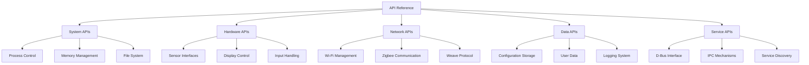

# API Reference Overview

The Nest Learning Thermostat provides comprehensive APIs for system integration, development, and automation. This document provides an overview of all available APIs, their purposes, and how to use them effectively.

## API Architecture

### Core Components
- **System APIs**: Core system functionality and control interfaces
- **Hardware APIs**: Hardware component access and control
- **Network APIs**: Network communication and connectivity
- **Data APIs**: Data storage, retrieval, and management
- **Service APIs**: Inter-service communication and coordination

### API Framework


## API Classification

### System APIs
Core system APIs for process management, memory control, and system operations.

```c
// System API overview
typedef struct {
    process_control_api_t process;         // Process control API
    memory_management_api_t memory;         // Memory management API
    filesystem_api_t filesystem;           // Filesystem API
    system_monitoring_api_t monitoring;     // System monitoring API
} system_api_t;

// Process control API
typedef struct {
    process_id_t (*create_process)(process_config_t *config);
    int (*terminate_process)(process_id_t pid);
    process_status_t (*get_process_status)(process_id_t pid);
    int (*set_process_priority)(process_id_t pid, priority_t priority);
    process_info_t (*enumerate_processes)(void);
} process_control_api_t;

// Memory management API
typedef struct {
    void* (*allocate_memory)(size_t size, allocation_flags_t flags);
    int (*free_memory)(void* ptr);
    memory_info_t (*get_memory_info)(void);
    int (*set_memory_protection)(void* ptr, size_t size, protection_t protection);
    memory_stats_t (*get_memory_statistics)(void);
} memory_management_api_t;

// Filesystem API
typedef struct {
    file_handle_t (*open_file)(const char* path, open_flags_t flags);
    int (*close_file)(file_handle_t handle);
    ssize_t (*read_file)(file_handle_t handle, void* buffer, size_t size);
    ssize_t (*write_file)(file_handle_t handle, const void* buffer, size_t size);
    file_info_t (*get_file_info)(const char* path);
} filesystem_api_t;
```

### Hardware APIs
Hardware abstraction APIs for sensor access, display control, and input handling.

```c
// Hardware API overview
typedef struct {
    sensor_api_t sensors;                  // Sensor API
    display_api_t display;                 // Display API
    input_api_t input;                     // Input API
    power_api_t power;                     // Power management API
} hardware_api_t;

// Sensor API
typedef struct {
    sensor_handle_t (*open_sensor)(sensor_type_t type, sensor_config_t *config);
    int (*close_sensor)(sensor_handle_t handle);
    sensor_reading_t (*read_sensor)(sensor_handle_t handle);
    int (*configure_sensor)(sensor_handle_t handle, sensor_config_t *config);
    sensor_info_t (*get_sensor_info)(sensor_handle_t handle);
} sensor_api_t;

// Display API
typedef struct {
    display_handle_t (*open_display)(display_config_t *config);
    int (*close_display)(display_handle_t handle);
    int (*update_display)(display_handle_t handle, display_buffer_t *buffer);
    int (*set_brightness)(display_handle_t handle, brightness_t level);
    display_info_t (*get_display_info)(display_handle_t handle);
} display_api_t;

// Input API
typedef struct {
    input_handle_t (*open_input)(input_type_t type, input_config_t *config);
    int (*close_input)(input_handle_t handle);
    input_event_t (*read_input_event)(input_handle_t handle);
    int (*configure_input)(input_handle_t handle, input_config_t *config);
    input_info_t (*get_input_info)(input_handle_t handle);
} input_api_t;
```

### Network APIs
Network communication APIs for Wi-Fi, Zigbee, and Weave protocol management.

```c
// Network API overview
typedef struct {
    wifi_api_t wifi;                       // Wi-Fi API
    zigbee_api_t zigbee;                   // Zigbee API
    weave_api_t weave;                     // Weave API
    network_monitoring_api_t monitoring;   // Network monitoring API
} network_api_t;

// Wi-Fi API
typedef struct {
    wifi_handle_t (*open_wifi)(wifi_config_t *config);
    int (*close_wifi)(wifi_handle_t handle);
    int (*scan_networks)(wifi_handle_t handle, network_scan_t *scan);
    int (*connect_network)(wifi_handle_t handle, network_config_t *network);
    int (*disconnect_network)(wifi_handle_t handle);
    wifi_status_t (*get_wifi_status)(wifi_handle_t handle);
} wifi_api_t;

// Zigbee API
typedef struct {
    zigbee_handle_t (*open_zigbee)(zigbee_config_t *config);
    int (*close_zigbee)(zigbee_handle_t handle);
    int (*form_network)(zigbee_handle_t handle, network_config_t *config);
    int (*join_network)(zigbee_handle_t handle, network_config_t *config);
    int (*send_message)(zigbee_handle_t handle, message_t *message);
    message_t (*receive_message)(zigbee_handle_t handle);
} zigbee_api_t;

// Weave API
typedef struct {
    weave_handle_t (*open_weave)(weave_config_t *config);
    int (*close_weave)(weave_handle_t handle);
    int (*start_weave_stack)(weave_handle_t handle);
    int (*stop_weave_stack)(weave_handle_t handle);
    int (*send_weave_message)(weave_handle_t handle, weave_message_t *message);
    weave_message_t (*receive_weave_message)(weave_handle_t handle);
} weave_api_t;
```

### Data APIs
Data management APIs for configuration, user data, and logging.

```c
// Data API overview
typedef struct {
    configuration_api_t config;            // Configuration API
    user_data_api_t user_data;              // User data API
    logging_api_t logging;                 // Logging API
    backup_api_t backup;                   // Backup API
} data_api_t;

// Configuration API
typedef struct {
    config_handle_t (*open_config)(const char* config_name);
    int (*close_config)(config_handle_t handle);
    int (*get_config_value)(config_handle_t handle, const char* key, 
                          config_value_t *value);
    int (*set_config_value)(config_handle_t handle, const char* key, 
                          config_value_t *value);
    config_section_t (*enumerate_config_sections)(config_handle_t handle);
} configuration_api_t;

// User data API
typedef struct {
    data_handle_t (*open_user_data)(const char* data_path);
    int (*close_user_data)(data_handle_t handle);
    int (*read_user_data)(data_handle_t handle, void* buffer, size_t size);
    int (*write_user_data)(data_handle_t handle, const void* buffer, size_t size);
    data_info_t (*get_user_data_info)(data_handle_t handle);
} user_data_api_t;

// Logging API
typedef struct {
    log_handle_t (*open_log)(const char* log_name, log_config_t *config);
    int (*close_log)(log_handle_t handle);
    int (*write_log)(log_handle_t handle, log_level_t level, const char* message);
    log_entry_t (*read_log)(log_handle_t handle);
    log_stats_t (*get_log_stats)(log_handle_t handle);
} logging_api_t;
```

### Service APIs
Inter-service communication APIs for system coordination and messaging.

```c
// Service API overview
typedef struct {
    dbus_api_t dbus;                       // D-Bus API
    ipc_api_t ipc;                         // IPC API
    service_discovery_api_t discovery;     // Service discovery API
    message_bus_api_t message_bus;         // Message bus API
} service_api_t;

// D-Bus API
typedef struct {
    dbus_handle_t (*open_dbus)(dbus_config_t *config);
    int (*close_dbus)(dbus_handle_t handle);
    int (*send_dbus_message)(dbus_handle_t handle, dbus_message_t *message);
    dbus_message_t (*receive_dbus_message)(dbus_handle_t handle);
    int (*register_dbus_service)(dbus_handle_t handle, const char* service_name);
} dbus_api_t;

// IPC API
typedef struct {
    ipc_handle_t (*open_ipc)(ipc_config_t *config);
    int (*close_ipc)(ipc_handle_t handle);
    int (*send_ipc_message)(ipc_handle_t handle, ipc_message_t *message);
    ipc_message_t (*receive_ipc_message)(ipc_handle_t handle);
    int (*create_ipc_channel)(const char* channel_name, ipc_config_t *config);
} ipc_api_t;

// Service discovery API
typedef struct {
    discovery_handle_t (*open_discovery)(discovery_config_t *config);
    int (*close_discovery)(discovery_handle_t handle);
    int (*register_service)(discovery_handle_t handle, service_info_t *service);
    service_list_t (*discover_services)(discovery_handle_t handle, 
                                       service_filter_t *filter);
    int (*unregister_service)(discovery_handle_t handle, const char* service_name);
} service_discovery_api_t;
```

## API Usage Patterns

### Initialization Pattern
Standard initialization pattern for all APIs.

```c
// Generic API initialization pattern
typedef struct {
    api_handle_t (*initialize_api)(api_config_t *config);
    int (*shutdown_api)(api_handle_t handle);
    api_status_t (*get_api_status)(api_handle_t handle);
    api_info_t (*get_api_info)(api_handle_t handle);
} api_interface_t;

// Example: Initialize system API
system_api_handle_t initialize_system_api(system_api_config_t *config) {
    // Validate configuration
    if (!validate_system_api_config(config)) {
        return NULL;
    }
    
    // Allocate API handle
    system_api_handle_t handle = allocate_system_api_handle();
    
    // Initialize subsystems
    if (!initialize_process_control(&handle->process, config->process_config)) {
        free_system_api_handle(handle);
        return NULL;
    }
    
    if (!initialize_memory_management(&handle->memory, config->memory_config)) {
        shutdown_process_control(&handle->process);
        free_system_api_handle(handle);
        return NULL;
    }
    
    if (!initialize_filesystem(&handle->filesystem, config->filesystem_config)) {
        shutdown_memory_management(&handle->memory);
        shutdown_process_control(&handle->process);
        free_system_api_handle(handle);
        return NULL;
    }
    
    // Set API status
    handle->status = API_STATUS_INITIALIZED;
    
    return handle;
}
```

### Error Handling Pattern
Consistent error handling across all APIs.

```c
// Error handling structure
typedef struct {
    error_code_t code;                     // Error code
    error_severity_t severity;              // Error severity
    char message[256];                     // Error message
    error_context_t context;                // Error context
    timestamp_t timestamp;                 // Error timestamp
} api_error_t;

// Error handling functions
typedef struct {
    api_error_t (*get_last_error)(api_handle_t handle);
    int (*clear_error)(api_handle_t handle);
    void (*set_error_handler)(api_handle_t handle, error_handler_t handler);
    error_stats_t (*get_error_statistics)(api_handle_t handle);
} error_handling_api_t;

// Example error handling
int handle_api_error(api_handle_t handle, api_result_t result) {
    if (result.status != API_STATUS_SUCCESS) {
        api_error_t error = get_last_error(handle);
        
        // Log error
        log_api_error(error);
        
        // Handle based on severity
        switch (error.severity) {
            case ERROR_SEVERITY_FATAL:
                // Fatal error - shutdown API
                shutdown_api(handle);
                return -1;
                
            case ERROR_SEVERITY_ERROR:
                // Error - attempt recovery
                return attempt_error_recovery(handle, error);
                
            case ERROR_SEVERITY_WARNING:
                // Warning - continue with caution
                return 0;
                
            default:
                return 0;
        }
    }
    
    return 0;
}
```

### Asynchronous Operations
Common pattern for asynchronous API operations.

```c
// Async operation structure
typedef struct {
    operation_id_t operation_id;           // Operation ID
    operation_type_t type;                  // Operation type
    operation_status_t status;              // Operation status
    completion_callback_t callback;         // Completion callback
    void* user_data;                       // User data
    timestamp_t start_time;                 // Start time
    timestamp_t completion_time;            // Completion time
} async_operation_t;

// Async API functions
typedef struct {
    operation_id_t (*start_async_operation)(api_handle_t handle, 
                                           operation_request_t *request);
    operation_status_t (*get_operation_status)(api_handle_t handle, 
                                              operation_id_t operation_id);
    operation_result_t (*get_operation_result)(api_handle_t handle, 
                                              operation_id_t operation_id);
    int (*cancel_operation)(api_handle_t handle, operation_id_t operation_id);
} async_api_t;

// Example async operation
operation_id_t start_sensor_reading_async(sensor_api_handle_t handle, 
                                         sensor_config_t *config,
                                         completion_callback_t callback,
                                         void* user_data) {
    // Create async operation
    async_operation_t *operation = create_async_operation();
    operation->type = OPERATION_TYPE_SENSOR_READING;
    operation->callback = callback;
    operation->user_data = user_data;
    operation->start_time = get_current_timestamp();
    
    // Start background task
    task_id_t task = start_sensor_reading_task(handle, config, operation);
    
    // Store operation
    store_async_operation(handle, operation);
    
    return operation->operation_id;
}
```

## API Security

### Authentication and Authorization
Security mechanisms for API access control.

```c
// API security structure
typedef struct {
    authentication_api_t auth;             // Authentication API
    authorization_api_t authz;              // Authorization API
    encryption_api_t encryption;            // Encryption API
    audit_api_t audit;                     // Audit API
} api_security_t;

// Authentication API
typedef struct {
    auth_token_t (*authenticate)(credentials_t *credentials);
    int (*validate_token)(auth_token_t token);
    int (*refresh_token)(auth_token_t *token);
    int (*logout)(auth_token_t token);
} authentication_api_t;

// Authorization API
typedef struct {
    int (*check_permission)(auth_token_t token, permission_t permission);
    permission_list_t (*get_permissions)(auth_token_t token);
    int (*grant_permission)(auth_token_t token, permission_t permission);
    int (*revoke_permission)(auth_token_t token, permission_t permission);
} authorization_api_t;
```

## API Versioning

### Version Management
API versioning and compatibility management.

```c
// API version structure
typedef struct {
    version_t version;                     // API version
    compatibility_t compatibility;         // Compatibility info
    deprecation_info_t deprecation;        // Deprecation info
    migration_guide_t migration;           // Migration guide
} api_version_info_t;

// Version management API
typedef struct {
    api_version_info_t (*get_api_version)(api_handle_t handle);
    int (*check_compatibility)(version_t required, version_t available);
    migration_result_t (*migrate_api)(api_handle_t handle, version_t target);
    deprecation_warning_t (*get_deprecation_warnings)(api_handle_t handle);
} version_management_api_t;
```

## Related Documentation

- [System APIs](./system-apis.mdx)
- [Hardware APIs](./hardware-apis.mdx)
- [Network APIs](./network-apis.mdx)
- [Data APIs](./data-apis.mdx)
