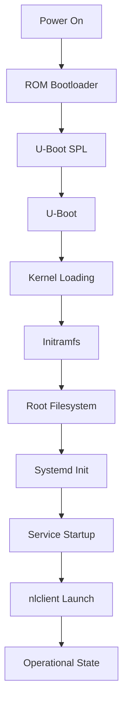

# Boot Process

The Nest Learning Thermostat follows a carefully designed boot process that ensures reliable operation, fast startup times, and secure system initialization. This document describes the complete boot sequence from power-on to operational state.

## Boot Sequence Overview



## Bootloader Stages

### Primary Bootloader (ROM)
- **Location**: Device ROM (immutable)
- **Purpose**: Initial hardware initialization
- **Functions**:
  - CPU and memory controller setup
  - Boot media detection (NAND flash)
  - Secondary bootloader loading
- **Timing**: ~100ms

### Secondary Bootloader (U-Boot SPL)
- **Location**: NAND flash, first sectors
- **Purpose**: Minimal bootloader for memory initialization
- **Functions**:
  - DDR memory initialization
  - Clock configuration
  - Full U-Boot loading
- **File**: `u-boot-spl.bin`
- **Timing**: ~500ms

### Main Bootloader (U-Boot)
- **Location**: NAND flash partition
- **Purpose**: System bootloader with advanced features
- **Functions**:
  - Hardware enumeration
  - Boot mode selection (normal/recovery/update)
  - Kernel and initramfs loading
  - System diagnostics
- **Configuration**: `/etc/u-boot.env`
- **Timing**: ~2-3 seconds

## Kernel Boot Phase

### Kernel Loading
- **Image**: Compressed Linux kernel (`zImage`)
- **Location**: Boot partition
- **Decompression**: In-memory kernel decompression
- **Parameters**: Boot command line from U-Boot

### Early Boot (Initramfs)
- **Purpose**: Early system initialization
- **Components**:
  - Essential drivers (storage, display, input)
  - Partition mounting utilities
  - System check scripts
- **Mount Points**: Temporary filesystem setup
- **Timing**: ~5 seconds

### Kernel Initialization
```bash
# Typical kernel boot parameters
console=ttyO2,115200n8
root=/dev/mtdblock3
rootfstype=jffs2
init=/sbin/init
rw
```

## System Initialization

### Systemd Boot Sequence
1. **Basic System Setup**
   - Mount filesystems
   - Load kernel modules
   - Set system clock

2. **Service Dependencies**
   - D-Bus system bus startup
   - Hardware abstraction layer
   - Network manager preparation

3. **Nest Services**
   - Sensor service initialization
   - Thermostat manager startup
   - Network connectivity establishment

### Critical Services
```bash
# Service startup order
systemd-journald.service      # Logging system
dbus.service                  # IPC system
connman.service               # Network management
sensor-service.service        # Hardware sensors
thermostat-manager.service    # Control logic
nlclient.service              # User interface
```

## Boot Modes

### Normal Boot
- **Trigger**: Standard power-on or restart
- **Process**: Full system initialization
- **Target**: Operational state
- **Timing**: ~20-30 seconds total

### Recovery Boot
- **Trigger**: System failure or user request
- **Process**: Minimal system with recovery tools
- **Features**:
  - Factory reset capability
  - Firmware recovery
  - Diagnostic tools
- **Activation**: Hold touch ring during power-on

### Update Boot
- **Trigger**: OTA update installation
- **Process**: Update application execution
- **Features**:
  - A/B partition switching
  - Update verification
  - Rollback capability
- **Safety**: Automatic rollback on failure

## Filesystem Mounting

### Mount Sequence
```bash
# Critical filesystems
/proc              # Process information (virtual)
/sys               # System information (virtual)
/dev               # Device nodes (virtual)
/dev/mtdblock3     # Root filesystem
/media/system-config # System configuration
/media/user-config   # User data
/media/data          # Runtime data
/media/log           # Log files
```

### Mount Options
- **Root Filesystem**: Read-write with journaling
- **Configuration Partitions**: Read-write with sync
- **Log Partition**: Read-write with compression
- **Data Partition**: Read-write with tmpfs overlay

## Hardware Initialization

### Display System
1. **Framebuffer Setup**
   - Resolution: 320x320 circular
   - Color depth: 16-bit RGB565
   - Rotation: 0 degrees (native)

2. **Touch Interface**
   - I2C touch controller initialization
   - Calibration data loading
   - Input device registration

3. **Backlight Control**
   - PWM controller setup
   - Initial brightness level
   - Ambient light sensor integration

### Sensor System
1. **Temperature Sensors**
   - I2C bus initialization
   - Sensor calibration loading
   - Sampling rate configuration

2. **Environmental Sensors**
   - Humidity sensor setup
   - Motion sensor configuration
   - Ambient light sensor calibration

### Network Interfaces
1. **Wi-Fi Module**
   - Power management setup
   - Firmware loading
   - Interface configuration

2. **Zigbee Radio**
   - IEEE 802.15.4 initialization
   - Network stack startup
   - Heatlink communication

## Service Startup Details

### nlclient Launch
```bash
# nlclient startup parameters
/nestlabs/bin/nlclient
  --display=/dev/fb0
  --touch=/dev/input/event0
  --config=/media/user-config/
  --log-level=info
```

### D-Bus Configuration
- **System Bus**: Main IPC mechanism
- **Services**: Hardware abstraction, settings management
- **Security**: Policy-based access control
- **Configuration**: `/etc/dbus-1/system.d/`

### Network Connectivity
1. **ConnMan Startup**
   - Network interface detection
   - Configuration loading
   - Connection management

2. **Wi-Fi Connection**
   - Saved network profiles
   - Automatic connection
   - Fallback to setup mode

## Boot Optimization

### Parallel Initialization
- **Systemd Features**: Parallel service startup
- **Dependency Resolution**: Optimal service ordering
- **Resource Management**: Efficient resource utilization

### Fast Boot Techniques
- **Initramfs Optimization**: Minimal essential components
- **Kernel Configuration**: Tailored to hardware
- **Service Tuning**: Reduced startup timeouts

### Caching Strategies
- **Configuration Cache**: Frequently accessed settings
- **Driver Cache**: Pre-loaded hardware configurations
- **Network Cache**: Connection profiles and credentials

## Error Handling

### Boot Failure Detection
- **Watchdog Timer**: Hardware reset on timeout
- **Health Checks**: Component validation
- **Fallback Modes**: Recovery boot options

### Recovery Procedures
1. **Automatic Recovery**
   - Service restart on failure
   - Configuration rollback
   - Safe mode boot

2. **Manual Recovery**
   - Recovery boot mode
   - Factory reset option
   - Firmware reinstallation

### Logging and Diagnostics
- **Boot Log**: Detailed boot sequence logging
- **Error Codes**: Standardized error reporting
- **Diagnostic Tools**: Hardware and software diagnostics

## Performance Metrics

### Timing Breakdown
| Phase | Typical Time | Description |
|-------|-------------|-------------|
| ROM Bootloader | 100ms | Hardware initialization |
| U-Boot SPL | 500ms | Memory setup |
| U-Boot | 2-3s | System preparation |
| Kernel Boot | 5s | Kernel initialization |
| Systemd Init | 10-15s | Service startup |
| nlclient Launch | 5s | UI initialization |
| **Total** | **20-30s** | **Complete boot** |

### Memory Usage
- **Boot Memory**: ~64MB during boot
- **Operational Memory**: ~128MB steady state
- **Peak Memory**: ~200MB during initialization

## Security Features

### Secure Boot
- **Signature Verification**: Kernel and bootloader validation
- **Chain of Trust**: ROM → SPL → U-Boot → Kernel
- **Rollback Protection**: Version-based update validation

### Early Security
- **SELinux Activation**: Mandatory access control
- **System Hardening**: Security module loading
- **Audit System**: Security event logging

## Development and Debugging

### Boot Debugging
- **Serial Console**: Debug output via UART
- **Boot Parameters**: Debug mode configuration
- **Early Userspace**: Debug tools in initramfs

### Customization
- **Boot Configuration**: U-Boot environment variables
- **Service Configuration**: Systemd unit customization
- **Kernel Parameters**: Runtime behavior tuning

## Related Documentation

- [Architecture Overview](./overview.mdx)
- [Linux System](./linux-system.mdx)
- [Hardware Components](../hardware/overview.mdx)
- [System Management](../software/system/monitoring.mdx)
