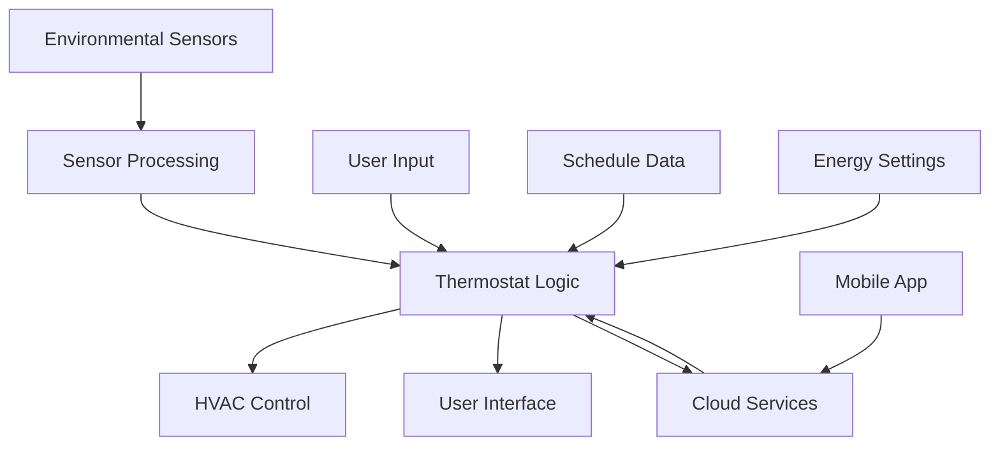

# Architecture Overview

The Nest Learning Thermostat is a sophisticated embedded system that combines hardware sensors, a Linux-based operating system, and intelligent software to provide automated climate control. This document provides a comprehensive overview of the system's architecture.

## System Components

### Hardware Layer
- **Processor**: Texas Instruments OMAP 3/4 series ARM Cortex-A8/A9
- **Display**: 320x320 pixel circular LCD with capacitive touch
- **Sensors**: Temperature, humidity, motion, and ambient light sensors
- **Connectivity**: Wi-Fi, Zigbee, and Bluetooth Low Energy
- **Storage**: NAND flash memory with multiple partitions

### Software Layer
- **Operating System**: Custom Linux distribution (OpenEmbedded-based)
- **UI Framework**: Native GTK+ application with custom Nest UI components
- **System Services**: D-Bus communication, device management, and monitoring
- **Network Stack**: ConnMan for network management, Weave protocol for device communication

### Application Layer
- **nlclient**: Main user interface application
- **Thermostat Logic**: Temperature control algorithms and learning systems
- **Energy Management**: Eco modes, scheduling, and energy optimization
- **Remote Services**: Cloud connectivity and mobile app integration

## Key Architectural Principles

### Modular Design
The system follows a modular architecture where each component has clearly defined responsibilities and interfaces. This approach enables:

- Independent development and testing of components
- Simplified maintenance and updates
- Clear separation of concerns between hardware, OS, and application layers

### Real-time Constraints
The thermostat must respond to environmental changes and user interactions in real-time. Key timing requirements include:

- Temperature readings every 5 seconds
- UI response within 100ms for user interactions
- HVAC control decisions within 1 second of sensor updates

### Energy Efficiency
Power consumption is optimized through:
- Low-power processor states during idle periods
- Adaptive display brightness based on ambient light
- Efficient sensor polling schedules
- Network connectivity management

### Security and Reliability
The system implements multiple layers of security and reliability:

- Secure boot with signed firmware images
- Encrypted communication channels
- Watchdog timers for system recovery
- Redundant storage for critical configuration data

## Data Flow

## Communication Interfaces

### Internal Communication
- **D-Bus**: Inter-process communication between system services
- **Shared Memory**: High-performance data exchange between components
- **Unix Sockets**: Local communication for UI and backend services

### External Communication
- **Wi-Fi**: Internet connectivity for cloud services
- **Zigbee**: Communication with Heatlink and other smart home devices
- **BLE**: Initial setup and proximity-based features

## Storage Architecture

The system uses a partitioned NAND flash layout:

- **Boot Partition**: Bootloader and kernel
- **Root Partition**: Linux root filesystem
- **Data Partition**: User settings and learned preferences
- **Log Partition**: System logs and diagnostic data
- **Recovery Partition**: Factory reset and recovery tools

## Development Considerations

### Cross-Platform Development
- Target: ARM embedded Linux
- Development: x86_64 Linux with cross-compilation toolchain
- Testing: Hardware-in-the-loop simulation and device testing

### Update Mechanism
- Over-the-air updates with rollback capability
- A/B partition scheme for seamless updates
- Delta updates to minimize bandwidth usage

### Debugging and Diagnostics
- Serial console access for low-level debugging
- Remote logging and monitoring capabilities
- Built-in diagnostic tools for field service

## Related Documentation

- [Linux System Details](./linux-system.mdx)
- [Boot Process](./boot-process.mdx)
- [Hardware Components](../hardware/overview.mdx)
- [Software Components](../software/overview.mdx)
