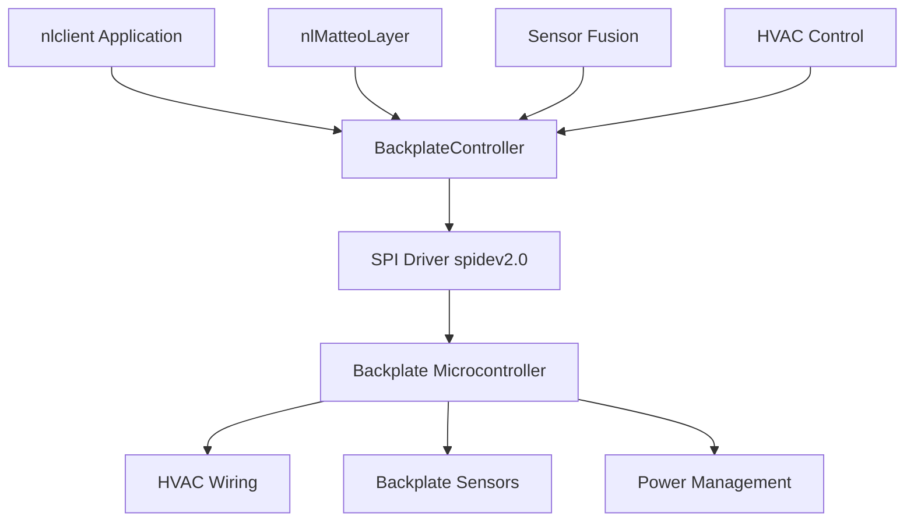
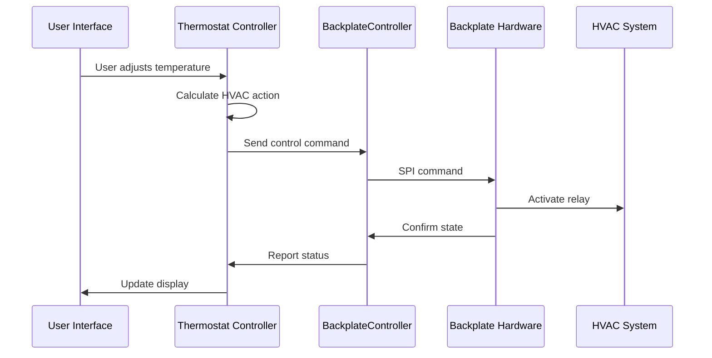

# UI-Backplate Communication Architecture

This document details the control backend architecture between the Nest Thermostat's user interface (display unit) and the backplate (base unit).

## System Architecture Overview

The Nest Learning Thermostat consists of two primary hardware components:

1. **Display Unit (Head)**: Contains the main processor, display, sensors, and user interface
2. **Backplate (Base)**: Contains HVAC wiring connections, power management, and additional sensors

These components communicate to coordinate thermostat operation, sensor data, and HVAC control.

## Hardware Communication Layer

### Physical Interface

Based on kernel logs and system messages, the communication uses **SPI (Serial Peripheral Interface)**:

```
spidev spi2.0: ... can't suspend
s6d05a1 spi1.0: ... can't suspend
```

**Key Interfaces:**
- **SPI1**: Display controller (s6d05a1 - Samsung display driver)
- **SPI2**: Backplate communication interface (spidev)

The `spidev` driver on `spi2.0` provides the communication channel between the display unit's main processor and the backplate microcontroller.

### Communication Characteristics

- **Protocol**: SPI-based serial communication
- **Device**: `/dev/spidev2.0` (accessible via spidev driver)
- **Power Management**: Cannot suspend during active communication
- **Bidirectional**: Full-duplex communication for sensor data and control commands

## Software Architecture

### BackplateController Component

The `BackplateController` is a critical software component that manages the display-backplate interface:

**Evidence from logs:**
```
nlclient[470:sleepm] sleepman: 3 Features blocking sleep: czcomms BackplateController AttemptToSleepClient
```

**Responsibilities:**
- Maintain active connection with backplate
- Block system sleep when communication is required
- Coordinate with sleep management system
- Handle attach/detach detection

### Communication Layers



### Key Software Components

#### 1. BackplateController
- **Location**: Part of nlclient application
- **Function**: Primary interface to backplate hardware
- **Features**:
  - Connection state management
  - Sensor data retrieval
  - HVAC control commands
  - Wire configuration detection
  - Power status monitoring

#### 2. nlMatteoLayer
**Evidence from logs:**
```
nlclient[470:client] nlMatteoLayer: waiting on backplate and sensor report
```

**Responsibilities:**
- Coordinate sensor data from backplate
- Synchronize sensor reports with display sensors
- Manage sensor fusion timing
- Handle sensor data validation

#### 3. czcomms (Communication Manager)
**Evidence from logs:**
```
nlclient[470:client] czcomms: ReadyToSleep - nopoll delta 2 vs. max 50
```

**Responsibilities:**
- Communication polling management
- Sleep coordination
- Network and local communication orchestration
- Power-efficient communication scheduling

## Data Exchange Protocol

### Sensor Data Flow

The backplate provides critical sensor data to the display unit:

**Backplate Sensors:**
- Temperature sensors (for HVAC control)
- Wire detection (which HVAC wires are connected)
- Power status (C-wire, battery charging)
- HVAC state (heating/cooling active)

**Communication Pattern:**
1. Display unit polls backplate for sensor reports
2. Backplate responds with current sensor readings
3. nlMatteoLayer synchronizes with display sensors
4. Data flows to thermostat control logic

### HVAC Control Commands

The display unit sends control commands to the backplate:

**Control Signals:**
- Heating relay control (W1, W2)
- Cooling relay control (Y1, Y2)
- Fan control (G)
- Reversing valve (O/B)
- Auxiliary/Emergency heat (E, AUX)
- Common wire power management (C)

**Command Flow:**
1. Thermostat logic determines HVAC action
2. BackplateController formats control command
3. Command sent via SPI to backplate
4. Backplate activates appropriate relays
5. Backplate confirms state change

### Wire Configuration Detection

The backplate detects and reports wiring configuration:

**Detection Capabilities:**
- Which HVAC wires are connected (R, C, W, Y, G, O/B, etc.)
- Wire configuration changes
- Unsupported configurations
- Power availability (C-wire present)

**Alert Messages (from localization files):**
```
"backplateconnectionsalert.wirechanged.aw" = "The wiring to your equipment has changed."
"backplateconnectionsalert.unsupported.aw" = "Your thermostat cannot control this equipment properly without wiring changes."
"backplateconnectionsalert.poweroff.aw" = "The power from your equipment to the thermostat may be off."
```

## Attach/Detach Detection

### Physical Connection States

The system detects three primary states:

1. **Attached**: Display properly connected to backplate
2. **Detached**: Display removed from backplate
3. **Connection Error**: Improper connection or communication failure

### Detection Mechanism

**User Messages:**
```
"backplateconnectionsalert.pleaseattach.aw" = "To use the thermostat, attach the display to its base."
"backplateconnectionsalert.pleasereattach.aw" = "Please remove the thermostat from its base, then reattach it."
"matteolayer.bpmsg.aw" = "Please attach the display to its base"
```

**Detection Method:**
- Continuous SPI communication monitoring
- Timeout detection when backplate doesn't respond
- Wire configuration validation
- Power status verification

### Behavior on Detachment

When the display is removed from the backplate:

1. **Battery Operation**: Display runs on internal battery
2. **Limited Functionality**: Cannot control HVAC
3. **Data Retention**: Maintains settings and schedule
4. **User Notification**: Displays attachment required message
5. **Update Blocking**: Firmware updates require attachment

## Power Management Integration

### Power Sources

**Backplate Power:**
- C-wire (common wire) from HVAC system
- Power stealing from R-wire when C-wire unavailable
- Battery charging circuit

**Display Power:**
- Power from backplate when attached
- Internal rechargeable battery when detached
- USB power (for diagnostics/recovery)

### Sleep Coordination

The BackplateController participates in system sleep management:

**Sleep Blocking:**
```
sleepman: 2 Features blocking sleep: BackplateController AttemptToSleepClient
```

**Sleep Coordination:**
1. BackplateController checks for pending operations
2. Ensures sensor data is synchronized
3. Confirms HVAC state is stable
4. Allows sleep when safe
5. Schedules wake for next sensor poll

### Battery Management

**Charging Coordination:**
- Backplate monitors battery voltage
- Controls charging current
- Reports battery status to display
- Prevents updates on low battery

**Battery Thresholds:**
```
"updatelayer.batterylevel" = "Battery %.1f V"
"updatelayer.batterylevelrequired" = "%.1f V required"
"updatelayer.batterylow.aw" = "Your thermostat's battery is recharging. When it's done, it will complete the update."
```

## Firmware Update Coordination

### Update Requirements

Firmware updates require backplate attachment:

```
"updatelayer.attachtobase.aw" = "To update the thermostat, attach the display to its base."
"updatemenulayer.attach.aw" = "To update the thermostat, attach the display to its base."
```

### Update Process

1. **Pre-Update Checks:**
   - Verify display attached to backplate
   - Check battery voltage sufficient
   - Ensure stable power from C-wire
   - Validate communication link

2. **Update Sequence:**
   - Display firmware update (nlswupdate)
   - Backplate firmware update (nlbpupdater)
   - ZigBee radio update (nlzbupdater)
   - Bootloader update if needed (nliplupdater)

3. **Backplate Update:**
   - Display coordinates backplate update
   - Sends firmware image via SPI
   - Backplate enters bootloader mode
   - Flashes new firmware
   - Verifies and reboots
   - Display confirms successful update

### Update Coordination

**nlbpupdater** (Backplate Updater):
- Location: `/nestlabs/sbin/nlbpupdater`
- Size: 201KB
- Coordinates with nlswupdate
- Manages backplate firmware flashing
- Verifies backplate version

## Error Handling and Recovery

### Communication Errors

**Detection:**
- SPI timeout
- Invalid response from backplate
- Checksum failures
- Missing sensor reports

**Recovery Actions:**
1. Retry communication
2. Reset SPI interface
3. Request backplate reset
4. Display reattachment message
5. Log error for diagnostics

### Wire Configuration Errors

**Unsupported Configurations:**
```
"backplateconnectionsalert.unsupported.aw" = "Your thermostat cannot control this equipment properly without wiring changes."
```

**Detection:**
- Backplate reports wire configuration
- Display validates against supported configurations
- Checks for required wires (R, W or Y)
- Verifies power availability

**User Guidance:**
- Display wiring diagrams
- Show connector images (Connector_2_0_*.png)
- Provide installation instructions
- Suggest professional installation if needed

### Power Loss Scenarios

**No C-Wire Power:**
```
"backplateconnectionsalert.poweroff.aw" = "The power from your equipment to the thermostat may be off."
"backplateconnectionsalert.poweroffduetotemp.aw" = "Your thermostat isn't getting power. Troubleshoot it to avoid losing heating."
```

**Handling:**
1. Detect power loss from backplate
2. Switch to battery power
3. Notify user of power issue
4. Reduce power consumption
5. Maintain critical functions
6. Log power events

## Integration with Thermostat Control

### Control Flow



### Sensor Fusion

The BackplateController provides sensor data for:

**Temperature Control:**
- Backplate temperature sensor
- Display temperature sensor
- Remote sensor data (via ZigBee)
- Sensor fusion algorithm combines all sources

**Environmental Monitoring:**
- Ambient light sensor (display)
- Motion sensor (display)
- Humidity sensor (if present)
- Outdoor temperature (from cloud)

### HVAC State Management

**State Synchronization:**
1. Thermostat logic determines desired state
2. BackplateController sends commands
3. Backplate activates relays
4. Backplate reports actual state
5. Controller verifies state matches intent
6. Logs state changes for energy tracking

## Performance Characteristics

### Communication Timing

**Polling Intervals:**
- Active operation: ~50ms sensor polls
- Idle operation: Reduced polling frequency
- Sleep mode: Periodic wake for critical checks

**Sleep Coordination:**
```
czcomms: ReadyToSleep - nopoll delta 2 vs. max 50
```
- Maximum 50 time units between polls
- Coordinated with other communication needs

### Reliability Features

**Redundancy:**
- Multiple retry attempts on communication failure
- Fallback to safe HVAC state on error
- Persistent state storage in recovery files
- Watchdog monitoring of communication health

**Diagnostics:**
- Communication error logging
- State change tracking
- Performance metrics collection
- Crash dump generation on failures

## Security Considerations

### Communication Security

**Physical Security:**
- SPI is a local, physical interface
- No wireless exposure of backplate protocol
- Requires physical access to intercept

**Firmware Verification:**
- Signed firmware updates
- Backplate verifies signatures
- Prevents unauthorized firmware
- Rollback on verification failure

### Isolation

**Component Separation:**
- Backplate runs separate microcontroller
- Isolated from main processor
- Limited attack surface
- Hardware-enforced boundaries

## Development and Debugging

### Debug Interfaces

**Logging:**
- BackplateController events in nlclient logs
- SPI driver messages in kernel log
- State changes in event log
- Error conditions logged for analysis

**Diagnostic Tools:**
- SPI communication can be monitored
- Backplate state readable via debug interface
- Wire configuration visible in settings
- Power status displayed on screen

### Testing Considerations

**Attach/Detach Testing:**
- Verify detection mechanism
- Test battery operation
- Validate power transitions
- Confirm HVAC safety on detach

**Communication Testing:**
- SPI protocol validation
- Error injection testing
- Timeout handling verification
- Recovery procedure testing

## Related Components

### HeatLink Integration

The backplate also communicates with HeatLink accessories:

**HeatLink:**
- Boiler control accessory
- Separate wireless communication
- Coordinated through backplate
- Firmware: `/nestlabs/share/heatlink/data/firmware/production/heatlink.elf`

### Remote Sensors

**ZigBee/Thread Network:**
- Remote temperature sensors
- Coordinated via wpantund daemon
- Data flows through nlclient
- Integrated with sensor fusion

## Summary

The UI-Backplate communication backend is a sophisticated system that:

1. **Uses SPI** for reliable, low-latency communication
2. **Coordinates sensor data** from multiple sources
3. **Controls HVAC relays** safely and efficiently
4. **Manages power** between C-wire and battery
5. **Detects wire configuration** and validates compatibility
6. **Handles attach/detach** gracefully with user feedback
7. **Coordinates firmware updates** for both components
8. **Integrates with sleep management** for power efficiency
9. **Provides robust error handling** and recovery
10. **Maintains security** through physical isolation and signed updates

The architecture demonstrates careful consideration of reliability, power efficiency, and user experience in an embedded thermostat system.

## See Also

- [System Overview](/system-overview) - Overall system architecture
- [Software Components](/software-components) - Detailed component documentation
- [Filesystem Structure](/filesystem-structure) - Data organization
- [nlclient Reference](/reference/nlclient) - Main application details
