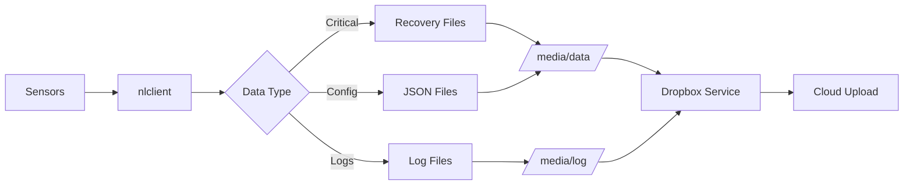

# Data Files Reference

The Nest Thermostat stores operational data in `/media/data/` using a combination of JSON and binary recovery files.

## File Format Types

### JSON Files (.json)
Human-readable JSON format for configuration and state that can tolerate loss or corruption.

### Recovery Files (.recovery)
Binary format designed for critical state that must survive power loss and corruption. Uses atomic write operations and checksums.

## Data Files Catalog

### Schedule Management

#### schedulemanager.recovery
**Purpose**: Stores the current schedule state and active schedule slots

**Key Data**:
- `previous_schedule_slot` - Last active schedule entry
- `next_learning_epoch` - Next scheduled learning event
- `last_transition_epoch` - Last schedule transition time

#### schedulescore.HEAT.recovery
**Purpose**: Heating schedule scoring and learning data

**Key Data**:
- Learning scores for heating schedule optimization
- Historical performance metrics

### Occupancy & Auto-Away

#### autoaway.recovery
**Purpose**: Auto-away detection state and history

**Key Data**:
- `away_state` - Current occupancy state
- `last_action` - Last occupancy-related action
- `last_action_by` - Source of last action (user/auto)
- Motion detection history
- Occupancy prediction models

### Energy Management

#### energystats.recovery
**Purpose**: Energy usage statistics and tracking

**Key Data**:
- Historical energy consumption
- Runtime statistics by HVAC stage
- Efficiency metrics

#### rateplan.json
**Purpose**: Utility rate plan configuration

**Key Data**:
- `id` - Rate plan identifier
- `description` - Rate plan description
- Time-of-use pricing tiers
- Peak/off-peak periods

#### toumanager.json
**Purpose**: Time-of-use rate management

**Key Data**:
- `last_pricing_change_processed` - Last rate update
- Active pricing schedule
- Cost optimization settings

#### demandcharge.json
**Purpose**: Demand charge management for commercial/industrial rates

**Key Data**:
- Peak demand tracking
- Demand limiting settings
- Historical demand patterns

#### fleetrhr.json
**Purpose**: Fleet runtime history

**Key Data**:
- `fleet_rhr` - Aggregated runtime data
- Equipment runtime tracking across fleet

### Prediction & Learning

#### predictionmanager.json
**Purpose**: Temperature prediction models and time-to-temperature estimation

**Key Data**:
- `predicted_completion_time_utc` - Estimated time to reach setpoint
- `predicted_afterglow_end_time_utc` - Predicted system coast time
- `predicted_expiration_time_utc` - Prediction validity period
- `OnOffModel` - On/off HVAC model parameters
- `ModulationModel` - Modulating HVAC model parameters
- `AutoTuneModel` - Auto-tuning parameters
- `AlgoLearnerStates` - Learning algorithm states

#### sunlightcorrection.recovery
**Purpose**: Sunlight correction algorithm state

**Key Data**:
- Temperature correction factors for sunlight exposure
- Historical sunlight impact data
- Calibration parameters

### HVAC Control

#### radiantcontrol.recovery
**Purpose**: Radiant heating system control state

**Key Data**:
- Radiant system parameters
- Control algorithms for radiant heating

#### furnaceshutdown.recovery
**Purpose**: Furnace shutdown protection state

**Key Data**:
- `last_bacteria_cycle_epoch` - Last bacteria prevention cycle
- Safety shutdown conditions
- Furnace protection parameters

#### autodehum.json
**Purpose**: Automatic dehumidification control

**Key Data**:
- `auto_dehum_state` - Current dehumidification state
- Humidity control parameters
- Dehumidification schedule

#### airwave.recovery
**Purpose**: Airwave feature state (fan-only cooling)

**Key Data**:
- Airwave activation conditions
- Energy savings from fan-only operation

### Smart Features

#### smartthermostatmanager.json
**Purpose**: Smart thermostat features coordination

**Key Data**:
- `multi_room_visible` - Multi-room sensor visibility
- `associated_sensor_info` - Connected sensor information
- `active_sensors` - Currently active sensors
- Smart feature states

#### rcsmanager.json
**Purpose**: Remote Control System management

**Key Data**:
- `rcs_control_setting` - Remote control configuration
- `RemoteModels` - Remote sensor models
- Remote sensor coordination

#### tuneupmanager.json
**Purpose**: System tuning and optimization

**Key Data**:
- `presenting_tuneup_time_utc` - Last tuning presentation
- `qualification_results` - System qualification results
- Optimization parameters

#### overundershoot.json
**Purpose**: Temperature overshoot/undershoot compensation

**Key Data**:
- `actual_temp_change` - Measured temperature changes
- `actual_results_stage_index` - HVAC stage performance
- `heating_adjustments` - Heating compensation factors
- `cooling_adjustments` - Cooling compensation factors
- `range_adjustments` - Range mode adjustments

### System State

#### crystalsubspaceid.recovery
**Purpose**: Device identity and subspace identifier

**Key Data**:
- Unique device identifier
- Nest service subspace ID

#### goosemgr.recovery
**Purpose**: Goose manager state (internal feature)

**Key Data**:
- Internal state management
- Feature coordination

### Demand Response

#### party_mode_setpoint
**Purpose**: Party mode and demand response setpoints

**Key Data**:
- `party_mode_setpoint` - User override setpoint
- `pre_party_mode_setpoint` - Setpoint before override
- `dr_setpoint` - Demand response setpoint
- `pre_dr_setpoint` - Setpoint before DR event
- `paused_start_time_utc` - Override start time
- `running_start_time_utc` - DR event start time

### Debugging

#### nlclient.crash
**Purpose**: Crash dump information

**Key Data**:
- Stack traces
- Register dumps
- Crash context

#### nlclient.maps
**Purpose**: Memory map information for debugging

**Key Data**:
- Memory layout
- Symbol information
- Library mappings

## Common Data Fields

Many files share common fields:

### Timestamps
- `*_epoch` - Unix epoch timestamps
- `*_time_utc` - UTC timestamps
- `initial_boot_time` - Device boot time
- `last_increment_time` - Last update time

### Control State
- `last_action` - Last action taken
- `last_action_by` - Actor (user/system/schedule)
- `requested_action` - Pending action
- `allowed_count` - Action rate limiting
- `num_backoffs` - Retry backoff count

### Setpoints
- `last_heat_setpoint` - Last heating target
- `last_cool_setpoint` - Last cooling target
- `last_range_setpoint` - Last range mode targets
- `last_emergency_setpoint` - Emergency heat target
- `last_sent_setpoint_temp` - Last transmitted setpoint

### HVAC Configuration
- `hvac_stages` - Available HVAC stages
- `actual_results_stage_index` - Current stage performance

## Data Persistence Strategy

### Critical State (Recovery Files)
- Atomic writes with checksums
- Survive power loss
- Used for schedule, occupancy, energy stats

### Configuration (JSON Files)
- Human-readable
- Can be regenerated if corrupted
- Used for preferences, tuning parameters

### Transient Data (Memory/Scratch)
- Temporary calculations
- Cached values
- Staging for uploads

## Data Flow

<Info>
  Understanding these data files is crucial for debugging thermostat behavior, recovering from failures, and analyzing system performance.
</Info>

<Warning>
  Modifying these files on a live system can cause unpredictable behavior or data loss. Always backup before making changes.
</Warning>
