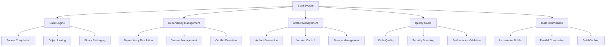

# Build System

The Nest Learning Thermostat build system provides comprehensive automation for firmware compilation, linking, and packaging. This document details the build system architecture, configuration, and optimization techniques.

## Build System Architecture

### Core Components
- **Build Engine**: Core build execution and coordination
- **Dependency Management**: Automated dependency resolution and management
- **Artifact Management**: Build artifact generation, storage, and versioning
- **Quality Gates**: Automated quality checks and validation
- **Build Optimization**: Performance optimization and caching

### Build Framework


## Build Engine

### Compilation Pipeline
Multi-stage compilation pipeline with optimization and validation.

```c
// Build engine system
typedef struct {
    compilation_pipeline_t compilation;    // Compilation pipeline
    linking_pipeline_t linking;            // Linking pipeline
    packaging_pipeline_t packaging;        // Packaging pipeline
    optimization_engine_t optimization;    // Optimization engine
} build_engine_t;

// Compilation pipeline
typedef struct {
    preprocessor_t preprocessor;           // Preprocessor
    compiler_t compiler;                   // Compiler
    assembler_t assembler;                 // Assembler
    postprocessor_t postprocessor;         // Postprocessor
} compilation_pipeline_t;

// Compilation configuration
typedef struct {
    compilation_target_t target;           // Compilation target
    optimization_level_t optimization;     // Optimization level
    debug_level_t debug_level;              // Debug level
    warning_level_t warning_level;          // Warning level
    feature_flags_t features;               // Feature flags
} compilation_config_t;

// Execute compilation pipeline
compilation_result_t execute_compilation_pipeline(
    compilation_pipeline_t *pipeline, 
    source_files_t *sources, 
    compilation_config_t *config) {
    
    compilation_result_t result = {0};
    
    // Initialize compilation context
    compilation_context_t context = initialize_compilation_context(
        sources, config);
    
    // Preprocess source files
    preprocessing_result_t preprocessing = preprocess_sources(
        &pipeline->preprocessor, context);
    
    if (!preprocessing.success) {
        result.status = COMPILATION_STATUS_PREPROCESSING_FAILED;
        result.preprocessing_errors = preprocessing.errors;
        return result;
    }
    
    // Compile preprocessed sources
    compilation_output_t compilation = compile_sources(
        &pipeline->compiler, preprocessing.preprocessed_sources, 
        preprocessing.source_count, config);
    
    if (!compilation.success) {
        result.status = COMPILATION_STATUS_COMPILATION_FAILED;
        result.compilation_errors = compilation.errors;
        return result;
    }
    
    // Assemble if needed
    if (config->target.requires_assembly) {
        assembly_result_t assembly = assemble_objects(
            &pipeline->assembler, compilation.object_files, 
            compilation.object_count);
        
        if (!assembly.success) {
            result.status = COMPILATION_STATUS_ASSEMBLY_FAILED;
            result.assembly_errors = assembly.errors;
            return result;
        }
        
        result.assembly_output = assembly;
    }
    
    // Postprocess compilation results
    postprocessing_result_t postprocessing = postprocess_compilation(
        &pipeline->postprocessor, compilation);
    
    if (!postprocessing.success) {
        result.status = COMPILATION_STATUS_POSTPROCESSING_FAILED;
        result.postprocessing_errors = postprocessing.errors;
        return result;
    }
    
    result.status = COMPILATION_STATUS_SUCCESS;
    result.object_files = compilation.object_files;
    result.object_count = compilation.object_count;
    result.compilation_metrics = calculate_compilation_metrics(
        preprocessing, compilation, postprocessing);
    
    return result;
}
```

### Linking Pipeline
Advanced linking pipeline with symbol resolution and optimization.

```c
// Linking pipeline
typedef struct {
    symbol_resolver_t resolver;            // Symbol resolver
    object_linker_t linker;                // Object linker
    library_manager_t libraries;           // Library management
    optimization_t optimization;           // Link-time optimization
} linking_pipeline_t;

// Linking configuration
typedef struct {
    link_type_t link_type;                 // Link type (static/dynamic)
    strip_symbols_t strip_symbols;         // Symbol stripping
    optimization_level_t optimization;     // Link-time optimization
    library_paths_t library_paths;         // Library search paths
} linking_config_t;

// Execute linking pipeline
linking_result_t execute_linking_pipeline(
    linking_pipeline_t *pipeline, 
    object_files_t *objects, 
    linking_config_t *config) {
    
    linking_result_t result = {0};
    
    // Resolve symbols
    symbol_resolution_t resolution = resolve_symbols(
        &pipeline->resolver, objects, config);
    
    if (!resolution.resolved) {
        result.status = LINKING_STATUS_SYMBOL_RESOLUTION_FAILED;
        result.unresolved_symbols = resolution.unresolved_symbols;
        return result;
    }
    
    // Link objects and libraries
    linking_output_t linking = link_objects(
        &pipeline->linker, objects, resolution.resolved_libraries, 
        config);
    
    if (!linking.success) {
        result.status = LINKING_STATUS_LINKING_FAILED;
        result.linking_errors = linking.errors;
        return result;
    }
    
    // Manage libraries
    library_management_result_t library_mgmt = manage_libraries(
        &pipeline->libraries, linking, config);
    
    if (!library_mgmt.success) {
        result.status = LINKING_STATUS_LIBRARY_MANAGEMENT_FAILED;
        result.library_errors = library_mgmt.errors;
        return result;
    }
    
    // Apply link-time optimization
    if (config->optimization > OPTIMIZATION_NONE) {
        lto_result_t lto = apply_link_time_optimization(
            &pipeline->optimization, linking.executable, 
            config->optimization);
        
        if (!lto.success) {
            result.status = LINKING_STATUS_LTO_FAILED;
            result.lto_errors = lto.errors;
            return result;
        }
        
        result.optimized_executable = lto.optimized_binary;
    } else {
        result.optimized_executable = linking.executable;
    }
    
    result.status = LINKING_STATUS_SUCCESS;
    result.linked_executable = result.optimized_executable;
    result.link_info = linking.link_info;
    result.library_info = library_mgmt.library_info;
    
    return result;
}
```

## Dependency Management

### Dependency Resolution
Automated dependency resolution with conflict detection and resolution.

```c
// Dependency management system
typedef struct {
    dependency_resolver_t resolver;        // Dependency resolver
    version_manager_t version_manager;     // Version management
    conflict_detector_t conflict;          // Conflict detection
    dependency_cache_t cache;              // Dependency cache
} dependency_management_t;

// Dependency resolver
typedef struct {
    dependency_graph_t graph;              // Dependency graph
    resolution_algorithm_t algorithm;      // Resolution algorithm
    constraint_solver_t solver;            // Constraint solver
    alternative_selector_t selector;       // Alternative selector
} dependency_resolver_t;

// Dependency specification
typedef struct {
    dependency_id_t dependency_id;         // Dependency ID
    version_constraint_t version;          // Version constraint
    dependency_type_t type;                 // Dependency type
    optional_flag_t optional;               // Optional flag
    conflict_specification_t conflicts;     // Conflict specifications
} dependency_specification_t;

// Resolve dependencies
dependency_resolution_result_t resolve_dependencies(
    dependency_resolver_t *resolver, 
    dependency_specification_t *specs, 
    int spec_count) {
    
    dependency_resolution_result_t result = {0};
    
    // Build dependency graph
    dependency_graph_t graph = build_dependency_graph(
        &resolver->graph, specs, spec_count);
    
    if (!graph.valid) {
        result.status = DEPENDENCY_RESOLUTION_GRAPH_FAILED;
        result.graph_errors = graph.errors;
        return result;
    }
    
    // Detect conflicts
    conflict_detection_t conflicts = detect_dependency_conflicts(
        &resolver->conflict, graph);
    
    if (conflicts.has_conflicts) {
        // Attempt conflict resolution
        conflict_resolution_t resolution = resolve_conflicts(
            &resolver->solver, conflicts);
        
        if (!resolution.resolved) {
            result.status = DEPENDENCY_RESOLUTION_CONFLICT_FAILED;
            result.unresolved_conflicts = conflicts.conflicts;
            return result;
        }
        
        graph = apply_conflict_resolution(graph, resolution);
    }
    
    // Apply resolution algorithm
    resolution_result_t resolution = apply_resolution_algorithm(
        &resolver->algorithm, graph);
    
    if (!resolution.success) {
        result.status = DEPENDENCY_RESOLUTION_ALGORITHM_FAILED;
        result.resolution_errors = resolution.errors;
        return result;
    }
    
    // Select alternatives if needed
    alternative_selection_t alternatives = select_alternatives(
        &resolver->selector, resolution);
    
    result.status = DEPENDENCY_RESOLUTION_SUCCESS;
    result.resolved_dependencies = resolution.dependencies;
    result.dependency_count = resolution.dependency_count;
    result.selected_alternatives = alternatives;
    
    return result;
}
```

### Version Management
Comprehensive version management for dependencies and build artifacts.

```c
// Version manager
typedef struct {
    version_resolver_t resolver;           // Version resolver
    version_comparator_t comparator;       // Version comparator
    version_updater_t updater;             // Version updater
    version_locker_t locker;               // Version locker
} version_manager_t;

// Version resolution
typedef struct {
    version_scheme_t scheme;               // Version scheme
    version_preference_t preference;       // Version preference
    compatibility_matrix_t compatibility;  // Compatibility matrix
    upgrade_path_t upgrade_path;           // Upgrade path
} version_resolver_t;

// Manage dependency versions
version_management_result_t manage_dependency_versions(
    version_manager_t *manager, 
    dependency_set_t *dependencies, 
    version_policy_t *policy) {
    
    version_management_result_t result = {0};
    
    // Resolve versions according to policy
    version_resolution_t resolution = resolve_versions(
        &manager->resolver, dependencies, policy);
    
    if (!resolution.success) {
        result.status = VERSION_MANAGEMENT_RESOLUTION_FAILED;
        result.resolution_errors = resolution.errors;
        return result;
    }
    
    // Compare versions for compatibility
    compatibility_check_t compat_check = check_version_compatibility(
        &manager->comparator, resolution.resolved_versions);
    
    if (!compat_check.compatible) {
        result.status = VERSION_MANAGEMENT_COMPATIBILITY_FAILED;
        result.compatibility_issues = compat_check.issues;
        return result;
    }
    
    // Update versions if needed
    if (policy->auto_update) {
        version_update_t update = update_versions(
            &manager->updater, resolution.resolved_versions, policy);
        
        if (!update.success) {
            result.status = VERSION_MANAGEMENT_UPDATE_FAILED;
            result.update_errors = update.errors;
            return result;
        }
        
        result.updated_versions = update.updated_versions;
    }
    
    // Lock versions for reproducible builds
    version_lock_t lock = lock_versions(
        &manager->locker, resolution.resolved_versions);
    
    result.status = VERSION_MANAGEMENT_SUCCESS;
    result.resolved_versions = resolution.resolved_versions;
    result.version_lock = lock;
    
    return result;
}
```

## Artifact Management

### Build Artifact Generation
Comprehensive artifact generation with metadata and signatures.

```c
// Artifact management system
typedef struct {
    artifact_generator_t generator;        // Artifact generator
    metadata_manager_t metadata;           // Metadata management
    signature_manager_t signatures;        // Signature management
    storage_manager_t storage;             // Storage management
} artifact_management_t;

// Artifact generator
typedef struct {
    package_builder_t package_builder;    // Package builder
    metadata_extractor_t extractor;        // Metadata extraction
    compression_engine_t compression;     // Compression engine
    checksum_calculator_t checksum;        // Checksum calculation
} artifact_generator_t;

// Build artifact
typedef struct {
    artifact_id_t artifact_id;             // Artifact ID
    artifact_type_t type;                   // Artifact type
    version_info_t version;                 // Version information
    build_metadata_t metadata;              // Build metadata
    artifact_content_t content;            // Artifact content
    artifact_signature_t signature;        // Artifact signature
    checksums_t checksums;                 // Checksums
} build_artifact_t;

// Generate build artifact
artifact_generation_result_t generate_build_artifact(
    artifact_generator_t *generator, 
    build_output_t *build_output, 
    artifact_config_t *config) {
    
    artifact_generation_result_t result = {0};
    
    // Create artifact structure
    build_artifact_t artifact = {0};
    artifact.artifact_id = generate_artifact_id();
    artifact.type = config->artifact_type;
    artifact.version = build_output->version_info;
    
    // Extract build metadata
    artifact.metadata = extract_build_metadata(
        &generator->metadata_extractor, build_output);
    
    // Build artifact package
    package_result_t package_result = build_artifact_package(
        &generator->package_builder, build_output, config);
    
    if (!package_result.success) {
        result.status = ARTIFACT_GENERATION_PACKAGE_FAILED;
        result.package_errors = package_result.errors;
        return result;
    }
    
    artifact.content = package_result.content;
    
    // Compress artifact if requested
    if (config->compress) {
        compression_result_t compression = compress_artifact(
            &generator->compression, artifact.content);
        
        if (!compression.success) {
            result.status = ARTIFACT_GENERATION_COMPRESSION_FAILED;
            result.compression_errors = compression.errors;
            return result;
        }
        
        artifact.content = compression.compressed_content;
    }
    
    // Calculate checksums
    artifact.checksums = calculate_artifact_checksums(
        &generator->checksum, artifact.content);
    
    // Generate artifact signature
    if (config->sign) {
        signature_result_t signature = generate_artifact_signature(
            &generator->signatures, artifact.content, config->signing_key);
        
        if (!signature.success) {
            result.status = ARTIFACT_GENERATION_SIGNATURE_FAILED;
            result.signature_errors = signature.errors;
            return result;
        }
        
        artifact.signature = signature.signature;
    }
    
    result.status = ARTIFACT_GENERATION_SUCCESS;
    result.artifact = artifact;
    
    return result;
}
```

### Artifact Storage
Secure and organized storage of build artifacts with versioning.

```c
// Storage manager
typedef struct {
    repository_t repository;               // Artifact repository
    version_control_t version_control;     // Version control
    replication_manager_t replication;     // Replication management
    cleanup_manager_t cleanup;             // Cleanup management
} storage_manager_t;

// Artifact repository
typedef struct {
    storage_backend_t backend;             // Storage backend
    index_manager_t index;                 // Index management
    access_control_t access_control;       // Access control
    retention_policy_t retention;          // Retention policy
} repository_t;

// Store build artifact
storage_result_t store_build_artifact(
    storage_manager_t *manager, 
    build_artifact_t *artifact, 
    storage_config_t *config) {
    
    storage_result_t result = {0};
    
    // Validate storage configuration
    if (!validate_storage_config(config)) {
        result.status = STORAGE_STATUS_INVALID_CONFIG;
        return result;
    }
    
    // Check storage permissions
    if (!check_storage_permissions(&manager->repository.access_control, 
                                 config->access_level)) {
        result.status = STORAGE_STATUS_ACCESS_DENIED;
        return result;
    }
    
    // Store artifact in repository
    repository_storage_t repo_storage = store_in_repository(
        &manager->repository, artifact, config);
    
    if (!repo_storage.success) {
        result.status = STORAGE_STATUS_REPOSITORY_FAILED;
        result.repository_errors = repo_storage.errors;
        return result;
    }
    
    // Update version control
    version_control_result_t version_result = update_version_control(
        &manager->version_control, artifact, repo_storage.location);
    
    if (!version_result.success) {
        result.status = STORAGE_STATUS_VERSION_CONTROL_FAILED;
        result.version_errors = version_result.errors;
        return result;
    }
    
    // Setup replication if configured
    if (config->replicate) {
        replication_result_t replication = setup_artifact_replication(
            &manager->replication, artifact, repo_storage.location);
        
        if (!replication.success) {
            result.status = STORAGE_STATUS_REPLICATION_FAILED;
            result.replication_errors = replication.errors;
            return result;
        }
    }
    
    // Schedule cleanup if needed
    if (config->auto_cleanup) {
        schedule_artifact_cleanup(&manager->cleanup, artifact, 
                                 &manager->repository.retention);
    }
    
    result.status = STORAGE_STATUS_SUCCESS;
    result.storage_location = repo_storage.location;
    result.storage_metadata = repo_storage.metadata;
    
    return result;
}
```

## Quality Gates

### Automated Quality Checks
Comprehensive quality checks integrated into the build pipeline.

```c
// Quality gates system
typedef struct {
    code_quality_t code_quality;           // Code quality checks
    security_scanner_t security;            // Security scanning
    performance_validator_t performance;   // Performance validation
    compliance_checker_t compliance;       // Compliance checking
} quality_gates_t;

// Code quality checker
typedef struct {
    static_analyzer_t static_analyzer;     // Static analysis
    style_checker_t style_checker;         // Style checking
    complexity_analyzer_t complexity;      // Complexity analysis
    duplication_detector_t duplication;    // Duplication detection
} code_quality_t;

// Quality gate result
typedef struct {
    gate_id_t gate_id;                     // Gate ID
    gate_status_t status;                  // Gate status
    quality_metrics_t metrics;             // Quality metrics
    violation_list_t violations;           // Quality violations
    recommendation_list_t recommendations;  // Recommendations
} quality_gate_result_t;

// Execute quality gates
quality_gate_result_t execute_quality_gates(
    quality_gates_t *gates, 
    build_artifact_t *artifact, 
    quality_config_t *config) {
    
    quality_gate_result_t result = {0};
    
    result.gate_id = generate_gate_id();
    
    // Execute code quality checks
    code_quality_result_t code_quality = execute_code_quality_checks(
        &gates->code_quality, artifact);
    
    result.metrics.code_quality = code_quality.metrics;
    result.violations.code_violations = code_quality.violations;
    
    // Execute security scanning
    security_scan_result_t security_scan = execute_security_scan(
        &gates->security, artifact);
    
    result.metrics.security_score = security_scan.security_score;
    result.violations.security_violations = security_scan.vulnerabilities;
    
    // Execute performance validation
    performance_validation_result_t performance = validate_performance(
        &gates->performance, artifact);
    
    result.metrics.performance_metrics = performance.metrics;
    result.violations.performance_violations = performance.violations;
    
    // Execute compliance checking
    compliance_result_t compliance = check_compliance(
        &gates->compliance, artifact, config->compliance_rules);
    
    result.metrics.compliance_score = compliance.compliance_score;
    result.violations.compliance_violations = compliance.violations;
    
    // Calculate overall quality score
    result.metrics.overall_quality = calculate_overall_quality_score(
        result.metrics);
    
    // Determine gate status
    result.status = determine_quality_gate_status(result.metrics, 
                                                config->quality_thresholds);
    
    // Generate recommendations
    result.recommendations = generate_quality_recommendations(result);
    
    return result;
}
```

## Build Optimization

### Incremental Builds
Optimized incremental build system for faster development cycles.

```c
// Build optimization system
typedef struct {
    incremental_builder_t incremental;     // Incremental builder
    parallel_compiler_t parallel;          // Parallel compiler
    build_cache_t cache;                   // Build cache
    optimization_tuner_t tuner;            // Optimization tuner
} build_optimization_t;

// Incremental builder
typedef struct {
    change_detector_t detector;            // Change detection
    dependency_analyzer_t analyzer;        // Dependency analysis
    rebuild_planner_t planner;             // Rebuild planning
    cache_manager_t cache_manager;         // Cache management
} incremental_builder_t;

// Execute optimized build
optimized_build_result_t execute_optimized_build(
    build_optimization_t *optimization, 
    build_request_t *request) {
    
    optimized_build_result_t result = {0};
    
    // Detect changes since last build
    change_detection_t changes = detect_build_changes(
        &optimization->incremental.detector, request);
    
    if (changes.change_count == 0) {
        result.status = OPTIMIZED_BUILD_NO_CHANGES;
        result.no_build_needed = true;
        return result;
    }
    
    // Analyze dependency impact
    impact_analysis_t impact = analyze_dependency_impact(
        &optimization->incremental.analyzer, changes);
    
    // Plan incremental rebuild
    rebuild_plan_t plan = plan_incremental_rebuild(
        &optimization->incremental.planner, impact);
    
    // Check build cache
    cache_lookup_result_t cache_result = lookup_build_cache(
        &optimization->cache, plan);
    
    // Execute parallel compilation
    parallel_compilation_result_t compilation = 
        execute_parallel_compilation(&optimization->parallel, 
                                   plan, cache_result);
    
    if (!compilation.success) {
        result.status = OPTIMIZED_BUILD_COMPILATION_FAILED;
        result.compilation_errors = compilation.errors;
        return result;
    }
    
    // Update build cache
    cache_update_result_t cache_update = update_build_cache(
        &optimization->cache, compilation.artifacts);
    
    // Apply build tuning
    tuning_result_t tuning = apply_build_tuning(
        &optimization->tuner, compilation.artifacts);
    
    result.status = OPTIMIZED_BUILD_SUCCESS;
    result.build_artifacts = compilation.artifacts;
    result.cache_hits = cache_result.cache_hits;
    result.build_time_saved = calculate_build_time_saved(cache_result);
    result.optimization_applied = tuning.applied;
    
    return result;
}
```

## Related Documentation

- [Development Overview](./overview.mdx)
- [Debugging Guide](./debugging-guide.mdx)
- [Testing Framework](./testing-framework.mdx)
- [Development Tools](./development-tools.mdx)
