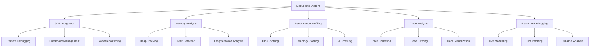

# Debugging Guide

The Nest Learning Thermostat provides comprehensive debugging capabilities for firmware development, including GDB integration, memory analysis, performance profiling, and real-time debugging. This document details debugging techniques, tools, and best practices.

## Debugging Architecture

### Core Components
- **GDB Integration**: Full GDB debugging support with remote debugging
- **Memory Analysis**: Advanced memory leak detection and analysis
- **Performance Profiling**: Real-time performance profiling and optimization
- **Trace Analysis**: Comprehensive trace collection and analysis
- **Real-time Debugging**: Live debugging of running systems

### Debugging Framework


## GDB Integration

### Remote Debugging Setup
Comprehensive remote debugging setup for embedded systems.

```c
// GDB debugging system
typedef struct {
    remote_debugger_t remote;              // Remote debugging
    breakpoint_manager_t breakpoints;     // Breakpoint management
    variable_watcher_t watcher;            // Variable watching
    stack_analyzer_t stack;                // Stack analysis
} gdb_debugging_t;

// Remote debugger
typedef struct {
    gdb_server_t server;                   // GDB server
    connection_manager_t connection;       // Connection management
    protocol_handler_t protocol;           // Protocol handling
    target_controller_t target;            // Target control
} remote_debugger_t;

// GDB debugging session
typedef struct {
    session_id_t session_id;               // Session ID
    target_info_t target;                  // Target information
    debugging_state_t state;               // Debugging state
    breakpoint_list_t breakpoints;         // Breakpoint list
    watchpoint_list_t watchpoints;         // Watchpoint list
    debugging_context_t context;           // Debugging context
} gdb_session_t;

// Initialize remote debugging session
remote_debug_result_t initialize_remote_debugging(
    remote_debugger_t *debugger, 
    target_config_t *target_config, 
    debug_config_t *debug_config) {
    
    remote_debug_result_t result = {0};
    
    // Start GDB server on target
    server_start_result_t server_result = start_gdb_server(
        &debugger->server, target_config);
    
    if (!server_result.success) {
        result.status = REMOTE_DEBUG_SERVER_FAILED;
        result.server_error = server_result.error;
        return result;
    }
    
    // Establish connection to target
    connection_result_t connection = establish_target_connection(
        &debugger->connection, server_result.server_info);
    
    if (!connection.success) {
        result.status = REMOTE_DEBUG_CONNECTION_FAILED;
        result.connection_error = connection.error;
        stop_gdb_server(&debugger->server);
        return result;
    }
    
    // Initialize protocol handler
    protocol_init_result_t protocol_init = initialize_protocol_handler(
        &debugger->protocol, connection);
    
    if (!protocol_init.success) {
        result.status = REMOTE_DEBUG_PROTOCOL_FAILED;
        result.protocol_error = protocol_init.error;
        cleanup_target_connection(connection);
        stop_gdb_server(&debugger->server);
        return result;
    }
    
    // Initialize target controller
    target_control_result_t target_control = initialize_target_controller(
        &debugger->target, target_config);
    
    if (!target_control.success) {
        result.status = REMOTE_DEBUG_TARGET_CONTROL_FAILED;
        result.target_error = target_control.error;
        cleanup_protocol_handler(&debugger->protocol);
        cleanup_target_connection(connection);
        stop_gdb_server(&debugger->server);
        return result;
    }
    
    // Create debugging session
    gdb_session_t session = create_debugging_session(
        target_config, debug_config);
    
    session.target = target_control.target_info;
    session.connection = connection;
    
    result.status = REMOTE_DEBUG_SUCCESS;
    result.session = session;
    
    return result;
}
```

### Breakpoint Management
Advanced breakpoint management with conditional breakpoints and watchpoints.

```c
// Breakpoint manager
typedef struct {
    breakpoint_setter_t setter;            // Breakpoint setter
    breakpoint_tracker_t tracker;          // Breakpoint tracking
    condition_evaluator_t evaluator;       // Condition evaluation
    breakpoint_statistics_t statistics;    // Breakpoint statistics
} breakpoint_manager_t;

// Breakpoint types
typedef enum {
    BREAKPOINT_TYPE_SOFTWARE,               // Software breakpoint
    BREAKPOINT_TYPE_HARDWARE,               // Hardware breakpoint
    BREAKPOINT_TYPE_WATCHPOINT_READ,        // Read watchpoint
    BREAKPOINT_TYPE_WATCHPOINT_WRITE,       // Write watchpoint
    BREAKPOINT_TYPE_WATCHPOINT_ACCESS       // Access watchpoint
} breakpoint_type_t;

// Breakpoint specification
typedef struct {
    breakpoint_id_t breakpoint_id;         // Breakpoint ID
    breakpoint_type_t type;                 // Breakpoint type
    address_t address;                      // Breakpoint address
    condition_expression_t condition;      // Breakpoint condition
    hit_count_t hit_count;                  // Hit count
    breakpoint_action_t action;             // Breakpoint action
} breakpoint_specification_t;

// Set conditional breakpoint
breakpoint_result_t set_conditional_breakpoint(
    breakpoint_manager_t *manager, 
    gdb_session_t *session, 
    breakpoint_specification_t *spec) {
    
    breakpoint_result_t result = {0};
    
    // Validate breakpoint specification
    if (!validate_breakpoint_specification(spec)) {
        result.status = BREAKPOINT_STATUS_INVALID_SPEC;
        return result;
    }
    
    // Set breakpoint on target
    target_breakpoint_result_t target_result = set_target_breakpoint(
        &session->target, spec);
    
    if (!target_result.success) {
        result.status = BREAKPOINT_STATUS_TARGET_FAILED;
        result.target_error = target_result.error;
        return result;
    }
    
    // Track breakpoint in manager
    breakpoint_tracking_t tracking = track_breakpoint(
        &manager->tracker, spec, target_result);
    
    // Evaluate condition if specified
    if (spec->condition.has_condition) {
        condition_result_t condition_result = evaluate_breakpoint_condition(
            &manager->evaluator, spec->condition, session);
        
        if (!condition_result.valid) {
            // Remove breakpoint if condition is invalid
            remove_target_breakpoint(&session->target, target_result.breakpoint_id);
            result.status = BREAKPOINT_STATUS_CONDITION_INVALID;
            result.condition_error = condition_result.error;
            return result;
        }
        
        result.condition_evaluation = condition_result;
    }
    
    // Add to session breakpoint list
    session->breakpoints.breakpoints[session->breakpoints.breakpoint_count++] = 
        create_breakpoint_entry(spec, target_result);
    
    // Update statistics
    update_breakpoint_statistics(&manager->statistics, spec, 
                                BREAKPOINT_ACTION_SET);
    
    result.status = BREAKPOINT_STATUS_SUCCESS;
    result.breakpoint_id = target_result.breakpoint_id;
    
    return result;
}
```

## Memory Analysis

### Heap Tracking
Comprehensive heap tracking and memory allocation monitoring.

```c
// Memory analysis system
typedef struct {
    heap_tracker_t heap_tracker;           // Heap tracking
    leak_detector_t leak_detector;         // Leak detection
    fragmentation_analyzer_t fragmentation; // Fragmentation analysis
    usage_profiler_t profiler;             // Usage profiling
} memory_analysis_t;

// Heap tracker
typedef struct {
    allocation_tracker_t allocations;     // Allocation tracking
    deallocation_tracker_t deallocations; // Deallocation tracking
    memory_map_t memory_map;               // Memory map
    usage_statistics_t statistics;         // Usage statistics
} heap_tracker_t;

// Memory allocation record
typedef struct {
    allocation_id_t allocation_id;         // Allocation ID
    timestamp_t allocation_time;           // Allocation time
    size_t size;                           // Allocation size
    address_t address;                     // Allocation address
    allocation_source_t source;            // Allocation source
    call_stack_t call_stack;               // Call stack
    allocation_flags_t flags;              // Allocation flags
} allocation_record_t;

// Track memory allocation
allocation_tracking_result_t track_memory_allocation(
    heap_tracker_t *tracker, 
    allocation_event_t *event) {
    
    allocation_tracking_result_t result = {0};
    
    // Create allocation record
    allocation_record_t record = create_allocation_record(event);
    
    // Record allocation
    record_allocation(&tracker->allocations, record);
    
    // Update memory map
    update_memory_map(&tracker->memory_map, record);
    
    // Update usage statistics
    update_usage_statistics(&tracker->statistics, record);
    
    // Check for potential issues
    memory_issue_check_t issue_check = check_memory_issues(
        tracker, record);
    
    result.issues_detected = issue_check.has_issues;
    result.issues = issue_check.issues;
    
    // Update allocation tracking metrics
    result.tracking_metrics = calculate_tracking_metrics(
        &tracker->allocations, &tracker->statistics);
    
    result.status = ALLOCATION_TRACKING_SUCCESS;
    result.allocation_record = record;
    
    return result;
}
```

### Memory Leak Detection
Advanced memory leak detection with root cause analysis.

```c
// Leak detector
typedef struct {
    leak_analyzer_t analyzer;              // Leak analyzer
    pattern_matcher_t pattern_matcher;     // Pattern matcher
    root_cause_analyzer_t root_cause;      // Root cause analysis
    leak_reporter_t reporter;              // Leak reporting
} leak_detector_t;

// Memory leak analysis
typedef struct {
    leak_id_t leak_id;                     // Leak ID
    leak_type_t type;                       // Leak type
    size_t leaked_size;                    // Leaked size
    allocation_count_t count;              // Number of leaked allocations
    leak_source_t source;                  // Leak source
    leak_pattern_t pattern;                // Leak pattern
    root_cause_t root_cause;               // Root cause
} memory_leak_t;

// Detect memory leaks
leak_detection_result_t detect_memory_leaks(
    leak_detector_t *detector, 
    allocation_records_t *allocations, 
    deallocation_records_t *deallocations) {
    
    leak_detection_result_t result = {0};
    
    // Find unmatched allocations
    unmatched_allocations_t unmatched = find_unmatched_allocations(
        allocations, deallocations);
    
    if (unmatched.count == 0) {
        result.status = LEAK_DETECTION_NO_LEAKS;
        return result;
    }
    
    // Analyze potential leaks
    for (int i = 0; i < unmatched.count; i++) {
        allocation_record_t *allocation = &unmatched.allocations[i];
        
        // Analyze leak pattern
        leak_pattern_t pattern = analyze_leak_pattern(
            &detector->pattern_matcher, allocation);
        
        // Perform root cause analysis
        root_cause_analysis_t root_cause = analyze_leak_root_cause(
            &detector->root_cause, allocation, pattern);
        
        // Create leak record
        memory_leak_t leak = {
            .leak_id = generate_leak_id(),
            .type = determine_leak_type(allocation, pattern),
            .leaked_size = allocation->size,
            .count = 1,
            .source = allocation->source,
            .pattern = pattern,
            .root_cause = root_cause
        };
        
        result.leaks[result.leak_count++] = leak;
    }
    
    // Group similar leaks
    result.leak_count = group_similar_leaks(result.leaks, 
                                          result.leak_count);
    
    // Generate leak report
    result.report = generate_leak_report(&detector->reporter, 
                                       result.leaks, result.leak_count);
    
    result.status = LEAK_DETECTION_LEAKS_FOUND;
    
    return result;
}
```

## Performance Profiling

### CPU Profiling
Real-time CPU profiling with function-level analysis.

```c
// Performance profiling system
typedef struct {
    cpu_profiler_t cpu_profiler;           // CPU profiler
    memory_profiler_t memory_profiler;     // Memory profiler
    io_profiler_t io_profiler;             // I/O profiler
    profiling_analyzer_t analyzer;         // Profiling analyzer
} performance_profiling_t;

// CPU profiler
typedef struct {
    sampling_profiler_t sampler;           // Sampling profiler
    function_tracer_t tracer;              // Function tracer
    call_graph_builder_t call_graph;       // Call graph builder
    hotspot_detector_t hotspot;            // Hotspot detection
} cpu_profiler_t;

// CPU profiling session
typedef struct {
    session_id_t session_id;               // Session ID
    profiling_target_t target;             // Profiling target
    sampling_config_t sampling_config;     // Sampling configuration
    profile_duration_t duration;           // Profile duration
    profiling_state_t state;               // Profiling state
} cpu_profiling_session_t;

// Start CPU profiling session
profiling_session_result_t start_cpu_profiling(
    cpu_profiler_t *profiler, 
    profiling_config_t *config) {
    
    profiling_session_result_t result = {0};
    
    // Create profiling session
    cpu_profiling_session_t session = create_profiling_session(config);
    
    // Initialize sampling profiler
    sampling_init_result_t sampling_init = initialize_sampling_profiler(
        &profiler->sampler, &session, config->sampling_config);
    
    if (!sampling_init.success) {
        result.status = PROFILING_SESSION_SAMPLING_FAILED;
        result.sampling_error = sampling_init.error;
        return result;
    }
    
    // Initialize function tracer
    tracer_init_result_t tracer_init = initialize_function_tracer(
        &profiler->tracer, &session, config->tracing_config);
    
    if (!tracer_init.success) {
        result.status = PROFILING_SESSION_TRACER_FAILED;
        result.tracer_error = tracer_init.error;
        cleanup_sampling_profiler(&profiler->sampler);
        return result;
    }
    
    // Start profiling
    if (!start_profiling(&session)) {
        result.status = PROFILING_SESSION_START_FAILED;
        cleanup_function_tracer(&profiler->tracer);
        cleanup_sampling_profiler(&profiler->sampler);
        return result;
    }
    
    result.status = PROFILING_SESSION_SUCCESS;
    result.session = session;
    
    return result;
}
```

### Performance Analysis
Comprehensive performance analysis with bottleneck identification.

```c
// Profiling analyzer
typedef struct {
    sample_analyzer_t sample_analyzer;     // Sample analysis
    function_analyzer_t function_analyzer; // Function analysis
    bottleneck_detector_t bottleneck;      // Bottleneck detection
    optimization_advisor_t advisor;        // Optimization advisor
} profiling_analyzer_t;

// Performance analysis result
typedef struct {
    profile_summary_t summary;             // Profile summary
    function_statistics_t functions;       // Function statistics
    call_graph_analysis_t call_graph;      // Call graph analysis
    bottleneck_analysis_t bottlenecks;     // Bottleneck analysis
    optimization_recommendations_t recommendations; // Recommendations
} performance_analysis_result_t;

// Analyze performance profile
performance_analysis_result_t analyze_performance_profile(
    profiling_analyzer_t *analyzer, 
    profiling_data_t *profile_data) {
    
    performance_analysis_result_t result = {0};
    
    // Analyze profiling samples
    sample_analysis_t sample_analysis = analyze_profiling_samples(
        &analyzer->sample_analyzer, profile_data->samples);
    
    result.summary = generate_profile_summary(sample_analysis);
    
    // Analyze function performance
    function_analysis_t function_analysis = analyze_function_performance(
        &analyzer->function_analyzer, profile_data->functions);
    
    result.functions = function_analysis.statistics;
    
    // Analyze call graph
    call_graph_analysis_t call_graph_analysis = analyze_call_graph(
        &analyzer->call_graph, profile_data->call_graph);
    
    result.call_graph = call_graph_analysis;
    
    // Detect performance bottlenecks
    bottleneck_analysis_t bottleneck_analysis = detect_performance_bottlenecks(
        &analyzer->bottleneck, sample_analysis, function_analysis);
    
    result.bottlenecks = bottleneck_analysis;
    
    // Generate optimization recommendations
    result.recommendations = generate_optimization_recommendations(
        &analyzer->advisor, result);
    
    return result;
}
```

## Trace Analysis

### Trace Collection
Comprehensive trace collection with filtering and compression.

```c
// Trace analysis system
typedef struct {
    trace_collector_t collector;           // Trace collector
    trace_filter_t filter;                 // Trace filtering
    trace_compressor_t compressor;         // Trace compression
    trace_visualizer_t visualizer;         // Trace visualization
} trace_analysis_t;

// Trace collector
typedef struct {
    trace_source_t sources[MAX_SOURCES];   // Trace sources
    collection_buffer_t buffer;            // Collection buffer
    trace_formatter_t formatter;           // Trace formatting
    storage_manager_t storage;             // Storage management
} trace_collector_t;

// Trace collection session
typedef struct {
    session_id_t session_id;               // Session ID
    trace_config_t config;                 // Trace configuration
    collection_statistics_t statistics;   // Collection statistics
    trace_buffer_t buffer;                 // Trace buffer
} trace_collection_session_t;

// Start trace collection
trace_collection_result_t start_trace_collection(
    trace_collector_t *collector, 
    trace_config_t *config) {
    
    trace_collection_result_t result = {0};
    
    // Create collection session
    trace_collection_session_t session = create_collection_session(config);
    
    // Initialize trace sources
    source_init_result_t source_init = initialize_trace_sources(
        collector->sources, config->source_config);
    
    if (!source_init.success) {
        result.status = TRACE_COLLECTION_SOURCE_INIT_FAILED;
        result.source_error = source_init.error;
        return result;
    }
    
    // Initialize collection buffer
    buffer_init_result_t buffer_init = initialize_collection_buffer(
        &collector->buffer, config->buffer_config);
    
    if (!buffer_init.success) {
        result.status = TRACE_COLLECTION_BUFFER_INIT_FAILED;
        result.buffer_error = buffer_init.error;
        cleanup_trace_sources(collector->sources);
        return result;
    }
    
    // Start trace collection
    if (!start_collection(&session, collector->sources, 
                         &collector->buffer)) {
        result.status = TRACE_COLLECTION_START_FAILED;
        cleanup_collection_buffer(&collector->buffer);
        cleanup_trace_sources(collector->sources);
        return result;
    }
    
    result.status = TRACE_COLLECTION_SUCCESS;
    result.session = session;
    
    return result;
}
```

## Real-time Debugging

### Live Monitoring
Real-time monitoring of system behavior and performance.

```c
// Real-time debugging system
typedef struct {
    live_monitor_t monitor;                // Live monitoring
    hot_patcher_t patcher;                 // Hot patching
    dynamic_analyzer_t analyzer;           // Dynamic analysis
    intervention_manager_t intervention;   // Intervention management
} realtime_debugging_t;

// Live monitor
typedef struct {
    system_monitor_t system;               // System monitoring
    performance_monitor_t performance;     // Performance monitoring
    event_monitor_t events;                 // Event monitoring
    alert_system_t alerts;                 // Alert system
} live_monitor_t;

// Real-time monitoring session
typedef struct {
    session_id_t session_id;               // Session ID
    monitoring_config_t config;             // Monitoring configuration
    real_time_metrics_t metrics;           // Real-time metrics
    monitoring_state_t state;               // Monitoring state
} realtime_monitoring_session_t;

// Start real-time monitoring
realtime_monitoring_result_t start_realtime_monitoring(
    live_monitor_t *monitor, 
    monitoring_config_t *config) {
    
    realtime_monitoring_result_t result = {0};
    
    // Create monitoring session
    realtime_monitoring_session_t session = create_monitoring_session(config);
    
    // Initialize system monitoring
    system_monitoring_result_t system_result = initialize_system_monitoring(
        &monitor->system, config->system_config);
    
    if (!system_result.success) {
        result.status = REALTIME_MONITORING_SYSTEM_FAILED;
        result.system_error = system_result.error;
        return result;
    }
    
    // Initialize performance monitoring
    performance_monitoring_result_t perf_result = 
        initialize_performance_monitoring(&monitor->performance, 
                                         config->performance_config);
    
    if (!perf_result.success) {
        result.status = REALTIME_MONITORING_PERFORMANCE_FAILED;
        result.performance_error = perf_result.error;
        cleanup_system_monitoring(&monitor->system);
        return result;
    }
    
    // Initialize event monitoring
    event_monitoring_result_t event_result = initialize_event_monitoring(
        &monitor->events, config->event_config);
    
    if (!event_result.success) {
        result.status = REALTIME_MONITORING_EVENT_FAILED;
        result.event_error = event_result.error;
        cleanup_performance_monitoring(&monitor->performance);
        cleanup_system_monitoring(&monitor->system);
        return result;
    }
    
    // Start monitoring
    if (!start_monitoring(&session, &monitor->system, 
                        &monitor->performance, &monitor->events)) {
        result.status = REALTIME_MONITORING_START_FAILED;
        cleanup_event_monitoring(&monitor->events);
        cleanup_performance_monitoring(&monitor->performance);
        cleanup_system_monitoring(&monitor->system);
        return result;
    }
    
    result.status = REALTIME_MONITORING_SUCCESS;
    result.session = session;
    
    return result;
}
```

## Related Documentation

- [Development Overview](./overview.mdx)
- [Build System](./build-system.mdx)
- [Testing Framework](./testing-framework.mdx)
- [Development Tools](./development-tools.mdx)
