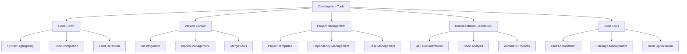

# Development Tools

The Nest Learning Thermostat development environment includes a comprehensive set of tools for efficient firmware development, including code editors, version control, project management, and documentation generation. This document details the essential development tools and their configuration.

## Development Tools Architecture

### Core Components
- **Code Editor**: Advanced code editing with syntax highlighting and completion
- **Version Control**: Git-based version control with branching and merging
- **Project Management**: Project organization and dependency management
- **Documentation Generation**: Automated documentation generation and maintenance
- **Build Tools**: Specialized build tools for cross-compilation and packaging

### Development Tools Framework


## Code Editor Configuration

### Advanced Editing Features
Comprehensive code editing with intelligent features for firmware development.

```c
// Code editor system
typedef struct {
    syntax_highlighter_t highlighter;      // Syntax highlighting
    code_completer_t completer;             // Code completion
    error_detector_t detector;             // Error detection
    refactoring_tools_t refactoring;       // Refactoring tools
} code_editor_t;

// Syntax highlighter
typedef struct {
    language_config_t languages[MAX_LANGUAGES]; // Language configurations
    theme_manager_t themes;                 // Theme management
    highlighting_engine_t engine;          // Highlighting engine
    custom_syntax_t custom;                 // Custom syntax rules
} syntax_highlighter_t;

// Language configuration for C/C++
typedef struct {
    language_id_t language_id;             // Language ID
    char language_name[64];                // Language name
    keyword_set_t keywords;                // Keywords
    syntax_rules_t rules;                  // Syntax rules
    comment_styles_t comments;              // Comment styles
    string_styles_t strings;                // String styles
    preprocessor_rules_t preprocessor;     // Preprocessor rules
} language_config_t;

// Configure syntax highlighting for firmware development
highlighting_config_result_t configure_firmware_highlighting(
    syntax_highlighter_t *highlighter, 
    highlighting_config_t *config) {
    
    highlighting_config_result_t result = {0};
    
    // Configure C language highlighting
    language_config_t c_config = {
        .language_id = LANGUAGE_C,
        .language_name = "C",
        .keywords = get_c_keywords(),
        .rules = get_c_syntax_rules(),
        .comments = get_c_comment_styles(),
        .strings = get_c_string_styles(),
        .preprocessor = get_c_preprocessor_rules()
    };
    
    register_language_config(highlighter, c_config);
    
    // Configure C++ language highlighting
    language_config_t cpp_config = {
        .language_id = LANGUAGE_CPP,
        .language_name = "C++",
        .keywords = get_cpp_keywords(),
        .rules = get_cpp_syntax_rules(),
        .comments = get_cpp_comment_styles(),
        .strings = get_cpp_string_styles(),
        .preprocessor = get_cpp_preprocessor_rules()
    };
    
    register_language_config(highlighter, cpp_config);
    
    // Configure assembly language highlighting
    language_config_t asm_config = {
        .language_id = LANGUAGE_ASSEMBLY,
        .language_name = "Assembly",
        .keywords = get_asm_keywords(),
        .rules = get_asm_syntax_rules(),
        .comments = get_asm_comment_styles(),
        .strings = get_asm_string_styles(),
        .preprocessor = get_asm_preprocessor_rules()
    };
    
    register_language_config(highlighter, asm_config);
    
    // Apply theme configuration
    theme_result_t theme_result = apply_editor_theme(
        &highlighter->themes, config->theme_name);
    
    if (!theme_result.success) {
        result.status = HIGHLIGHTING_CONFIG_THEME_FAILED;
        result.theme_error = theme_result.error;
        return result;
    }
    
    // Configure custom syntax rules for Nest-specific code
    custom_syntax_result_t custom_result = configure_custom_syntax(
        &highlighter->custom, config->custom_rules);
    
    if (!custom_result.success) {
        result.status = HIGHLIGHTING_CONFIG_CUSTOM_FAILED;
        result.custom_error = custom_result.error;
        return result;
    }
    
    result.status = HIGHLIGHTING_CONFIG_SUCCESS;
    result.configured_languages = 3; // C, C++, Assembly
    
    return result;
}
```

### Code Completion System
Intelligent code completion with context-aware suggestions.

```c
// Code completer
typedef struct {
    completion_engine_t engine;            // Completion engine
    context_analyzer_t analyzer;           // Context analyzer
    suggestion_ranker_t ranker;            // Suggestion ranking
    learning_system_t learning;            // Learning system
} code_completer_t;

// Completion engine
typedef struct {
    symbol_database_t symbols;             // Symbol database
    api_database_t apis;                   // API database
    template_engine_t templates;           // Template engine
    snippet_manager_t snippets;            // Snippet management
} completion_engine_t;

// Code completion result
typedef struct {
    completion_id_t completion_id;         // Completion ID
    suggestion_list_t suggestions;         // Completion suggestions
    context_info_t context;                // Context information
    completion_metadata_t metadata;        // Completion metadata
} code_completion_result_t;

// Generate code completions
code_completion_result_t generate_code_completions(
    code_completer_t *completer, 
    source_buffer_t *buffer, 
    cursor_position_t position) {
    
    code_completion_result_t result = {0};
    
    // Analyze current context
    context_analysis_t context = analyze_completion_context(
        &completer->analyzer, buffer, position);
    
    result.context = context.info;
    
    // Get symbol-based completions
    symbol_completions_t symbol_completions = get_symbol_completions(
        &completer->engine.symbols, context);
    
    // Get API-based completions
    api_completions_t api_completions = get_api_completions(
        &completer->engine.apis, context);
    
    // Get template completions
    template_completions_t template_completions = get_template_completions(
        &completer->engine.templates, context);
    
    // Get snippet completions
    snippet_completions_t snippet_completions = get_snippet_completions(
        &completer->engine.snippets, context);
    
    // Merge all completions
    merge_completions(&result.suggestions, symbol_completions, 
                     api_completions, template_completions, 
                     snippet_completions);
    
    // Rank suggestions by relevance
    rank_completion_suggestions(&completer->ranker, 
                               &result.suggestions, context);
    
    // Update learning system
    update_completion_learning(&completer->learning, context, 
                             result.suggestions);
    
    result.completion_id = generate_completion_id();
    result.metadata = generate_completion_metadata(result);
    
    return result;
}
```

## Version Control Integration

### Git Workflow Management
Advanced Git workflow management for collaborative firmware development.

```c
// Version control system
typedef struct {
    git_manager_t git;                     // Git management
    branch_manager_t branches;             // Branch management
    merge_tools_t merge;                   // Merge tools
    conflict_resolver_t resolver;          // Conflict resolution
} version_control_t;

// Git manager
typedef struct {
    repository_manager_t repository;       // Repository management
    commit_manager_t commits;              // Commit management
    remote_manager_t remotes;              // Remote management
    tag_manager_t tags;                    // Tag management
} git_manager_t;

// Git workflow configuration
typedef struct {
    branching_strategy_t strategy;         // Branching strategy
    commit_policy_t policy;                // Commit policy
    merge_strategy_t merge_strategy;       // Merge strategy
    review_workflow_t review;              // Review workflow
} git_workflow_config_t;

// Configure Git workflow for firmware development
git_workflow_result_t configure_firmware_workflow(
    git_manager_t *git_manager, 
    git_workflow_config_t *config) {
    
    git_workflow_result_t result = {0};
    
    // Initialize repository
    repository_init_result_t repo_init = initialize_repository(
        &git_manager->repository, config->repository_config);
    
    if (!repo_init.success) {
        result.status = GIT_WORKFLOW_REPO_INIT_FAILED;
        result.repository_error = repo_init.error;
        return result;
    }
    
    // Configure branching strategy
    branching_config_result_t branch_config = configure_branching_strategy(
        &git_manager->branches, config->strategy);
    
    if (!branch_config.success) {
        result.status = GIT_WORKFLOW_BRANCH_CONFIG_FAILED;
        result.branch_error = branch_config.error;
        return result;
    }
    
    // Setup commit policy
    commit_policy_result_t commit_policy = setup_commit_policy(
        &git_manager->commits, config->policy);
    
    if (!commit_policy.success) {
        result.status = GIT_WORKFLOW_COMMIT_POLICY_FAILED;
        result.commit_error = commit_policy.error;
        return result;
    }
    
    // Configure merge strategy
    merge_config_result_t merge_config = configure_merge_strategy(
        &git_manager->merge, config->merge_strategy);
    
    if (!merge_config.success) {
        result.status = GIT_WORKFLOW_MERGE_CONFIG_FAILED;
        result.merge_error = merge_config.error;
        return result;
    }
    
    // Setup review workflow
    review_workflow_result_t review_workflow = setup_review_workflow(
        config->review);
    
    if (!review_workflow.success) {
        result.status = GIT_WORKFLOW_REVIEW_SETUP_FAILED;
        result.review_error = review_workflow.error;
        return result;
    }
    
    result.status = GIT_WORKFLOW_SUCCESS;
    result.repository_info = repo_init.repository_info;
    result.branching_info = branch_config.branching_info;
    
    return result;
}
```

### Branch Management
Advanced branch management with automated merging and conflict resolution.

```c
// Branch manager
typedef struct {
    branch_creator_t creator;              // Branch creation
    branch_tracker_t tracker;              // Branch tracking
    merge_coordinator_t coordinator;       // Merge coordination
    branch_cleanup_t cleanup;              // Branch cleanup
} branch_manager_t;

// Branch configuration
typedef struct {
    branch_type_t type;                    // Branch type
    branch_naming_t naming;                 // Branch naming
    protection_rules_t protection;         // Protection rules
    automation_rules_t automation;         // Automation rules
} branch_config_t;

// Create feature branch
branch_creation_result_t create_feature_branch(
    branch_manager_t *manager, 
    feature_request_t *feature) {
    
    branch_creation_result_t result = {0};
    
    // Validate feature request
    if (!validate_feature_request(feature)) {
        result.status = BRANCH_CREATION_INVALID_FEATURE;
        return result;
    }
    
    // Generate branch name
    branch_name_t branch_name = generate_branch_name(
        manager->creator.naming, feature);
    
    // Create branch
    git_branch_result_t git_result = create_git_branch(
        &manager->creator, branch_name, feature->base_branch);
    
    if (!git_result.success) {
        result.status = BRANCH_CREATION_GIT_FAILED;
        result.git_error = git_result.error;
        return result;
    }
    
    // Track branch
    branch_tracking_t tracking = track_branch(
        &manager->tracker, git_result.branch, feature);
    
    // Apply branch protection
    protection_result_t protection = apply_branch_protection(
        &manager->creator, git_result.branch, 
        manager->creator.protection);
    
    // Setup automation
    automation_setup_result_t automation = setup_branch_automation(
        &manager->creator, git_result.branch, 
        manager->creator.automation);
    
    result.status = BRANCH_CREATION_SUCCESS;
    result.branch = git_result.branch;
    result.tracking = tracking;
    result.protection = protection;
    result.automation = automation;
    
    return result;
}
```

## Project Management

### Project Templates
Pre-configured project templates for different firmware development scenarios.

```c
// Project management system
typedef struct {
    template_manager_t templates;          // Template management
    dependency_manager_t dependencies;     // Dependency management
    task_manager_t tasks;                  // Task management
    build_manager_t builds;                // Build management
} project_management_t;

// Template manager
typedef struct {
    template_repository_t repository;      // Template repository
    template_generator_t generator;        // Template generation
    template_customizer_t customizer;      // Template customization
    template_validator_t validator;        // Template validation
} template_manager_t;

// Firmware project template
typedef struct {
    template_id_t template_id;             // Template ID
    char template_name[128];               // Template name
    template_type_t type;                  // Template type
    directory_structure_t structure;       // Directory structure
    file_templates_t files;                // File templates
    build_configuration_t build_config;    // Build configuration
    dependency_specification_t dependencies; // Dependencies
} firmware_project_template_t;

// Create project from template
project_creation_result_t create_project_from_template(
    template_manager_t *manager, 
    template_request_t *request) {
    
    project_creation_result_t result = {0};
    
    // Find appropriate template
    firmware_project_template_t *template = find_template(
        &manager->template_repository, request->template_type);
    
    if (!template) {
        result.status = PROJECT_CREATION_TEMPLATE_NOT_FOUND;
        return result;
    }
    
    // Validate template
    template_validation_t validation = validate_template(
        &manager->validator, template);
    
    if (!validation.valid) {
        result.status = PROJECT_CREATION_TEMPLATE_INVALID;
        result.validation_errors = validation.errors;
        return result;
    }
    
    // Generate project structure
    structure_generation_t structure = generate_project_structure(
        &manager->generator, template, request->project_path);
    
    if (!structure.success) {
        result.status = PROJECT_CREATION_STRUCTURE_FAILED;
        result.structure_error = structure.error;
        return result;
    }
    
    // Generate project files
    file_generation_t files = generate_project_files(
        &manager->generator, template, request);
    
    if (!files.success) {
        result.status = PROJECT_CREATION_FILES_FAILED;
        result.files_error = files.error;
        return result;
    }
    
    // Customize project
    customization_result_t customization = customize_project(
        &manager->customizer, template, request);
    
    if (!customization.success) {
        result.status = PROJECT_CREATION_CUSTOMIZATION_FAILED;
        result.customization_error = customization.error;
        return result;
    }
    
    result.status = PROJECT_CREATION_SUCCESS;
    result.project_path = request->project_path;
    result.structure = structure;
    result.files = files;
    result.customization = customization;
    
    return result;
}
```

### Dependency Management
Advanced dependency management with version resolution and conflict detection.

```c
// Dependency manager
typedef struct {
    dependency_resolver_t resolver;        // Dependency resolver
    version_manager_t versions;            // Version management
    package_manager_t packages;            // Package management
    conflict_detector_t conflicts;         // Conflict detection
} dependency_manager_t;

// Firmware dependency specification
typedef struct {
    dependency_id_t dependency_id;         // Dependency ID
    dependency_type_t type;                 // Dependency type
    version_constraint_t version;          // Version constraint
    source_location_t source;              // Source location
    build_configuration_t build_config;    // Build configuration
    dependency_metadata_t metadata;        // Dependency metadata
} firmware_dependency_t;

// Resolve project dependencies
dependency_resolution_result_t resolve_project_dependencies(
    dependency_manager_t *manager, 
    dependency_specification_t *specs, 
    int spec_count) {
    
    dependency_resolution_result_t result = {0};
    
    // Build dependency graph
    dependency_graph_t graph = build_dependency_graph(
        &manager->resolver, specs, spec_count);
    
    if (!graph.valid) {
        result.status = DEPENDENCY_RESOLUTION_GRAPH_FAILED;
        result.graph_errors = graph.errors;
        return result;
    }
    
    // Detect conflicts
    conflict_detection_t conflicts = detect_dependency_conflicts(
        &manager->conflicts, graph);
    
    if (conflicts.has_conflicts) {
        // Attempt conflict resolution
        conflict_resolution_t resolution = resolve_conflicts(
            &manager->resolver, conflicts);
        
        if (!resolution.resolved) {
            result.status = DEPENDENCY_RESOLUTION_CONFLICT_FAILED;
            result.unresolved_conflicts = conflicts.conflicts;
            return result;
        }
        
        graph = apply_conflict_resolution(graph, resolution);
    }
    
    // Resolve versions
    version_resolution_t version_resolution = resolve_versions(
        &manager->versions, graph);
    
    if (!version_resolution.success) {
        result.status = DEPENDENCY_RESOLUTION_VERSION_FAILED;
        result.version_errors = version_resolution.errors;
        return result;
    }
    
    // Download packages
    package_download_result_t download = download_packages(
        &manager->packages, version_resolution.resolved_packages);
    
    if (!download.success) {
        result.status = DEPENDENCY_RESOLUTION_DOWNLOAD_FAILED;
        result.download_errors = download.errors;
        return result;
    }
    
    result.status = DEPENDENCY_RESOLUTION_SUCCESS;
    result.resolved_dependencies = version_resolution.resolved_packages;
    result.dependency_count = version_resolution.package_count;
    result.download_info = download.download_info;
    
    return result;
}
```

## Documentation Generation

### API Documentation
Automated API documentation generation from source code comments.

```c
// Documentation generation system
typedef struct {
    api_generator_t api;                   // API documentation
    code_analyzer_t analyzer;              // Code analysis
    markdown_generator_t markdown;         // Markdown generation
    html_generator_t html;                 // HTML generation
} documentation_generation_t;

// API generator
typedef struct {
    comment_parser_t parser;               // Comment parsing
    symbol_extractor_t extractor;          // Symbol extraction
    documentation_builder_t builder;       // Documentation building
    cross_reference_t cross_ref;           // Cross-referencing
} api_generator_t;

// API documentation configuration
typedef struct {
    source_paths_t source_paths;           // Source paths
    output_format_t format;                 // Output format
    documentation_style_t style;           // Documentation style
    filtering_rules_t filters;              // Filtering rules
    template_config_t templates;           // Template configuration
} api_documentation_config_t;

// Generate API documentation
api_documentation_result_t generate_api_documentation(
    documentation_generation_t *doc_gen, 
    api_documentation_config_t *config) {
    
    api_documentation_result_t result = {0};
    
    // Parse source code comments
    comment_parsing_result_t comments = parse_source_comments(
        &doc_gen->api.parser, config->source_paths);
    
    if (!comments.success) {
        result.status = API_DOC_COMMENT_PARSING_FAILED;
        result.parsing_errors = comments.errors;
        return result;
    }
    
    // Extract symbols and signatures
    symbol_extraction_result_t symbols = extract_symbols(
        &doc_gen->api.extractor, config->source_paths);
    
    if (!symbols.success) {
        result.status = API_DOC_SYMBOL_EXTRACTION_FAILED;
        result.extraction_errors = symbols.errors;
        return result;
    }
    
    // Build documentation structure
    documentation_structure_t structure = build_documentation_structure(
        &doc_gen->api.builder, comments.parsed_comments, 
        symbols.extracted_symbols);
    
    if (!structure.valid) {
        result.status = API_DOC_STRUCTURE_BUILDING_FAILED;
        result.structure_errors = structure.errors;
        return result;
    }
    
    // Generate cross-references
    cross_reference_result_t cross_ref = generate_cross_references(
        &doc_gen->api.cross_ref, structure);
    
    // Generate output based on format
    output_generation_result_t output = {0};
    
    switch (config->format) {
        case OUTPUT_FORMAT_MARKDOWN:
            output = generate_markdown_documentation(
                &doc_gen->markdown, structure, cross_ref);
            break;
            
        case OUTPUT_FORMAT_HTML:
            output = generate_html_documentation(
                &doc_gen->html, structure, cross_ref);
            break;
            
        default:
            result.status = API_DOC_UNSUPPORTED_FORMAT;
            return result;
    }
    
    if (!output.success) {
        result.status = API_DOC_OUTPUT_GENERATION_FAILED;
        result.output_errors = output.errors;
        return result;
    }
    
    result.status = API_DOC_GENERATION_SUCCESS;
    result.documentation = output.documentation;
    result.structure_info = structure.info;
    result.cross_reference_info = cross_ref.info;
    
    return result;
}
```

## Build Tools

### Cross-Compilation Tools
Specialized tools for cross-compilation to target embedded platforms.

```c
// Build tools system
typedef struct {
    cross_compiler_t cross_compiler;       // Cross compiler
    toolchain_manager_t toolchain;         // Toolchain management
    build_optimizer_t optimizer;           // Build optimization
    package_builder_t package_builder;     // Package building
} build_tools_t;

// Cross compiler
typedef struct {
    target_platform_t target;              // Target platform
    compilation_flags_t flags;             // Compilation flags
    optimization_settings_t optimization; // Optimization settings
    debug_settings_t debug;                 // Debug settings
} cross_compiler_t;

// Cross-compilation configuration
typedef struct {
    target_architecture_t architecture;    // Target architecture
    toolchain_path_t toolchain_path;        // Toolchain path
    sysroot_path_t sysroot_path;            // Sysroot path
    compilation_options_t options;          // Compilation options
    linking_options_t linking;              // Linking options
} cross_compilation_config_t;

// Configure cross-compilation environment
cross_compilation_result_t configure_cross_compilation(
    build_tools_t *build_tools, 
    cross_compilation_config_t *config) {
    
    cross_compilation_result_t result = {0};
    
    // Setup toolchain
    toolchain_setup_result_t toolchain_setup = setup_toolchain(
        &build_tools->toolchain, config->toolchain_path, 
        config->architecture);
    
    if (!toolchain_setup.success) {
        result.status = CROSS_COMPILATION_TOOLCHAIN_FAILED;
        result.toolchain_error = toolchain_setup.error;
        return result;
    }
    
    // Configure cross compiler
    compiler_config_result_t compiler_config = configure_cross_compiler(
        &build_tools->cross_compiler, config);
    
    if (!compiler_config.success) {
        result.status = CROSS_COMPILATION_COMPILER_CONFIG_FAILED;
        result.compiler_error = compiler_config.error;
        return result;
    }
    
    // Setup sysroot
    sysroot_setup_result_t sysroot_setup = setup_sysroot(
        config->sysroot_path, config->architecture);
    
    if (!sysroot_setup.success) {
        result.status = CROSS_COMPILATION_SYSROOT_FAILED;
        result.sysroot_error = sysroot_setup.error;
        return result;
    }
    
    // Configure build optimization
    optimization_config_result_t opt_config = configure_build_optimization(
        &build_tools->optimizer, config->options.optimization);
    
    if (!opt_config.success) {
        result.status = CROSS_COMPILATION_OPTIMIZATION_FAILED;
        result.optimization_error = opt_config.error;
        return result;
    }
    
    result.status = CROSS_COMPILATION_SUCCESS;
    result.toolchain_info = toolchain_setup.toolchain_info;
    result.compiler_info = compiler_config.compiler_info;
    result.sysroot_info = sysroot_setup.sysroot_info;
    result.optimization_info = opt_config.optimization_info;
    
    return result;
}
```

## Related Documentation

- [Development Overview](./overview.mdx)
- [Build System](./build-system.mdx)
- [Debugging Guide](./debugging-guide.mdx)
- [Testing Framework](./testing-framework.mdx)
