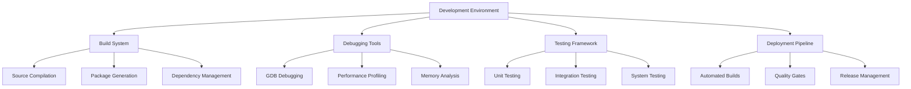

# Development Overview

The Nest Learning Thermostat development environment provides comprehensive tools and workflows for firmware development, debugging, and testing. This document provides an overview of the development architecture, toolchain, and development processes.

## Development Architecture

### Core Components
- **Development Environment**: Complete development setup and configuration
- **Build System**: Automated build and compilation processes
- **Debugging Tools**: Comprehensive debugging and profiling capabilities
- **Testing Framework**: Automated testing and validation systems
- **Deployment Pipeline**: Automated deployment and release processes

### Development Framework


## Development Environment

### Toolchain Setup
Comprehensive development toolchain for firmware development.

```c
// Development environment system
typedef struct {
    toolchain_manager_t toolchain;         // Toolchain management
    build_environment_t build_env;         // Build environment
    debug_environment_t debug_env;         // Debug environment
    test_environment_t test_env;           // Test environment
} development_environment_t;

// Toolchain manager
typedef struct {
    compiler_suite_t compilers;            // Compiler suite
    linker_suite_t linkers;                // Linker suite
    build_tools_t tools;                   // Build tools
    utility_tools_t utilities;             // Utility tools
} toolchain_manager_t;

// Compiler suite
typedef struct {
    gcc_compiler_t gcc;                    // GCC compiler
    clang_compiler_t clang;                // Clang compiler
    cross_compiler_t cross;                // Cross compiler
    optimizer_t optimizer;                 // Code optimizer
} compiler_suite_t;

// Initialize development environment
env_init_result_t initialize_development_environment(
    development_environment_t *env, 
    env_config_t *config) {
    
    env_init_result_t result = {0};
    
    // Initialize toolchain
    toolchain_init_result_t toolchain_result = initialize_toolchain(
        &env->toolchain, config->toolchain_config);
    
    if (!toolchain_result.success) {
        result.status = ENV_INIT_TOOLCHAIN_FAILED;
        result.error_info = toolchain_result.error_info;
        return result;
    }
    
    // Setup build environment
    build_env_result_t build_result = setup_build_environment(
        &env->build_env, config->build_config);
    
    if (!build_result.success) {
        result.status = ENV_INIT_BUILD_FAILED;
        result.error_info = build_result.error_info;
        return result;
    }
    
    // Setup debug environment
    debug_env_result_t debug_result = setup_debug_environment(
        &env->debug_env, config->debug_config);
    
    if (!debug_result.success) {
        result.status = ENV_INIT_DEBUG_FAILED;
        result.error_info = debug_result.error_info;
        return result;
    }
    
    // Setup test environment
    test_env_result_t test_result = setup_test_environment(
        &env->test_env, config->test_config);
    
    if (!test_result.success) {
        result.status = ENV_INIT_TEST_FAILED;
        result.error_info = test_result.error_info;
        return result;
    }
    
    // Validate environment
    validation_result_t validation = validate_development_environment(env);
    
    if (!validation.valid) {
        result.status = ENV_INIT_VALIDATION_FAILED;
        result.validation_errors = validation.errors;
        return result;
    }
    
    result.status = ENV_INIT_SUCCESS;
    result.environment_ready = true;
    
    return result;
}
```

### Development Tools
Essential development tools and utilities.

```c
// Development tools
typedef struct {
    code_editor_t editor;                  // Code editor
    version_control_t version_control;     // Version control
    project_manager_t project;             // Project management
    documentation_generator_t docs;        // Documentation generator
} development_tools_t;

// Code editor configuration
typedef struct {
    syntax_highlighting_t syntax;          // Syntax highlighting
    code_completion_t completion;          // Code completion
    error_detection_t errors;              // Error detection
    refactoring_tools_t refactoring;       // Refactoring tools
} code_editor_t;

// Configure development tools
tools_config_result_t configure_development_tools(
    development_tools_t *tools, 
    tools_config_t *config) {
    
    tools_config_result_t result = {0};
    
    // Configure code editor
    editor_config_result_t editor_result = configure_code_editor(
        &tools->editor, config->editor_config);
    
    if (!editor_result.success) {
        result.status = TOOLS_CONFIG_EDITOR_FAILED;
        return result;
    }
    
    // Configure version control
    vcs_config_result_t vcs_result = configure_version_control(
        &tools->version_control, config->vcs_config);
    
    if (!vcs_result.success) {
        result.status = TOOLS_CONFIG_VCS_FAILED;
        return result;
    }
    
    // Configure project management
    project_config_result_t project_result = configure_project_management(
        &tools->project, config->project_config);
    
    if (!project_result.success) {
        result.status = TOOLS_CONFIG_PROJECT_FAILED;
        return result;
    }
    
    // Configure documentation generator
    docs_config_result_t docs_result = configure_documentation_generator(
        &tools->docs, config->docs_config);
    
    if (!docs_result.success) {
        result.status = TOOLS_CONFIG_DOCS_FAILED;
        return result;
    }
    
    result.status = TOOLS_CONFIG_SUCCESS;
    result.tools_ready = true;
    
    return result;
}
```

## Build System

### Automated Build Process
Comprehensive automated build system for firmware compilation.

```c
// Build system
typedef struct {
    build_engine_t engine;                 // Build engine
    dependency_manager_t dependencies;     // Dependency management
    artifact_manager_t artifacts;         // Artifact management
    quality_gates_t quality;               // Quality gates
} build_system_t;

// Build engine
typedef struct {
    compilation_engine_t compilation;      // Compilation engine
    linking_engine_t linking;              // Linking engine
    packaging_engine_t packaging;          // Packaging engine
    optimization_engine_t optimization;    // Optimization engine
} build_engine_t;

// Build configuration
typedef struct {
    build_target_t target;                 // Build target
    build_options_t options;               // Build options
    optimization_level_t optimization;     // Optimization level
    debug_level_t debug_level;              // Debug level
} build_configuration_t;

// Execute automated build
build_result_t execute_automated_build(
    build_system_t *build_system, 
    build_configuration_t *config) {
    
    build_result_t result = {0};
    
    // Resolve dependencies
    dependency_resolution_t deps = resolve_dependencies(
        &build_system->dependencies, config);
    
    if (!deps.resolved) {
        result.status = BUILD_STATUS_DEPENDENCY_FAILED;
        result.dependency_errors = deps.errors;
        return result;
    }
    
    // Execute compilation
    compilation_result_t compilation = execute_compilation(
        &build_system->engine.compilation, config, deps);
    
    if (!compilation.success) {
        result.status = BUILD_STATUS_COMPILATION_FAILED;
        result.compilation_errors = compilation.errors;
        return result;
    }
    
    // Execute linking
    linking_result_t linking = execute_linking(
        &build_system->engine.linking, compilation.objects, 
        compilation.object_count);
    
    if (!linking.success) {
        result.status = BUILD_STATUS_LINKING_FAILED;
        result.linking_errors = linking.errors;
        return result;
    }
    
    // Execute optimization
    optimization_result_t optimization = execute_optimization(
        &build_system->engine.optimization, linking.executable, 
        config->optimization);
    
    if (!optimization.success) {
        result.status = BUILD_STATUS_OPTIMIZATION_FAILED;
        result.optimization_errors = optimization.errors;
        return result;
    }
    
    // Package artifacts
    packaging_result_t packaging = package_artifacts(
        &build_system->engine.packaging, optimization.optimized_binary, 
        config);
    
    if (!packaging.success) {
        result.status = BUILD_STATUS_PACKAGING_FAILED;
        result.packaging_errors = packaging.errors;
        return result;
    }
    
    // Store artifacts
    artifact_storage_t storage = store_build_artifacts(
        &build_system->artifacts, packaging.package);
    
    result.artifact_id = storage.artifact_id;
    
    // Apply quality gates
    quality_gate_result_t quality = apply_quality_gates(
        &build_system->quality, result);
    
    if (!quality.passed) {
        result.status = BUILD_STATUS_QUALITY_GATE_FAILED;
        result.quality_issues = quality.issues;
        return result;
    }
    
    result.status = BUILD_STATUS_SUCCESS;
    result.build_artifact = packaging.package;
    result.build_metrics = calculate_build_metrics(compilation, linking, 
                                                 optimization, packaging);
    
    return result;
}
```

### Incremental Builds
Optimized incremental build system for faster development cycles.

```c
// Incremental build system
typedef struct {
    change_detector_t change_detector;     // Change detection
    dependency_analyzer_t analyzer;        // Dependency analysis
    incremental_compiler_t compiler;      // Incremental compiler
    cache_manager_t cache;                 // Cache management
} incremental_build_system_t;

// Change detector
typedef struct {
    file_monitor_t file_monitor;           // File monitoring
    dependency_tracker_t dependency;       // Dependency tracking
    impact_analyzer_t impact;              // Impact analysis
    change_classifier_t classifier;        // Change classification
} change_detector_t;

// Execute incremental build
incremental_build_result_t execute_incremental_build(
    incremental_build_system_t *incremental_system, 
    build_configuration_t *config) {
    
    incremental_build_result_t result = {0};
    
    // Detect changes since last build
    change_detection_t changes = detect_changes(
        &incremental_system->change_detector, config);
    
    if (changes.change_count == 0) {
        result.status = INCREMENTAL_BUILD_NO_CHANGES;
        result.no_build_needed = true;
        return result;
    }
    
    // Analyze change impact
    impact_analysis_t impact = analyze_change_impact(
        &incremental_system->change_detector.impact, changes);
    
    // Determine rebuild scope
    rebuild_scope_t scope = determine_rebuild_scope(impact);
    
    // Check cache for reusable artifacts
    cache_lookup_result_t cache_result = lookup_build_cache(
        &incremental_system->cache, scope);
    
    // Compile changed components
    incremental_compilation_result_t compilation = 
        compile_incrementally(&incremental_system->compiler, 
                            scope, cache_result);
    
    if (!compilation.success) {
        result.status = INCREMENTAL_BUILD_COMPILATION_FAILED;
        result.compilation_errors = compilation.errors;
        return result;
    }
    
    // Update cache with new artifacts
    cache_update_result_t cache_update = update_build_cache(
        &incremental_system->cache, compilation.artifacts);
    
    result.status = INCREMENTAL_BUILD_SUCCESS;
    result.built_components = compilation.built_components;
    result.reused_components = cache_result.reused_components;
    result.build_time_saved = calculate_time_saved(cache_result);
    
    return result;
}
```

## Debugging Tools

### GDB Integration
Comprehensive GDB integration for firmware debugging.

```c
// Debugging system
typedef struct {
    gdb_integration_t gdb;                 // GDB integration
    memory_analyzer_t memory;              // Memory analysis
    performance_profiler_t profiler;       // Performance profiling
    trace_analyzer_t trace;                // Trace analysis
} debugging_system_t;

// GDB integration
typedef struct {
    gdb_session_t session;                 // GDB session
    breakpoint_manager_t breakpoints;     // Breakpoint management
    variable_watcher_t watcher;            // Variable watching
    stack_analyzer_t stack;                // Stack analysis
} gdb_integration_t;

// GDB debugging session
typedef struct {
    session_id_t session_id;               // Session ID
    target_process_t target;               // Target process
    debugging_state_t state;               // Debugging state
    breakpoint_list_t breakpoints;         // Breakpoint list
    watchpoint_list_t watchpoints;         // Watchpoint list
    debugging_context_t context;           // Debugging context
} gdb_session_t;

// Initialize GDB debugging session
gdb_session_result_t initialize_gdb_session(
    gdb_integration_t *gdb, 
    debug_target_t *target, 
    debug_config_t *config) {
    
    gdb_session_result_t result = {0};
    
    // Create GDB session
    gdb_session_t session = create_gdb_session(target);
    
    if (!session.valid) {
        result.status = GDB_SESSION_CREATION_FAILED;
        return result;
    }
    
    // Attach to target process
    attachment_result_t attachment = attach_to_target(
        &session, target);
    
    if (!attachment.success) {
        result.status = GDB_SESSION_ATTACHMENT_FAILED;
        cleanup_gdb_session(session);
        return result;
    }
    
    // Load debugging symbols
    symbol_load_result_t symbol_load = load_debugging_symbols(
        &session, config->symbol_paths);
    
    if (!symbol_load.success) {
        result.status = GDB_SESSION_SYMBOL_LOAD_FAILED;
        cleanup_gdb_session(session);
        return result;
    }
    
    // Set initial breakpoints
    if (config->initial_breakpoints) {
        breakpoint_result_t bp_result = set_initial_breakpoints(
            &gdb->breakpoints, &session, config->initial_breakpoints);
        
        if (!bp_result.success) {
            result.status = GDB_SESSION_BREAKPOINT_FAILED;
            cleanup_gdb_session(session);
            return result;
        }
    }
    
    // Start debugging session
    if (!start_debugging_session(&session)) {
        result.status = GDB_SESSION_START_FAILED;
        cleanup_gdb_session(session);
        return result;
    }
    
    result.status = GDB_SESSION_SUCCESS;
    result.session = session;
    
    return result;
}
```

### Memory Analysis
Advanced memory analysis and leak detection.

```c
// Memory analyzer
typedef struct {
    heap_tracker_t heap;                   // Heap tracking
    leak_detector_t leak_detector;         // Leak detection
    fragmentation_analyzer_t fragmentation; // Fragmentation analysis
    usage_profiler_t profiler;             // Usage profiling
} memory_analyzer_t;

// Heap tracker
typedef struct {
    allocation_tracker_t allocations;     // Allocation tracking
    deallocation_tracker_t deallocations; // Deallocation tracking
    memory_map_t memory_map;               // Memory map
    usage_statistics_t statistics;         // Usage statistics
} heap_tracker_t;

// Execute memory analysis
memory_analysis_result_t execute_memory_analysis(
    memory_analyzer_t *analyzer, 
    analysis_target_t *target, 
    analysis_config_t *config) {
    
    memory_analysis_result_t result = {0};
    
    // Track heap allocations
    heap_tracking_result_t heap_tracking = track_heap_allocations(
        &analyzer->heap, target, config);
    
    result.heap_tracking = heap_tracking;
    
    // Detect memory leaks
    leak_detection_result_t leak_detection = detect_memory_leaks(
        &analyzer->leak_detector, heap_tracking);
    
    result.leak_detection = leak_detection;
    
    // Analyze memory fragmentation
    fragmentation_analysis_t fragmentation = analyze_memory_fragmentation(
        &analyzer->fragmentation, heap_tracking);
    
    result.fragmentation = fragmentation;
    
    // Profile memory usage
    usage_profile_t usage_profile = profile_memory_usage(
        &analyzer->profiler, heap_tracking);
    
    result.usage_profile = usage_profile;
    
    // Generate memory analysis report
    result.report = generate_memory_analysis_report(
        heap_tracking, leak_detection, fragmentation, usage_profile);
    
    // Generate optimization recommendations
    result.recommendations = generate_memory_optimization_recommendations(
        result);
    
    return result;
}
```

## Testing Framework

### Unit Testing
Comprehensive unit testing framework for firmware components.

```c
// Testing framework
typedef struct {
    unit_test_framework_t unit;            // Unit testing
    integration_test_framework_t integration; // Integration testing
    system_test_framework_t system;        // System testing
    test_runner_t runner;                  // Test runner
} testing_framework_t;

// Unit test framework
typedef struct {
    test_case_manager_t cases;             // Test case management
    assertion_engine_t assertions;         // Assertion engine
    mock_framework_t mocks;                // Mock framework
    coverage_analyzer_t coverage;          // Coverage analysis
} unit_test_framework_t;

// Unit test case
typedef struct {
    test_case_id_t test_id;                // Test case ID
    char test_name[128];                   // Test name
    test_function_t test_function;         // Test function
    setup_function_t setup;                // Setup function
    teardown_function_t teardown;          // Teardown function
    test_timeout_t timeout;                // Test timeout
    test_dependencies_t dependencies;      // Test dependencies
} unit_test_case_t;

// Execute unit tests
unit_test_result_t execute_unit_tests(
    unit_test_framework_t *framework, 
    test_suite_t *test_suite) {
    
    unit_test_result_t result = {0};
    
    // Initialize test execution
    test_execution_context_t context = initialize_test_execution(
        test_suite);
    
    // Execute test cases
    for (int i = 0; i < test_suite->test_case_count; i++) {
        unit_test_case_t *test_case = &test_suite->test_cases[i];
        
        // Setup test case
        setup_result_t setup_result = setup_test_case(
            test_case, &context);
        
        if (setup_result.success) {
            // Execute test case
            test_execution_result_t execution = execute_test_case(
                test_case, &context);
            
            // Record test result
            result.test_results[result.test_count++] = execution;
            
            // Update statistics
            if (execution.passed) {
                result.passed_tests++;
            } else {
                result.failed_tests++;
            }
            
            // Teardown test case
            teardown_test_case(test_case, &context);
        } else {
            // Record setup failure
            test_execution_result_t setup_failure = {
                .test_case = test_case,
                .passed = false,
                .failure_type = FAILURE_TYPE_SETUP,
                .error_message = setup_result.error_message
            };
            
            result.test_results[result.test_count++] = setup_failure;
            result.failed_tests++;
        }
    }
    
    // Analyze test coverage
    result.coverage = analyze_test_coverage(&framework->coverage, 
                                          context);
    
    // Calculate overall result
    result.overall_success = (result.failed_tests == 0);
    result.success_rate = (float)result.passed_tests / 
                         (result.passed_tests + result.failed_tests);
    
    // Cleanup test execution
    cleanup_test_execution(&context);
    
    return result;
}
```

### Integration Testing
Integration testing for component interactions and system integration.

```c
// Integration test framework
typedef struct {
    test_environment_t environment;        // Test environment
    component_orchestrator_t orchestrator; // Component orchestration
    interaction_validator_t validator;     // Interaction validation
    performance_monitor_t monitor;         // Performance monitoring
} integration_test_framework_t;

// Integration test scenario
typedef struct {
    scenario_id_t scenario_id;             // Scenario ID
    char scenario_name[128];               // Scenario name
    component_configuration_t components; // Component configuration
    interaction_sequence_t sequence;      // Interaction sequence
    validation_criteria_t criteria;       // Validation criteria
} integration_test_scenario_t;

// Execute integration tests
integration_test_result_t execute_integration_tests(
    integration_test_framework_t *framework, 
    test_scenario_t *scenarios, 
    int scenario_count) {
    
    integration_test_result_t result = {0};
    
    // Setup test environment
    environment_setup_result_t env_setup = setup_test_environment(
        &framework->environment);
    
    if (!env_setup.success) {
        result.status = INTEGRATION_TEST_ENVIRONMENT_FAILED;
        return result;
    }
    
    // Execute test scenarios
    for (int i = 0; i < scenario_count; i++) {
        test_scenario_t *scenario = &scenarios[i];
        
        // Configure components
        component_setup_result_t comp_setup = configure_components(
            &framework->orchestrator, &scenario->components);
        
        if (comp_setup.success) {
            // Execute interaction sequence
            sequence_execution_result_t sequence = execute_interaction_sequence(
                &framework->orchestrator, &scenario->sequence);
            
            // Validate interactions
            validation_result_t validation = validate_interactions(
                &framework->validator, sequence, &scenario->criteria);
            
            // Record scenario result
            scenario_result_t scenario_result = {
                .scenario = scenario,
                .execution = sequence,
                .validation = validation,
                .passed = validation.valid
            };
            
            result.scenario_results[result.scenario_count++] = scenario_result;
            
            if (validation.valid) {
                result.passed_scenarios++;
            } else {
                result.failed_scenarios++;
            }
            
            // Cleanup components
            cleanup_components(&framework->orchestrator, 
                              &scenario->components);
        } else {
            result.failed_scenarios++;
        }
    }
    
    // Cleanup test environment
    cleanup_test_environment(&framework->environment);
    
    // Calculate overall result
    result.overall_success = (result.failed_scenarios == 0);
    result.success_rate = (float)result.passed_scenarios / 
                         (result.passed_scenarios + result.failed_scenarios);
    
    return result;
}
```

## Deployment Pipeline

### Automated Deployment
Comprehensive automated deployment pipeline for firmware releases.

```c
// Deployment pipeline
typedef struct {
    build_pipeline_t build;                // Build pipeline
    test_pipeline_t test;                  // Test pipeline
    quality_pipeline_t quality;            // Quality pipeline
    release_pipeline_t release;            // Release pipeline
} deployment_pipeline_t;

// Build pipeline
typedef struct {
    source_checkout_t checkout;            // Source checkout
    build_execution_t build;               // Build execution
    artifact_validation_t validation;      // Artifact validation
    artifact_storage_t storage;            // Artifact storage
} build_pipeline_t;

// Execute deployment pipeline
deployment_result_t execute_deployment_pipeline(
    deployment_pipeline_t *pipeline, 
    deployment_request_t *request) {
    
    deployment_result_t result = {0};
    
    // Execute build pipeline
    build_pipeline_result_t build_result = execute_build_pipeline(
        &pipeline->build, request);
    
    if (!build_result.success) {
        result.status = DEPLOYMENT_STATUS_BUILD_FAILED;
        result.build_errors = build_result.errors;
        return result;
    }
    
    // Execute test pipeline
    test_pipeline_result_t test_result = execute_test_pipeline(
        &pipeline->test, build_result.artifacts);
    
    if (!test_result.success) {
        result.status = DEPLOYMENT_STATUS_TEST_FAILED;
        result.test_errors = test_result.errors;
        return result;
    }
    
    // Execute quality pipeline
    quality_pipeline_result_t quality_result = execute_quality_pipeline(
        &pipeline->quality, build_result.artifacts);
    
    if (!quality_result.success) {
        result.status = DEPLOYMENT_STATUS_QUALITY_FAILED;
        result.quality_issues = quality_result.issues;
        return result;
    }
    
    // Execute release pipeline
    release_pipeline_result_t release_result = execute_release_pipeline(
        &pipeline->release, build_result.artifacts, request);
    
    if (!release_result.success) {
        result.status = DEPLOYMENT_STATUS_RELEASE_FAILED;
        result.release_errors = release_result.errors;
        return result;
    }
    
    result.status = DEPLOYMENT_STATUS_SUCCESS;
    result.deployment_artifact = release_result.release_artifact;
    result.deployment_metrics = calculate_deployment_metrics(
        build_result, test_result, quality_result, release_result);
    
    return result;
}
```

## Related Documentation

- [Build System](./build-system.mdx)
- [Debugging Guide](./debugging-guide.mdx)
- [Testing Framework](./testing-framework.mdx)
- [Development Tools](./development-tools.mdx)
