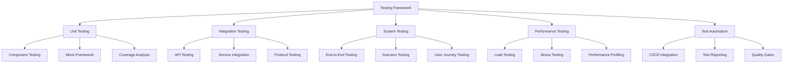

# Testing Framework

The Nest Learning Thermostat testing framework provides comprehensive automated testing capabilities including unit testing, integration testing, system testing, and performance validation. This document details the testing architecture, frameworks, and best practices.

## Testing Architecture

### Core Components
- **Unit Testing Framework**: Isolated component testing with mocking
- **Integration Testing Framework**: Component interaction and integration testing
- **System Testing Framework**: End-to-end system validation
- **Performance Testing Framework**: Performance and load testing
- **Test Automation**: Automated test execution and reporting

### Testing Framework


## Unit Testing Framework

### Test Case Management
Comprehensive test case management with setup, teardown, and lifecycle management.

```c
// Unit testing framework
typedef struct {
    test_case_manager_t case_manager;     // Test case management
    assertion_engine_t assertions;         // Assertion engine
    mock_framework_t mocks;                // Mock framework
    coverage_analyzer_t coverage;          // Coverage analysis
} unit_testing_framework_t;

// Test case manager
typedef struct {
    test_registry_t registry;              // Test registry
    test_executor_t executor;              // Test executor
    lifecycle_manager_t lifecycle;         // Lifecycle management
    result_collector_t collector;          // Result collection
} test_case_manager_t;

// Unit test case
typedef struct {
    test_case_id_t test_id;                // Test case ID
    char test_name[128];                   // Test name
    char test_description[512];            // Test description
    test_function_t test_function;         // Test function
    setup_function_t setup;                // Setup function
    teardown_function_t teardown;          // Teardown function
    test_timeout_t timeout;                // Test timeout
    test_dependencies_t dependencies;      // Test dependencies
    test_tags_t tags;                      // Test tags
} unit_test_case_t;

// Test execution context
typedef struct {
    context_id_t context_id;               // Context ID
    test_case_t *test_case;                // Current test case
    test_environment_t environment;        // Test environment
    mock_manager_t mock_manager;           // Mock manager
    assertion_state_t assertions;          // Assertion state
    timing_metrics_t timing;               // Timing metrics
} test_execution_context_t;

// Execute unit test suite
unit_test_result_t execute_unit_test_suite(
    unit_testing_framework_t *framework, 
    test_suite_t *test_suite) {
    
    unit_test_result_t result = {0};
    
    // Initialize test execution
    test_execution_context_t context = initialize_test_execution(
        test_suite);
    
    // Execute test cases
    for (int i = 0; i < test_suite->test_case_count; i++) {
        unit_test_case_t *test_case = &test_suite->test_cases[i];
        
        context.test_case = test_case;
        context.context_id = generate_context_id();
        
        // Setup test case
        setup_result_t setup_result = setup_test_case(
            test_case, &context);
        
        test_execution_result_t execution_result = {0};
        
        if (setup_result.success) {
            // Record setup time
            context.timing.setup_time = get_current_timestamp() - 
                                       context.timing.start_time;
            
            // Execute test function
            execution_result = execute_test_function(
                test_case->test_function, &context);
            
            // Record execution time
            context.timing.execution_time = get_current_timestamp() - 
                                            context.timing.setup_time;
            
        } else {
            // Setup failed
            execution_result = {
                .test_case = test_case,
                .passed = false,
                .failure_type = FAILURE_TYPE_SETUP,
                .error_message = setup_result.error_message,
                .execution_time = 0
            };
        }
        
        // Teardown test case
        teardown_result_t teardown_result = teardown_test_case(
            test_case, &context);
        
        // Record teardown time
        context.timing.teardown_time = get_current_timestamp() - 
                                       context.timing.execution_time;
        
        // Calculate total time
        execution_result.execution_time = 
            context.timing.setup_time + 
            context.timing.execution_time + 
            context.timing.teardown_time;
        
        // Record test result
        result.test_results[result.test_count++] = execution_result;
        
        // Update statistics
        if (execution_result.passed) {
            result.passed_tests++;
        } else {
            result.failed_tests++;
            result.failure_types[execution_result.failure_type]++;
        }
        
        // Update timing statistics
        update_timing_statistics(&result.timing, context.timing);
        
        // Cleanup mocks
        cleanup_test_mocks(&context.mock_manager);
    }
    
    // Analyze test coverage
    result.coverage = analyze_test_coverage(&framework->coverage, 
                                          context);
    
    // Calculate overall result
    result.overall_success = (result.failed_tests == 0);
    result.success_rate = (float)result.passed_tests / 
                         (result.passed_tests + result.failed_tests);
    
    // Generate test report
    result.report = generate_unit_test_report(result);
    
    // Cleanup test execution
    cleanup_test_execution(&context);
    
    return result;
}
```

### Assertion Engine
Comprehensive assertion engine with custom matchers and detailed error reporting.

```c
// Assertion engine
typedef struct {
    assertion_matchers_t matchers;         // Assertion matchers
    error_formatter_t formatter;           // Error formatter
    assertion_collector_t collector;       // Assertion collector
    custom_assertions_t custom;            // Custom assertions
} assertion_engine_t;

// Assertion result
typedef struct {
    assertion_id_t assertion_id;           // Assertion ID
    bool passed;                           // Assertion passed
    assertion_type_t type;                 // Assertion type
    char expected_message[256];            // Expected value message
    char actual_message[256];              // Actual value message
    char error_message[512];               // Error message
    source_location_t location;            // Source location
} assertion_result_t;

// Standard assertion macros and functions
assertion_result_t assert_equals_int(
    assertion_engine_t *engine, 
    int expected, 
    int actual, 
    source_location_t *location) {
    
    assertion_result_t result = {0};
    
    result.assertion_id = generate_assertion_id();
    result.type = ASSERTION_TYPE_EQUALS_INT;
    result.location = *location;
    
    result.passed = (expected == actual);
    
    if (result.passed) {
        sprintf(result.expected_message, "%d", expected);
        sprintf(result.actual_message, "%d", actual);
        sprintf(result.error_message, "Assertion passed: %d == %d", 
                expected, actual);
    } else {
        sprintf(result.expected_message, "%d", expected);
        sprintf(result.actual_message, "%d", actual);
        sprintf(result.error_message, "Assertion failed: expected %d, got %d", 
                expected, actual);
    }
    
    // Collect assertion
    collect_assertion(&engine->collector, result);
    
    return result;
}

assertion_result_t assert_equals_string(
    assertion_engine_t *engine, 
    char *expected, 
    char *actual, 
    source_location_t *location) {
    
    assertion_result_t result = {0};
    
    result.assertion_id = generate_assertion_id();
    result.type = ASSERTION_TYPE_EQUALS_STRING;
    result.location = *location;
    
    result.passed = (strcmp(expected, actual) == 0);
    
    if (result.passed) {
        strncpy(result.expected_message, expected, 255);
        strncpy(result.actual_message, actual, 255);
        sprintf(result.error_message, "Assertion passed: strings are equal");
    } else {
        strncpy(result.expected_message, expected, 255);
        strncpy(result.actual_message, actual, 255);
        sprintf(result.error_message, "Assertion failed: expected '%s', got '%s'", 
                expected, actual);
    }
    
    // Collect assertion
    collect_assertion(&engine->collector, result);
    
    return result;
}
```

### Mock Framework
Advanced mocking framework for isolating components under test.

```c
// Mock framework
typedef struct {
    mock_factory_t factory;                // Mock factory
    expectation_manager_t expectations;   // Expectation management
    call_recorder_t recorder;              // Call recording
    verification_engine_t verification;    // Verification engine
} mock_framework_t;

// Mock object
typedef struct {
    mock_id_t mock_id;                     // Mock ID
    mock_type_t type;                      // Mock type
    expectation_list_t expectations;      // Expectations
    call_history_t call_history;           // Call history
    mock_behavior_t behavior;              // Mock behavior
} mock_object_t;

// Mock expectation
typedef struct {
    expectation_id_t expectation_id;       // Expectation ID
    function_signature_t function;         // Function signature
    argument_matchers_t matchers;          // Argument matchers
    return_value_t return_value;           // Return value
    call_count_t expected_calls;           // Expected call count
    call_count_t actual_calls;             // Actual call count
    expectation_action_t action;           // Expectation action
} mock_expectation_t;

// Create mock object
mock_object_t* create_mock_object(
    mock_framework_t *framework, 
    mock_type_t type, 
    mock_config_t *config) {
    
    mock_object_t *mock = allocate_mock_object();
    
    mock->mock_id = generate_mock_id();
    mock->type = type;
    mock->expectations.expectation_count = 0;
    mock->call_history.call_count = 0;
    mock->behavior = config->default_behavior;
    
    // Register mock with framework
    register_mock_object(&framework->factory, mock);
    
    return mock;
}
```

## Integration Testing Framework

### Component Integration Testing
Testing of component interactions and system integration points.

```c
// Integration testing framework
typedef struct {
    component_tester_t component_tester;   // Component tester
    service_integration_t service;         // Service integration
    protocol_tester_t protocol;            // Protocol tester
    environment_manager_t environment;     // Environment management
} integration_testing_framework_t;

// Component tester
typedef struct {
    component_orchestrator_t orchestrator; // Component orchestration
    interaction_validator_t validator;     // Interaction validation
    state_manager_t state;                 // State management
    performance_monitor_t monitor;         // Performance monitoring
} component_tester_t;

// Integration test scenario
typedef struct {
    scenario_id_t scenario_id;             // Scenario ID
    char scenario_name[128];               // Scenario name
    component_configuration_t components; // Component configuration
    interaction_sequence_t sequence;      // Interaction sequence
    validation_criteria_t criteria;       // Validation criteria
    performance_requirements_t performance; // Performance requirements
} integration_test_scenario_t;

// Execute integration test
integration_test_result_t execute_integration_test(
    integration_testing_framework_t *framework, 
    integration_test_scenario_t *scenario) {
    
    integration_test_result_t result = {0};
    
    // Setup test environment
    environment_setup_result_t env_setup = setup_test_environment(
        &framework->environment, &scenario->components);
    
    if (!env_setup.success) {
        result.status = INTEGRATION_TEST_ENVIRONMENT_FAILED;
        result.environment_errors = env_setup.errors;
        return result;
    }
    
    // Configure components
    component_setup_result_t comp_setup = configure_components(
        &framework->component_tester.orchestrator, 
        &scenario->components);
    
    if (!comp_setup.success) {
        result.status = INTEGRATION_TEST_COMPONENT_SETUP_FAILED;
        result.component_errors = comp_setup.errors;
        cleanup_test_environment(&framework->environment);
        return result;
    }
    
    // Execute interaction sequence
    sequence_execution_result_t sequence = execute_interaction_sequence(
        &framework->component_tester.orchestrator, 
        &scenario->sequence);
    
    if (!sequence.success) {
        result.status = INTEGRATION_TEST_SEQUENCE_FAILED;
        result.sequence_errors = sequence.errors;
        cleanup_components(&framework->component_tester.orchestrator);
        cleanup_test_environment(&framework->environment);
        return result;
    }
    
    // Validate interactions
    validation_result_t validation = validate_interactions(
        &framework->component_tester.validator, 
        sequence, &scenario->criteria);
    
    result.validation = validation;
    
    // Monitor performance
    performance_metrics_t performance = monitor_test_performance(
        &framework->component_tester.monitor, 
        &scenario->performance);
    
    result.performance = performance;
    
    // Determine overall result
    result.overall_success = validation.valid && 
                           performance.meets_requirements;
    
    result.status = result.overall_success ? 
                   INTEGRATION_TEST_SUCCESS : 
                   INTEGRATION_TEST_VALIDATION_FAILED;
    
    // Generate integration test report
    result.report = generate_integration_test_report(
        scenario, sequence, validation, performance);
    
    // Cleanup
    cleanup_components(&framework->component_tester.orchestrator);
    cleanup_test_environment(&framework->environment);
    
    return result;
}
```

### Service Integration Testing
Testing of service interactions and API integrations.

```c
// Service integration
typedef struct {
    service_orchestrator_t orchestrator;   // Service orchestration
    api_tester_t api_tester;               // API testing
    message_validator_t validator;         // Message validation
    contract_tester_t contract;            // Contract testing
} service_integration_t;

// API test configuration
typedef struct {
    api_endpoint_t endpoint;               // API endpoint
    request_specification_t request;       // Request specification
    response_specification_t response;     // Response specification
    authentication_t authentication;       // Authentication
    timeout_t timeout;                     // Request timeout
} api_test_config_t;

// Execute API integration test
api_integration_result_t execute_api_integration_test(
    api_tester_t *api_tester, 
    api_test_config_t *config) {
    
    api_integration_result_t result = {0};
    
    // Prepare API request
    api_request_t request = prepare_api_request(config);
    
    // Execute API call
    api_response_t response = execute_api_call(api_tester, request);
    
    if (!response.success) {
        result.status = API_INTEGRATION_CALL_FAILED;
        result.call_error = response.error;
        return result;
    }
    
    // Validate response
    response_validation_t validation = validate_api_response(
        response, config->response);
    
    result.validation = validation;
    
    // Validate API contract
    contract_validation_t contract = validate_api_contract(
        request, response, config);
    
    result.contract = contract;
    
    // Determine overall result
    result.overall_success = validation.valid && contract.valid;
    
    result.status = result.overall_success ? 
                   API_INTEGRATION_SUCCESS : 
                   API_INTEGRATION_VALIDATION_FAILED;
    
    result.request = request;
    result.response = response;
    
    return result;
}
```

## System Testing Framework

### End-to-End Testing
Comprehensive end-to-end testing of complete system workflows.

```c
// System testing framework
typedef struct {
    e2e_tester_t e2e_tester;               // End-to-end tester
    scenario_runner_t scenario_runner;     // Scenario runner
    user_journey_t user_journey;           // User journey testing
    system_validator_t validator;          // System validation
} system_testing_framework_t;

// E2E test scenario
typedef struct {
    scenario_id_t scenario_id;             // Scenario ID
    char scenario_name[128];               // Scenario name
    test_environment_t environment;        // Test environment
    workflow_steps_t workflow;             // Workflow steps
    expected_outcomes_t outcomes;          // Expected outcomes
    validation_points_t validations;       // Validation points
} e2e_test_scenario_t;

// Workflow step
typedef struct {
    step_id_t step_id;                     // Step ID
    step_type_t type;                      // Step type
    step_parameters_t parameters;          // Step parameters
    expected_result_t expected;            // Expected result
    timeout_t timeout;                     // Step timeout
    retry_policy_t retry;                  // Retry policy
} workflow_step_t;

// Execute end-to-end test
e2e_test_result_t execute_e2e_test(
    system_testing_framework_t *framework, 
    e2e_test_scenario_t *scenario) {
    
    e2e_test_result_t result = {0};
    
    // Setup system environment
    environment_setup_result_t env_setup = setup_system_environment(
        &framework->e2e_tester, &scenario->environment);
    
    if (!env_setup.success) {
        result.status = E2E_TEST_ENVIRONMENT_FAILED;
        result.environment_errors = env_setup.errors;
        return result;
    }
    
    // Execute workflow steps
    for (int i = 0; i < scenario->workflow.step_count; i++) {
        workflow_step_t *step = &scenario->workflow.steps[i];
        
        step_result_t step_result = execute_workflow_step(
            &framework->scenario_runner, step);
        
        result.step_results[result.step_count++] = step_result;
        
        if (!step_result.success) {
            result.status = E2E_TEST_WORKFLOW_FAILED;
            result.failed_step = i;
            result.step_error = step_result.error;
            break;
        }
        
        // Validate step results
        if (step->expected.has_validation) {
            validation_result_t validation = validate_step_result(
                step_result, step->expected);
            
            result.step_validations[result.validation_count++] = validation;
            
            if (!validation.valid) {
                result.status = E2E_TEST_VALIDATION_FAILED;
                result.validation_error = validation.error;
                break;
            }
        }
    }
    
    // Validate system state
    if (result.status == E2E_TEST_WORKFLOW_SUCCESS) {
        system_validation_t system_validation = validate_system_state(
            &framework->validator, &scenario->expected_outcomes);
        
        result.system_validation = system_validation;
        
        if (!system_validation.valid) {
            result.status = E2E_TEST_SYSTEM_VALIDATION_FAILED;
        }
    }
    
    // Determine overall success
    result.overall_success = (result.status == E2E_TEST_WORKFLOW_SUCCESS);
    
    // Generate E2E test report
    result.report = generate_e2e_test_report(scenario, result);
    
    // Cleanup system environment
    cleanup_system_environment(&framework->e2e_tester, 
                              &scenario->environment);
    
    return result;
}
```

## Performance Testing Framework

### Load Testing
Comprehensive load testing for system performance validation.

```c
// Performance testing framework
typedef struct {
    load_generator_t load_generator;       // Load generator
    performance_monitor_t monitor;         // Performance monitor
    stress_tester_t stress_tester;         // Stress tester
    performance_analyzer_t analyzer;       // Performance analyzer
} performance_testing_framework_t;

// Load generator
typedef struct {
    workload_generator_t workload;         // Workload generation
    concurrent_users_t users;              // Concurrent users
    request_generator_t requests;          // Request generation
    scenario_executor_t executor;          // Scenario executor
} load_generator_t;

// Load test configuration
typedef struct {
    load_profile_t profile;                 // Load profile
    user_simulation_t users;                // User simulation
    request_patterns_t patterns;           // Request patterns
    performance_targets_t targets;          // Performance targets
    test_duration_t duration;               // Test duration
} load_test_config_t;

// Execute load test
load_test_result_t execute_load_test(
    performance_testing_framework_t *framework, 
    load_test_config_t *config) {
    
    load_test_result_t result = {0};
    
    // Initialize load generator
    load_generator_init_result_t init_result = 
        initialize_load_generator(&framework->load_generator, config);
    
    if (!init_result.success) {
        result.status = LOAD_TEST_INITIALIZATION_FAILED;
        result.initialization_error = init_result.error;
        return result;
    }
    
    // Start performance monitoring
    monitoring_session_t monitoring = start_performance_monitoring(
        &framework->performance_monitor, config);
    
    // Generate load
    load_generation_result_t load_result = generate_load(
        &framework->load_generator, config->duration);
    
    if (!load_result.success) {
        result.status = LOAD_TEST_GENERATION_FAILED;
        result.generation_error = load_result.error;
        stop_performance_monitoring(monitoring);
        return result;
    }
    
    // Stop performance monitoring
    performance_metrics_t metrics = stop_performance_monitoring(monitoring);
    
    result.performance_metrics = metrics;
    
    // Analyze performance results
    performance_analysis_t analysis = analyze_performance_results(
        &framework->performance_analyzer, metrics, config->targets);
    
    result.analysis = analysis;
    
    // Determine overall result
    result.overall_success = analysis.meets_targets;
    
    result.status = result.overall_success ? 
                   LOAD_TEST_SUCCESS : 
                   LOAD_TEST_PERFORMANCE_FAILED;
    
    // Generate load test report
    result.report = generate_load_test_report(config, load_result, 
                                            metrics, analysis);
    
    // Cleanup load generator
    cleanup_load_generator(&framework->load_generator);
    
    return result;
}
```

## Test Automation

### CI/CD Integration
Automated test execution integrated with CI/CD pipelines.

```c
// Test automation system
typedef struct {
    ci_integration_t ci;                   // CI integration
    test_scheduler_t scheduler;             // Test scheduling
    reporting_engine_t reporting;          // Reporting engine
    quality_gates_t quality_gates;          // Quality gates
} test_automation_t;

// CI integration
typedef struct {
    pipeline_interface_t pipeline;         // Pipeline interface
    artifact_manager_t artifacts;         // Artifact management
    environment_provision_t environment;   // Environment provisioning
    notification_system_t notifications;   // Notification system
} ci_integration_t;

// Automated test execution
automated_test_result_t execute_automated_tests(
    test_automation_t *automation, 
    test_execution_request_t *request) {
    
    automated_test_result_t result = {0};
    
    // Provision test environment
    environment_provision_result_t env_result = 
        provision_test_environment(&automation->ci.environment, 
                                  request->environment_config);
    
    if (!env_result.success) {
        result.status = AUTOMATED_TEST_ENVIRONMENT_FAILED;
        result.environment_error = env_result.error;
        return result;
    }
    
    // Schedule test execution
    test_schedule_t schedule = schedule_test_execution(
        &automation->scheduler, request);
    
    // Execute test suites
    for (int i = 0; i < request->test_suite_count; i++) {
        test_suite_execution_t suite_execution = 
            execute_test_suite_automatically(&request->test_suitets[i]);
        
        result.suite_results[result.suite_count++] = suite_execution;
        
        // Update CI pipeline status
        update_pipeline_status(&automation->ci.pipeline, 
                             suite_execution);
    }
    
    // Apply quality gates
    quality_gate_result_t quality_result = apply_quality_gates(
        &automation->quality_gates, result.suite_results, 
        result.suite_count);
    
    result.quality_gates = quality_result;
    
    // Generate comprehensive report
    result.report = generate_automated_test_report(
        &automation->reporting, result);
    
    // Send notifications
    send_test_notifications(&automation->ci.notifications, 
                          result, request->notification_config);
    
    // Determine overall result
    result.overall_success = quality_result.all_passed;
    
    result.status = result.overall_success ? 
                   AUTOMATED_TEST_SUCCESS : 
                   AUTOMATED_TEST_QUALITY_GATE_FAILED;
    
    // Cleanup test environment
    cleanup_test_environment(&automation->ci.environment, 
                            env_result.environment_id);
    
    return result;
}
```

## Related Documentation

- [Development Overview](./overview.mdx)
- [Build System](./build-system.mdx)
- [Debugging Guide](./debugging-guide.mdx)
- [Development Tools](./development-tools.mdx)
