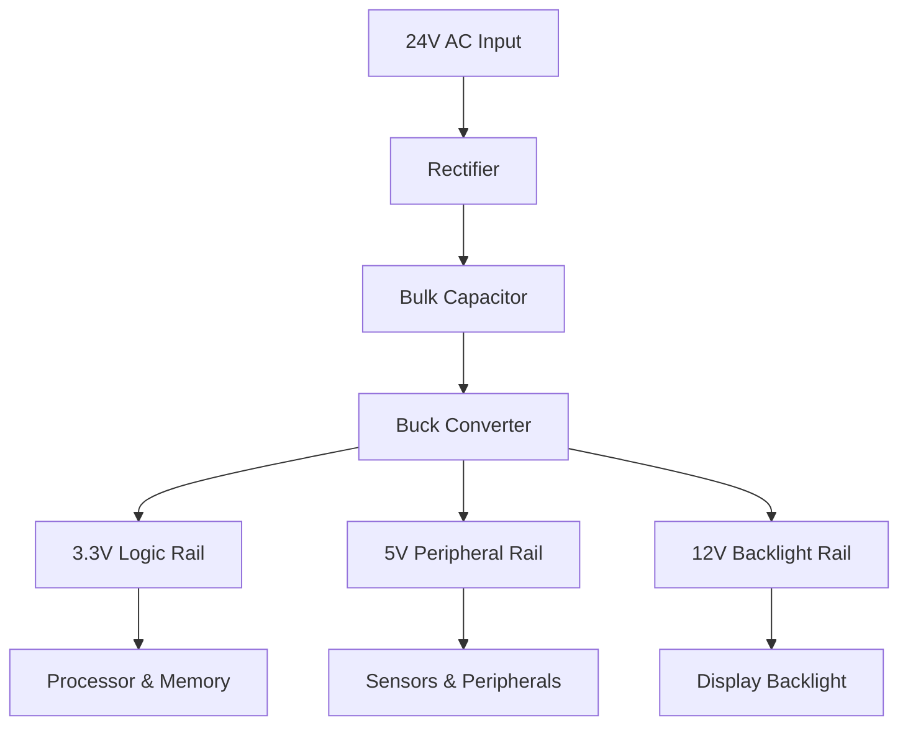
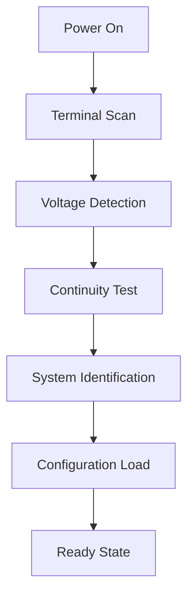

# Backplate System

The Nest thermostat backplate serves as the critical interface between the thermostat and the HVAC system. It provides power, control signals, and wiring detection capabilities while maintaining safety and reliability.

## Backplate Overview

### Primary Functions
- **Power Supply**: 24V AC power conversion and regulation
- **HVAC Control**: Relay control for heating, cooling, and fan
- **Wiring Detection**: Automatic HVAC system identification
- **Safety Protection**: Overcurrent and fault protection
- **Communication**: Data link with thermostat main unit

### Physical Characteristics
- **Material**: Flame-retardant ABS plastic
- **Mounting**: Standard wall plate compatibility
- **Dimensions**: 84mm diameter × 15mm depth
- **Terminals**: Screw terminals for HVAC wiring
- **Weight**: 120 grams

## Power Supply System

### Input Power
- **Voltage**: 24V AC from HVAC transformer
- **Frequency**: 50/60Hz (auto-detecting)
- **Current**: Up to 1A maximum draw
- **Protection**: Overvoltage and overcurrent protection

### Power Conversion


### Power Rails
| Rail | Voltage | Current | Purpose |
|------|---------|---------|---------|
| Logic | 3.3V | 500mA | Processor, memory, logic |
| Peripheral | 5V | 200mA | Sensors, touch, USB |
| Backlight | 12V | 150mA | Display backlight |
| Battery | 3.7V | 600mAh | Backup power |

### Battery Backup
- **Chemistry**: Lithium-ion polymer
- **Capacity**: 600mAh typical
- **Runtime**: 1-2 hours on battery power
- **Charging**: Trickle charge from AC power
- **Protection**: Overcharge/discharge protection

## HVAC Control Interface

### Relay Control
- **Heat Relay**: R (heating) control
- **Cool Relay**: Y (cooling) control
- **Fan Relay**: G (fan) control
- **Power Relay**: C (common) connection
- **Aux Relay**: W/AUX (auxiliary) control

### Relay Specifications
| Function | Terminal | Voltage | Current | Type |
|----------|----------|---------|---------|------|
| Heat | R/W | 24V AC | 1A | Solid-state |
| Cool | Y | 24V AC | 1A | Solid-state |
| Fan | G | 24V AC | 1A | Solid-state |
| Common | C | 24V AC | 1A | Power |
| Aux | W2/AUX | 24V AC | 1A | Solid-state |

### Control Logic
```c
// HVAC control logic example
void control_hvac(float target_temp, float current_temp, SystemMode mode) {
    switch (mode) {
        case HEAT:
            if (current_temp < target_temp - HEATING_DEADBAND) {
                activate_relay(HEAT_RELAY);
                activate_relay(FAN_RELAY);
            } else if (current_temp >= target_temp) {
                deactivate_relay(HEAT_RELAY);
                deactivate_relay(FAN_RELAY);
            }
            break;
        case COOL:
            if (current_temp > target_temp + COOLING_DEADBAND) {
                activate_relay(COOL_RELAY);
                activate_relay(FAN_RELAY);
            } else if (current_temp <= target_temp) {
                deactivate_relay(COOL_RELAY);
                deactivate_relay(FAN_RELAY);
            }
            break;
    }
}
```

## Wiring Detection System

### Automatic Detection
- **Continuity Testing**: Automatic wiring continuity check
- **Voltage Sensing**: Voltage presence detection on terminals
- **Type Identification**: HVAC system type identification
- **Configuration**: Automatic system configuration

### Detection Process


### Supported Systems
- **Conventional**: Standard heating/cooling systems
- **Heat Pump**: Heat pump with auxiliary heat
- **Dual Fuel**: Heat pump with furnace backup
- **Boiler**: Hot water boiler systems
- **Multi-stage**: Multi-stage heating/cooling

### Wiring Configurations
```
R - 24V AC power (red)
C - Common (blue or black)
G - Fan (green)
Y - Cooling (yellow)
W - Heating (white)
W2/AUX - Auxiliary heat (brown or black)
O/B - Heat pump reversing valve (orange or blue)
```

## Communication Interface

### Data Link
- **Protocol**: Custom serial communication
- **Speed**: 115200 baud rate
- **Format**: 8N1 (8 data bits, no parity, 1 stop bit)
- **Connector**: Multi-pin connector for main unit

### Communication Features
- **Status Reporting**: Real-time status updates
- **Configuration**: System configuration exchange
- **Diagnostics**: Diagnostic data transmission
- **Updates**: Firmware update capability

### Data Protocol
```c
// Communication packet structure
typedef struct {
    uint8_t start_byte;      // 0xAA start marker
    uint8_t packet_type;     // Command or data type
    uint16_t data_length;    // Data payload length
    uint8_t* data;           // Data payload
    uint8_t checksum;        // Packet checksum
    uint8_t end_byte;        // 0x55 end marker
} comm_packet_t;
```

## Safety and Protection

### Electrical Safety
- **Isolation**: Galvanic isolation from HVAC circuits
- **Overcurrent**: Current limiting on all outputs
- **Overvoltage**: Voltage spike protection
- **Short Circuit**: Short circuit protection

### Thermal Safety
- **Temperature Monitoring**: Component temperature monitoring
- **Thermal Shutdown**: Over-temperature protection
- **Ventilation**: Passive cooling design
- **Fire Safety**: Flame-retardant materials

### Fault Detection
- **Wiring Faults**: Open/short circuit detection
- **Power Faults**: Power supply fault detection
- **Communication Faults**: Communication link monitoring
- **System Faults**: HVAC system fault detection

## Installation and Setup

### Installation Steps
1. **Power Down**: Turn off HVAC system power
2. **Mount Backplate**: Secure backplate to wall
3. **Connect Wires**: Connect HVAC wires to terminals
4. **Secure Connections**: Tighten terminal screws
5. **Attach Thermostat**: Mount main thermostat unit
6. **Power Up**: Restore HVAC system power

### Wiring Guidelines
- **Wire Gauge**: 18-22 AWG wire recommended
- **Stripping**: 6-8mm wire stripping
- **Torque**: 0.5-0.8 N·m terminal torque
- **Labeling**: Wire labeling recommended

### Configuration
- **System Type**: Automatic or manual system type selection
- **Equipment**: Equipment brand and model selection
- **Features**: System feature enable/disable
- **Calibration**: Temperature calibration settings

## Diagnostic Features

### Self-Test
- **Power On Test**: Comprehensive power-on self-test
- **Continuity Test**: Wiring continuity verification
- **Voltage Test**: Voltage level verification
- **Communication Test**: Data link verification

### Diagnostic Modes
- **Installation Mode**: Installation and setup mode
- **Service Mode**: Service technician mode
- **Test Mode**: Component testing mode
- **Debug Mode**: Engineering debug mode

### Error Codes
| Code | Description | Action |
|------|-------------|--------|
| E1 | Wiring fault detected | Check wiring connections |
| E2 | Power supply fault | Check 24V AC power |
| E3 | Communication fault | Check data link connection |
| E4 | Temperature sensor fault | Check sensor connections |

## Performance Specifications

### Electrical Performance
- **Input Voltage**: 20-30V AC range
- **Power Consumption**: 1-5W typical
- **Efficiency**: >85% power conversion efficiency
- **Ripple**: <100mV output ripple

### Environmental Performance
- **Operating Temperature**: 0-50°C
- **Storage Temperature**: -20-60°C
- **Humidity**: 20-80% RH non-condensing
- **Altitude**: Up to 3,000 meters

### Reliability
- **MTBF**: 75,000 hours mean time between failures
- **Cycle Life**: >1 million relay cycles
- **Connector Life**: >10,000 mating cycles
- **Battery Life**: >5 years battery life

## Quality Assurance

### Testing Procedures
- **Electrical Testing**: Voltage, current, insulation testing
- **Mechanical Testing**: Fit, finish, torque testing
- **Environmental Testing**: Temperature, humidity, vibration testing
- **Safety Testing**: Safety agency compliance testing

### Certifications
- **UL**: Underwriters Laboratories certification
- **CE**: European Conformity marking
- **FCC**: Federal Communications Commission
- **CSA**: Canadian Standards Association

## Related Documentation

- [Hardware Overview](./overview.mdx)
- [Processor Details](./processor.mdx)
- [Heatlink Interface](./heatlink.mdx)
- [Installation Guide](../troubleshooting/factory-reset.mdx)
