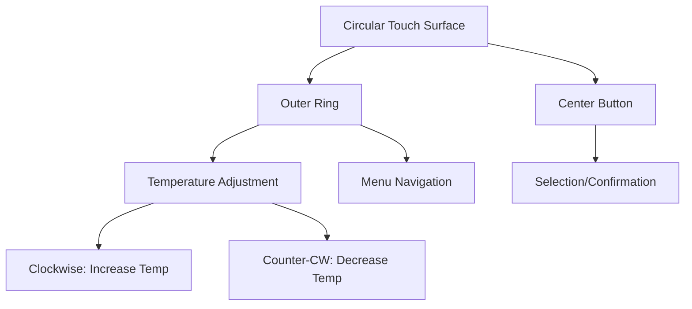
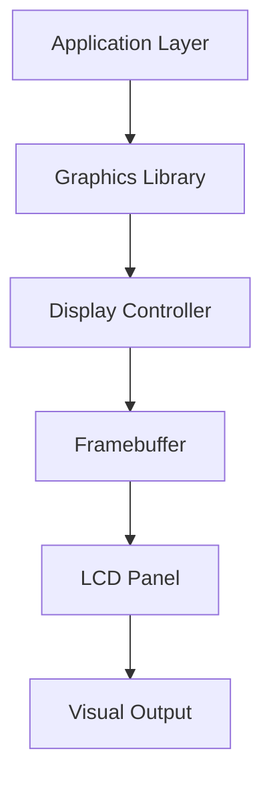

# Display System

The Nest Learning Thermostat features a distinctive circular display that provides an intuitive user interface for temperature control and system interaction. The display system combines a custom LCD panel with capacitive touch technology.

## Display Overview

### Physical Characteristics
- **Size**: 2.8-inch circular display
- **Resolution**: 320×320 pixels (square pixel grid)
- **Aspect Ratio**: 1:1 (circular active area)
- **Pixel Density**: ~143 PPI
- **Viewable Area**: 56mm diameter circle

### Display Technology
- **Panel Type**: Thin-Film Transistor (TFT) LCD
- **Color Depth**: 16-bit RGB565 (65,536 colors)
- **Backlight**: White LED array
- **Response Time**: <8ms gray-to-gray
- **Viewing Angles**: 160° all directions

## LCD Panel Specifications

### Optical Performance
- **Brightness**: 400 cd/m² (typical), 600 cd/m² (maximum)
- **Contrast Ratio**: 500:1 (typical)
- **Color Gamut**: 65% NTSC
- **White Balance**: 6500K color temperature
- **Anti-Glare**: Matte surface treatment

### Electrical Characteristics
- **Supply Voltage**: 3.3V logic, 12V backlight
- **Power Consumption**: 50-200mW (variable brightness)
- **Interface**: Parallel RGB interface
- **Refresh Rate**: 60Hz refresh frequency
- **Data Bus**: 18-bit RGB data bus

### Display Controller
- **Controller**: Custom LCD controller IC
- **Framebuffer**: 320×320×16-bit memory buffer
- **Gamma Correction**: 2.2 gamma curve
- **Color Enhancement**: Adaptive color enhancement
- **Power Management**: Dynamic backlight control

## Touch Interface

### Touch Technology
- **Type**: Projected capacitive (PCAP) touch
- **Controller**: I2C-based touch controller
- **Channels**: Multiple capacitive sensing channels
- **Multi-touch**: Up to 5 simultaneous touch points
- **Sampling Rate**: 100-200Hz sampling frequency

### Touch Performance
- **Accuracy**: ±1mm positioning accuracy
- **Resolution**: 0.1mm touch resolution
- **Response Time**: <10ms touch response
- **Pressure Sensitivity**: 256 pressure levels
- **Glove Support**: Limited glove compatibility

### Touch Zones


## Backlight System

### LED Backlight
- **Technology**: White LED edge lighting
- **LED Count**: Multiple LEDs around perimeter
- **Control**: PWM brightness control
- **Range**: 40-100% brightness range
- **Efficiency**: >80% luminous efficiency

### Brightness Control
```c
// PWM brightness calculation
int calculate_pwm_duty(int brightness_percent) {
    // Map 40-100% to PWM duty cycle
    int normalized = brightness_percent - 40;
    int pwm_duty = (normalized * 255) / 60;
    
    return constrain(pwm_duty, 0, 255);
}
```

### Auto-Brightness
- **Light Sensor**: Ambient light sensor integration
- **Mapping Algorithm**: Logarithmic brightness mapping
- **Response Time**: <1 second brightness adjustment
- **User Override**: Manual brightness override available

## Display Modes

### Normal Mode
- **Content**: Temperature display with status
- **Layout**: Large temperature digits, status icons
- **Colors**: Dynamic color based on heating/cooling
- **Animation**: Smooth transitions between states

### Menu Mode
- **Content**: Settings and configuration options
- **Layout**: List-based menu interface
- **Navigation**: Rotary ring for scrolling
- **Selection**: Center button for selection

### Farsight Mode
- **Content**: Time, temperature, or weather display
- **Activation**: Motion-based activation
- **Brightness**: Optimized for distance viewing
- **Timeout**: Automatic dimming after inactivity

### Eco Mode
- **Content**: Energy-saving display mode
- **Brightness**: Reduced brightness levels
- **Update Rate**: Slower refresh rate
- **Content**: Minimal information display

## Graphics Pipeline

### Rendering Pipeline


### Graphics Features
- **Anti-Aliasing**: Smooth edge rendering
- **Alpha Blending**: Transparency support
- **Dithering**: Color dithering for gradients
- **Scaling**: Hardware-accelerated scaling
- **Rotation**: Hardware display rotation

### UI Elements
- **Fonts**: Custom anti-aliased fonts
- **Icons**: Scalable vector icons
- **Animations**: Smooth transition animations
- **Effects**: Visual effects and transitions

## Display Calibration

### Factory Calibration
- **Color Calibration**: Factory color calibration
- **Brightness Calibration**: Brightness level calibration
- **Touch Calibration**: Touch coordinate calibration
- **Uniformity**: Display uniformity correction

### Field Calibration
- **Brightness Adjustment**: User brightness preference
- **Color Temperature**: Color temperature adjustment
- **Touch Sensitivity**: Touch sensitivity tuning
- **Auto-Calibration**: Automatic calibration routines

## Power Management

### Power States
- **Active**: Full brightness and refresh rate
- **Dim**: Reduced brightness for power saving
- **Sleep**: Minimal power consumption
- **Off**: Complete power down

### Power Optimization
- **Dynamic Brightness**: Adaptive brightness control
- **Refresh Rate Control**: Variable refresh rates
- **Backlight Control**: Efficient LED driving
- **Sleep Mode**: Aggressive power saving

### Power Consumption
| Mode | Brightness | Power Consumption |
|------|------------|-------------------|
| Active | 100% | ~200mW |
| Normal | 70% | ~140mW |
| Dim | 40% | ~80mW |
| Sleep | Off | ~5mW |

## Environmental Performance

### Temperature Performance
- **Operating Range**: 0-50°C operating temperature
- **Storage Range**: -20-60°C storage temperature
- **Temperature Compensation**: Automatic color compensation
- **Response Time**: Temperature-dependent response

### Humidity Performance
- **Operating Humidity**: 20-80% RH non-condensing
- **Condensation Resistance**: Anti-condensation design
- **Sealing**: Environmental sealing of display assembly

## Reliability and Durability

### Display Lifetime
- **Backlight Lifetime**: >50,000 hours LED lifetime
- **Panel Lifetime**: >60,000 hours panel lifetime
- **Touch Lifetime**: >50 million touches
- **Cycle Life**: >1 million on/off cycles

### Environmental Stress
- **Thermal Cycling**: -20°C to +60°C cycling
- **Humidity Cycling**: 10% to 90% RH cycling
- **UV Resistance**: UV-resistant materials
- **Impact Resistance**: 1.5m drop resistance

## Quality Assurance

### Testing Procedures
- **Optical Testing**: Brightness, contrast, color testing
- **Electrical Testing**: Power consumption, signal integrity
- **Mechanical Testing**: Impact, vibration, drop testing
- **Environmental Testing**: Temperature, humidity, altitude testing

### Defect Screening
- **Pixel Defects**: Dead pixel detection and screening
- **Touch Defects**: Touch accuracy and response testing
- **Uniformity**: Display uniformity testing
- **Calibration**: Calibration accuracy verification

## Related Documentation

- [Hardware Overview](./overview.mdx)
- [Sensor System](./sensors.mdx)
- [Processor Details](./processor.mdx)
- [User Interface](../software/user-interface.mdx)
