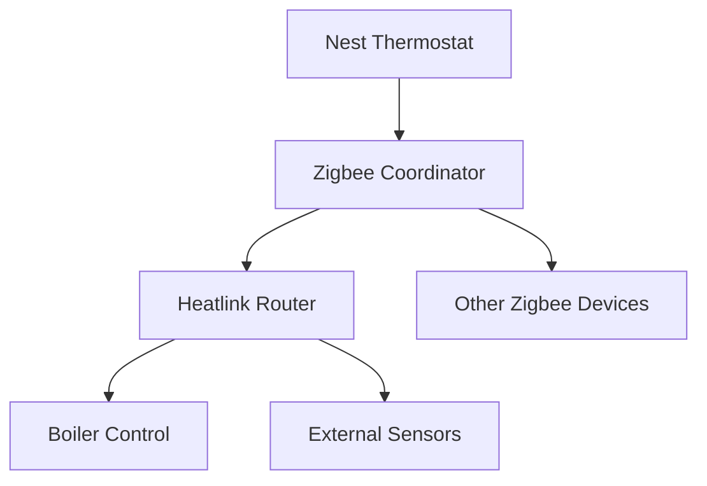
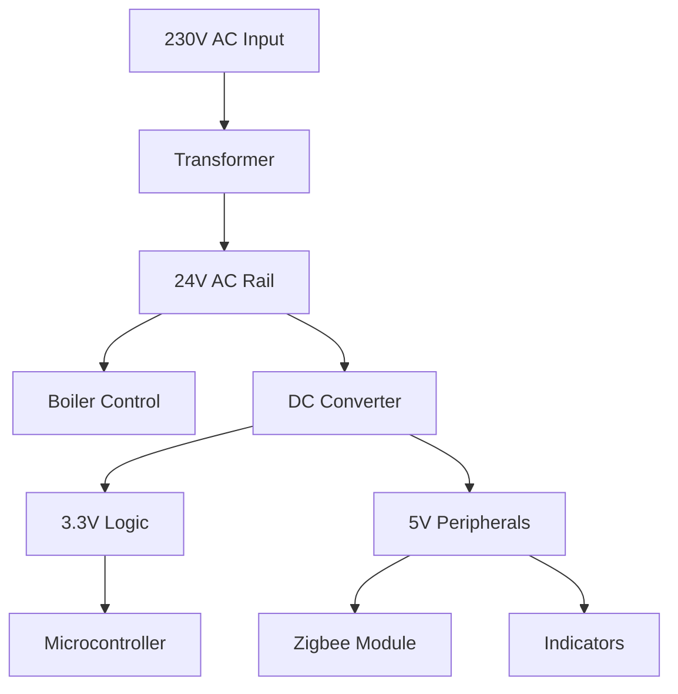

# Heatlink System

The Heatlink is Nest's boiler control interface that enables remote heating control and advanced features like hot water control and OpenTherm integration. It communicates with the main thermostat via Zigbee protocol.

## Heatlink Overview

### Primary Functions
- **Boiler Control**: Remote boiler activation and control
- **Hot Water Control**: Separate hot water system control
- **Protocol Support**: OpenTherm and on/off control protocols
- **Zigbee Communication**: Wireless link to main thermostat
- **Safety Monitoring**: Boiler safety and fault monitoring

### Physical Characteristics
- **Dimensions**: 120mm × 80mm × 30mm
- **Weight**: 200 grams
- **Housing**: White plastic enclosure
- **Mounting**: Wall-mount or boiler-mount options
- **Indicators**: LED status indicators

## Communication System

### Zigbee Interface
- **Standard**: IEEE 802.15.4 Zigbee protocol
- **Frequency**: 2.4GHz ISM band
- **Data Rate**: 250kbps nominal
- **Range**: 10-100m indoor range
- **Network**: Zigbee Home Automation profile

### Network Topology


### Communication Features
- **Mesh Networking**: Multi-hop communication capability
- **Self-Healing**: Automatic network repair
- **Security**: AES-128 encryption
- **Low Power**: Energy-efficient communication

## Boiler Control Interface

### Control Methods
- **On/Off Control**: Simple relay-based boiler control
- **OpenTherm**: Advanced modulating boiler control
- **Voltage Control**: 24V AC control signals
- **Current Control**: Current loop control (industrial)

### Relay Control
- **Heat Relay**: Central heating control
- **Hot Water Relay**: Domestic hot water control
- **Pump Relay**: Circulation pump control
- **Valve Relay**: Motorized valve control

### Relay Specifications
| Function | Voltage | Current | Type | Rating |
|----------|---------|---------|------|--------|
| Heat | 230V AC | 3A | Mechanical | 690W |
| Hot Water | 230V AC | 3A | Mechanical | 690W |
| Pump | 230V AC | 1A | Mechanical | 230W |
| Valve | 24V AC | 0.5A | Mechanical | 12W |

## OpenTherm Integration

### Protocol Overview
- **Standard**: OpenTherm Protocol v4.0
- **Interface**: 2-wire communication
- **Voltage**: 24V AC with data modulation
- **Data Rate**: 9.6kbps
- **Features**: Modulating control, diagnostics

### OpenTherm Features
```c
// OpenTherm message structure
typedef struct {
    uint8_t msg_type;        // Message type (read/write/ack)
    uint8_t data_id;         // Data ID (temperature, status, etc.)
    uint16_t data_value;     // Data value
    uint8_t reserved;        // Reserved bits
} opentherm_msg_t;
```

### Supported Data IDs
- **Control Setpoint**: Desired boiler temperature
- **CH Water Temperature**: Central heating water temperature
- **DHW Temperature**: Domestic hot water temperature
- **Boiler Status**: Operating status and fault codes
- **Flame Signal**: Burner activation status
- **Fan Speed**: Modulation level for variable speed boilers

### OpenTherm Advantages
- **Efficiency**: Improved boiler efficiency
- **Comfort**: Better temperature control
- **Diagnostics**: Detailed boiler diagnostics
- **Flexibility**: Support for advanced boiler features

## Power Supply

### Input Power
- **Voltage**: 230V AC mains power
- **Frequency**: 50Hz (Europe) / 60Hz (other regions)
- **Current**: <100mA typical
- **Protection**: Overcurrent and surge protection

### Power Conversion
- **Primary**: 230V AC to 24V AC transformer
- **Secondary**: 24V AC to low-voltage DC rails
- **Rails**: 3.3V logic, 5V peripherals, 24V control
- **Backup**: Optional battery backup for critical functions

### Power Distribution


## Safety Features

### Electrical Safety
- **Isolation**: Galvanic isolation from mains
- **Creepage**: Proper creepage distances
- **Clearance**: Adequate clearance distances
- **Insulation**: Double insulation construction

### Boiler Safety
- **Interlock**: Safety interlock circuits
- **Monitoring**: Continuous boiler monitoring
- **Fault Detection**: Automatic fault detection
- **Shutdown**: Safe shutdown on faults

### Temperature Protection
- **Over-Temperature**: Component over-temperature protection
- **Thermal Cutoff**: Thermal cutoff switches
- **Ventilation**: Adequate ventilation design
- **Fire Safety**: Flame-retardant materials

## Installation and Setup

### Installation Requirements
- **Location**: Near boiler or in utility room
- **Power**: 230V AC power outlet required
- **Wiring**: Professional installation recommended
- **Clearance**: Adequate ventilation clearance

### Wiring Connections
```
L - Live (230V AC)
N - Neutral (230V AC)
E - Earth/Ground
OT1 - OpenTherm terminal 1
OT2 - OpenTherm terminal 2
CH - Central heating relay
HW - Hot water relay
```

### Setup Process
1. **Power Connection**: Connect mains power
2. **Boiler Wiring**: Connect boiler control wires
3. **Thermostat Pairing**: Pair with main thermostat
4. **Configuration**: Configure boiler type and features
5. **Testing**: Test all control functions
6. **Commissioning**: Final system commissioning

## Monitoring and Diagnostics

### Status Monitoring
- **Boiler Status**: Real-time boiler operating status
- **Temperature Monitoring**: Water temperature tracking
- **Energy Consumption**: Energy usage monitoring
- **Fault Logging**: Automatic fault event logging

### Diagnostic Features
- **Self-Test**: Power-on self-test routines
- **Loop Testing**: Control loop testing
- **Communication Test**: Zigbee link quality testing
- **Safety Test**: Safety circuit verification

### Fault Detection
| Fault Type | Detection Method | Response |
|------------|------------------|----------|
| No Power | Voltage monitoring | Alert user |
| Comms Lost | Zigbee link monitoring | Retry connection |
| Boiler Fault | Status monitoring | Safe shutdown |
| Over-Temp | Temperature sensor | Safety cutoff |

## Performance Specifications

### Communication Performance
- **Range**: 100m line-of-sight, 30m through walls
- **Latency**: <100ms message latency
- **Reliability**: >99.9% packet delivery
- **Network**: Support for 20+ Zigbee devices

### Control Performance
- **Response Time**: <1 second control response
- **Accuracy**: ±1°C temperature control
- **Relay Life**: >100,000 operations
- **Power Consumption**: <5W typical

### Environmental Performance
- **Operating Temperature**: 0-50°C
- **Storage Temperature**: -20-60°C
- **Humidity**: 20-80% RH non-condensing
- **IP Rating**: IP20 (dust protected)

## Advanced Features

### Load Compensation
- **Outdoor Sensor**: External temperature sensor support
- **Weather Compensation**: Weather-based control adjustment
- **Load Prediction**: Predictive load management
- **Efficiency Optimization**: Boiler efficiency optimization

### Hot Water Control
- **Separate Control**: Independent hot water control
- **Schedule Control**: Time-based hot water scheduling
- **Temperature Control**: Precise hot water temperature
- **Legionella Protection**: Anti-legionella routines

### Integration Features
- **Multi-Zone**: Support for multi-zone heating
- **External Controls**: Integration with external controls
- **BMS Integration**: Building management system interface
- **Remote Access**: Remote monitoring and control

## Quality and Compliance

### Quality Standards
- **ISO 9001**: Quality management system
- **ISO 14001**: Environmental management
- **Testing**: Comprehensive factory testing
- **Warranty**: 2-year manufacturer warranty

### Regulatory Compliance
- **CE**: European Conformity
- **UKCA**: UK Conformity Assessed
- **Gas Safe**: Gas safety regulations
- **Building Regulations**: Compliance with building codes

## Related Documentation

- [Hardware Overview](./overview.mdx)
- [Zigbee Interface](./zigbee.mdx)
- [Backplate System](./backplate.mdx)
- [Installation Guide](../troubleshooting/factory-reset.mdx)
