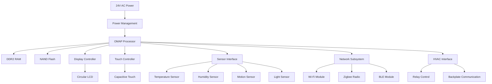

# Hardware Overview

The Nest Learning Thermostat is a sophisticated embedded device that combines multiple hardware subsystems to provide intelligent climate control. This document provides a comprehensive overview of all hardware components.

## System Architecture

### Main Components
- **Processor**: ARM Cortex-A8/A9 OMAP SoC
- **Memory**: 256MB-512MB DDR2 RAM + NAND flash storage
- **Display**: 320x320 circular LCD with capacitive touch
- **Sensors**: Temperature, humidity, motion, ambient light
- **Connectivity**: Wi-Fi, Zigbee, Bluetooth Low Energy
- **Power**: 24V AC HVAC system power with backup battery

### Block Diagram

## Processor Subsystem

### OMAP SoC
- **Model**: Texas Instruments OMAP 3/4 series
- **CPU**: ARM Cortex-A8 (1GHz) or Cortex-A9 (1.2GHz)
- **GPU**: PowerVR SGX530/540
- **DSP**: C64x+ DSP for audio processing
- **Memory Controller**: LPDDR2 interface
- **Peripherals**: Multiple I2C, SPI, UART interfaces

### Memory Configuration
- **RAM**: 256MB or 512MB DDR2
- **Storage**: 2GB-8GB NAND flash
- **Cache**: 32KB L1 instruction, 32KB L1 data, 256KB L2
- **Memory Bus**: 32-bit wide, 400MHz

## Display System

### LCD Panel
- **Size**: 2.8" circular display
- **Resolution**: 320x320 pixels
- **Technology**: TFT-LCD with LED backlight
- **Color Depth**: 16-bit RGB565 (65,536 colors)
- **Viewing Angle**: 160° all around
- **Brightness**: 400 cd/m² maximum

### Touch Interface
- **Type**: Projected capacitive touch
- **Controller**: I2C-based touch controller
- **Multi-touch**: Up to 5 touch points
- **Accuracy**: ±1mm
- **Response Time**: <10ms

### Backlight Control
- **Technology**: White LED array
- **Control**: PWM brightness control
- **Range**: 40-100% brightness (auto-adjusting)
- **Power Consumption**: 50-200mW

## Sensor System

### Temperature Sensing
- **Primary Sensor**: NTC thermistor
- **Accuracy**: ±0.5°C (±1°F)
- **Range**: 0-50°C (32-122°F)
- **Response Time**: 2 minutes
- **Calibration**: Factory calibrated with software compensation

### Humidity Sensing
- **Sensor Type**: Capacitive humidity sensor
- **Accuracy**: ±3% RH
- **Range**: 20-80% RH
- **Response Time**: 5 minutes
- **Temperature Compensation**: Automatic

### Motion Detection
- **Technology**: Passive infrared (PIR) sensor
- **Range**: 5 meters detection distance
- **Field of View**: 120° cone
- **Purpose**: Farsight wake-on-approach
- **Power Saving**: Low-power polling mode

### Ambient Light Sensing
- **Sensor**: Photodiode with ADC
- **Range**: 0-100,000 lux
- **Purpose**: Display brightness adjustment
- **Integration**: Automatic brightness mapping
- **Power Consumption**: <1mW

## Connectivity Subsystem

### Wi-Fi Module
- **Standard**: 802.11b/g/n (2.4GHz)
- **Antenna**: Internal PCB antenna
- **Power**: 802.11 power saving enabled
- **Security**: WPA2/WPA3 support
- **Data Rate**: Up to 72Mbps (802.11n)

### Zigbee Radio
- **Standard**: IEEE 802.15.4
- **Frequency**: 2.4GHz ISM band
- **Data Rate**: 250kbps
- **Range**: 10-100m indoor
- **Purpose**: Heatlink communication

### Bluetooth Low Energy
- **Version**: Bluetooth 4.0+ LE
- **Range**: 10 meters
- **Power**: Ultra-low power consumption
- **Purpose**: Initial setup and proximity features

## Power Management

### Power Supply
- **Input**: 24V AC from HVAC system
- **Backup**: 3.7V Li-ion battery (600mAh)
- **Consumption**: 1-3W typical, 5W peak
- **Efficiency**: >85% power conversion

### Power Rails
- **3.3V**: Digital logic and sensors
- **1.8V**: Processor core voltage
- **5V**: USB and peripheral power
- **12V**: Display backlight

### Battery Management
- **Charging**: Trickle charge from AC power
- **Runtime**: 1-2 hours on battery
- **Monitoring**: Battery health and capacity tracking
- **Safety**: Overcharge and over-discharge protection

## HVAC Interface

### Relay Control
- **Type**: Solid-state relays
- **Load**: 24V AC, up to 1A per relay
- **Functions**: Heat, Cool, Fan control
- **Isolation**: Opto-isolated control signals

### Backplate Communication
- **Protocol**: Custom serial protocol
- **Data**: Wiring detection, configuration
- **Power**: Backplate power detection
- **Safety**: Interlock and fault detection

## Physical Design

### Enclosure
- **Material**: ABS plastic with aluminum ring
- **Dimensions**: 84mm diameter × 27mm depth
- **Weight**: 180 grams
- **Mounting**: Standard wall plate compatibility

### Thermal Design
- **Cooling**: Passive cooling only
- **Temperature Range**: 0-40°C operating
- **Heat Dissipation**: <5W thermal output
- **Materials**: Thermally conductive plastics

### Environmental Ratings
- **Operating Temperature**: 0-40°C (32-104°F)
- **Storage Temperature**: -20-60°C (-4-140°F)
- **Humidity**: 20-80% RH non-condensing
- **Altitude**: Up to 3,000 meters

## Manufacturing Information

### PCB Design
- **Layers**: 6-layer PCB
- **Material**: FR-4 with high-speed design rules
- **Size**: 70mm × 70mm circular
- **Components**: Surface mount technology (SMT)

### Quality Control
- **Testing**: Automated optical inspection (AOI)
- **Calibration**: Individual sensor calibration
- **Burn-in**: 24-hour stress testing
- **Compliance**: FCC, CE, UL certification

## Component Variations

### Generation Differences
- **1st Gen**: Basic display, limited connectivity
- **2nd Gen**: Improved display, added sensors
- **3rd Gen**: Larger display, enhanced processing
- **4th Gen**: Farsight display, improved sensors

### Regional Variations
- **North America**: 60Hz AC support
- **Europe**: 50Hz AC support
- **Asia**: Multiple voltage support
- **Regulatory**: Region-specific certifications

## Reliability and Durability

### MTBF Ratings
- **Overall System**: 50,000 hours MTBF
- **Display**: 60,000 hours lifetime
- **Sensors**: 100,000 hours calibration stability
- **Power Supply**: 75,000 hours MTBF

### Environmental Stress
- **Thermal Cycling**: -20°C to +60°C
- **Humidity Cycling**: 10% to 90% RH
- **Vibration**: 0.5g peak acceleration
- **Shock**: 30g peak acceleration

## Related Documentation

- [Processor Details](./processor.mdx)
- [Sensor System](./sensors.mdx)
- [Display System](./display.mdx)
- [Backplate Interface](./backplate.mdx)
