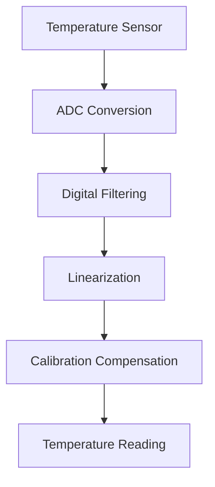
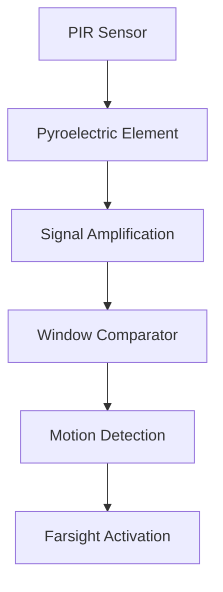
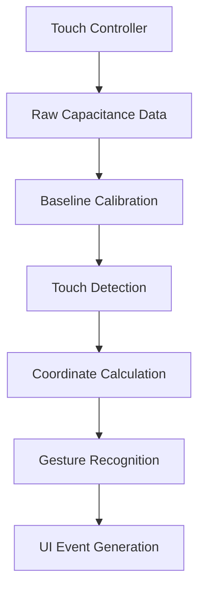

# Sensors

The Nest Learning Thermostat incorporates multiple sensors to monitor environmental conditions and user presence. These sensors provide the data necessary for intelligent temperature control and energy optimization.

## Sensor Overview

### Primary Sensors
- **Temperature**: NTC thermistor for ambient temperature
- **Humidity**: Capacitive humidity sensor
- **Motion**: Passive infrared (PIR) motion detector
- **Ambient Light**: Photodiode light sensor
- **Proximity**: Capacitive proximity sensing (integrated with touch)

### Sensor Specifications
| Sensor | Type | Accuracy | Range | Response Time |
|--------|------|----------|-------|---------------|
| Temperature | NTC Thermistor | ±0.5°C | 0-50°C | 2 minutes |
| Humidity | Capacitive | ±3% RH | 20-80% RH | 5 minutes |
| Motion | PIR | Detection only | 5m range | <1 second |
| Light | Photodiode | ±10% | 0-100k lux | <100ms |

## Temperature Sensing

### Sensor Technology
- **Type**: NTC (Negative Temperature Coefficient) thermistor
- **Resistance**: 10kΩ at 25°C
- **Beta Value**: 3950K
- **Package**: Surface mount with thermal pad
- **Calibration**: Individual factory calibration

### Measurement Process


### Temperature Compensation
- **Self-heating**: Algorithmic compensation for sensor self-heating
- **Drift Correction**: Long-term drift compensation
- **Environmental**: Ambient condition compensation
- **Multi-point**: Multiple calibration points for accuracy

### Performance Characteristics
- **Stability**: ±0.1°C/year drift
- **Repeatability**: ±0.1°C repeatability
- **Hysteresis**: <0.2°C thermal hysteresis
- **Power Consumption**: <1mW active power

## Humidity Sensing

### Sensor Technology
- **Type**: Capacitive polymer humidity sensor
- **Capacitance**: 180pF at 55% RH, 25°C
- **Temperature Coefficient**: -0.1% RH/°C
- **Package**: Surface mount with protective filter
- **Aging**: <0.5% RH/year

### Measurement Algorithm
```c
// Simplified humidity calculation
float calculate_humidity(float capacitance, float temperature) {
    // Base capacitance to RH conversion
    float rh_base = (capacitance - 180.0) * 0.5;
    
    // Temperature compensation
    float temp_compensation = (temperature - 25.0) * -0.1;
    
    // Apply calibration factors
    float rh_calibrated = rh_base + temp_compensation + calibration_offset;
    
    return constrain(rh_calibrated, 0.0, 100.0);
}
```

### Humidity Features
- **Condensation Resistance**: Operates in high humidity environments
- **Contamination Resistance**: Protective filter against dust
- **Fast Response**: Quick response to humidity changes
- **Low Power**: Ultra-low power consumption

## Motion Detection

### PIR Sensor Technology
- **Type**: Passive infrared motion detector
- **Elements**: Dual pyroelectric elements
- **Field of View**: 120° detection cone
- **Range**: 5 meters detection distance
- **Sensitivity**: Adjustable sensitivity levels

### Detection Principle


### Motion Processing
- **Signal Processing**: Digital filtering of PIR signals
- **False Rejection**: Algorithm to reject false triggers
- **Sensitivity Control**: Adaptive sensitivity adjustment
- **Power Saving**: Low-power polling mode

### Farsight Features
- **Wake-on-Approach**: Display activates when user approaches
- **Distance Detection**: Variable distance based on settings
- **Time-of-Day**: Different behavior during day/night
- **Learning**: Adapts to user patterns over time

## Ambient Light Sensing

### Light Sensor Technology
- **Type**: Silicon photodiode with integrated ADC
- **Spectral Response**: 530nm peak sensitivity
- **Dynamic Range**: 0-100,000 lux
- **Resolution**: 16-bit ADC resolution
- **Integration**: Automatic gain control

### Brightness Mapping
```c
// Brightness level calculation
int calculate_brightness_level(float lux) {
    // Logarithmic mapping for perceived linearity
    float normalized_lux = log10(lux + 1) / log10(100001);
    
    // Map to 40-100% brightness range
    int brightness = 40 + (int)(normalized_lux * 60);
    
    return constrain(brightness, 40, 100);
}
```

### Light Sensor Features
- **Auto-brightness**: Automatic display brightness adjustment
- **Day/Night Detection**: Automatic day/night mode switching
- **Energy Saving**: Reduced brightness in low light
- **User Override**: Manual brightness control available

## Touch and Proximity Sensing

### Capacitive Touch Technology
- **Type**: Projected capacitive touch controller
- **Channels**: Multiple touch channels
- **Resolution**: 12-bit ADC resolution
- **Sampling Rate**: 100Hz sampling frequency
- **Multi-touch**: Up to 5 simultaneous touch points

### Touch Processing Pipeline


### Touch Features
- **Rotary Input**: Circular ring for temperature adjustment
- **Button Press**: Center button for selection
- **Gesture Support**: Swipe gestures for navigation
- **Haptic Feedback**: Optional vibration feedback

## Sensor Fusion

### Data Integration
- **Temperature**: Primary control parameter
- **Humidity**: Comfort optimization
- **Motion**: Presence detection and energy saving
- **Light**: User interface optimization

### Sensor Calibration
- **Factory Calibration**: Individual sensor calibration
- **Field Calibration**: In-field calibration capabilities
- **Self-Calibration**: Automatic calibration routines
- **Compensation**: Cross-sensor compensation algorithms

### Quality Assurance
- **Sensor Validation**: Real-time sensor health monitoring
- **Data Validation**: Plausibility checking of sensor data
- **Fault Detection**: Automatic sensor fault detection
- **Fallback Modes**: Graceful degradation on sensor failure

## Power Management

### Sensor Power States
- **Active**: Full sampling rate and accuracy
- **Low Power**: Reduced sampling for battery operation
- **Sleep**: Minimal power consumption
- **Off**: Complete power down (rare)

### Power Optimization
- **Duty Cycling**: Intermittent sensor activation
- **Adaptive Sampling**: Variable sampling rates
- **Event-driven**: Sensor activation on events
- **Batch Processing**: Group sensor readings together

## Environmental Considerations

### Operating Conditions
- **Temperature**: 0-50°C operating range
- **Humidity**: 20-80% RH non-condensing
- **Altitude**: Up to 3,000 meters
- **Vibration**: 0.5g peak acceleration

### Protection Features
- **ESD Protection**: Electrostatic discharge protection
- **Overvoltage Protection**: Voltage spike protection
- **Reverse Polarity**: Reverse voltage protection
- **Surge Protection**: Electrical surge protection

## Performance Monitoring

### Sensor Health
- **Drift Monitoring**: Long-term drift tracking
- **Noise Analysis**: Signal noise monitoring
- **Response Time**: Sensor response time verification
- **Calibration Status**: Calibration validity tracking

### Diagnostic Features
- **Self-Test**: Built-in sensor self-test routines
- **BIST**: Built-in self-test on power-up
- **Loopback**: Sensor loopback testing
- **Performance Metrics**: Real-time performance monitoring

## Related Documentation

- [Hardware Overview](./overview.mdx)
- [Processor Details](./processor.mdx)
- [Display System](./display.mdx)
- [Thermostat Logic](../software/thermostat/overview.mdx)
