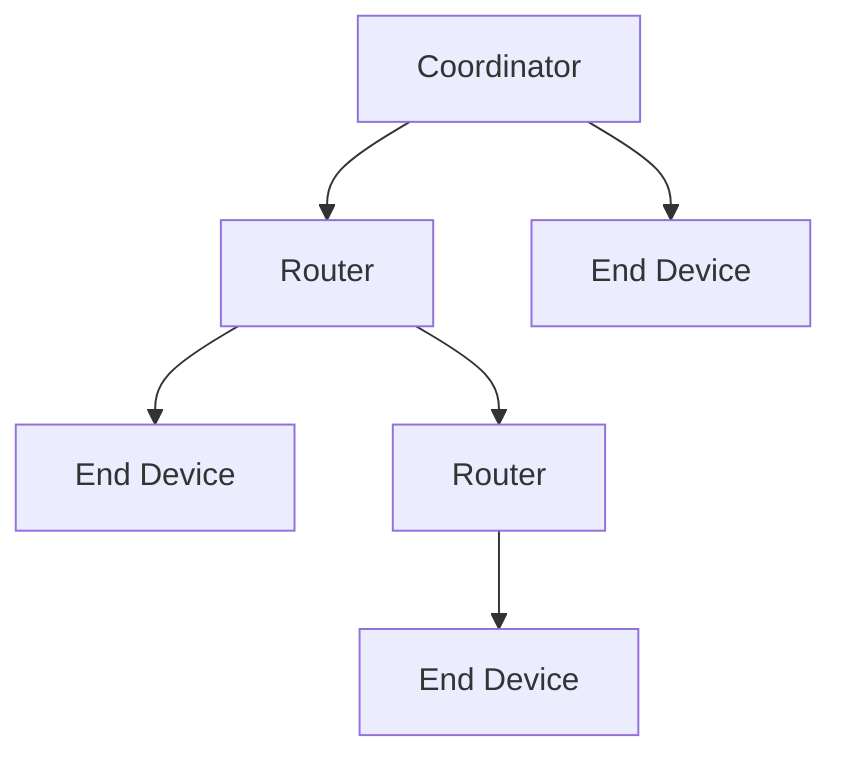
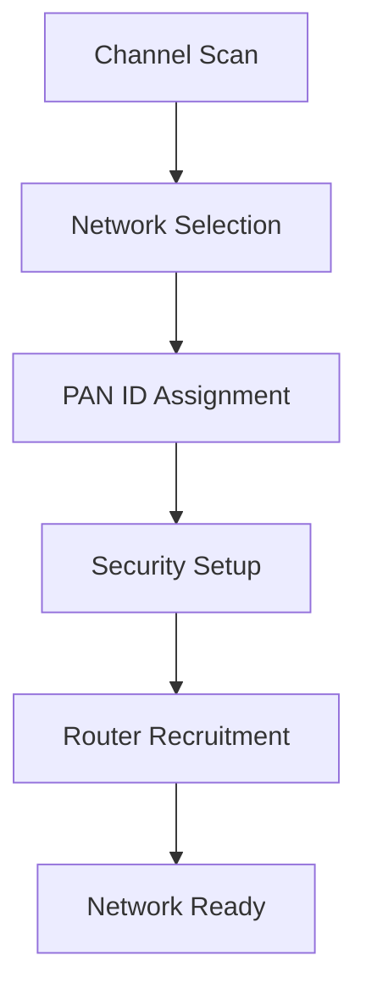

# Zigbee Interface

The Nest Learning Thermostat incorporates Zigbee wireless communication for connectivity with Heatlink and other smart home devices. Zigbee provides reliable, low-power mesh networking for home automation applications.

## Zigbee Overview

### Protocol Characteristics
- **Standard**: IEEE 802.15.4 physical layer, Zigbee PRO network layer
- **Frequency**: 2.4GHz ISM band (16 channels, 5MHz spacing)
- **Data Rate**: 250kbps nominal data rate
- **Range**: 10-100m indoor range, extended with mesh networking
- **Topology**: Mesh, star, and tree network topologies

### Key Features
- **Low Power**: Ultra-low power consumption
- **Mesh Networking**: Self-healing multi-hop network
- **Security**: AES-128 encryption and authentication
- **Scalability**: Support for 65,000+ devices per network
- **Reliability**: Reliable data delivery with acknowledgments

## Radio Hardware

### Radio Module
- **Chipset**: TI CC253x series or similar
- **Output Power**: +4.5dBm maximum output power
- **Receiver Sensitivity**: -97dBm typical sensitivity
- **Antenna**: Internal PCB antenna or external connector
- **Interface**: SPI or UART interface to host processor

### Radio Specifications
| Parameter | Value | Description |
|-----------|-------|-------------|
| Frequency Range | 2405-2480MHz | 2.4GHz ISM band |
| Channels | 11-26 | 16 available channels |
| Modulation | O-QPSK | Offset quadrature phase-shift keying |
| Spread Spectrum | DSSS | Direct sequence spread spectrum |
| Data Rate | 250kbps | Over-the-air data rate |

### Antenna Design
- **Type**: Meandered inverted-F antenna (MIFA)
- **Gain**: 2dBi typical antenna gain
- **VSWR**: <2:1 voltage standing wave ratio
- **Polarization**: Linear polarization
- **Efficiency**: >60% radiation efficiency

## Network Architecture

### Device Types


### Device Roles
- **Coordinator**: Network formation and management
- **Router**: Extends network range and routes traffic
- **End Device**: Low-power devices that sleep between transmissions

### Network Layers
- **Physical Layer**: Radio frequency transmission
- **MAC Layer**: Medium access control
- **Network Layer**: Routing and network management
- **Application Layer**: Application-specific profiles

## Network Configuration

### Network Parameters
```c
// Zigbee network configuration
typedef struct {
    uint16_t pan_id;         // Personal Area Network ID
    uint64_t extended_pan_id; // Extended PAN ID
    uint32_t channel_mask;   // Channel selection mask
    uint8_t network_key[16]; // Network encryption key
    uint8_t link_key[16];    // Link key for secure communication
    uint16_t short_addr;     // Device short address
    uint64_t ieee_addr;      // Device IEEE address
} zigbee_network_config_t;
```

### Channel Selection
- **Default Channels**: 15, 20, 25 (default selection)
- **Channel Scanning**: Automatic channel interference detection
- **Channel Hopping**: Dynamic channel switching capability
- **Regional Compliance**: Channel selection based on regional regulations

### Network Security
- **Network Key**: AES-128 network encryption key
- **Link Key**: Device-to-device link keys
- **Trust Center**: Centralized security management
- **Authentication**: Device authentication and authorization

## Communication Profiles

### Home Automation Profile
- **Profile ID**: 0x0104 (Home Automation)
- **Device Types**: Thermostat, temperature sensor, switch, dimmer
- **Clusters**: Basic, power configuration, temperature measurement
- **Attributes**: Device information, measurement values, control commands

### Nest-Specific Profile
- **Custom Clusters**: Nest-specific communication clusters
- **Heatlink Communication**: Dedicated Heatlink control cluster
- **Telemetry**: Device telemetry and diagnostic data
- **OTA Updates**: Over-the-air update mechanism

### Cluster Examples
```c
// Temperature measurement cluster
typedef struct {
    uint16_t cluster_id;        // 0x0402 for temperature
    int16_t measured_value;     // Temperature in 0.01°C
    uint16_t min_measured_value; // Minimum measured value
    uint16_t max_measured_value; // Maximum measured value
    uint16_t tolerance;         // Measurement tolerance
} temp_measurement_cluster_t;
```

## Power Management

### Power States
- **Active**: Radio active for transmission/reception
- **Idle**: Radio idle but powered on
- **Sleep**: Radio powered down for power saving
- **Deep Sleep**: Minimum power consumption state

### Power Consumption
| State | Current | Duration | Description |
|-------|---------|----------|-------------|
| Transmit | 25mA | Variable | Data transmission |
| Receive | 25mA | Variable | Data reception |
| Idle | 1mA | Continuous | Radio idle |
| Sleep | 1μA | Variable | Power saving |

### Battery Optimization
- **Duty Cycling**: Intermittent radio activation
- **Beacon Tracking**: Synchronized wake-up intervals
- **Polling Control**: Optimized polling intervals
- **Sleep Optimization**: Aggressive sleep policies

## Network Management

### Network Formation


### Network Operations
- **Join Process**: Device joining and authentication
- **Leave Process**: Secure device removal
- **Route Discovery**: Dynamic route establishment
- **Network Repair**: Automatic network healing

### Quality of Service
- **Reliability**: Acknowledged and unacknowledged transmission
- **Priority**: Message priority levels
- **Retransmission**: Automatic retransmission on failure
- **Flow Control**: Network congestion control

## Performance Optimization

### Range Optimization
- **Transmission Power**: Adaptive power control
- **Data Rate**: Variable data rate selection
- **Antenna Tuning**: Optimal antenna matching
- **Path Loss**: Path loss compensation

### Throughput Optimization
- **Packet Size**: Optimal packet size selection
- **Compression**: Data compression for efficiency
- **Aggregation**: Message aggregation techniques
- **Scheduling**: Efficient transmission scheduling

### Latency Optimization
- **Beacon Interval**: Optimized beacon timing
- **Superframe Structure**: Efficient superframe configuration
- **Contention Window**: Optimized contention parameters
- **Priority Queuing**: Message priority handling

## Interference Management

### Interference Sources
- **Wi-Fi**: 2.4GHz Wi-Fi network interference
- **Bluetooth**: Bluetooth device interference
- **Microwave**: Microwave oven interference
- **Other Zigbee**: Co-channel interference from other networks

### Mitigation Techniques
- **Channel Selection**: Intelligent channel selection
- **Frequency Hopping**: Dynamic frequency hopping
- **Power Control**: Adaptive transmission power
- **Error Correction**: Forward error correction

### Coexistence Features
- **Clear Channel Assessment**: Channel activity detection
- **Collision Avoidance**: Collision avoidance mechanisms
- **Adaptive Backoff**: Adaptive backoff algorithms
- **Interference Detection**: Real-time interference monitoring

## Development and Testing

### Development Tools
- **Sniffer**: Zigbee packet sniffing tools
- **Analyzer**: Network analysis and debugging
- **Simulator**: Network simulation environment
- **Debugger**: On-device debugging capabilities

### Testing Procedures
- **Range Testing**: Real-world range verification
- **Interference Testing**: Interference immunity testing
- **Power Testing**: Power consumption verification
- **Reliability Testing**: Long-term reliability testing

### Certification
- **Zigbee Alliance**: Zigbee certification program
- **Regulatory**: FCC, CE, and other regulatory approvals
- **Interoperability**: Multi-vendor interoperability testing
- **Compliance**: Standard compliance verification

## Troubleshooting

### Common Issues
- **Connection Loss**: Intermittent connection problems
- **Poor Range**: Reduced communication range
- **High Power**: Excessive power consumption
- **Interference**: Network interference issues

### Diagnostic Tools
- **Signal Strength**: RSSI measurement and monitoring
- **Packet Loss**: Packet loss statistics
- **Network Topology**: Network topology visualization
- **Error Rates**: Bit error rate monitoring

### Resolution Strategies
- **Channel Change**: Switch to less congested channel
- **Router Addition**: Add routers for range extension
- **Power Adjustment**: Adjust transmission power
- **Antenna Optimization**: Optimize antenna placement

## Related Documentation

- [Hardware Overview](./overview.mdx)
- [Heatlink Interface](./heatlink.mdx)
- [Network Connectivity](../software/network/overview.mdx)
- [Communication Protocols](../reference/protocols.mdx)
