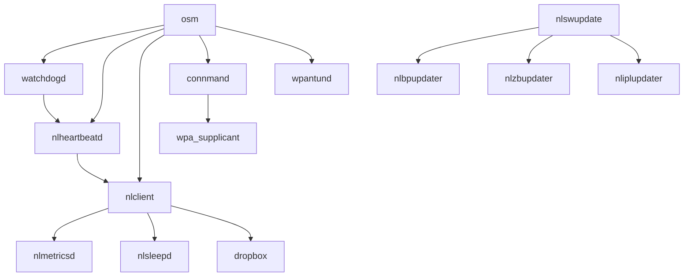

# Software Components

The Nest Thermostat runs a sophisticated software stack with multiple daemons, services, and utilities.

## Core Application

### nlclient (4.9MB)
**Location**: `/nestlabs/sbin/nlclient`

**Purpose**: Main thermostat application

**Responsibilities**:
- Thermostat control logic
- Sensor data processing and fusion
- Schedule management and learning
- Auto-away occupancy detection
- Temperature prediction (time-to-temp)
- HVAC control and optimization
- Energy statistics tracking
- Cloud communication via Weave protocol
- User interface management
- Display rendering

**Key Features**:
- Multi-stage HVAC support (heating, cooling, auxiliary, emergency)
- Radiant heating control
- Dehumidification management
- Sunlight correction algorithms
- Demand response integration
- Time-of-use rate optimization
- Remote sensor coordination
- Recovery state management

## System Services

### osm - Open Service Manager
**Location**: `/nestlabs/sbin/osm`

**Purpose**: Service orchestration and lifecycle management

**Responsibilities**:
- Start/stop system services
- Service dependency management
- State machine coordination
- System state transitions (boot, init, running, update, recovery)
- Service health monitoring

### watchdogd - Watchdog Daemon
**Location**: `/nestlabs/sbin/watchdogd`

**Purpose**: System health monitoring and recovery

**Responsibilities**:
- Hardware watchdog timer management
- Process health checks
- Automatic system recovery on hang/crash
- Heartbeat monitoring coordination

### nlheartbeatd - Heartbeat Daemon
**Location**: `/nestlabs/sbin/nlheartbeatd`

**Purpose**: Service-level health monitoring

**Responsibilities**:
- Monitor critical service heartbeats
- Detect service failures
- Trigger recovery actions
- Report health status to watchdogd

### nlmetricsd - Metrics Daemon
**Location**: `/nestlabs/sbin/nlmetricsd`

**Purpose**: System metrics collection and reporting

**Responsibilities**:
- Collect performance metrics
- Monitor resource usage (CPU, memory, disk)
- Track system events
- Aggregate metrics for cloud upload

### nlsleepd - Sleep Management Daemon
**Location**: `/nestlabs/sbin/nlsleepd`

**Purpose**: Power management and sleep coordination

**Responsibilities**:
- Coordinate system sleep states
- Manage wake events
- Optimize power consumption
- Schedule periodic wake-ups

### nlshutdownd - Shutdown Daemon
**Location**: `/nestlabs/sbin/nlshutdownd`

**Purpose**: Graceful shutdown coordination

**Responsibilities**:
- Coordinate clean shutdown
- Ensure data persistence
- Notify services of shutdown
- Manage shutdown sequence

### dropbox - Upload Service
**Location**: `/nestlabs/sbin/dropbox`

**Purpose**: Log and data upload to cloud

**Responsibilities**:
- Stage files for upload in `/media/scratch/`
- Upload logs and crash dumps
- Upload metrics and diagnostics
- Manage upload queue and retry logic

## Network Services

### connmand - Connection Manager
**Purpose**: Network connection management

**Responsibilities**:
- WiFi connection management
- Network profile management
- DHCP client
- DNS configuration
- Network state tracking

### wpa_supplicant - WiFi Authentication
**Purpose**: WPA/WPA2 authentication

**Responsibilities**:
- WiFi security protocols
- Network authentication
- Key management
- Roaming support

### wpantund - LowPAN Daemon
**Purpose**: 6LoWPAN/ZigBee networking

**Responsibilities**:
- 802.15.4 radio management
- ZigBee protocol stack
- Thread networking (6LoWPAN)
- Local device mesh networking
- Communication with remote sensors and accessories

## Update Services

### nlswupdate - Software Update Manager
**Location**: `/nestlabs/sbin/nlswupdate`

**Purpose**: Main firmware update orchestration

**Responsibilities**:
- Download firmware updates
- Verify update signatures
- Coordinate update installation
- Manage update rollback
- Multi-tier recovery on failure

### nlbpupdater - Backplate Updater
**Location**: `/nestlabs/sbin/nlbpupdater`

**Purpose**: Update backplate microcontroller firmware

**Responsibilities**:
- Flash backplate firmware
- Verify backplate version
- Coordinate with main update process

### nlzbupdater - ZigBee Updater
**Location**: `/nestlabs/sbin/nlzbupdater`

**Purpose**: Update ZigBee radio firmware

**Responsibilities**:
- Flash ZigBee radio firmware
- Verify radio version
- Maintain radio configuration

### nliplupdater - IPL Updater
**Location**: `/nestlabs/sbin/nliplupdater`

**Purpose**: Update Initial Program Loader (bootloader)

**Responsibilities**:
- Flash bootloader updates
- Ensure bootloader integrity
- Critical low-level updates

## Recovery & Diagnostics

### client_recovery
**Location**: `/nestlabs/sbin/client_recovery`

**Purpose**: Client application recovery

**Responsibilities**:
- Detect nlclient failures
- Restore from recovery state
- Rebuild corrupted data
- Fallback to safe defaults

### configcoredump
**Location**: `/nestlabs/sbin/configcoredump`

**Purpose**: Core dump configuration

**Responsibilities**:
- Configure core dump generation
- Manage core dump storage
- Prepare dumps for upload

### monit-resource-logger
**Location**: `/nestlabs/sbin/monit-resource-logger`

**Purpose**: Resource usage logging

**Responsibilities**:
- Log CPU usage
- Log memory usage
- Track resource trends
- Detect resource exhaustion

### nand_ecc_check
**Location**: `/nestlabs/sbin/nand_ecc_check`

**Purpose**: NAND flash error checking

**Responsibilities**:
- Check flash ECC errors
- Monitor flash health
- Predict flash failures

## Utility Programs

### wirelessregcal
**Location**: `/nestlabs/bin/wirelessregcal`

**Purpose**: Wireless regulatory calibration

**Responsibilities**:
- WiFi regulatory domain configuration
- Transmit power calibration
- Channel restrictions

### zb-loader
**Location**: `/nestlabs/bin/zb-loader`

**Purpose**: ZigBee firmware loader

**Responsibilities**:
- Load ZigBee firmware to radio
- Bootstrap ZigBee stack

### upgrade-ip-modem-app
**Location**: `/nestlabs/sbin/upgrade-ip-modem-app`

**Purpose**: IP modem application upgrade

**Responsibilities**:
- Update modem firmware (if present)
- Manage modem configuration

### nlheartbeat
**Location**: `/nestlabs/sbin/nlheartbeat`

**Purpose**: Heartbeat utility

**Responsibilities**:
- Send heartbeat signals
- Test heartbeat infrastructure

## Shared Libraries

### Core Libraries

#### libnlsystem.so
**Purpose**: System utilities and abstractions

**Functions**:
- File I/O wrappers
- Process management
- System calls abstraction
- Error handling

#### libnlnetworkmanager.so
**Purpose**: Network management

**Functions**:
- Network interface control
- Connection management
- Network state tracking

#### libnlweavetools.a
**Purpose**: Weave protocol implementation

**Functions**:
- Weave message encoding/decoding
- Secure communication
- Device pairing
- Service discovery
- Group key management

#### libnlapputils.so
**Purpose**: Application utilities

**Functions**:
- Common application functions
- Data structure utilities
- Algorithm implementations

#### libnldbus.so
**Purpose**: D-Bus integration

**Functions**:
- D-Bus client/server
- Inter-process communication
- Service discovery

#### libnlmetrics.so
**Purpose**: Metrics collection

**Functions**:
- Metric recording
- Metric aggregation
- Metric formatting

### Third-Party Libraries

#### libVersion.so
**Purpose**: Version information management

#### libNuovationsUtilities.so
**Purpose**: Core utilities (Nuovations vendor library)

#### libUrlAccess.so
**Purpose**: HTTP/HTTPS client

**Functions**:
- URL fetching
- HTTP requests
- HTTPS with TLS

#### libArchive.so
**Purpose**: Archive handling

**Functions**:
- TAR archive creation/extraction
- Compression support
- Update package handling

## Service Dependencies

## Process Communication

### D-Bus
Primary IPC mechanism for service coordination:
- System bus for system services
- Service discovery
- Signal/method calls

### Shared Memory
High-performance data sharing:
- Sensor data
- Display buffers

### Files
Persistent state and configuration:
- JSON configuration files
- Binary recovery files
- Log files

## Resource Usage

### Memory
- **nlclient**: ~50-100MB (primary consumer)
- **System services**: ~5-10MB each
- **Total system**: ~200MB RAM available

### CPU
- **Idle**: <5% CPU usage
- **Active UI**: 10-30% CPU usage
- **Updates**: 50-80% CPU usage

### Storage
- **Root**: 26.7MB / 46MB (58%)
- **Data**: 1.2MB / 20MB (6%)
- **Logs**: 892KB / 20MB (4%)
- **Scratch**: 3.4MB / 92MB (4%)

<Info>
  The modular architecture enables independent updates, recovery, and debugging of individual components while maintaining system stability.
</Info>
