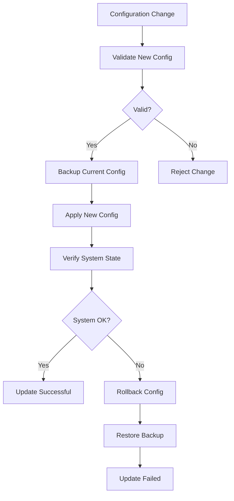

# Configuration Files

The Nest Learning Thermostat uses a structured configuration system with JSON-based configuration files for system settings, user preferences, and operational parameters. This document details the configuration file formats, locations, and management.

## Configuration File Organization

### File Locations
- **System Config**: `/media/system-config/` - System-level configuration
- **User Config**: `/media/user-config/` - User preferences and settings
- **Runtime Config**: `/media/data/` - Runtime configuration and state
- **Backup Config**: `/media/data/backups/` - Configuration backups

### File Structure
```
/media/system-config/
├── system.json              # Main system configuration
├── hardware.json            # Hardware settings
├── network.json             # Network configuration
├── security.json            # Security settings
└── calibration.json         # Hardware calibration

/media/user-config/
├── preferences.json         # User preferences
├── schedule.json            # Temperature schedules
├── energy.json              # Energy settings
├── display.json             # Display settings
└── locales.json             # Localization settings
```

## System Configuration Files

### system.json
Main system configuration file containing core system settings.

```json
{
  "version": "5.9.3",
  "build": "20231115-001",
  "device_id": "nest-thermostat-001122334455",
  "model": "4th Generation",
  "hardware_revision": "4.0",
  "timezone": "America/New_York",
  "ntp_servers": [
    "pool.ntp.org",
    "time.nist.gov"
  ],
  "logging": {
    "level": "info",
    "max_file_size": "10MB",
    "max_files": 5,
    "remote_logging": true
  },
  "updates": {
    "auto_update": true,
    "check_interval": 86400,
    "update_channel": "stable"
  },
  "security": {
    "secure_boot": true,
    "encryption_enabled": true,
    "certificate_validation": "strict"
  }
}
```

### hardware.json
Hardware-specific configuration and calibration data.

```json
{
  "display": {
    "type": "circular_lcd",
    "resolution": {
      "width": 320,
      "height": 320
    },
    "brightness": {
      "min": 40,
      "max": 100,
      "default": 70,
      "auto_brightness": true
    },
    "rotation": 0,
    "color_profile": "srgb"
  },
  "sensors": {
    "temperature": {
      "type": "ntc_thermistor",
      "calibration_offset": -0.2,
      "sampling_rate": 5,
      "filter_coefficient": 0.1
    },
    "humidity": {
      "type": "capacitive",
      "calibration_offset": 2.0,
      "sampling_rate": 30,
      "filter_coefficient": 0.05
    },
    "motion": {
      "type": "pir",
      "sensitivity": "medium",
      "detection_range": 5.0,
      "cooldown_period": 30
    },
    "light": {
      "type": "photodiode",
      "calibration_factor": 1.0,
      "sampling_rate": 10
    }
  },
  "touch": {
    "type": "capacitive",
    "sensitivity": "normal",
    "gesture_timeout": 1000,
    "multi_touch": true
  }
}
```

### network.json
Network configuration for Wi-Fi, Zigbee, and cloud connectivity.

```json
{
  "wifi": {
    "enabled": true,
    "scan_interval": 300,
    "connection_timeout": 30,
    "power_save": true,
    "preferred_networks": [
      {
        "ssid": "HomeNetwork",
        "priority": 1,
        "auto_connect": true
      }
    ],
    "security": {
      "wpa2_enabled": true,
      "wpa3_enabled": true,
      "enterprise_auth": false
    }
  },
  "zigbee": {
    "enabled": true,
    "channel": 15,
    "pan_id": "0x1234",
    "network_key": "encrypted_key_here",
    "coordinator": true,
    "permit_join": false
  },
  "weave": {
    "enabled": true,
    "device_id": "nest-device-001",
    "certificate_id": "cert-001",
    "pairing_code": "1234-5678",
    "cloud_endpoint": "https://api.nest.com/weave"
  },
  "cloud": {
    "enabled": true,
    "endpoint": "https://api.nest.com",
    "api_version": "v1",
    "auth_token": "encrypted_token",
    "sync_interval": 300,
    "telemetry_enabled": true
  }
}
```

## User Configuration Files

### preferences.json
User preferences and personalization settings.

```json
{
  "temperature": {
    "units": "fahrenheit",
    "display_precision": 1,
    "rounding": "nearest"
  },
  "interface": {
    "language": "en_US",
    "time_format": "12h",
    "date_format": "MM/DD/YYYY",
    "animations_enabled": true,
    "sound_enabled": true,
    "haptic_feedback": true
  },
  "display": {
    "brightness_mode": "auto",
    "manual_brightness": 75,
    "sleep_timeout": 60,
    "farsight_enabled": true,
    "farsight_content": "time"
  },
  "energy": {
    "eco_mode": true,
    "eco_temperature_heat": 62,
    "eco_temperature_cool": 84,
    "leaf_enabled": true,
    "demand_response": true
  },
  "privacy": {
    "data_collection": true,
    "usage_analytics": true,
    "remote_access": true,
    "location_sharing": false
  }
}
```

### schedule.json
Temperature scheduling configuration.

```json
{
  "version": "1.0",
  "enabled": true,
  "auto_schedule": true,
  "learning_enabled": true,
  "schedules": {
    "heating": {
      "monday": [
        {
          "time": "06:30",
          "temperature": 70,
          "mode": "home"
        },
        {
          "time": "08:00",
          "temperature": 62,
          "mode": "away"
        },
        {
          "time": "17:00",
          "temperature": 70,
          "mode": "home"
        },
        {
          "time": "22:00",
          "temperature": 64,
          "mode": "sleep"
        }
      ],
      "tuesday": [
        {
          "time": "06:30",
          "temperature": 70,
          "mode": "home"
        }
      ]
    },
    "cooling": {
      "monday": [
        {
          "time": "06:30",
          "temperature": 76,
          "mode": "home"
        },
        {
          "time": "08:00",
          "temperature": 84,
          "mode": "away"
        },
        {
          "time": "17:00",
          "temperature": 76,
          "mode": "home"
        },
        {
          "time": "22:00",
          "temperature": 78,
          "mode": "sleep"
        }
      ]
    }
  },
  "away_mode": {
    "enabled": true,
    "auto_away": true,
    "away_temperature_heat": 62,
    "away_temperature_cool": 84,
    "presence_sensors": ["motion", "phone"]
  }
}
```

### energy.json
Energy management and optimization settings.

```json
{
  "eco_mode": {
    "enabled": true,
    "heat_temperature": 62,
    "cool_temperature": 84,
    "auto_switch": true,
    "learning_enabled": true
  },
  "leaf": {
    "enabled": true,
    "threshold_heat": 68,
    "threshold_cool": 78,
    "display_leaf": true,
    "learning_adaptation": true
  },
  "demand_response": {
    "enabled": true,
    "participation": "auto",
    "utility_provider": "default",
    "event_handling": "auto_participate",
    "max_load_reduction": 50
  },
  "time_of_use": {
    "enabled": false,
    "provider": "none",
    "peak_hours": [],
    "off_peak_hours": [],
    "rate_schedule": {}
  },
  "sunlight_correction": {
    "enabled": true,
    "learning_enabled": true,
    "correction_factor": 1.0,
    "confidence_threshold": 0.8
  },
  "true_radiant": {
    "enabled": true,
    "preheat_time": 30,
    "temperature_overshoot": 2,
    "learning_enabled": true
  }
}
```

## Runtime Configuration

### runtime_state.json
Current system state and runtime parameters.

```json
{
  "timestamp": "2023-11-15T10:30:00Z",
  "system": {
    "uptime": 172800,
    "free_memory": 134217728,
    "cpu_usage": 15.5,
    "storage_usage": {
      "total": 2147483648,
      "used": 1073741824,
      "free": 1073741824
    }
  },
  "thermostat": {
    "current_temperature": 68.5,
    "target_temperature": 70.0,
    "mode": "heat",
    "state": "heating",
    "humidity": 45.2,
    "fan_state": "auto"
  },
  "sensors": {
    "temperature_sensor": {
      "last_reading": 68.5,
      "last_update": "2023-11-15T10:30:00Z",
      "status": "normal"
    },
    "humidity_sensor": {
      "last_reading": 45.2,
      "last_update": "2023-11-15T10:29:30Z",
      "status": "normal"
    },
    "motion_sensor": {
      "last_detection": "2023-11-15T09:15:00Z",
      "status": "no_motion"
    }
  },
  "network": {
    "wifi": {
      "connected": true,
      "ssid": "HomeNetwork",
      "signal_strength": -45,
      "ip_address": "192.168.1.100"
    },
    "cloud": {
      "connected": true,
      "last_sync": "2023-11-15T10:29:00Z",
      "status": "online"
    }
  }
}
```

## Configuration Management

### Configuration Schema
JSON schemas provide validation and structure for configuration files.

```json
{
  "$schema": "http://json-schema.org/draft-07/schema#",
  "title": "Nest Thermostat Configuration",
  "type": "object",
  "properties": {
    "version": {
      "type": "string",
      "pattern": "^\\d+\\.\\d+\\.\\d+$"
    },
    "device_id": {
      "type": "string",
      "pattern": "^nest-thermostat-[0-9a-f]{12}$"
    },
    "temperature": {
      "type": "object",
      "properties": {
        "units": {
          "type": "string",
          "enum": ["fahrenheit", "celsius"]
        },
        "display_precision": {
          "type": "integer",
          "minimum": 0,
          "maximum": 2
        }
      },
      "required": ["units"]
    }
  },
  "required": ["version", "device_id"]
}
```

### Configuration API
Programmatic interface for configuration management.

```c
// Configuration management API
typedef struct {
    char *key;
    json_value_t *value;
    config_type_t type;
    validation_func_t validator;
} config_item_t;

// Load configuration from file
int load_config(const char *filename, json_value_t **config);

// Save configuration to file
int save_config(const char *filename, json_value_t *config);

// Get configuration value
int get_config_value(json_value_t *config, const char *key, 
                     json_value_t **value);

// Set configuration value
int set_config_value(json_value_t *config, const char *key, 
                     json_value_t *value);

// Validate configuration
int validate_config(json_value_t *config, json_schema_t *schema);
```

## Configuration Updates

### Update Process


### Atomic Updates
- **Temporary Files**: Write to temporary file first
- **Atomic Rename**: Atomic rename operation
- **Validation**: Post-write validation
- **Rollback**: Automatic rollback on failure

## Configuration Backup

### Backup Strategy
```bash
# Automatic backup configuration
{
  "backup": {
    "enabled": true,
    "interval": 86400,
    "max_backups": 10,
    "compression": true,
    "encryption": true,
    "cloud_backup": true
  }
}
```

### Backup Files
- **Timestamped Backups**: Files with timestamp in filename
- **Incremental Backups**: Only changed configuration
- **Full Backups**: Complete configuration backup
- **Cloud Backups**: Remote backup storage

## Configuration Security

### Access Control
- **File Permissions**: Restricted file permissions
- **User Access**: Only authorized user access
- **Service Access**: Service-specific access control
- **Audit Logging**: Configuration change logging

### Encryption
- **Sensitive Data**: Encryption of sensitive configuration
- **Key Management**: Secure key storage and management
- **Data Protection**: Protection of configuration data
- **Secure Transmission**: Secure transmission of configuration

## Troubleshooting

### Common Issues
- **Invalid JSON**: Malformed JSON syntax
- **Missing Fields**: Required configuration fields missing
- **Invalid Values**: Values outside allowed ranges
- **Permission Issues**: File permission problems

### Debug Commands
```bash
# Configuration validation
config-validator --file /media/user-config/preferences.json

# Configuration backup
config-backup --create --destination /media/data/backups/

# Configuration restore
config-restore --source /media/data/backups/config-20231115.json

# Configuration comparison
config-diff --file1 config-old.json --file2 config-new.json
```

## Related Documentation

- [Data Overview](./overview.mdx)
- [Thermostat Data](./thermostat-data.mdx)
- [User Settings](./user-settings.mdx)
- [Recovery Files](./recovery-files.mdx)
