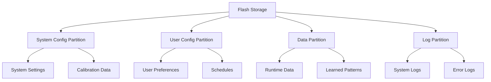

# Data Overview

The Nest Learning Thermostat manages various types of data including system configuration, user preferences, learned patterns, and operational data. This document provides a comprehensive overview of the data architecture and management systems.

## Data Architecture

### Data Categories
- **Configuration Data**: System and user configuration settings
- **Operational Data**: Runtime data and system state
- **Learned Data**: Machine learning data and user patterns
- **Log Data**: System logs and diagnostic information
- **Temporary Data**: Cache and temporary working data

### Storage Hierarchy


## Filesystem Structure

### Partition Layout
```
/dev/mtdblock0  - Boot partition (read-only)
/dev/mtdblock1  - Root filesystem (read-write)
/dev/mtdblock2  - System configuration (read-write)
/dev/mtdblock3  - User configuration (read-write)
/dev/mtdblock4  - Runtime data (read-write)
/dev/mtdblock5  - Log storage (read-write)
/dev/mtdblock6  - Recovery partition (read-only)
```

### Mount Points
- **/media/system-config**: System-level configuration
- **/media/user-config**: User preferences and settings
- **/media/data**: Runtime data and temporary files
- **/media/log**: System and application logs
- **/media/scratch**: Temporary working space

## Configuration Data

### System Configuration
- **Hardware Settings**: Hardware-specific configuration
- **Network Settings**: Network and connectivity configuration
- **Service Settings**: System service configuration
- **Security Settings**: Security and authentication settings

### User Configuration
- **Temperature Preferences**: User temperature preferences
- **Schedule Settings**: Heating and cooling schedules
- **Energy Settings**: Energy-saving preferences
- **Display Settings**: Display and interface preferences

### Configuration Files
```bash
# System configuration examples
/etc/system/config.json          # Main system configuration
/etc/network/wifi-config.json    # Wi-Fi network configuration
/etc/security/certs.json         # Security certificates
/etc/hardware/calibration.json   # Hardware calibration data

# User configuration examples
/media/user-config/preferences.json    # User preferences
/media/user-config/schedule.json       # Temperature schedules
/media/user-config/energy.json         # Energy settings
/media/user-config/display.json        # Display settings
```

## Data Management

### Data Persistence
- **Flash Storage**: NAND flash for persistent storage
- **Wear Leveling**: Flash wear leveling algorithms
- **Error Correction**: Error detection and correction
- **Backup Systems**: Data backup and recovery

### Data Synchronization
- **Cloud Sync**: Configuration synchronization with cloud
- **Mobile Sync**: Mobile app synchronization
- **Backup Sync**: Local backup synchronization
- **Conflict Resolution**: Data conflict resolution

### Data Formats
- **JSON**: Primary configuration format
- **Binary**: Efficient binary data storage
- **Compressed**: Compressed data for storage efficiency
- **Encrypted**: Encrypted sensitive data

## Configuration System

### Configuration Manager
```c
// Configuration manager interface
typedef struct {
    char config_path[256];       // Configuration file path
    config_format_t format;      // Configuration file format
    validation_func_t validator; // Configuration validator
    backup_policy_t backup;      // Backup policy
} config_manager_t;

int load_configuration(config_manager_t *mgr, void *config);
int save_configuration(config_manager_t *mgr, void *config);
int validate_configuration(config_manager_t *mgr, void *config);
int backup_configuration(config_manager_t *mgr);
int restore_configuration(config_manager_t *mgr);
```

### Configuration Validation
- **Schema Validation**: JSON schema validation
- **Range Validation**: Value range checking
- **Dependency Validation**: Configuration dependency checking
- **Consistency Validation**: Configuration consistency checking

### Configuration Updates
- **Atomic Updates**: Atomic configuration updates
- **Rollback**: Configuration rollback capability
- **Version Control**: Configuration version management
- **Change Tracking**: Configuration change tracking

## User Data

### Preference Data
- **Temperature Units**: Celsius/Fahrenheit preference
- **Language Settings**: User interface language
- **Time Zone**: Local time zone configuration
- **Display Brightness**: Display brightness preferences

### Schedule Data
- **Heating Schedule**: Time-based heating schedule
- **Cooling Schedule**: Time-based cooling schedule
- **Away Schedule**: Away mode schedule
- **Vacation Schedule**: Vacation hold settings

### Energy Data
- **Eco Temperature**: Eco mode temperature settings
- **Leaf Threshold**: Energy leaf threshold settings
- **Demand Response**: Demand response participation
- **Time-of-Use**: Time-of-use electricity rates

## Learned Data

### Learning Algorithms
- **Schedule Learning**: Automatic schedule learning
- **Usage Pattern Learning**: User behavior pattern learning
- **Energy Optimization**: Energy usage optimization
- **Comfort Learning**: User comfort preference learning

### Learning Data Structure
```c
// Learning data structure
typedef struct {
    timestamp_t timestamp;       // Data timestamp
    float temperature;           // Temperature reading
    float humidity;              // Humidity reading
    bool occupancy;              // Occupancy detection
    user_action_t action;        // User action
    system_state_t state;        // System state
} learning_data_point_t;

typedef struct {
    learning_data_point_t *data; // Learning data array
    size_t data_count;           // Number of data points
    pattern_model_t model;       // Learned pattern model
    accuracy_t accuracy;         // Model accuracy
} learning_dataset_t;
```

### Pattern Recognition
- **Time Patterns**: Time-based usage patterns
- **Temperature Patterns**: Temperature preference patterns
- **Occupancy Patterns**: Occupancy detection patterns
- **Energy Patterns**: Energy consumption patterns

## Runtime Data

### System State
- **Current Temperature**: Current temperature readings
- **Target Temperature**: Current target temperature
- **System Mode**: Current operating mode
- **HVAC State**: HVAC system state

### Performance Data
- **Sensor Readings**: Real-time sensor data
- **Control Outputs**: Current control output values
- **Energy Consumption**: Real-time energy usage
- **System Performance**: Performance metrics

### Temporary Data
- **Cache Data**: Frequently accessed cached data
- **Working Data**: Temporary working files
- **Buffer Data**: Communication buffers
- **Session Data**: User session data

## Logging System

### Log Categories
- **System Logs**: System event logs
- **Application Logs**: Application-specific logs
- **Error Logs**: Error and exception logs
- **Debug Logs**: Debug and diagnostic logs

### Log Management
```c
// Log management structure
typedef struct {
    log_level_t level;           // Minimum log level
    log_format_t format;         // Log format
    rotation_policy_t rotation;  // Log rotation policy
    retention_policy_t retention; // Log retention policy
} log_config_t;

int log_message(log_config_t *config, log_level_t level, 
                const char *format, ...);
int rotate_logs(log_config_t *config);
int cleanup_old_logs(log_config_t *config);
int export_logs(log_config_t *config, const char *destination);
```

### Log Rotation
- **Size-based Rotation**: Rotate based on file size
- **Time-based Rotation**: Rotate based on time intervals
- **Compression**: Log file compression
- **Retention**: Log retention policies

## Data Security

### Encryption
- **Data at Rest**: Encrypted storage of sensitive data
- **Data in Transit**: Encrypted data transmission
- **Key Management**: Secure key management
- **Access Control**: Data access control

### Data Integrity
- **Checksums**: Data integrity checksums
- **Digital Signatures**: Digital signature verification
- **Audit Trails**: Data access audit trails
- **Tamper Detection**: Tamper detection mechanisms

### Privacy Protection
- **Data Minimization**: Collect only necessary data
- **Anonymization**: Data anonymization techniques
- **User Consent**: User consent management
- **Data Deletion**: Secure data deletion

## Performance Optimization

### Storage Optimization
- **Compression**: Data compression for storage efficiency
- **Deduplication**: Data deduplication techniques
- **Caching**: Frequently accessed data caching
- **Indexing**: Data indexing for fast access

### Access Optimization
- **Lazy Loading**: Load data only when needed
- **Batch Operations**: Batch data operations
- **Connection Pooling**: Database connection pooling
- **Query Optimization**: Optimized data queries

## Data Analytics

### Usage Analytics
- **Temperature Usage**: Temperature setting analytics
- **Energy Usage**: Energy consumption analytics
- **Schedule Usage**: Schedule adherence analytics
- **Feature Usage**: Feature utilization analytics

### Performance Analytics
- **System Performance**: System performance metrics
- **Reliability Analytics**: System reliability analysis
- **Error Analytics**: Error pattern analysis
- **User Behavior**: User behavior analysis

## Backup and Recovery

### Backup Strategies
- **Automatic Backup**: Scheduled automatic backups
- **Manual Backup**: User-initiated backups
- **Incremental Backup**: Incremental backup strategies
- **Cloud Backup**: Cloud backup integration

### Recovery Procedures
- **Data Recovery**: Data recovery procedures
- **System Recovery**: Complete system recovery
- **Configuration Recovery**: Configuration restoration
- **Emergency Recovery**: Emergency recovery procedures

## Data Migration

### Upgrade Migration
- **Configuration Migration**: Configuration data migration
- **User Data Migration**: User data preservation
- **Format Conversion**: Data format conversion
- **Compatibility**: Backward compatibility maintenance

### Device Migration
- **Device Transfer**: Data transfer between devices
- **Cloud Sync**: Cloud-based migration
- **Local Transfer**: Local data transfer
- **Validation**: Migration validation

## Related Documentation

- [Configuration Files](./configuration-files.mdx)
- [Thermostat Data](./thermostat-data.mdx)
- [Recovery Files](./recovery-files.mdx)
- [User Settings](./user-settings.mdx)
