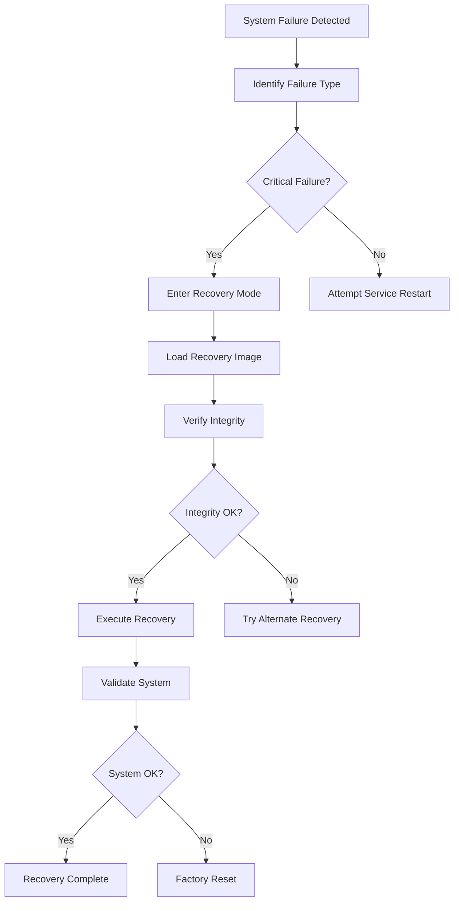

# Recovery Files

The Nest Learning Thermostat maintains comprehensive recovery files and backup data to ensure system reliability, disaster recovery, and service continuity. This document details the recovery file structures, backup mechanisms, and restoration procedures.

## Recovery Architecture

### Recovery Categories
- **System Recovery**: Complete system restoration capabilities
- **Configuration Recovery**: Configuration backup and restore
- **Data Recovery**: User data and learned patterns recovery
- **Firmware Recovery**: Firmware rollback and recovery mechanisms
- **Factory Recovery**: Factory reset and recovery procedures

### Recovery Storage Structure
```
/media/data/recovery/
├── system/
│   ├── full_backup_20231115.tar.gz
│   ├── config_backup_20231115.tar.gz
│   └── firmware_recovery.bin
├── user/
│   ├── preferences_backup.json
│   ├── schedule_backup.json
│   └── learning_data_backup.json
├── logs/
│   ├── system_logs_20231115.tar.gz
│   └── crash_logs_20231115.tar.gz
└── metadata/
    ├── backup_manifest.json
    ├── recovery_index.json
    └── integrity_checksums.json
```

## System Recovery Files

### Full System Backup
Complete system image including all partitions and configurations.

```c
// System backup structure
typedef struct {
    backup_header_t header;      // Backup header information
    partition_data_t partitions[MAX_PARTITIONS]; // Partition data
    system_config_t config;      // System configuration
    backup_metadata_t metadata;  // Backup metadata
} system_backup_t;

// Backup header
typedef struct {
    char magic[8];               // Backup magic number
    uint32_t version;            // Backup format version
    timestamp_t created;         // Backup creation timestamp
    uint64_t backup_size;        // Total backup size
    uint32_t checksum;           // Backup checksum
    compression_type_t compression; // Compression type
    encryption_type_t encryption; // Encryption type
} backup_header_t;

// Partition data
typedef struct {
    char partition_name[32];     // Partition name
    uint64_t partition_size;     // Partition size
    uint64_t data_offset;        // Data offset in backup
    uint32_t data_size;          // Compressed data size
    uint32_t original_size;      // Original uncompressed size
    partition_type_t type;       // Partition type
    uint32_t checksum;           // Partition checksum
} partition_data_t;
```

### Configuration Backup
System and user configuration backup for selective restoration.

```json
{
  "config_backup": {
    "version": "1.0",
    "created": "2023-11-15T10:30:00Z",
    "device_id": "nest-thermostat-001122334455",
    "backup_type": "configuration",
    "includes": [
      "system_config",
      "user_preferences",
      "network_settings",
      "calibration_data"
    ],
    "data": {
      "system_config": {
        "system.json": "encrypted_base64_data_here",
        "hardware.json": "encrypted_base64_data_here",
        "network.json": "encrypted_base64_data_here"
      },
      "user_config": {
        "preferences.json": "encrypted_base64_data_here",
        "schedule.json": "encrypted_base64_data_here",
        "energy.json": "encrypted_base64_data_here"
      }
    },
    "checksum": "sha256_checksum_here",
    "encrypted": true,
    "compression": "gzip"
  }
}
```

## User Data Recovery

### Preferences and Settings Backup
User preferences, schedules, and personalized settings backup.

```c
// User data backup structure
typedef struct {
    user_backup_header_t header; // User backup header
    preferences_data_t preferences; // User preferences
    schedule_data_t schedule;    // Schedule data
    learning_data_t learning;    // Learning data
    energy_data_t energy;        // Energy data
    backup_metadata_t metadata;  // Backup metadata
} user_data_backup_t;

// User backup header
typedef struct {
    char user_id[64];            // User identifier
    timestamp_t last_sync;       // Last cloud sync timestamp
    uint32_t data_version;       // Data format version
    uint64_t total_preferences; // Total preference entries
    uint64_t total_schedule_entries; // Total schedule entries
    uint64_t learning_data_size; // Learning data size
} user_backup_header_t;
```

### Learning Data Backup
Machine learning models and learned user patterns backup.

```json
{
  "learning_backup": {
    "version": "2.1",
    "created": "2023-11-15T10:30:00Z",
    "model_accuracy": 0.94,
    "training_days": 45,
    "data_points": 64800,
    "models": {
      "schedule_model": {
        "type": "neural_network",
        "accuracy": 0.92,
        "last_trained": "2023-11-15T02:00:00Z",
        "model_data": "encrypted_model_data_here"
      },
      "comfort_model": {
        "type": "decision_tree",
        "accuracy": 0.89,
        "last_trained": "2023-11-14T20:00:00Z",
        "model_data": "encrypted_model_data_here"
      }
    },
    "patterns": {
      "time_patterns": "encrypted_pattern_data_here",
      "temperature_preferences": "encrypted_preference_data_here",
      "occupancy_patterns": "encrypted_occupancy_data_here"
    }
  }
}
```

## Firmware Recovery

### Firmware Images
Recovery firmware images for rollback and emergency recovery.

```c
// Firmware recovery structure
typedef struct {
    firmware_header_t header;    // Firmware header
    firmware_components_t components; // Firmware components
    recovery_instructions_t instructions; // Recovery instructions
    integrity_data_t integrity;  // Integrity verification data
} firmware_recovery_t;

// Firmware header
typedef struct {
    char signature[16];          // Firmware signature
    uint32_t version;            // Firmware version
    uint64_t build_number;       // Build number
    timestamp_t build_date;      // Build date
    uint32_t image_size;         // Image size
    uint32_t checksum;           // Firmware checksum
    signature_t digital_signature; // Digital signature
} firmware_header_t;

// Firmware components
typedef struct {
    component_data_t bootloader; // Bootloader component
    component_data_t kernel;     // Kernel component
    component_data_t rootfs;     // Root filesystem component
    component_data_t applications; // Applications component
} firmware_components_t;
```

### Rollback Information
Firmware version history and rollback capabilities.

```json
{
  "firmware_rollback": {
    "current_version": "5.9.3",
    "current_build": "20231115-001",
    "available_versions": [
      {
        "version": "5.9.2",
        "build": "20231028-003",
        "stable": true,
        "rollback_available": true,
        "image_path": "/recovery/firmware_5.9.2.bin"
      },
      {
        "version": "5.9.1",
        "build": "20230915-002",
        "stable": true,
        "rollback_available": true,
        "image_path": "/recovery/firmware_5.9.1.bin"
      }
    ],
    "rollback_history": [
      {
        "timestamp": "2023-11-10T15:30:00Z",
        "from_version": "5.9.2",
        "to_version": "5.9.3",
        "reason": "scheduled_update",
        "success": true
      }
    ]
  }
}
```

## Log Recovery

### System Logs Backup
System and application logs for diagnostic and troubleshooting purposes.

```c
// Log backup structure
typedef struct {
    log_backup_header_t header;  // Log backup header
    log_category_t categories[MAX_LOG_CATEGORIES]; // Log categories
    log_entries_t entries;       // Log entries
    compression_info_t compression; // Compression information
} log_backup_t;

// Log backup header
typedef struct {
    timestamp_t backup_start;    // Backup start time
    timestamp_t backup_end;      // Backup end time
    uint32_t total_entries;      // Total log entries
    uint64_t uncompressed_size;  // Uncompressed size
    uint64_t compressed_size;    // Compressed size
    log_level_t min_level;       // Minimum log level
} log_backup_header_t;
```

### Crash and Error Logs
Critical error logs and crash dumps for system recovery.

```json
{
  "crash_logs": {
    "backup_date": "2023-11-15T10:30:00Z",
    "crash_count": 0,
    "error_count": 3,
    "critical_errors": [
      {
        "timestamp": "2023-11-14T22:15:30Z",
        "severity": "error",
        "component": "network_service",
        "error_code": "NET_CONN_TIMEOUT",
        "message": "Network connection timeout",
        "stack_trace": "stack_trace_here",
        "system_state": {
          "uptime": 86400,
          "memory_usage": 85.2,
          "cpu_usage": 95.5
        }
      }
    ],
    "warnings": [
      {
        "timestamp": "2023-11-15T09:30:15Z",
        "severity": "warning",
        "component": "sensor_service",
        "message": "Temperature sensor reading outside expected range"
      }
    ]
  }
}
```

## Recovery Procedures

### Automatic Recovery
System-initiated automatic recovery procedures.



### Manual Recovery
User or technician-initiated recovery procedures.

```c
// Manual recovery interface
typedef struct {
    recovery_options_t options;  // Available recovery options
    recovery_status_t status;    // Recovery status
    progress_callback_t progress; // Progress callback
    error_handler_t error_handler; // Error handler
} manual_recovery_t;

// Recovery options
typedef struct {
    bool full_system_restore;     // Full system restore option
    bool config_restore;          // Configuration restore option
    bool user_data_restore;       // User data restore option
    bool firmware_rollback;       // Firmware rollback option
    bool factory_reset;           // Factory reset option
} recovery_options_t;
```

## Recovery Metadata

### Backup Manifest
Comprehensive manifest of all available recovery files and their metadata.

```json
{
  "backup_manifest": {
    "version": "1.0",
    "created": "2023-11-15T10:30:00Z",
    "device_id": "nest-thermostat-001122334455",
    "total_backups": 15,
    "storage_used": "2.3GB",
    "storage_available": "5.7GB",
    "backups": [
      {
        "id": "backup_20231115_103000",
        "type": "full_system",
        "created": "2023-11-15T10:30:00Z",
        "size": "1.8GB",
        "checksum": "sha256_checksum_here",
        "encrypted": true,
        "compression": "gzip",
        "integrity": "verified"
      },
      {
        "id": "config_20231115_100000",
        "type": "configuration",
        "created": "2023-11-15T10:00:00Z",
        "size": "15MB",
        "checksum": "sha256_checksum_here",
        "encrypted": true,
        "compression": "gzip"
      }
    ]
  }
}
```

### Recovery Index
Indexed recovery information for quick access and restoration.

```c
// Recovery index structure
typedef struct {
    index_header_t header;       // Index header
    recovery_entry_t entries[MAX_ENTRIES]; // Recovery entries
    search_index_t search;       // Search index
    integrity_info_t integrity;  // Integrity information
} recovery_index_t;

// Recovery entry
typedef struct {
    char backup_id[64];          // Backup identifier
    backup_type_t type;          // Backup type
    timestamp_t created;         // Creation timestamp
    uint64_t size;               // Backup size
    char location[256];          // Storage location
    uint32_t checksum;           // Backup checksum
    bool verified;               // Verification status
} recovery_entry_t;
```

## Security and Integrity

### Backup Encryption
Encryption mechanisms for protecting recovery data.

```c
// Encryption configuration
typedef struct {
    encryption_algorithm_t algorithm; // Encryption algorithm
    encryption_key_t key;        // Encryption key
    key_derivation_t derivation; // Key derivation parameters
    integrity_protection_t integrity; // Integrity protection
} backup_encryption_t;

// Encryption algorithms
typedef enum {
    ENCRYPTION_AES256_GCM,       // AES-256 GCM mode
    ENCRYPTION_CHACHA20_POLY1305, // ChaCha20-Poly1305
    ENCRYPTION_AES256_CBC        // AES-256 CBC mode
} encryption_algorithm_t;
```

### Integrity Verification
Checksums and digital signatures for recovery file integrity.

```json
{
  "integrity_verification": {
    "verification_method": "sha256_digital_signature",
    "signature_algorithm": "RSA-2048",
    "certificate_id": "nest_recovery_cert_001",
    "checksums": {
      "backup_20231115_103000": "sha256_hash_here",
      "config_20231115_100000": "sha256_hash_here",
      "firmware_5.9.2": "sha256_hash_here"
    },
    "signatures": {
      "backup_20231115_103000": "digital_signature_here",
      "config_20231115_100000": "digital_signature_here"
    },
    "verification_status": "all_verified"
  }
}
```

## Recovery Automation

### Scheduled Backups
Automated backup scheduling and management.

```c
// Backup scheduling
typedef struct {
    schedule_config_t config;    // Schedule configuration
    backup_policy_t policy;      // Backup policy
    retention_policy_t retention; // Retention policy
    automation_stats_t stats;    // Automation statistics
} backup_automation_t;

// Schedule configuration
typedef struct {
    bool enabled;                // Scheduling enabled
    int full_backup_interval;    // Full backup interval (hours)
    int config_backup_interval;  // Config backup interval (hours)
    int log_backup_interval;     // Log backup interval (hours)
    time_window_t backup_window; // Backup time window
} schedule_config_t;
```

### Recovery Testing
Automated testing of recovery procedures and backup integrity.

```c
// Recovery testing framework
typedef struct {
    test_config_t config;        // Test configuration
    test_results_t results;      // Test results
    validation_criteria_t criteria; // Validation criteria
} recovery_testing_t;

// Test configuration
typedef struct {
    bool automated_testing;      // Automated testing enabled
    int test_interval;           // Test interval (hours)
    test_scope_t scope;          // Test scope
    notification_config_t notifications; // Notification config
} test_config_t;
```

## Troubleshooting Recovery

### Common Recovery Issues
- **Corrupted Backups**: Backup file corruption detection and handling
- **Insufficient Space**: Storage space management for recovery
- **Integrity Failures**: Backup integrity verification failures
- **Recovery Failures**: Recovery process failure analysis

### Recovery Diagnostics
Diagnostic tools and procedures for recovery system troubleshooting.

```bash
# Recovery diagnostic commands
recovery-tool --status          # Check recovery system status
recovery-tool --verify-backups  # Verify all backup integrity
recovery-tool --test-recovery   # Test recovery procedures
recovery-tool --cleanup         # Clean up old recovery files
recovery-tool --restore-config  # Restore configuration backup
```

## Related Documentation

- [Data Overview](./overview.mdx)
- [Configuration Files](./configuration-files.mdx)
- [Thermostat Data](./thermostat-data.mdx)
- [User Settings](./user-settings.mdx)
