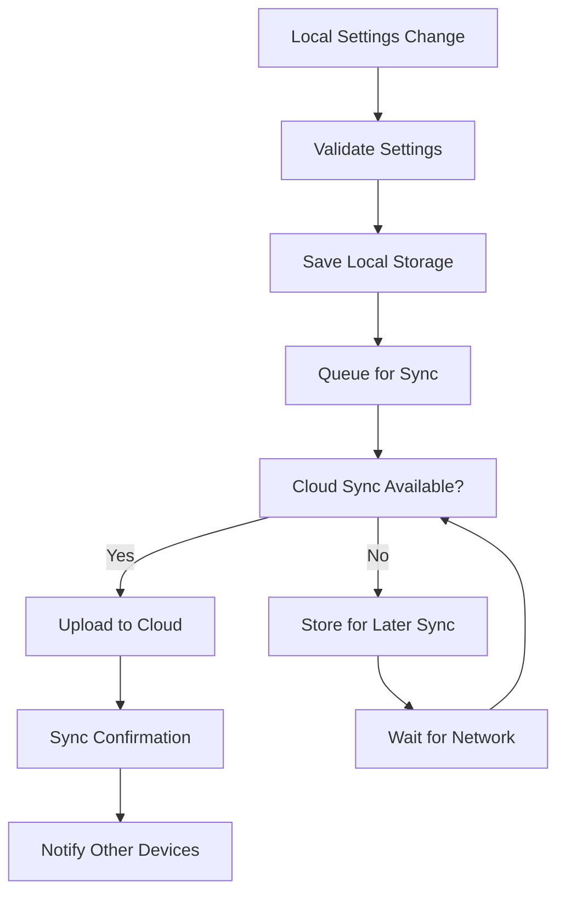

# User Settings

The Nest Learning Thermostat provides extensive user customization options through a comprehensive settings management system. This document details the user settings structure, management, and personalization features.

## Settings Architecture

### Settings Categories
- **Temperature Settings**: Temperature units, ranges, and display preferences
- **Interface Settings**: User interface customization and accessibility
- **Schedule Settings**: Heating and cooling schedule preferences
- **Energy Settings**: Energy-saving and eco mode preferences
- **Privacy Settings**: Data collection and privacy controls
- **Advanced Settings**: Technical and advanced configuration options

### Settings Storage Structure
```
/media/user-config/
├── preferences.json           # Main user preferences
├── temperature_settings.json  # Temperature-specific settings
├── interface_settings.json    # UI and display settings
├── schedule_settings.json     # Schedule preferences
├── energy_settings.json       # Energy management settings
├── privacy_settings.json      # Privacy and data settings
└── advanced_settings.json     # Advanced configuration
```

## Temperature Settings

### Temperature Units and Display
User preferences for temperature display and formatting.

```json
{
  "temperature_settings": {
    "units": {
      "display_units": "fahrenheit",
      "input_units": "fahrenheit",
      "conversion_behavior": "auto",
      "precision": {
        "display_precision": 1,
        "rounding_rule": "nearest"
      }
    },
    "display": {
      "show_decimals": false,
      "show_trend": true,
      "show_humidity": true,
      "show_outdoor": false,
      "color_coding": {
        "heating_color": "#FF6B35",
        "cooling_color": "#004E89",
        "eco_color": "#0D9373"
      }
    },
    "ranges": {
      "min_heat_setpoint": 50,
      "max_heat_setpoint": 90,
      "min_cool_setpoint": 60,
      "max_cool_setpoint": 85,
      "default_heat": 70,
      "default_cool": 76
    },
    "deadbands": {
      "heating_deadband": 1.0,
      "cooling_deadband": 1.0,
      "auto_deadband": true,
      "adaptive_deadband": true
    }
  }
}
```

### Temperature Preferences
Personalized temperature preferences and comfort settings.

```c
// Temperature preferences structure
typedef struct {
    temperature_units_t units;   // Temperature units
    display_preferences_t display; // Display preferences
    range_limits_t ranges;       // Temperature range limits
    deadband_settings_t deadbands; // Deadband settings
    comfort_preferences_t comfort; // Comfort preferences
} temperature_settings_t;

// Comfort preferences
typedef struct {
    float preferred_heat;        // Preferred heating temperature
    float preferred_cool;        // Preferred cooling temperature
    float sleep_temperature;     // Sleep temperature preference
    float away_temperature;      // Away temperature preference
    float comfort_range_heat;    // Comfort range for heating
    float comfort_range_cool;    // Comfort range for cooling
    bool adaptive_comfort;       // Adaptive comfort learning
} comfort_preferences_t;
```

## Interface Settings

### Display and Visual Settings
User interface customization and visual preferences.

```json
{
  "interface_settings": {
    "display": {
      "brightness": {
        "mode": "auto",
        "manual_level": 75,
        "auto_min": 40,
        "auto_max": 100,
        "sleep_brightness": 30,
        "farsight_brightness": 80
      },
      "screen": {
        "sleep_timeout": 60,
        "farsight_enabled": true,
        "farsight_content": "time",
        "animations_enabled": true,
        "transition_speed": "normal",
        "color_theme": "auto"
      }
    },
    "touch": {
      "sensitivity": "normal",
      "haptic_feedback": true,
      "touch_sounds": true,
      "gesture_recognition": true,
      "multi_touch": true
    },
    "accessibility": {
      "large_text": false,
      "high_contrast": false,
      "color_blind_mode": "none",
      "voice_prompts": false,
      "screen_reader": false
    }
  }
}
```

### Localization and Language
Multi-language support and regional settings.

```c
// Localization settings
typedef struct {
    language_settings_t language; // Language preferences
    regional_settings_t regional; // Regional settings
    time_settings_t time_format;  // Time format preferences
    locale_settings_t locale;     // Locale-specific settings
} localization_settings_t;

// Language settings
typedef struct {
    char primary_language[8];    // Primary language code
    char secondary_language[8];  // Secondary language code
    bool auto_detect;            // Auto-detect language
    translation_source_t source; // Translation source
} language_settings_t;
```

## Schedule Settings

### Schedule Preferences
User preferences for temperature scheduling and automation.

```json
{
  "schedule_settings": {
    "general": {
      "auto_schedule": true,
      "learning_enabled": true,
      "schedule_confidence_threshold": 0.8,
      "manual_override_timeout": 120,
      "smart_start": true,
      "early_start": true
    },
    "away_mode": {
      "auto_away": true,
      "away_detection_methods": ["motion", "phone"],
      "away_timeout": 60,
      "return_detection": true,
      "eco_temperatures": true,
      "away_schedule_override": false
    },
    "vacation_mode": {
      "auto_vacation": false,
      "vacation_detection": "geofence",
      "vacation_temperature_heat": 60,
      "vacation_temperature_cool": 80,
      "hold_until_return": true
    },
    "notifications": {
      "schedule_change_alerts": true,
      "away_mode_alerts": true,
      "energy_saving_alerts": true,
      "maintenance_reminders": true
    }
  }
}
```

### Learning and Adaptation
Machine learning preferences and adaptation settings.

```c
// Schedule learning settings
typedef struct {
    learning_config_t learning;  // Learning configuration
    adaptation_settings_t adaptation; // Adaptation settings
    prediction_settings_t prediction; // Prediction settings
    feedback_settings_t feedback; // User feedback settings
} schedule_learning_settings_t;

// Learning configuration
typedef struct {
    bool enabled;                // Learning enabled
    float confidence_threshold;  // Confidence threshold
    int min_data_points;         // Minimum data points for learning
    learning_rate_t rate;        // Learning rate
    model_complexity_t complexity; // Model complexity
} learning_config_t;
```

## Energy Settings

### Eco Mode and Energy Saving
Energy-saving preferences and eco mode configuration.

```json
{
  "energy_settings": {
    "eco_mode": {
      "enabled": true,
      "auto_eco": true,
      "eco_temperature_heat": 62,
      "eco_temperature_cool": 84,
      "eco_schedule": true,
      "learning_adaptation": true,
      "user_override_allowed": true
    },
    "leaf_program": {
      "enabled": true,
      "leaf_threshold_heat": 68,
      "leaf_threshold_cool": 78,
      "display_leaf": true,
      "leaf_challenges": true,
      "learning_adaptation": true
    },
    "demand_response": {
      "enabled": true,
      "participation_level": "auto",
      "utility_provider": "auto_detect",
      "max_load_reduction": 50,
      "user_notifications": true,
      "manual_override": true
    },
    "time_of_use": {
      "enabled": false,
      "provider": "none",
      "peak_hours": [],
      "off_peak_hours": [],
      "rate_optimization": true
    }
  }
}
```

### Advanced Energy Features
Advanced energy management and optimization settings.

```c
// Advanced energy settings
typedef struct {
    advanced_features_t advanced; // Advanced features
    optimization_settings_t optimization; // Optimization settings
    reporting_settings_t reporting; // Reporting settings
    integration_settings_t integration; // Third-party integration
} advanced_energy_settings_t;

// Optimization settings
typedef struct {
    bool sunlight_correction;   // Sunlight correction enabled
    bool true_radiant;          // True radiant enabled
    bool preheating_optimization; // Preheating optimization
    bool smart_fan;             // Smart fan control
    float efficiency_threshold; // Efficiency threshold
} optimization_settings_t;
```

## Privacy Settings

### Data Collection and Privacy
User privacy controls and data collection preferences.

```json
{
  "privacy_settings": {
    "data_collection": {
      "usage_data": true,
      "temperature_data": true,
      "schedule_data": true,
      "location_data": false,
      "voice_data": false,
      "analytics_data": true,
      "diagnostic_data": true
    },
    "sharing": {
      "cloud_sync": true,
      "mobile_app_access": true,
      "family_sharing": false,
      "utility_sharing": false,
      "third_party_apps": false,
      "research_participation": false
    },
    "retention": {
      "data_retention_days": 365,
      "anonymize_after_days": 90,
      "auto_cleanup": true,
      "export_data": true,
      "delete_on_request": true
    },
    "security": {
      "two_factor_auth": false,
      "device_approval": true,
      "session_timeout": 3600,
      "privacy_mode": false,
      "incognito_mode": false
    }
  }
}
```

### Security and Access
Security settings and access control preferences.

```c
// Privacy and security settings
typedef struct {
    data_collection_t collection; // Data collection settings
    sharing_preferences_t sharing; // Sharing preferences
    data_retention_t retention;   // Data retention settings
    security_settings_t security; // Security settings
} privacy_settings_t;

// Security settings
typedef struct {
    bool two_factor_enabled;    // Two-factor authentication
    bool device_approval;       // Device approval required
    int session_timeout;        // Session timeout in seconds
    bool privacy_mode;          // Privacy mode enabled
    bool incognito_mode;        // Incognito mode enabled
    access_log_t access_log;    // Access logging
} security_settings_t;
```

## Advanced Settings

### Technical Configuration
Advanced technical settings for power users and technicians.

```json
{
  "advanced_settings": {
    "system": {
      "debug_mode": false,
      "developer_options": false,
      "usb_debugging": false,
      "boot_log_enabled": false,
      "performance_monitoring": false
    },
    "network": {
      "static_ip_enabled": false,
      "dns_override": false,
      "vpn_enabled": false,
      "proxy_enabled": false,
      "advanced_wifi_settings": false
    },
    "hardware": {
      "fan_control_mode": "auto",
      "sensor_calibration_mode": "auto",
      "display_calibration": false,
      "touch_calibration": false,
      "advanced_power_settings": false
    },
    "experimental": {
      "beta_features": false,
      "experimental_algorithms": false,
      "early_access_updates": false,
      "diagnostic_mode": false
    }
  }
}
```

### Pro Settings
Professional installer and technician settings.

```c
// Professional settings
typedef struct {
    installer_settings_t installer; // Installer settings
    equipment_settings_t equipment; // Equipment configuration
    diagnostic_settings_t diagnostic; // Diagnostic settings
    calibration_settings_t calibration; // Calibration settings
} pro_settings_t;

// Installer settings
typedef struct {
    bool pro_mode_enabled;      // Pro mode enabled
    equipment_type_t equipment; // Equipment type
    wiring_configuration_t wiring; // Wiring configuration
    system_capacity_t capacity; // System capacity
    installation_date_t install_date; // Installation date
} installer_settings_t;
```

## Settings Management

### Settings API
Programmatic interface for settings management.

```c
// Settings management API
typedef struct {
    settings_category_t category; // Settings category
    settings_key_t key;          // Settings key
    settings_value_t value;      // Settings value
    validation_func_t validator; // Validation function
    change_callback_t callback;  // Change callback
} settings_item_t;

// Settings operations
int load_settings(const char *category, json_value_t **settings);
int save_settings(const char *category, json_value_t *settings);
int get_setting(const char *category, const char *key, 
                settings_value_t *value);
int set_setting(const char *category, const char *key, 
                settings_value_t value);
int reset_settings(const char *category);
int export_settings(const char *filename);
int import_settings(const char *filename);
```

### Settings Validation
Validation rules and constraints for user settings.

```c
// Settings validation
typedef struct {
    validation_type_t type;     // Validation type
    validation_range_t range;   // Valid range
    validation_enum_t enum_values; // Enumerated values
    pattern_t pattern;          // Regular expression pattern
    custom_validator_t custom;  // Custom validation function
} validation_rule_t;

// Validation functions
bool validate_temperature_range(float temperature, float min, float max);
bool validate_schedule_time(const char *time_str);
bool validate_brightness_level(int level);
bool validate_network_config(json_value_t *config);
bool validate_privacy_settings(json_value_t *settings);
```

## Settings Synchronization

### Cloud Sync
Settings synchronization with cloud services and mobile apps.



### Multi-Device Sync
Settings synchronization across multiple devices and platforms.

```c
// Multi-device synchronization
typedef struct {
    sync_config_t config;        // Sync configuration
    device_registry_t devices;   // Registered devices
    conflict_resolution_t resolution; // Conflict resolution
    sync_status_t status;        // Sync status
} multi_device_sync_t;

// Sync configuration
typedef struct {
    bool auto_sync;              // Automatic synchronization
    int sync_interval;           // Sync interval in seconds
    conflict_policy_t policy;    // Conflict resolution policy
    priority_t priorities[MAX_SETTINGS]; // Setting priorities
} sync_config_t;
```

## Settings Backup and Restore

### Backup Management
Settings backup and restoration capabilities.

```bash
# Settings backup commands
settings-backup --create --output settings_backup.json
settings-backup --restore --input settings_backup.json
settings-backup --list --show-details
settings-backup --schedule --interval daily
settings-backup --export --format csv --output settings.csv
```

### Migration Support
Settings migration during device upgrades and replacements.

```c
// Settings migration
typedef struct {
    migration_config_t config;  // Migration configuration
    version_mapping_t version_map; // Version mapping
    transformation_rules_t rules; // Transformation rules
    migration_results_t results; // Migration results
} settings_migration_t;

// Migration process
int migrate_settings_from_version(const char *from_version, 
                                  const char *to_version);
int transform_setting(const char *key, json_value_t *old_value, 
                      json_value_t **new_value);
int validate_migrated_settings(json_value_t *settings);
```

## Related Documentation

- [Data Overview](./overview.mdx)
- [Configuration Files](./configuration-files.mdx)
- [Thermostat Data](./thermostat-data.mdx)
- [Recovery Files](./recovery-files.mdx)
