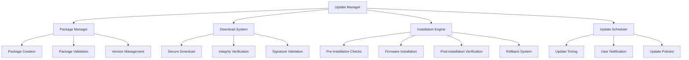

# Firmware Updates Overview

The Nest Learning Thermostat implements a comprehensive firmware update system for secure, reliable, and efficient software updates. This document provides an overview of the firmware update architecture and components.

## Update Architecture

### Core Components
- **Update Manager**: Central coordination of update processes
- **Package Management**: Firmware package creation and validation
- **Download System**: Secure firmware download and verification
- **Installation Engine**: Safe firmware installation and rollback
- **Update Scheduler**: Intelligent update scheduling and timing

### Update Framework


## Update Manager

### Update Coordination
Central coordination of all firmware update activities.

```c
// Update manager system
typedef struct {
    update_coordinator_t coordinator;      // Update coordinator
    update_state_t state;                  // Update state
    update_policy_t policy;                // Update policy
    update_monitoring_t monitoring;        // Update monitoring
} update_manager_t;

// Update coordinator
typedef struct {
    update_workflow_t workflow;            // Update workflow
    dependency_resolver_t resolver;        // Dependency resolver
    conflict_detector_t conflict;          // Conflict detection
    rollback_manager_t rollback;           // Rollback manager
} update_coordinator_t;

// Update state
typedef struct {
    update_phase_t current_phase;          // Current update phase
    update_status_t status;                // Update status
    version_info_t current_version;        // Current version info
    version_info_t target_version;         // Target version info
    update_progress_t progress;            // Update progress
    error_info_t last_error;               // Last error information
    timestamp_t update_start_time;         // Update start time
    timestamp_t estimated_completion;      // Estimated completion time
} update_state_t;

// Update management
update_result_t manage_firmware_update(update_manager_t *manager, 
                                      update_request_t *request) {
    update_coordinator_t *coordinator = &manager->coordinator;
    update_result_t result = {0};
    
    // Validate update request
    if (!validate_update_request(request, &manager->policy)) {
        result.status = UPDATE_STATUS_INVALID_REQUEST;
        return result;
    }
    
    // Initialize update state
    initialize_update_state(&manager->state, request);
    
    // Execute update workflow
    result = execute_update_workflow(coordinator, request);
    
    // Handle update completion
    if (result.status == UPDATE_STATUS_SUCCESS) {
        finalize_successful_update(manager, result);
    } else {
        handle_update_failure(manager, result);
    }
    
    return result;
}
```

### Update Workflow
Comprehensive workflow for firmware update processes.

```c
// Update workflow
typedef struct {
    workflow_phase_t phases[MAX_PHASES];   // Workflow phases
    int phase_count;                       // Number of phases
    workflow_config_t config;              // Workflow configuration
    phase_dependencies_t dependencies;     // Phase dependencies
} update_workflow_t;

// Workflow phase
typedef struct {
    phase_id_t phase_id;                   // Phase ID
    phase_type_t type;                     // Phase type
    phase_handler_t handler;               // Phase handler
    rollback_handler_t rollback_handler;   // Rollback handler
    timeout_t timeout;                     // Phase timeout
    retry_policy_t retry_policy;           // Retry policy
    verification_t verification;           // Phase verification
} workflow_phase_t;

// Execute update workflow
update_result_t execute_update_workflow(
    update_coordinator_t *coordinator, 
    update_request_t *request) {
    
    update_workflow_t *workflow = &coordinator->workflow;
    update_result_t result = {0};
    
    // Execute workflow phases in order
    for (int phase = 0; phase < workflow->phase_count; phase++) {
        workflow_phase_t *current_phase = &workflow->phases[phase];
        
        // Check phase dependencies
        if (!check_phase_dependencies(&workflow->dependencies, 
                                     current_phase->phase_id)) {
            result.status = UPDATE_STATUS_DEPENDENCY_FAILED;
            break;
        }
        
        // Execute phase
        phase_result_t phase_result = execute_workflow_phase(
            current_phase, request);
        
        if (phase_result.success) {
            // Verify phase completion
            if (!verify_phase_completion(&current_phase->verification, 
                                        phase_result)) {
                result.status = UPDATE_STATUS_VERIFICATION_FAILED;
                break;
            }
        } else {
            // Handle phase failure
            result = handle_phase_failure(coordinator, current_phase, 
                                        phase_result);
            break;
        }
    }
    
    return result;
}
```

## Package Management

### Firmware Package Creation
Secure creation and management of firmware update packages.

```c
// Package management system
typedef struct {
    package_builder_t builder;            // Package builder
    package_validator_t validator;        // Package validator
    version_manager_t version_manager;    // Version manager
    package_repository_t repository;      // Package repository
} package_management_t;

// Package builder
typedef struct {
    build_config_t config;                // Build configuration
    component_includer_t includer;        // Component includer
    compression_engine_t compression;     // Compression engine
    signature_generator_t signature;      // Signature generator
} package_builder_t;

// Firmware package structure
typedef struct {
    package_header_t header;              // Package header
    package_metadata_t metadata;          // Package metadata
    component_data_t components;          // Component data
    package_signature_t signature;        // Package signature
    package_checksum_t checksum;          // Package checksum
} firmware_package_t;

// Package header
typedef struct {
    char magic[4];                        // Package magic number
    package_version_t format_version;     // Package format version
    firmware_version_t firmware_version;  // Firmware version
    package_type_t type;                  // Package type
    size_t package_size;                  // Package size
    timestamp_t creation_time;            // Creation time
    char build_id[32];                    // Build identifier
} package_header_t;

// Create firmware package
package_result_t create_firmware_package(
    package_builder_t *builder, 
    package_specification_t *spec) {
    
    package_result_t result = {0};
    
    // Initialize package structure
    firmware_package_t package = {0};
    initialize_package_header(&package.header, spec);
    
    // Include components
    result = include_package_components(&builder->includer, &package, 
                                       spec->components);
    if (result.status != PACKAGE_STATUS_SUCCESS) {
        return result;
    }
    
    // Generate package metadata
    generate_package_metadata(&package.metadata, spec);
    
    // Compress package data
    result = compress_package_data(&builder->compression, &package);
    if (result.status != PACKAGE_STATUS_SUCCESS) {
        return result;
    }
    
    // Generate package signature
    result = generate_package_signature(&builder->signature, &package);
    if (result.status != PACKAGE_STATUS_SUCCESS) {
        return result;
    }
    
    // Calculate package checksum
    calculate_package_checksum(&package);
    
    // Validate created package
    if (!validate_created_package(&package)) {
        result.status = PACKAGE_STATUS_VALIDATION_FAILED;
        return result;
    }
    
    result.package = package;
    result.status = PACKAGE_STATUS_SUCCESS;
    
    return result;
}
```

### Package Validation
Comprehensive validation of firmware packages.

```c
// Package validator
typedef struct {
    validation_rules_t rules;              // Validation rules
    certificate_verifier_t cert_verifier;  // Certificate verifier
    integrity_checker_t integrity;        // Integrity checker
    compatibility_checker_t compatibility; // Compatibility checker
} package_validator_t;

// Package validation
validation_result_t validate_firmware_package(
    package_validator_t *validator, 
    firmware_package_t *package) {
    
    validation_result_t result = {0};
    
    // Validate package format
    if (!validate_package_format(package)) {
        result.status = VALIDATION_STATUS_INVALID_FORMAT;
        result.error_code = ERROR_INVALID_PACKAGE_FORMAT;
        return result;
    }
    
    // Verify package signature
    signature_verification_t sig_result = verify_package_signature(
        &validator->cert_verifier, package);
    if (!sig_result.valid) {
        result.status = VALIDATION_STATUS_SIGNATURE_FAILED;
        result.error_code = ERROR_INVALID_SIGNATURE;
        return result;
    }
    
    // Verify package integrity
    integrity_verification_t integrity_result = verify_package_integrity(
        &validator->integrity, package);
    if (!integrity_result.valid) {
        result.status = VALIDATION_STATUS_INTEGRITY_FAILED;
        result.error_code = ERROR_INTEGRITY_CHECK_FAILED;
        return result;
    }
    
    // Check compatibility
    compatibility_result_t compat_result = check_package_compatibility(
        &validator->compatibility, package);
    if (!compat_result.compatible) {
        result.status = VALIDATION_STATUS_INCOMPATIBLE;
        result.error_code = ERROR_INCOMPATIBLE_VERSION;
        return result;
    }
    
    // Apply validation rules
    if (!apply_validation_rules(&validator->rules, package)) {
        result.status = VALIDATION_STATUS_RULES_FAILED;
        result.error_code = ERROR_VALIDATION_RULES_VIOLATION;
        return result;
    }
    
    result.status = VALIDATION_STATUS_SUCCESS;
    result.confidence = calculate_validation_confidence(sig_result, 
                                                      integrity_result, 
                                                      compat_result);
    
    return result;
}
```

## Download System

### Secure Download
Secure and reliable firmware download system.

```c
// Download system
typedef struct {
    download_manager_t manager;            // Download manager
    security_manager_t security;          // Security manager
    progress_tracker_t progress;          // Progress tracking
    retry_handler_t retry;                // Retry handling
} download_system_t;

// Download manager
typedef struct {
    connection_pool_t connections;        // Connection pool
    bandwidth_manager_t bandwidth;        // Bandwidth management
    cache_manager_t cache;                // Cache management
    mirror_selector_t mirror_selector;    // Mirror selection
} download_manager_t;

// Download configuration
typedef struct {
    url_t download_url;                   // Download URL
    authentication_t auth;                // Authentication
    proxy_config_t proxy;                 // Proxy configuration
    timeout_config_t timeouts;            // Timeout configuration
    retry_config_t retry_config;          // Retry configuration
} download_config_t;

// Download firmware package
download_result_t download_firmware_package(
    download_system_t *download_system, 
    download_config_t *config, 
    firmware_package_t *package) {
    
    download_manager_t *manager = &download_system->manager;
    download_result_t result = {0};
    
    // Select optimal download mirror
    mirror_info_t mirror = select_download_mirror(
        &manager->mirror_selector, config->download_url);
    
    // Establish secure connection
    connection_t connection = establish_secure_connection(
        &manager->connections, mirror, config);
    
    if (!connection.is_valid) {
        result.status = DOWNLOAD_STATUS_CONNECTION_FAILED;
        return result;
    }
    
    // Initialize progress tracking
    initialize_progress_tracking(&download_system->progress, 
                                package->header.package_size);
    
    // Download package with retry logic
    result = download_with_retry(&download_system->retry, connection, 
                               package, config);
    
    // Verify download integrity
    if (result.status == DOWNLOAD_STATUS_SUCCESS) {
        if (!verify_download_integrity(package)) {
            result.status = DOWNLOAD_STATUS_INTEGRITY_FAILED;
            cleanup_download(package);
        }
    }
    
    // Cleanup connection
    cleanup_connection(connection);
    
    return result;
}
```

### Progressive Download
Progressive download with resume capability.

```c
// Progressive download system
typedef struct {
    chunk_manager_t chunk_manager;        // Chunk management
    resume_manager_t resume;              // Resume management
    parallel_downloader_t parallel;       // Parallel downloader
    integrity_monitor_t integrity;        // Integrity monitoring
} progressive_download_t;

// Chunk manager
typedef struct {
    chunk_size_t chunk_size;              // Chunk size
    chunk_strategy_t strategy;            // Chunking strategy
    chunk_scheduler_t scheduler;          // Chunk scheduler
    chunk_assembler_t assembler;          // Chunk assembler
} chunk_manager_t;

// Progressive download implementation
download_result_t download_firmware_progressive(
    progressive_download_t *progressive, 
    download_config_t *config, 
    firmware_package_t *package) {
    
    download_result_t result = {0};
    
    // Check for resumable download
    resume_state_t resume_state = check_resume_state(
        &progressive->resume, config);
    
    // Calculate download chunks
    chunk_plan_t chunk_plan = calculate_chunk_plan(
        &progressive->chunk_manager, package->header.package_size, 
        resume_state);
    
    // Download chunks in parallel
    result = download_chunks_parallel(&progressive->parallel, 
                                    config, chunk_plan);
    
    // Assemble downloaded chunks
    if (result.status == DOWNLOAD_STATUS_SUCCESS) {
        result = assemble_downloaded_chunks(
            &progressive->chunk_manager.assembler, chunk_plan, 
            package);
    }
    
    // Update resume state
    update_resume_state(&progressive->resume, config, result);
    
    return result;
}
```

## Installation Engine

### Safe Installation
Safe and reliable firmware installation process.

```c
// Installation engine
typedef struct {
    pre_install_checker_t pre_check;      // Pre-installation checks
    installer_t installer;                // Firmware installer
    post_install_validator_t validator;   // Post-installation validation
    rollback_system_t rollback;           // Rollback system
} installation_engine_t;

// Pre-installation checker
typedef struct {
    system_requirements_t requirements;   // System requirements
    compatibility_checker_t compatibility; // Compatibility checking
    space_checker_t space;                // Space availability
    dependency_checker_t dependencies;    // Dependency checking
} pre_install_checker_t;

// Firmware installer
typedef struct {
    installation_strategy_t strategy;     // Installation strategy
    partition_manager_t partitions;       // Partition management
    bootloader_interface_t bootloader;    // Bootloader interface
    installation_progress_t progress;     // Installation progress
} installer_t;

// Safe firmware installation
installation_result_t install_firmware_safely(
    installation_engine_t *engine, 
    firmware_package_t *package, 
    installation_config_t *config) {
    
    installation_result_t result = {0};
    
    // Perform pre-installation checks
    pre_check_result_t pre_check = perform_pre_installation_checks(
        &engine->pre_check, package, config);
    
    if (!pre_check.passed) {
        result.status = INSTALLATION_STATUS_PRE_CHECK_FAILED;
        result.error_info = pre_check.error_info;
        return result;
    }
    
    // Create installation backup
    backup_result_t backup = create_installation_backup(config);
    if (!backup.success) {
        result.status = INSTALLATION_STATUS_BACKUP_FAILED;
        return result;
    }
    
    // Prepare installation environment
    if (!prepare_installation_environment(config)) {
        result.status = INSTALLATION_STATUS_ENVIRONMENT_FAILED;
        return result;
    }
    
    // Install firmware
    result = install_firmware_package(&engine->installer, package, config);
    
    if (result.status == INSTALLATION_STATUS_SUCCESS) {
        // Perform post-installation validation
        validation_result_t validation = perform_post_installation_validation(
            &engine->validator, package, config);
        
        if (!validation.success) {
            // Rollback installation
            rollback_installation(&engine->rollback, backup);
            result.status = INSTALLATION_STATUS_VALIDATION_FAILED;
        }
    } else {
        // Rollback on installation failure
        rollback_installation(&engine->rollback, backup);
    }
    
    // Cleanup installation environment
    cleanup_installation_environment(config);
    
    return result;
}
```

### Installation Strategies
Different strategies for firmware installation.

```c
// Installation strategies
typedef struct {
    strategy_type_t type;                 // Strategy type
    partition_scheme_t partitions;        // Partition scheme
    fallback_strategy_t fallback;         // Fallback strategy
    verification_method_t verification;   // Verification method
} installation_strategy_t;

// A/B partition installation
installation_result_t install_ab_partition(
    installer_t *installer, 
    firmware_package_t *package, 
    installation_config_t *config) {
    
    installation_result_t result = {0};
    
    // Identify inactive partition
    partition_info_t inactive_partition = 
        identify_inactive_partition(&installer->partitions);
    
    // Verify partition integrity
    if (!verify_partition_integrity(inactive_partition)) {
        result.status = INSTALLATION_STATUS_PARTITION_CORRUPT;
        return result;
    }
    
    // Format inactive partition
    if (!format_partition(inactive_partition)) {
        result.status = INSTALLATION_STATUS_FORMAT_FAILED;
        return result;
    }
    
    // Install firmware to inactive partition
    result = install_to_partition(package, inactive_partition);
    
    if (result.status == INSTALLATION_STATUS_SUCCESS) {
        // Update bootloader configuration
        if (!update_bootloader_config(&installer->bootloader, 
                                     inactive_partition)) {
            result.status = INSTALLATION_STATUS_BOOTLOADER_FAILED;
        }
    }
    
    return result;
}

// Delta update installation
installation_result_t install_delta_update(
    installer_t *installer, 
    firmware_package_t *package, 
    installation_config_t *config) {
    
    installation_result_t result = {0};
    
    // Verify current firmware version
    version_info_t current_version = get_current_firmware_version();
    if (!is_delta_compatible(package, current_version)) {
        result.status = INSTALLATION_STATUS_DELTA_INCOMPATIBLE;
        return result;
    }
    
    // Apply delta patches
    result = apply_delta_patches(package, current_version);
    
    if (result.status == INSTALLATION_STATUS_SUCCESS) {
        // Verify patched firmware
        if (!verify_patched_firmware(package)) {
            result.status = INSTALLATION_STATUS_PATCH_VERIFICATION_FAILED;
        }
    }
    
    return result;
}
```

## Update Scheduler

### Intelligent Scheduling
Smart scheduling of firmware updates for optimal timing.

```c
// Update scheduler
typedef struct {
    scheduling_algorithm_t algorithm;     // Scheduling algorithm
    timing_analyzer_t timing;              // Timing analysis
    user_preference_t preferences;        // User preferences
    notification_system_t notifications;   // Notification system
} update_scheduler_t;

// Scheduling algorithm
typedef struct {
    algorithm_type_t type;                 // Algorithm type
    optimization_criteria_t criteria;     // Optimization criteria
    constraint_set_t constraints;          // Scheduling constraints
    learning_model_t learning;             // Learning model
} scheduling_algorithm_t;

// Update timing analysis
typedef struct {
    usage_pattern_t patterns;              // Usage patterns
    occupancy_prediction_t occupancy;     // Occupancy prediction
    energy_cost_analysis_t energy;         // Energy cost analysis
    network_quality_t network;             // Network quality
} timing_analyzer_t;

// Calculate optimal update time
update_schedule_t calculate_optimal_update_time(
    update_scheduler_t *scheduler, 
    update_request_t *request) {
    
    timing_analyzer_t *timing = &scheduler->timing;
    update_schedule_t schedule = {0};
    
    // Analyze usage patterns
    usage_analysis_t usage = analyze_usage_patterns(
        &timing->patterns, SCHEDULING_WINDOW_DAYS);
    
    // Predict occupancy
    occupancy_prediction_t occupancy = predict_occupancy(
        &timing->occupancy, PREDICTION_HORIZON_HOURS);
    
    // Analyze energy costs
    energy_analysis_t energy = analyze_energy_costs(
        &timing->energy, request->estimated_duration);
    
    // Analyze network quality
    network_analysis_t network = analyze_network_quality(
        &timing->network, request->package_size);
    
    // Apply scheduling algorithm
    schedule = apply_scheduling_algorithm(
        &scheduler->algorithm, usage, occupancy, energy, network);
    
    // Apply user preferences
    schedule = apply_user_preferences(&scheduler->preferences, schedule);
    
    // Validate schedule feasibility
    if (!validate_schedule_feasibility(schedule)) {
        schedule = generate_fallback_schedule(schedule);
    }
    
    return schedule;
}
```

### Update Policies
Configurable policies for update behavior and restrictions.

```c
// Update policies
typedef struct {
    policy_engine_t engine;               // Policy engine
    rule_set_t rules;                     // Policy rules
    enforcement_t enforcement;           // Policy enforcement
    exceptions_t exceptions;              // Policy exceptions
} update_policies_t;

// Policy engine
typedef struct {
    evaluation_algorithm_t algorithm;     // Evaluation algorithm
    priority_system_t priority;           // Priority system
    conflict_resolver_t resolver;         // Conflict resolution
    audit_trail_t audit;                  // Audit trail
} policy_engine_t;

// Policy evaluation
policy_result_t evaluate_update_policies(
    update_policies_t *policies, 
    update_request_t *request, 
    update_schedule_t *schedule) {
    
    policy_engine_t *engine = &policies->engine;
    policy_result_t result = {0};
    
    // Evaluate all applicable policies
    policy_evaluation_t evaluations[MAX_POLICIES];
    int evaluation_count = evaluate_policies(
        &policies->rules, request, schedule, evaluations);
    
    // Resolve policy conflicts
    result = resolve_policy_conflicts(&engine->resolver, 
                                    evaluations, evaluation_count);
    
    // Apply policy enforcement
    if (result.allowed) {
        result = enforce_update_policies(&policies->enforcement, 
                                        request, schedule);
    }
    
    // Check for policy exceptions
    result = check_policy_exceptions(&policies->exceptions, 
                                   request, result);
    
    // Log policy evaluation
    log_policy_evaluation(&engine->audit, request, result);
    
    return result;
}
```

## Related Documentation

- [Package Management](./package-management.mdx)
- [Update Installation](./update-installation.mdx)
- [Rollback System](./rollback-system.mdx)
- [Update Security](./update-security.mdx)
