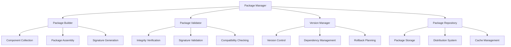

# Package Management

The Nest Learning Thermostat implements a comprehensive package management system for creating, validating, and distributing firmware updates. This document details the package management architecture and implementation.

## Package Architecture

### Package Components
- **Package Builder**: Tools for creating firmware packages
- **Package Validator**: Validation and verification systems
- **Version Manager**: Version control and compatibility management
- **Package Repository**: Storage and distribution of packages

### Package Framework


## Package Builder

### Package Creation Process
Comprehensive process for creating secure firmware packages.

```c
// Package management system
typedef struct {
    package_builder_t builder;            // Package builder
    package_validator_t validator;        // Package validator
    version_manager_t version_manager;    // Version manager
    package_repository_t repository;      // Package repository
} package_management_t;

// Package builder
typedef struct {
    build_config_t config;                // Build configuration
    component_collector_t collector;      // Component collector
    package_assembler_t assembler;        // Package assembler
    signature_generator_t signature;      // Signature generator
    compression_engine_t compression;     // Compression engine
} package_builder_t;

// Build configuration
typedef struct {
    build_environment_t environment;      // Build environment
    target_platform_t platform;          // Target platform
    optimization_level_t optimization;   // Optimization level
    security_level_t security;            // Security level
    debug_info_t debug;                   // Debug information
} build_config_t;

// Firmware package structure
typedef struct {
    package_header_t header;              // Package header
    package_metadata_t metadata;          // Package metadata
    component_manifest_t manifest;        // Component manifest
    component_data_t components;          // Component data
    package_signature_t signature;        // Package signature
    package_checksums_t checksums;        // Package checksums
} firmware_package_t;

// Package header
typedef struct {
    char magic[4];                        // Package magic number
    package_version_t format_version;     // Package format version
    firmware_version_t firmware_version;  // Firmware version
    package_type_t type;                  // Package type
    size_t package_size;                  // Package size
    timestamp_t creation_time;            // Creation time
    char build_id[32];                    // Build identifier
    char toolchain_version[16];           // Toolchain version
} package_header_t;

// Create firmware package
package_result_t create_firmware_package(
    package_builder_t *builder, 
    package_specification_t *spec) {
    
    package_result_t result = {0};
    
    // Initialize package structure
    firmware_package_t package = {0};
    initialize_package_header(&package.header, spec);
    
    // Collect components
    result = collect_package_components(&builder->collector, &package, 
                                       spec->components);
    if (result.status != PACKAGE_STATUS_SUCCESS) {
        return result;
    }
    
    // Generate component manifest
    result = generate_component_manifest(&package.manifest, 
                                        &package.components);
    if (result.status != PACKAGE_STATUS_SUCCESS) {
        return result;
    }
    
    // Generate package metadata
    generate_package_metadata(&package.metadata, spec);
    
    // Compress package data
    result = compress_package_data(&builder->compression, &package);
    if (result.status != PACKAGE_STATUS_SUCCESS) {
        return result;
    }
    
    // Generate package checksums
    generate_package_checksums(&package.checksums, &package);
    
    // Generate package signature
    result = generate_package_signature(&builder->signature, &package);
    if (result.status != PACKAGE_STATUS_SUCCESS) {
        return result;
    }
    
    // Finalize package
    finalize_package(&package);
    
    result.package = package;
    result.status = PACKAGE_STATUS_SUCCESS;
    
    return result;
}
```

### Component Collection
Collect and organize firmware components.

```c
// Component collector
typedef struct {
    component_scanner_t scanner;          // Component scanner
    dependency_analyzer_t analyzer;       // Dependency analyzer
    component_filter_t filter;            // Component filter
    component_optimizer_t optimizer;      // Component optimizer
} component_collector_t;

// Component specification
typedef struct {
    component_id_t component_id;          // Component ID
    component_type_t type;                // Component type
    version_t version;                    // Component version
    source_path_t source_path;            // Source path
    build_options_t build_options;        // Build options
    dependencies_t dependencies;          // Component dependencies
} component_specification_t;

// Collect package components
package_result_t collect_package_components(
    component_collector_t *collector, 
    firmware_package_t *package, 
    component_specification_t *specs, 
    int spec_count) {
    
    package_result_t result = {0};
    
    // Scan for components
    component_scan_result_t scan_result = scan_components(
        &collector->scanner, specs, spec_count);
    
    if (scan_result.component_count == 0) {
        result.status = PACKAGE_STATUS_NO_COMPONENTS;
        return result;
    }
    
    // Analyze dependencies
    dependency_analysis_t dep_analysis = analyze_dependencies(
        &collector->analyzer, scan_result.components, 
        scan_result.component_count);
    
    if (!dep_analysis.valid) {
        result.status = PACKAGE_STATUS_DEPENDENCY_ERROR;
        result.error_info = dep_analysis.error_info;
        return result;
    }
    
    // Filter components
    component_filter_result_t filter_result = filter_components(
        &collector->filter, scan_result.components, 
        scan_result.component_count);
    
    // Optimize components
    component_optimization_t optimization = optimize_components(
        &collector->optimizer, filter_result.components, 
        filter_result.component_count);
    
    // Add components to package
    package->components.count = filter_result.component_count;
    memcpy(package->components.components, 
           filter_result.components, 
           sizeof(component_t) * filter_result.component_count);
    
    result.status = PACKAGE_STATUS_SUCCESS;
    return result;
}
```

## Package Validator

### Validation Systems
Comprehensive validation of firmware packages.

```c
// Package validator
typedef struct {
    validation_engine_t engine;          // Validation engine
    certificate_verifier_t cert_verifier; // Certificate verifier
    integrity_checker_t integrity;        // Integrity checker
    compatibility_checker_t compatibility; // Compatibility checker
} package_validator_t;

// Validation engine
typedef struct {
    validation_rules_t rules;              // Validation rules
    rule_processor_t processor;           // Rule processor
    validation_context_t context;         // Validation context
    validation_reporter_t reporter;       // Validation reporter
} validation_engine_t;

// Validation rules
typedef struct {
    format_validation_t format;           // Format validation
    security_validation_t security;       // Security validation
    content_validation_t content;         // Content validation
    performance_validation_t performance; // Performance validation
} validation_rules_t;

// Comprehensive package validation
validation_result_t validate_firmware_package(
    package_validator_t *validator, 
    firmware_package_t *package, 
    validation_context_t *context) {
    
    validation_result_t result = {0};
    
    // Initialize validation context
    initialize_validation_context(&validator->engine.context, 
                                package, context);
    
    // Validate package format
    format_validation_t format_result = validate_package_format(
        &validator->engine.rules.format, package);
    result.format_valid = format_result.valid;
    result.format_errors = format_result.errors;
    
    // Validate security
    security_validation_t security_result = validate_package_security(
        &validator->engine.rules.security, package);
    result.security_valid = security_result.valid;
    result.security_errors = security_result.errors;
    
    // Validate content
    content_validation_t content_result = validate_package_content(
        &validator->engine.rules.content, package);
    result.content_valid = content_result.valid;
    result.content_errors = content_result.errors;
    
    // Validate performance
    performance_validation_t perf_result = validate_package_performance(
        &validator->engine.rules.performance, package);
    result.performance_valid = perf_result.valid;
    result.performance_errors = perf_result.errors;
    
    // Check compatibility
    compatibility_result_t compat_result = check_package_compatibility(
        &validator->compatibility, package, context);
    result.compatible = compat_result.compatible;
    result.compatibility_issues = compat_result.issues;
    
    // Calculate overall validation result
    result.overall_valid = result.format_valid && 
                          result.security_valid && 
                          result.content_valid && 
                          result.performance_valid && 
                          result.compatible;
    
    result.confidence = calculate_validation_confidence(result);
    
    // Generate validation report
    generate_validation_report(&validator->engine.reporter, 
                              package, result);
    
    return result;
}
```

### Security Validation
Security-focused validation of firmware packages.

```c
// Security validation
typedef struct {
    signature_verification_t signature;   // Signature verification
    certificate_validation_t certificate; // Certificate validation
    malware_scan_t malware_scan;          // Malware scanning
    vulnerability_check_t vulnerability;  // Vulnerability checking
} security_validation_t;

// Signature verification
typedef struct {
    signature_algorithm_t algorithm;      // Signature algorithm
    certificate_chain_t chain;            // Certificate chain
    trust_store_t trust_store;            // Trust store
    revocation_check_t revocation;        // Revocation checking
} signature_verification_t;

// Verify package signature
signature_verification_result_t verify_package_signature(
    signature_verification_t *sig_verify, 
    firmware_package_t *package) {
    
    signature_verification_result_t result = {0};
    
    // Extract signature data
    signature_data_t signature = extract_signature_data(
        &package->signature);
    
    // Calculate message digest
    message_digest_t digest = calculate_package_digest(package);
    
    // Verify signature
    result.signature_valid = verify_digital_signature(
        sig_verify->algorithm, signature, digest);
    
    // Validate certificate chain
    if (result.signature_valid) {
        result.certificate_valid = validate_certificate_chain(
            &sig_verify->chain, &sig_verify->trust_store);
        
        // Check for certificate revocation
        if (result.certificate_valid) {
            result.not_revoked = check_certificate_revocation(
                &sig_verify->revocation, signature.certificate);
        }
    }
    
    // Overall security validation
    result.security_valid = result.signature_valid && 
                          result.certificate_valid && 
                          result.not_revoked;
    
    return result;
}
```

## Version Manager

### Version Control
Comprehensive version management for firmware packages.

```c
// Version manager
typedef struct {
    version_control_t version_control;    // Version control system
    dependency_manager_t dependency;      // Dependency management
    compatibility_matrix_t compatibility; // Compatibility matrix
    rollback_planner_t rollback;          // Rollback planning
} version_manager_t;

// Version control system
typedef struct {
    version_scheme_t scheme;              // Version scheme
    version_history_t history;            // Version history
    branch_management_t branches;         // Branch management
    tagging_system_t tagging;             // Tagging system
} version_control_t;

// Version information
typedef struct {
    version_t version;                    // Version number
    build_number_t build_number;          // Build number
    branch_t branch;                      // Development branch
    release_type_t release_type;          // Release type
    compatibility_level_t compatibility;  // Compatibility level
    timestamp_t build_time;               // Build timestamp
    char version_string[64];              // Version string
} version_info_t;

// Version management operations
version_result_t manage_firmware_version(
    version_manager_t *manager, 
    version_operation_t operation, 
    version_info_t *version) {
    
    version_result_t result = {0};
    
    switch (operation.type) {
        case VERSION_OPERATION_CREATE:
            result = create_new_version(manager, version);
            break;
            
        case VERSION_OPERATION_UPDATE:
            result = update_existing_version(manager, version);
            break;
            
        case VERSION_OPERATION_VALIDATE:
            result = validate_version(manager, version);
            break;
            
        case VERSION_OPERATION_ROLLBACK:
            result = plan_version_rollback(manager, version);
            break;
    }
    
    return result;
}
```

### Dependency Management
Manage component dependencies and compatibility.

```c
// Dependency manager
typedef struct {
    dependency_graph_t graph;             // Dependency graph
    resolver_t resolver;                  // Dependency resolver
    conflict_detector_t conflict;         // Conflict detection
    version_comparator_t comparator;      // Version comparison
} dependency_manager_t;

// Dependency graph
typedef struct {
    dependency_node_t nodes[MAX_NODES];    // Dependency nodes
    dependency_edge_t edges[MAX_EDGES];    // Dependency edges
    int node_count;                        // Number of nodes
    int edge_count;                        // Number of edges
    graph_validation_t validation;         // Graph validation
} dependency_graph_t;

// Resolve package dependencies
dependency_resolution_t resolve_package_dependencies(
    dependency_manager_t *manager, 
    firmware_package_t *package) {
    
    dependency_resolution_t resolution = {0};
    
    // Build dependency graph
    dependency_graph_t graph = build_dependency_graph(
        &manager->graph, package);
    
    // Validate dependency graph
    if (!validate_dependency_graph(&graph)) {
        resolution.status = DEPENDENCY_STATUS_INVALID_GRAPH;
        return resolution;
    }
    
    // Resolve dependencies
    resolution = resolve_dependencies(&manager->resolver, graph);
    
    // Detect conflicts
    if (resolution.status == DEPENDENCY_STATUS_SUCCESS) {
        conflict_detection_t conflicts = detect_dependency_conflicts(
            &manager->conflict, resolution.resolved_dependencies);
        
        if (conflicts.conflict_count > 0) {
            resolution.status = DEPENDENCY_STATUS_CONFLICTS;
            resolution.conflicts = conflicts;
        }
    }
    
    return resolution;
}
```

## Package Repository

### Storage and Distribution
Secure storage and distribution of firmware packages.

```c
// Package repository
typedef struct {
    storage_system_t storage;              // Storage system
    distribution_system_t distribution;    // Distribution system
    cache_manager_t cache;                // Cache management
    access_control_t access_control;      // Access control
} package_repository_t;

// Storage system
typedef struct {
    storage_backend_t backend;            // Storage backend
    replication_t replication;            // Replication system
    backup_system_t backup;               // Backup system
    integrity_monitoring_t integrity;     // Integrity monitoring
} storage_system_t;

// Distribution system
typedef struct {
    cdn_manager_t cdn;                    // CDN management
    mirror_system_t mirrors;              // Mirror system
    load_balancer_t load_balancer;        // Load balancing
    bandwidth_management_t bandwidth;     // Bandwidth management
} distribution_system_t;

// Store package in repository
storage_result_t store_package_in_repository(
    package_repository_t *repository, 
    firmware_package_t *package, 
    storage_options_t *options) {
    
    storage_result_t result = {0};
    
    // Validate storage options
    if (!validate_storage_options(options)) {
        result.status = STORAGE_STATUS_INVALID_OPTIONS;
        return result;
    }
    
    // Check access permissions
    if (!check_storage_permissions(&repository->access_control, 
                                 options->access_level)) {
        result.status = STORAGE_STATUS_ACCESS_DENIED;
        return result;
    }
    
    // Store package
    result = store_package(&repository->storage.backend, 
                         package, options);
    
    if (result.status == STORAGE_STATUS_SUCCESS) {
        // Setup replication
        setup_package_replication(&repository->storage.replication, 
                                package, options);
        
        // Update distribution system
        update_distribution_system(&repository->distribution, 
                                  package);
        
        // Update cache
        update_package_cache(&repository->cache, package);
    }
    
    return result;
}
```

### Package Retrieval
Efficient retrieval of firmware packages.

```c
// Package retrieval
typedef struct {
    retrieval_strategy_t strategy;        // Retrieval strategy
    location_selector_t selector;          // Location selector
    prefetch_manager_t prefetch;          // Prefetch management
    download_optimizer_t optimizer;        // Download optimization
} package_retrieval_t;

// Retrieval strategy
typedef struct {
    strategy_type_t type;                  // Strategy type
    performance_criteria_t performance;   // Performance criteria
    reliability_requirements_t reliability; // Reliability requirements
    cost_constraints_t cost;               // Cost constraints
} retrieval_strategy_t;

// Retrieve package from repository
retrieval_result_t retrieve_package_from_repository(
    package_repository_t *repository, 
    package_request_t *request) {
    
    retrieval_result_t result = {0};
    
    // Select optimal retrieval location
    location_info_t location = select_retrieval_location(
        &repository->distribution.selector, request);
    
    // Check package availability
    availability_check_t availability = check_package_availability(
        location, request->package_id);
    
    if (!availability.available) {
        result.status = RETRIEVAL_STATUS_UNAVAILABLE;
        return result;
    }
    
    // Retrieve package
    result = retrieve_package(location, request);
    
    if (result.status == RETRIEVAL_STATUS_SUCCESS) {
        // Verify retrieved package
        if (!verify_retrieved_package(result.package, request)) {
            result.status = RETRIEVAL_STATUS_VERIFICATION_FAILED;
            cleanup_retrieved_package(result.package);
            return result;
        }
        
        // Update cache
        update_package_cache(&repository->cache, result.package);
    }
    
    return result;
}
```

## Package Optimization

### Size Optimization
Optimize package size for efficient distribution.

```c
// Package optimizer
typedef struct {
    compression_engine_t compression;     // Compression engine
    delta_generator_t delta;              // Delta generation
    content_deduplication_t deduplication; // Content deduplication
    size_analyzer_t analyzer;             // Size analysis
} package_optimizer_t;

// Compression engine
typedef struct {
    compression_algorithm_t algorithm;    // Compression algorithm
    compression_level_t level;             // Compression level
    dictionary_manager_t dictionary;       // Dictionary management
    performance_monitor_t performance;     // Performance monitoring
} compression_engine_t;

// Optimize package size
optimization_result_t optimize_package_size(
    package_optimizer_t *optimizer, 
    firmware_package_t *package, 
    optimization_options_t *options) {
    
    optimization_result_t result = {0};
    
    // Analyze package composition
    composition_analysis_t analysis = analyze_package_composition(
        &optimizer->analyzer, package);
    
    // Apply compression
    compression_result_t compression = compress_package_components(
        &optimizer->compression, package, options->compression_level);
    
    if (compression.success) {
        result.size_reduction += compression.size_reduction;
        
        // Apply content deduplication
        deduplication_result_t deduplication = apply_content_deduplication(
            &optimizer->deduplication, package);
        
        if (deduplication.success) {
            result.size_reduction += deduplication.size_reduction;
            
            // Generate delta if applicable
            if (options->enable_delta) {
                delta_result_t delta = generate_package_delta(
                    &optimizer->delta, package, options->base_package);
                
                if (delta.success) {
                    result.size_reduction += delta.size_reduction;
                    result.delta_package = delta.package;
                }
            }
        }
    }
    
    result.success = (result.size_reduction > 0);
    result.optimized_package = package;
    
    return result;
}
```

## Related Documentation

- [Firmware Updates Overview](./overview.mdx)
- [Update Installation](./update-installation.mdx)
- [Rollback System](./rollback-system.mdx)
- [Update Security](./update-security.mdx)
