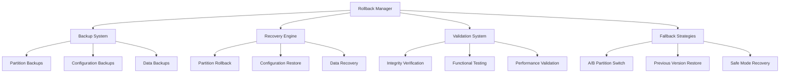

# Rollback System

The Nest Learning Thermostat implements a comprehensive rollback system for safe firmware recovery and fallback mechanisms. This document details the rollback architecture, strategies, and implementation.

## Rollback Architecture

### Core Components
- **Rollback Manager**: Central coordination of rollback operations
- **Backup System**: Creation and management of rollback backups
- **Recovery Engine**: Execution of rollback procedures
- **Validation System**: Verification of rollback success
- **Fallback Strategies**: Multiple fallback approaches for different scenarios

### Rollback Framework


## Rollback Manager

### Rollback Coordination
Central coordination of all rollback operations and procedures.

```c
// Rollback manager system
typedef struct {
    rollback_coordinator_t coordinator;    // Rollback coordinator
    rollback_state_t state;                // Rollback state
    rollback_policy_t policy;              // Rollback policy
    rollback_monitoring_t monitoring;      // Rollback monitoring
} rollback_manager_t;

// Rollback coordinator
typedef struct {
    rollback_workflow_t workflow;          // Rollback workflow
    backup_manager_t backup;               // Backup management
    recovery_executor_t executor;          // Recovery executor
    validation_engine_t validator;         // Validation engine
} rollback_coordinator_t;

// Rollback state
typedef struct {
    rollback_phase_t current_phase;        // Current rollback phase
    rollback_status_t status;              // Rollback status
    rollback_trigger_t trigger;            // Rollback trigger
    target_version_t target_version;       // Target rollback version
    rollback_progress_t progress;          // Rollback progress
    error_info_t last_error;               // Last error information
    timestamp_t rollback_start_time;       // Rollback start time
    timestamp_t estimated_completion;      // Estimated completion time
} rollback_state_t;

// Execute firmware rollback
rollback_result_t execute_firmware_rollback(
    rollback_manager_t *manager, 
    rollback_request_t *request) {
    
    rollback_coordinator_t *coordinator = &manager->coordinator;
    rollback_result_t result = {0};
    
    // Validate rollback request
    if (!validate_rollback_request(request, &manager->policy)) {
        result.status = ROLLBACK_STATUS_INVALID_REQUEST;
        return result;
    }
    
    // Initialize rollback state
    initialize_rollback_state(&manager->state, request);
    
    // Execute rollback workflow
    result = execute_rollback_workflow(coordinator, request);
    
    // Handle rollback completion
    if (result.status == ROLLBACK_STATUS_SUCCESS) {
        finalize_successful_rollback(manager, result);
    } else {
        handle_rollback_failure(manager, result);
    }
    
    return result;
}
```

### Rollback Triggers
Various triggers that can initiate rollback procedures.

```c
// Rollback trigger system
typedef struct {
    trigger_detector_t detector;           // Trigger detector
    trigger_classifier_t classifier;       // Trigger classifier
    trigger_handler_t handler;             // Trigger handler
    trigger_history_t history;             // Trigger history
} rollback_trigger_t;

// Trigger types
typedef enum {
    ROLLBACK_TRIGGER_MANUAL,               // Manual rollback request
    ROLLBACK_TRIGGER_AUTOMATIC,             // Automatic rollback
    ROLLBACK_TRIGGER_HEALTH_BASED,          // Health-based rollback
    ROLLBACK_TRIGGER_TIMEOUT_BASED,        // Timeout-based rollback
    ROLLBACK_TRIGGER_ERROR_BASED,          // Error-based rollback
    ROLLBACK_TRIGGER_USER_REQUEST          // User-initiated rollback
} rollback_trigger_type_t;

// Trigger detection
trigger_detection_result_t detect_rollback_triggers(
    rollback_trigger_t *trigger_system, 
    system_health_t *health, 
    installation_status_t *install_status) {
    
    trigger_detection_result_t result = {0};
    
    // Detect health-based triggers
    health_trigger_t health_trigger = detect_health_triggers(
        &trigger_system->detector, health);
    
    if (health_trigger.triggered) {
        result.triggers[result.trigger_count++] = 
            create_trigger_info(ROLLBACK_TRIGGER_HEALTH_BASED, health_trigger);
    }
    
    // Detect timeout-based triggers
    timeout_trigger_t timeout_trigger = detect_timeout_triggers(
        &trigger_system->detector, install_status);
    
    if (timeout_trigger.triggered) {
        result.triggers[result.trigger_count++] = 
            create_trigger_info(ROLLBACK_TRIGGER_TIMEOUT_BASED, timeout_trigger);
    }
    
    // Detect error-based triggers
    error_trigger_t error_trigger = detect_error_triggers(
        &trigger_system->detector, install_status);
    
    if (error_trigger.triggered) {
        result.triggers[result.trigger_count++] = 
            create_trigger_info(ROLLBACK_TRIGGER_ERROR_BASED, error_trigger);
    }
    
    // Classify and prioritize triggers
    result = classify_triggers(&trigger_system->classifier, result);
    
    return result;
}
```

## Backup System

### Backup Creation
Comprehensive backup creation for rollback purposes.

```c
// Backup system
typedef struct {
    backup_creator_t creator;              // Backup creator
    backup_storage_t storage;              // Backup storage
    backup_validator_t validator;          // Backup validator
    backup_manager_t manager;              // Backup management
} backup_system_t;

// Backup creator
typedef struct {
    partition_backup_t partition;          // Partition backup
    configuration_backup_t config;         // Configuration backup
    data_backup_t data;                    // Data backup
    metadata_backup_t metadata;            // Metadata backup
} backup_creator_t;

// Backup structure
typedef struct {
    backup_header_t header;                // Backup header
    backup_metadata_t metadata;            // Backup metadata
    partition_backup_data_t partitions;    // Partition backup data
    configuration_backup_data_t config;    // Configuration backup data
    user_data_backup_t user_data;          // User data backup
    backup_signature_t signature;          // Backup signature
} firmware_backup_t;

// Create rollback backup
backup_result_t create_rollback_backup(
    backup_system_t *backup_system, 
    backup_request_t *request) {
    
    backup_creator_t *creator = &backup_system->creator;
    backup_result_t result = {0};
    
    // Initialize backup structure
    firmware_backup_t backup = {0};
    initialize_backup_header(&backup.header, request);
    
    // Create partition backups
    result = create_partition_backups(&creator->partition, &backup);
    if (result.status != BACKUP_STATUS_SUCCESS) {
        return result;
    }
    
    // Create configuration backup
    result = create_configuration_backup(&creator->config, &backup);
    if (result.status != BACKUP_STATUS_SUCCESS) {
        return result;
    }
    
    // Create data backup
    result = create_data_backup(&creator->data, &backup);
    if (result.status != BACKUP_STATUS_SUCCESS) {
        return result;
    }
    
    // Create metadata backup
    create_metadata_backup(&creator->metadata, &backup);
    
    // Generate backup signature
    result = generate_backup_signature(&backup);
    if (result.status != BACKUP_STATUS_SUCCESS) {
        return result;
    }
    
    // Validate backup
    if (!validate_backup_integrity(&backup_system->validator, &backup)) {
        result.status = BACKUP_STATUS_VALIDATION_FAILED;
        return result;
    }
    
    // Store backup
    result = store_backup(&backup_system->storage, &backup, request);
    
    result.backup = backup;
    return result;
}
```

### Partition Backup
Backup of system partitions for rollback.

```c
// Partition backup
typedef struct {
    partition_scanner_t scanner;           // Partition scanner
    image_creator_t image_creator;         // Image creator
    compression_engine_t compression;     // Compression engine
    integrity_checker_t integrity;         // Integrity checking
} partition_backup_t;

// Partition backup data
typedef struct {
    partition_info_t partitions[MAX_PARTITIONS]; // Partition information
    partition_image_t images[MAX_PARTITIONS]; // Partition images
    int partition_count;                   // Number of partitions
    size_t total_size;                     // Total backup size
    compression_info_t compression;        // Compression information
} partition_backup_data_t;

// Create partition backups
backup_result_t create_partition_backups(
    partition_backup_t *partition_backup, 
    firmware_backup_t *backup) {
    
    backup_result_t result = {0};
    
    // Scan system partitions
    partition_scan_result_t scan_result = scan_system_partitions(
        &partition_backup->scanner);
    
    if (scan_result.partition_count == 0) {
        result.status = BACKUP_STATUS_NO_PARTITIONS;
        return result;
    }
    
    // Create backup images for each partition
    for (int i = 0; i < scan_result.partition_count; i++) {
        partition_info_t *partition = &scan_result.partitions[i];
        
        // Create partition image
        partition_image_t image = create_partition_image(
            &partition_backup->image_creator, partition);
        
        if (!image.valid) {
            result.status = BACKUP_STATUS_IMAGE_CREATION_FAILED;
            return result;
        }
        
        // Compress partition image
        compression_result_t compression = compress_partition_image(
            &partition_backup->compression, &image);
        
        if (!compression.success) {
            result.status = BACKUP_STATUS_COMPRESSION_FAILED;
            return result;
        }
        
        // Verify image integrity
        if (!verify_image_integrity(&partition_backup->integrity, 
                                  &image, compression)) {
            result.status = BACKUP_STATUS_INTEGRITY_FAILED;
            return result;
        }
        
        // Add to backup data
        backup->partitions.partitions[i] = *partition;
        backup->partitions.images[i] = image;
        backup->partitions.partition_count++;
    }
    
    result.status = BACKUP_STATUS_SUCCESS;
    return result;
}
```

## Recovery Engine

### Rollback Execution
Execution of rollback procedures and recovery operations.

```c
// Recovery engine
typedef struct {
    rollback_executor_t executor;          // Rollback executor
    partition_restorer_t partition;        // Partition restoration
    configuration_restorer_t config;       // Configuration restoration
    data_restorer_t data;                  // Data restoration
} recovery_engine_t;

// Rollback executor
typedef struct {
    rollback_strategy_t strategy;          // Rollback strategy
    execution_plan_t plan;                 // Execution plan
    progress_monitor_t progress;           // Progress monitoring
    error_handler_t error_handler;         // Error handling
} rollback_executor_t;

// Execute rollback procedure
rollback_result_t execute_rollback_procedure(
    recovery_engine_t *engine, 
    firmware_backup_t *backup, 
    rollback_config_t *config) {
    
    rollback_executor_t *executor = &engine->executor;
    rollback_result_t result = {0};
    
    // Select rollback strategy
    rollback_strategy_t strategy = select_rollback_strategy(
        &executor->strategy, backup, config);
    
    // Create execution plan
    execution_plan_t plan = create_rollback_plan(strategy, backup, config);
    
    // Execute rollback steps
    result = execute_rollback_plan(executor, plan);
    
    // Verify rollback success
    if (result.status == ROLLBACK_STATUS_SUCCESS) {
        result.verified = verify_rollback_success(backup, config);
        
        if (!result.verified) {
            result.status = ROLLBACK_STATUS_VERIFICATION_FAILED;
        }
    }
    
    return result;
}
```

### Partition Restoration
Restoration of system partitions from backup.

```c
// Partition restorer
typedef struct {
    image_restorer_t image_restorer;       // Image restorer
    partition_manager_t partition_manager; // Partition management
    bootloader_restorer_t bootloader;      // Bootloader restoration
    verification_system_t verification;    // Verification system
} partition_restorer_t;

// Restore partitions from backup
rollback_result_t restore_partitions_from_backup(
    partition_restorer_t *restorer, 
    firmware_backup_t *backup, 
    rollback_config_t *config) {
    
    rollback_result_t result = {0};
    
    // Prepare target partitions
    preparation_result_t prep_result = prepare_target_partitions(
        &restorer->partition_manager, backup);
    
    if (!prep_result.success) {
        result.status = ROLLBACK_STATUS_PREPARATION_FAILED;
        return result;
    }
    
    // Restore partition images
    for (int i = 0; i < backup->partitions.partition_count; i++) {
        partition_image_t *image = &backup->partitions.images[i];
        partition_info_t *partition = &backup->partitions.partitions[i];
        
        // Restore partition image
        restore_result_t restore_result = restore_partition_image(
            &restorer->image_restorer, image, partition);
        
        if (!restore_result.success) {
            result.status = ROLLBACK_STATUS_RESTORE_FAILED;
            return result;
        }
    }
    
    // Restore bootloader if needed
    if (config->restore_bootloader) {
        bootloader_result_t bootloader_result = restore_bootloader(
            &restorer->bootloader, backup);
        
        if (!bootloader_result.success) {
            result.status = ROLLBACK_STATUS_BOOTLOADER_FAILED;
            return result;
        }
    }
    
    // Verify partition restoration
    verification_result_t verification = verify_partition_restoration(
        &restorer->verification, backup);
    
    if (!verification.success) {
        result.status = ROLLBACK_STATUS_VERIFICATION_FAILED;
        return result;
    }
    
    result.status = ROLLBACK_STATUS_SUCCESS;
    return result;
}
```

## Validation System

### Rollback Verification
Comprehensive verification of rollback success and system integrity.

```c
// Rollback validation system
typedef struct {
    integrity_validator_t integrity;       // Integrity validation
    functional_validator_t functional;     // Functional validation
    performance_validator_t performance;   // Performance validation
    security_validator_t security;         // Security validation
} rollback_validation_t;

// Integrity validator
typedef struct {
    checksum_verifier_t checksum;          // Checksum verification
    signature_verifier_t signature;        // Signature verification
    version_validator_t version;           // Version validation
    component_validator_t components;      // Component validation
} integrity_validator_t;

// Verify rollback success
validation_result_t verify_rollback_success(
    rollback_validation_t *validator, 
    firmware_backup_t *backup, 
    rollback_config_t *config) {
    
    validation_result_t result = {0};
    
    // Verify rollback integrity
    integrity_result_t integrity_result = verify_rollback_integrity(
        &validator->integrity, backup, config);
    
    result.integrity_valid = integrity_result.valid;
    result.integrity_issues = integrity_result.issues;
    
    // Verify functional operation
    functional_result_t functional_result = verify_rollback_functionality(
        &validator->functional, backup);
    
    result.functional_valid = functional_result.operational;
    result.functional_issues = functional_result.issues;
    
    // Verify performance characteristics
    performance_result_t performance_result = verify_rollback_performance(
        &validator->performance, backup);
    
    result.performance_valid = performance_result.acceptable;
    result.performance_issues = performance_result.issues;
    
    // Verify security posture
    security_result_t security_result = verify_rollback_security(
        &validator->security, backup);
    
    result.security_valid = security_result.secure;
    result.security_issues = security_result.issues;
    
    // Overall validation result
    result.overall_valid = result.integrity_valid && 
                         result.functional_valid && 
                         result.performance_valid && 
                         result.security_valid;
    
    return result;
}
```

### Functional Testing
Testing of rolled-back system functionality.

```c
// Functional validator
typedef struct {
    test_suite_t test_suite;               // Test suite
    test_executor_t executor;              // Test executor
    result_analyzer_t analyzer;            // Result analyzer
    baseline_comparator_t comparator;      // Baseline comparison
} functional_validator_t;

// Verify rollback functionality
functional_result_t verify_rollback_functionality(
    functional_validator_t *validator, 
    firmware_backup_t *backup) {
    
    functional_result_t result = {0};
    
    // Execute rollback test suite
    test_execution_result_t test_result = execute_rollback_test_suite(
        &validator->test_suite, &validator->executor);
    
    result.tests_passed = test_result.passed;
    result.test_failures = test_result.failures;
    
    // Compare with baseline functionality
    baseline_comparison_t comparison = compare_with_baseline(
        &validator->comparator, test_result.results, backup);
    
    result.baseline_match = comparison.matches;
    result.differences = comparison.differences;
    
    // Analyze test results
    result = analyze_functional_results(&validator->analyzer, 
                                       test_result, comparison);
    
    // Overall functional result
    result.operational = result.tests_passed && 
                        result.baseline_match &&
                        (result.critical_failures == 0);
    
    return result;
}
```

## Fallback Strategies

### A/B Partition Switch
A/B partition switching for instant rollback capability.

```c
// A/B fallback strategy
typedef struct {
    partition_switcher_t switcher;        // Partition switcher
    bootloader_controller_t bootloader;   // Bootloader control
    synchronization_t sync;                // Synchronization
    verification_t verification;          // Verification
} ab_fallback_t;

// Partition switcher
typedef struct {
    active_partition_detector_t detector; // Active partition detector
    partition_selector_t selector;        // Partition selector
    switch_executor_t executor;           // Switch executor
    switch_validator_t validator;         // Switch validation
} partition_switcher_t;

// Execute A/B partition switch
fallback_result_t execute_ab_partition_switch(
    ab_fallback_t *ab_fallback, 
    rollback_request_t *request) {
    
    fallback_result_t result = {0};
    
    // Detect current active partition
    partition_info_t current_active = detect_active_partition(
        &ab_fallback->switcher.detector);
    
    // Identify target rollback partition
    partition_info_t target_partition = select_rollback_partition(
        &ab_fallback->switcher.selector, request, current_active);
    
    if (!is_valid_rollback_partition(target_partition)) {
        result.status = FALLBACK_STATUS_INVALID_PARTITION;
        return result;
    }
    
    // Validate target partition
    if (!validate_rollback_partition(&ab_fallback->switcher.validator, 
                                   target_partition)) {
        result.status = FALLBACK_STATUS_PARTITION_INVALID;
        return result;
    }
    
    // Execute partition switch
    switch_result_t switch_result = execute_partition_switch(
        &ab_fallback->switcher.executor, current_active, target_partition);
    
    if (!switch_result.success) {
        result.status = FALLBACK_STATUS_SWITCH_FAILED;
        return result;
    }
    
    // Update bootloader configuration
    bootloader_result_t bootloader_result = update_bootloader_config(
        &ab_fallback->bootloader, target_partition);
    
    if (!bootloader_result.success) {
        result.status = FALLBACK_STATUS_BOOTLOADER_FAILED;
        return result;
    }
    
    // Verify switch success
    if (!verify_partition_switch(&ab_fallback->verification, 
                                target_partition)) {
        result.status = FALLBACK_STATUS_VERIFICATION_FAILED;
        return result;
    }
    
    result.status = FALLBACK_STATUS_SUCCESS;
    return result;
}
```

### Safe Mode Recovery
Safe mode recovery for critical system failures.

```c
// Safe mode recovery strategy
typedef struct {
    safe_mode_loader_t loader;             // Safe mode loader
    minimal_system_t minimal;              // Minimal system
    recovery_tools_t tools;                // Recovery tools
    diagnostics_t diagnostics;             // Diagnostics
} safe_mode_recovery_t;

// Safe mode loader
typedef struct {
    boot_sequence_t sequence;              // Boot sequence
    minimal_image_loader_t image_loader;   // Minimal image loader
    emergency_shell_t shell;               // Emergency shell
    communication_t communication;         // Communication interface
} safe_mode_loader_t;

// Execute safe mode recovery
fallback_result_t execute_safe_mode_recovery(
    safe_mode_recovery_t *safe_mode, 
    rollback_request_t *request) {
    
    fallback_result_t result = {0};
    
    // Load safe mode
    load_result_t load_result = load_safe_mode(
        &safe_mode->loader, request);
    
    if (!load_result.success) {
        result.status = FALLBACK_STATUS_SAFE_MODE_LOAD_FAILED;
        return result;
    }
    
    // Initialize minimal system
    minimal_result_t minimal_result = initialize_minimal_system(
        &safe_mode->minimal);
    
    if (!minimal_result.success) {
        result.status = FALLBACK_STATUS_MINIMAL_SYSTEM_FAILED;
        return result;
    }
    
    // Run recovery diagnostics
    diagnostic_result_t diagnostic = run_recovery_diagnostics(
        &safe_mode->diagnostics);
    
    if (!diagnostic.system_recoverable) {
        result.status = FALLBACK_STATUS_SYSTEM_UNRECOVERABLE;
        return result;
    }
    
    // Execute recovery tools
    recovery_result_t recovery = execute_recovery_tools(
        &safe_mode->tools, diagnostic, request);
    
    if (!recovery.success) {
        result.status = FALLBACK_STATUS_RECOVERY_FAILED;
        return result;
    }
    
    // Verify recovery
    if (!verify_safe_mode_recovery(recovery)) {
        result.status = FALLBACK_STATUS_VERIFICATION_FAILED;
        return result;
    }
    
    result.status = FALLBACK_STATUS_SUCCESS;
    return result;
}
```

## Rollback Monitoring

### Rollback Progress Tracking
Real-time monitoring of rollback operations.

```c
// Rollback monitoring
typedef struct {
    progress_tracker_t progress;           // Progress tracking
    performance_monitor_t performance;     // Performance monitoring
    error_monitor_t errors;                 // Error monitoring
    alert_system_t alerts;                  // Alert system
} rollback_monitoring_t;

// Progress tracker
typedef struct {
    rollback_metrics_t metrics;             // Rollback metrics
    stage_tracker_t stages;                 // Stage tracking
    time_estimator_t estimator;             // Time estimation
    milestone_tracker_t milestones;         // Milestone tracking
} progress_tracker_t;

// Monitor rollback progress
rollback_progress_t monitor_rollback_progress(
    rollback_monitoring_t *monitor, 
    rollback_phase_t current_phase, 
    phase_progress_t phase_progress) {
    
    rollback_progress_t progress = {0};
    
    // Update progress metrics
    progress.metrics = update_rollback_metrics(
        &monitor->progress.metrics, current_phase, phase_progress);
    
    // Update stage tracking
    progress.stage_info = update_rollback_stage_tracking(
        &monitor->progress.stages, current_phase);
    
    // Update time estimation
    progress.time_estimate = update_rollback_time_estimation(
        &monitor->progress.estimator, phase_progress);
    
    // Check rollback milestones
    progress.milestone_status = check_rollback_milestones(
        &monitor->progress.milestones, current_phase);
    
    // Monitor rollback performance
    progress.performance = monitor_rollback_performance(
        &monitor->performance, current_phase);
    
    // Check for rollback errors
    progress.error_status = monitor_rollback_errors(
        &monitor->errors, current_phase);
    
    // Generate alerts if needed
    if (progress.error_status.has_errors || 
        progress.performance.degraded) {
        generate_rollback_alerts(&monitor->alerts, progress);
    }
    
    return progress;
}
```

## Related Documentation

- [Firmware Updates Overview](./overview.mdx)
- [Package Management](./package-management.mdx)
- [Update Installation](./update-installation.mdx)
- [Update Security](./update-security.mdx)
