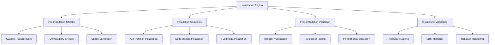

# Update Installation

The Nest Learning Thermostat implements a robust firmware installation system with multiple strategies, safety mechanisms, and verification processes. This document details the update installation architecture and implementation.

## Installation Architecture

### Core Components
- **Installation Engine**: Core installation coordination and execution
- **Pre-installation Checks**: Comprehensive validation before installation
- **Installation Strategies**: Multiple installation approaches for different scenarios
- **Post-installation Validation**: Verification and testing after installation
- **Installation Monitoring**: Real-time monitoring and progress tracking

### Installation Framework


## Installation Engine

### Installation Coordination
Central coordination of the firmware installation process.

```c
// Installation engine
typedef struct {
    installation_coordinator_t coordinator; // Installation coordinator
    installation_state_t state;            // Installation state
    installation_config_t config;          // Installation configuration
    installation_monitor_t monitor;        // Installation monitoring
} installation_engine_t;

// Installation coordinator
typedef struct {
    workflow_executor_t executor;          // Workflow executor
    resource_manager_t resources;          // Resource management
    safety_manager_t safety;               // Safety management
    recovery_manager_t recovery;           // Recovery management
} installation_coordinator_t;

// Installation state
typedef struct {
    installation_phase_t current_phase;    // Current installation phase
    installation_status_t status;          // Installation status
    progress_info_t progress;              // Progress information
    error_info_t last_error;               // Last error information
    rollback_info_t rollback;               // Rollback information
    timestamp_t start_time;                // Installation start time
    timestamp_t estimated_completion;     // Estimated completion time
} installation_state_t;

// Execute firmware installation
installation_result_t execute_firmware_installation(
    installation_engine_t *engine, 
    firmware_package_t *package, 
    installation_config_t *config) {
    
    installation_coordinator_t *coordinator = &engine->coordinator;
    installation_result_t result = {0};
    
    // Initialize installation state
    initialize_installation_state(&engine->state, package, config);
    
    // Execute installation workflow
    result = execute_installation_workflow(coordinator, package, config);
    
    // Handle installation completion
    if (result.status == INSTALLATION_STATUS_SUCCESS) {
        finalize_successful_installation(engine, result);
    } else {
        handle_installation_failure(engine, result);
    }
    
    return result;
}
```

### Installation Workflow
Step-by-step workflow for firmware installation.

```c
// Installation workflow
typedef struct {
    workflow_step_t steps[MAX_STEPS];      // Workflow steps
    int step_count;                        // Number of steps
    step_dependencies_t dependencies;       // Step dependencies
    rollback_plan_t rollback_plan;         // Rollback plan
} installation_workflow_t;

// Workflow step
typedef struct {
    step_id_t step_id;                     // Step ID
    step_type_t type;                      // Step type
    step_handler_t handler;                // Step handler
    rollback_handler_t rollback_handler;   // Rollback handler
    timeout_t timeout;                     // Step timeout
    retry_policy_t retry_policy;           // Retry policy
    verification_t verification;           // Step verification
} workflow_step_t;

// Execute installation workflow
installation_result_t execute_installation_workflow(
    installation_coordinator_t *coordinator, 
    firmware_package_t *package, 
    installation_config_t *config) {
    
    installation_workflow_t *workflow = get_installation_workflow(config);
    installation_result_t result = {0};
    
    // Execute workflow steps in order
    for (int step = 0; step < workflow->step_count; step++) {
        workflow_step_t *current_step = &workflow->steps[step];
        
        // Check step dependencies
        if (!check_step_dependencies(&workflow->dependencies, 
                                    current_step->step_id)) {
            result.status = INSTALLATION_STATUS_DEPENDENCY_FAILED;
            break;
        }
        
        // Execute step with retry logic
        step_result_t step_result = execute_workflow_step_with_retry(
            current_step, package, config);
        
        if (step_result.success) {
            // Verify step completion
            if (!verify_step_completion(&current_step->verification, 
                                       step_result)) {
                result.status = INSTALLATION_STATUS_VERIFICATION_FAILED;
                break;
            }
        } else {
            // Handle step failure
            result = handle_step_failure(coordinator, current_step, 
                                       step_result);
            break;
        }
        
        // Update installation progress
        update_installation_progress(&coordinator->monitor, 
                                   current_step->step_id, step_result);
    }
    
    return result;
}
```

## Pre-installation Checks

### System Validation
Comprehensive validation of system readiness for installation.

```c
// Pre-installation checker
typedef struct {
    system_validator_t system;             // System validation
    compatibility_checker_t compatibility; // Compatibility checking
    space_validator_t space;               // Space validation
    security_validator_t security;         // Security validation
} pre_installation_checker_t;

// System validator
typedef struct {
    hardware_checker_t hardware;           // Hardware checking
    software_checker_t software;           // Software checking
    environment_checker_t environment;     // Environment checking
    performance_checker_t performance;     // Performance checking
} system_validator_t;

// System requirements
typedef struct {
    hardware_requirements_t hardware;      // Hardware requirements
    software_requirements_t software;      // Software requirements
    network_requirements_t network;        // Network requirements
    power_requirements_t power;            // Power requirements
} system_requirements_t;

// Perform pre-installation checks
pre_check_result_t perform_pre_installation_checks(
    pre_installation_checker_t *checker, 
    firmware_package_t *package, 
    installation_config_t *config) {
    
    pre_check_result_t result = {0};
    
    // Check system requirements
    system_check_result_t system_result = check_system_requirements(
        &checker->system, &package->metadata.requirements);
    
    result.system_check_passed = system_result.passed;
    result.system_issues = system_result.issues;
    
    // Check compatibility
    compatibility_result_t compat_result = check_package_compatibility(
        &checker->compatibility, package, config);
    
    result.compatibility_check_passed = compat_result.compatible;
    result.compatibility_issues = compat_result.issues;
    
    // Check available space
    space_check_result_t space_result = check_available_space(
        &checker->space, package);
    
    result.space_check_passed = space_result.sufficient;
    result.space_issues = space_result.issues;
    
    // Check security requirements
    security_check_result_t security_result = check_security_requirements(
        &checker->security, package, config);
    
    result.security_check_passed = security_result.secure;
    result.security_issues = security_result.issues;
    
    // Overall pre-check result
    result.overall_passed = result.system_check_passed && 
                          result.compatibility_check_passed && 
                          result.space_check_passed && 
                          result.security_check_passed;
    
    return result;
}
```

### Compatibility Checking
Detailed compatibility analysis for firmware installation.

```c
// Compatibility checker
typedef struct {
    version_compatibility_t version;       // Version compatibility
    hardware_compatibility_t hardware;     // Hardware compatibility
    software_compatibility_t software;     // Software compatibility
    configuration_compatibility_t config;  // Configuration compatibility
} compatibility_checker_t;

// Version compatibility
typedef struct {
    version_matrix_t matrix;               // Version compatibility matrix
    upgrade_path_t upgrade_path;           // Upgrade path analysis
    dependency_compatibility_t dependencies; // Dependency compatibility
    rollback_compatibility_t rollback;     // Rollback compatibility
} version_compatibility_t;

// Check package compatibility
compatibility_result_t check_package_compatibility(
    compatibility_checker_t *checker, 
    firmware_package_t *package, 
    installation_config_t *config) {
    
    compatibility_result_t result = {0};
    
    // Check version compatibility
    version_compat_result_t version_result = check_version_compatibility(
        &checker->version, package, config->current_version);
    
    result.version_compatible = version_result.compatible;
    result.version_issues = version_result.issues;
    
    // Check hardware compatibility
    hardware_compat_result_t hardware_result = check_hardware_compatibility(
        &checker->hardware, package);
    
    result.hardware_compatible = hardware_result.compatible;
    result.hardware_issues = hardware_result.issues;
    
    // Check software compatibility
    software_compat_result_t software_result = check_software_compatibility(
        &checker->software, package, config);
    
    result.software_compatible = software_result.compatible;
    result.software_issues = software_result.issues;
    
    // Check configuration compatibility
    config_compat_result_t config_result = check_configuration_compatibility(
        &checker->config, package, config);
    
    result.configuration_compatible = config_result.compatible;
    result.configuration_issues = config_result.issues;
    
    // Overall compatibility
    result.compatible = result.version_compatible && 
                      result.hardware_compatible && 
                      result.software_compatible && 
                      result.configuration_compatible;
    
    return result;
}
```

## Installation Strategies

### A/B Partition Installation
Dual-partition installation strategy for maximum reliability.

```c
// A/B installation strategy
typedef struct {
    partition_manager_t partitions;        // Partition management
    bootloader_interface_t bootloader;     // Bootloader interface
    synchronization_t sync;                // Partition synchronization
    failover_system_t failover;            // Failover system
} ab_installation_t;

// Partition manager
typedef struct {
    partition_scheme_t scheme;             // Partition scheme
    partition_selector_t selector;         // Partition selector
    partition_formatter_t formatter;       // Partition formatting
    partition_validator_t validator;       // Partition validation
} partition_manager_t;

// A/B partition installation
installation_result_t install_ab_partition(
    ab_installation_t *ab_install, 
    firmware_package_t *package, 
    installation_config_t *config) {
    
    installation_result_t result = {0};
    
    // Identify inactive partition
    partition_info_t inactive_partition = 
        identify_inactive_partition(&ab_install->partitions.selector);
    
    if (!is_valid_partition(inactive_partition)) {
        result.status = INSTALLATION_STATUS_NO_INACTIVE_PARTITION;
        return result;
    }
    
    // Validate inactive partition
    if (!validate_target_partition(&ab_install->partitions.validator, 
                                 inactive_partition)) {
        result.status = INSTALLATION_STATUS_PARTITION_INVALID;
        return result;
    }
    
    // Format inactive partition
    if (!format_target_partition(&ab_install->partitions.formatter, 
                               inactive_partition)) {
        result.status = INSTALLATION_STATUS_FORMAT_FAILED;
        return result;
    }
    
    // Install firmware to inactive partition
    result = install_firmware_to_partition(package, inactive_partition);
    
    if (result.status == INSTALLATION_STATUS_SUCCESS) {
        // Synchronize partitions if needed
        if (config->enable_sync) {
            sync_result_t sync_result = synchronize_partitions(
                &ab_install->sync, inactive_partition);
            
            if (!sync_result.success) {
                result.status = INSTALLATION_STATUS_SYNC_FAILED;
                return result;
            }
        }
        
        // Update bootloader configuration
        if (!update_bootloader_config(&ab_install->bootloader, 
                                     inactive_partition)) {
            result.status = INSTALLATION_STATUS_BOOTLOADER_FAILED;
            return result;
        }
        
        // Verify installation
        if (!verify_partition_installation(inactive_partition, package)) {
            result.status = INSTALLATION_STATUS_VERIFICATION_FAILED;
            return result;
        }
    }
    
    return result;
}
```

### Delta Update Installation
Incremental update installation for efficient updates.

```c
// Delta installation strategy
typedef struct {
    delta_processor_t processor;           // Delta processor
    patch_engine_t patch_engine;           // Patch engine
    verification_system_t verification;    // Verification system
    rollback_generator_t rollback;         // Rollback generation
} delta_installation_t;

// Delta processor
typedef struct {
    delta_analyzer_t analyzer;             // Delta analyzer
    patch_applicator_t applicator;         // Patch applicator
    compression_handler_t compression;     // Compression handling
    integrity_checker_t integrity;         // Integrity checking
} delta_processor_t;

// Delta update installation
installation_result_t install_delta_update(
    delta_installation_t *delta_install, 
    firmware_package_t *package, 
    installation_config_t *config) {
    
    installation_result_t result = {0};
    
    // Verify delta compatibility
    if (!verify_delta_compatibility(package, config->current_version)) {
        result.status = INSTALLATION_STATUS_DELTA_INCOMPATIBLE;
        return result;
    }
    
    // Analyze delta package
    delta_analysis_t analysis = analyze_delta_package(
        &delta_install->processor.analyzer, package);
    
    if (!analysis.valid) {
        result.status = INSTALLATION_STATUS_DELTA_INVALID;
        result.error_info = analysis.error_info;
        return result;
    }
    
    // Create rollback information
    rollback_info_t rollback = create_rollback_info(
        &delta_install->rollback, config->current_version);
    
    // Apply delta patches
    result = apply_delta_patches(&delta_install->patch_engine, 
                               package, analysis);
    
    if (result.status == INSTALLATION_STATUS_SUCCESS) {
        // Verify patched firmware
        verification_result_t verification = verify_patched_firmware(
            &delta_install->verification, package);
        
        if (!verification.success) {
            // Rollback delta changes
            rollback_delta_changes(&delta_install->rollback, rollback);
            result.status = INSTALLATION_STATUS_VERIFICATION_FAILED;
        }
    } else {
        // Rollback on failure
        rollback_delta_changes(&delta_install->rollback, rollback);
    }
    
    return result;
}
```

### Full Image Installation
Complete firmware image installation for major updates.

```c
// Full image installation strategy
typedef struct {
    image_flasher_t flasher;               // Image flasher
    bootloader_updater_t bootloader;       // Bootloader updater
    partition_rebuilder_t rebuilder;       // Partition rebuilder
    system_reinitializer_t reinitializer;   // System reinitializer
} full_image_installation_t;

// Image flasher
typedef struct {
    flashing_algorithm_t algorithm;        // Flashing algorithm
    block_manager_t blocks;                // Block management
    progress_tracker_t progress;           // Progress tracking
    error_recovery_t recovery;             // Error recovery
} image_flasher_t;

// Full image installation
installation_result_t install_full_image(
    full_image_installation_t *full_install, 
    firmware_package_t *package, 
    installation_config_t *config) {
    
    installation_result_t result = {0};
    
    // Prepare for full image installation
    if (!prepare_full_image_installation(config)) {
        result.status = INSTALLATION_STATUS_PREPARATION_FAILED;
        return result;
    }
    
    // Flash firmware image
    result = flash_firmware_image(&full_install->flasher, 
                                package, config);
    
    if (result.status == INSTALLATION_STATUS_SUCCESS) {
        // Update bootloader if needed
        if (package->metadata.includes_bootloader) {
            bootloader_result_t bootloader_result = update_bootloader(
                &full_install->bootloader, package);
            
            if (!bootloader_result.success) {
                result.status = INSTALLATION_STATUS_BOOTLOADER_FAILED;
                return result;
            }
        }
        
        // Rebuild partitions if needed
        if (config->rebuild_partitions) {
            rebuild_result_t rebuild_result = rebuild_partitions(
                &full_install->rebuilder, package);
            
            if (!rebuild_result.success) {
                result.status = INSTALLATION_STATUS_REBUILD_FAILED;
                return result;
            }
        }
        
        // Reinitialize system
        reinit_result_t reinit_result = reinitialize_system(
            &full_install->reinitializer, package);
        
        if (!reinit_result.success) {
            result.status = INSTALLATION_STATUS_REINIT_FAILED;
            return result;
        }
    }
    
    return result;
}
```

## Post-installation Validation

### Integrity Verification
Comprehensive verification of installed firmware.

```c
// Post-installation validator
typedef struct {
    integrity_checker_t integrity;         // Integrity checking
    functional_tester_t functional;        // Functional testing
    performance_validator_t performance;   // Performance validation
    security_validator_t security;         // Security validation
} post_installation_validator_t;

// Integrity checker
typedef struct {
    checksum_verifier_t checksum;          // Checksum verification
    signature_verifier_t signature;        // Signature verification
    version_validator_t version;           // Version validation
    component_validator_t components;      // Component validation
} integrity_checker_t;

// Perform post-installation validation
validation_result_t perform_post_installation_validation(
    post_installation_validator_t *validator, 
    firmware_package_t *package, 
    installation_config_t *config) {
    
    validation_result_t result = {0};
    
    // Verify installation integrity
    integrity_result_t integrity_result = verify_installation_integrity(
        &validator->integrity, package, config);
    
    result.integrity_valid = integrity_result.valid;
    result.integrity_issues = integrity_result.issues;
    
    // Perform functional testing
    functional_result_t functional_result = perform_functional_tests(
        &validator->functional, package);
    
    result.functional_valid = functional_result.passed;
    result.functional_issues = functional_result.issues;
    
    // Validate performance
    performance_result_t performance_result = validate_performance(
        &validator->performance, package);
    
    result.performance_valid = performance_result.acceptable;
    result.performance_issues = performance_result.issues;
    
    // Validate security
    security_result_t security_result = validate_security(
        &validator->security, package);
    
    result.security_valid = security_result.secure;
    result.security_issues = security_result.issues;
    
    // Overall validation result
    result.overall_valid = result.integrity_valid && 
                         result.functional_valid && 
                         result.performance_valid && 
                         result.security_valid;
    
    return result;
}
```

### Functional Testing
Comprehensive testing of installed firmware functionality.

```c
// Functional tester
typedef struct {
    test_suite_t test_suite;               // Test suite
    test_executor_t executor;              // Test executor
    result_analyzer_t analyzer;            // Result analyzer
    coverage_tracker_t coverage;           // Coverage tracking
} functional_tester_t;

// Test suite
typedef struct {
    unit_tests_t unit_tests;               // Unit tests
    integration_tests_t integration;       // Integration tests
    system_tests_t system_tests;           // System tests
    regression_tests_t regression;         // Regression tests
} test_suite_t;

// Perform functional tests
functional_result_t perform_functional_tests(
    functional_tester_t *tester, 
    firmware_package_t *package) {
    
    functional_result_t result = {0};
    
    // Execute unit tests
    unit_test_result_t unit_result = execute_unit_tests(
        &tester->test_suite.unit_tests);
    
    result.unit_tests_passed = unit_result.passed;
    result.unit_test_failures = unit_result.failures;
    
    // Execute integration tests
    integration_test_result_t integration_result = execute_integration_tests(
        &tester->test_suite.integration);
    
    result.integration_tests_passed = integration_result.passed;
    result.integration_test_failures = integration_result.failures;
    
    // Execute system tests
    system_test_result_t system_result = execute_system_tests(
        &tester->test_suite.system_tests);
    
    result.system_tests_passed = system_result.passed;
    result.system_test_failures = system_result.failures;
    
    // Execute regression tests
    regression_test_result_t regression_result = execute_regression_tests(
        &tester->test_suite.regression);
    
    result.regression_tests_passed = regression_result.passed;
    result.regression_test_failures = regression_result.failures;
    
    // Analyze test results
    result = analyze_test_results(&tester->analyzer, result);
    
    // Update test coverage
    update_test_coverage(&tester->coverage, result);
    
    // Overall functional test result
    result.passed = result.unit_tests_passed && 
                  result.integration_tests_passed && 
                  result.system_tests_passed && 
                  result.regression_tests_passed;
    
    return result;
}
```

## Installation Monitoring

### Real-time Monitoring
Comprehensive monitoring of the installation process.

```c
// Installation monitor
typedef struct {
    progress_tracker_t progress;           // Progress tracking
    performance_monitor_t performance;     // Performance monitoring
    error_monitor_t errors;                 // Error monitoring
    alert_system_t alerts;                  // Alert system
} installation_monitor_t;

// Progress tracker
typedef struct {
    progress_metrics_t metrics;             // Progress metrics
    stage_tracker_t stages;                 // Stage tracking
    time_estimator_t estimator;             // Time estimation
    milestone_tracker_t milestones;         // Milestone tracking
} progress_tracker_t;

// Monitor installation progress
progress_update_t monitor_installation_progress(
    installation_monitor_t *monitor, 
    installation_phase_t current_phase, 
    phase_progress_t phase_progress) {
    
    progress_update_t update = {0};
    
    // Update progress metrics
    update.metrics = update_progress_metrics(
        &monitor->progress.metrics, current_phase, phase_progress);
    
    // Update stage tracking
    update.stage_info = update_stage_tracking(
        &monitor->progress.stages, current_phase, phase_progress);
    
    // Update time estimation
    update.time_estimate = update_time_estimation(
        &monitor->progress.estimator, phase_progress);
    
    // Check milestones
    update.milestone_status = check_milestone_status(
        &monitor->progress.milestones, current_phase);
    
    // Monitor performance
    performance_metrics_t perf_metrics = monitor_installation_performance(
        &monitor->performance, current_phase);
    
    update.performance = perf_metrics;
    
    // Check for errors
    error_status_t error_status = monitor_installation_errors(
        &monitor->errors, current_phase);
    
    update.error_status = error_status;
    
    // Generate alerts if needed
    if (error_status.has_errors || perf_metrics.degraded) {
        generate_installation_alerts(&monitor->alerts, update);
    }
    
    return update;
}
```

## Related Documentation

- [Firmware Updates Overview](./overview.mdx)
- [Package Management](./package-management.mdx)
- [Rollback System](./rollback-system.mdx)
- [Update Security](./update-security.mdx)
