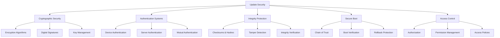

# Update Security

The Nest Learning Thermostat implements comprehensive security measures for firmware updates to ensure authenticity, integrity, and confidentiality throughout the update process. This document details the security architecture and implementation.

## Security Architecture

### Core Components
- **Cryptographic Security**: Encryption, signatures, and key management
- **Authentication Systems**: Device and server authentication mechanisms
- **Integrity Protection**: Checksums, hashes, and tamper detection
- **Secure Boot**: Chain of trust verification during boot
- **Access Control**: Authorization and permission management

### Security Framework


## Cryptographic Security

### Encryption Systems
Strong encryption for protecting firmware packages and update data.

```c
// Update security system
typedef struct {
    cryptographic_security_t crypto;      // Cryptographic security
    authentication_system_t auth;         // Authentication systems
    integrity_protection_t integrity;      // Integrity protection
    secure_boot_t secure_boot;             // Secure boot
    access_control_t access_control;       // Access control
} update_security_t;

// Cryptographic security
typedef struct {
    encryption_engine_t encryption;        // Encryption engine
    signature_engine_t signatures;        // Signature engine
    key_management_t key_management;      // Key management
    random_generator_t random;             // Random number generation
} cryptographic_security_t;

// Encryption engine
typedef struct {
    cipher_suite_t cipher_suite;           // Cipher suite
    key_derivation_t key_derivation;       // Key derivation
    encryption_mode_t mode;                // Encryption mode
    padding_scheme_t padding;              // Padding scheme
} encryption_engine_t;

// Firmware package encryption
encryption_result_t encrypt_firmware_package(
    encryption_engine_t *engine, 
    firmware_package_t *package, 
    encryption_key_t *key) {
    
    encryption_result_t result = {0};
    
    // Derive encryption keys
    key_derivation_result_t key_result = derive_encryption_keys(
        &engine->key_derivation, key, package);
    
    if (!key_result.success) {
        result.status = ENCRYPTION_STATUS_KEY_DERIVATION_FAILED;
        return result;
    }
    
    // Initialize encryption context
    encryption_context_t context = initialize_encryption_context(
        engine->cipher_suite, key_result.encryption_key);
    
    // Encrypt package data
    for (int i = 0; i < package->components.count; i++) {
        component_data_t *component = &package->components.components[i];
        
        // Encrypt component data
        encryption_operation_t encrypt_op = {
            .data = component->data,
            .data_size = component->data_size,
            .context = context,
            .mode = engine->mode,
            .padding = engine->padding
        };
        
        component_encryption_result_t comp_result = 
            encrypt_component_data(encrypt_op);
        
        if (!comp_result.success) {
            result.status = ENCRYPTION_STATUS_COMPONENT_ENCRYPTION_FAILED;
            cleanup_encryption_context(context);
            return result;
        }
        
        // Update component with encrypted data
        component->encrypted_data = comp_result.encrypted_data;
        component->encrypted_size = comp_result.encrypted_size;
        component->encryption_info = comp_result.encryption_info;
    }
    
    // Generate encryption metadata
    result.encryption_metadata = generate_encryption_metadata(
        context, key_result);
    
    // Cleanup encryption context
    cleanup_encryption_context(context);
    
    result.status = ENCRYPTION_STATUS_SUCCESS;
    return result;
}
```

### Digital Signatures
Cryptographic signatures for firmware authenticity verification.

```c
// Signature engine
typedef struct {
    signature_algorithm_t algorithm;      // Signature algorithm
    certificate_chain_t certificates;     // Certificate chain
    hash_algorithm_t hash_algorithm;      // Hash algorithm
    signature_padding_t padding;          // Signature padding
} signature_engine_t;

// Digital signature
typedef struct {
    signature_data_t signature;           // Signature data
    signing_certificate_t certificate;    // Signing certificate
    hash_value_t hash;                    // Message hash
    signature_metadata_t metadata;        // Signature metadata
} digital_signature_t;

// Generate firmware signature
signature_result_t generate_firmware_signature(
    signature_engine_t *engine, 
    firmware_package_t *package, 
    signing_key_t *private_key) {
    
    signature_result_t result = {0};
    
    // Calculate message hash
    hash_result_t hash_result = calculate_package_hash(
        engine->hash_algorithm, package);
    
    if (!hash_result.success) {
        result.status = SIGNATURE_STATUS_HASH_FAILED;
        return result;
    }
    
    // Initialize signing context
    signing_context_t context = initialize_signing_context(
        engine->algorithm, private_key, engine->padding);
    
    // Generate digital signature
    signature_operation_t sign_op = {
        .hash = hash_result.hash,
        .context = context,
        .algorithm = engine->algorithm
    };
    
    result.signature = generate_signature(sign_op);
    
    if (!result.signature.valid) {
        result.status = SIGNATURE_STATUS_GENERATION_FAILED;
        cleanup_signing_context(context);
        return result;
    }
    
    // Attach certificate information
    result.certificate = get_signing_certificate(private_key);
    
    // Generate signature metadata
    result.metadata = generate_signature_metadata(
        engine->algorithm, hash_result.hash, context);
    
    // Cleanup signing context
    cleanup_signing_context(context);
    
    result.status = SIGNATURE_STATUS_SUCCESS;
    return result;
}
```

## Authentication Systems

### Device Authentication
Strong device authentication for update server communication.

```c
// Authentication system
typedef struct {
    device_authenticator_t device;         // Device authentication
    server_authenticator_t server;         // Server authentication
    mutual_auth_t mutual;                  // Mutual authentication
    token_manager_t tokens;                // Token management
} authentication_system_t;

// Device authenticator
typedef struct {
    certificate_auth_t certificate;       // Certificate authentication
    key_pair_auth_t key_pair;             // Key pair authentication
    device_id_auth_t device_id;           // Device ID authentication
    challenge_response_t challenge;       // Challenge-response
} device_authenticator_t;

// Device authentication process
auth_result_t authenticate_device_to_server(
    device_authenticator_t *authenticator, 
    server_info_t *server, 
    device_credentials_t *credentials) {
    
    auth_result_t result = {0};
    
    // Establish secure connection
    secure_connection_t connection = establish_secure_connection(
        server, credentials->tls_config);
    
    if (!connection.established) {
        result.status = AUTH_STATUS_CONNECTION_FAILED;
        return result;
    }
    
    // Perform certificate-based authentication
    if (credentials->has_certificate) {
        cert_auth_result_t cert_result = authenticate_with_certificate(
            &authenticator->certificate, connection, 
            credentials->certificate);
        
        if (!cert_result.success) {
            result.status = AUTH_STATUS_CERTIFICATE_FAILED;
            cleanup_connection(connection);
            return result;
        }
        
        result.certificate_authenticated = true;
    }
    
    // Perform key pair authentication
    if (credentials->has_key_pair) {
        keypair_auth_result_t keypair_result = authenticate_with_keypair(
            &authenticator->key_pair, connection, 
            credentials->key_pair);
        
        if (!keypair_result.success) {
            result.status = AUTH_STATUS_KEYPAIR_FAILED;
            cleanup_connection(connection);
            return result;
        }
        
        result.keypair_authenticated = true;
    }
    
    // Perform device ID authentication
    device_id_auth_result_t device_id_result = authenticate_device_id(
        &authenticator->device_id, connection, 
        credentials->device_id);
    
    if (!device_id_result.success) {
        result.status = AUTH_STATUS_DEVICE_ID_FAILED;
        cleanup_connection(connection);
        return result;
    }
    
    result.device_id_authenticated = true;
    
    // Perform challenge-response authentication
    challenge_response_result_t challenge_result = 
        perform_challenge_response(&authenticator->challenge, 
                                 connection, credentials);
    
    if (!challenge_result.success) {
        result.status = AUTH_STATUS_CHALLENGE_FAILED;
        cleanup_connection(connection);
        return result;
    }
    
    result.challenge_authenticated = true;
    
    // Overall authentication result
    result.authenticated = result.certificate_authenticated && 
                         result.keypair_authenticated && 
                         result.device_id_authenticated && 
                         result.challenge_authenticated;
    
    if (result.authenticated) {
        result.session_token = generate_session_token(connection);
    }
    
    cleanup_connection(connection);
    result.status = AUTH_STATUS_SUCCESS;
    
    return result;
}
```

### Server Authentication
Verification of update server authenticity.

```c
// Server authenticator
typedef struct {
    certificate_validation_t certificate; // Certificate validation
    hostname_validation_t hostname;       // Hostname validation
    pin_validation_t pin;                 // Certificate pinning
    reputation_check_t reputation;        // Reputation checking
} server_authenticator_t;

// Authenticate update server
auth_result_t authenticate_update_server(
    server_authenticator_t *authenticator, 
    server_connection_t *connection, 
    server_expectations_t *expectations) {
    
    auth_result_t result = {0};
    
    // Validate server certificate
    cert_validation_result_t cert_result = validate_server_certificate(
        &authenticator->certificate, connection->certificate);
    
    if (!cert_result.valid) {
        result.status = AUTH_STATUS_CERTIFICATE_INVALID;
        result.verification_errors = cert_result.errors;
        return result;
    }
    
    result.certificate_valid = true;
    
    // Validate server hostname
    hostname_validation_result_t hostname_result = validate_server_hostname(
        &authenticator->hostname, connection->certificate, 
        expectations->expected_hostname);
    
    if (!hostname_result.valid) {
        result.status = AUTH_STATUS_HOSTNAME_INVALID;
        result.verification_errors = hostname_result.errors;
        return result;
    }
    
    result.hostname_valid = true;
    
    // Perform certificate pinning validation
    pin_validation_result_t pin_result = validate_certificate_pin(
        &authenticator->pin, connection->certificate, 
        expectations->pinned_certificates);
    
    if (!pin_result.valid) {
        result.status = AUTH_STATUS_PIN_VALIDATION_FAILED;
        result.verification_errors = pin_result.errors;
        return result;
    }
    
    result.pin_valid = true;
    
    // Check server reputation
    reputation_result_t reputation_result = check_server_reputation(
        &authenticator->reputation, connection->server_info);
    
    if (!reputation_result.trusted) {
        result.status = AUTH_STATUS_REPUTATION_FAILED;
        result.verification_errors = reputation_result.issues;
        return result;
    }
    
    result.reputation_trusted = true;
    
    // Overall authentication result
    result.authenticated = result.certificate_valid && 
                         result.hostname_valid && 
                         result.pin_valid && 
                         result.reputation_trusted;
    
    result.status = AUTH_STATUS_SUCCESS;
    
    return result;
}
```

## Integrity Protection

### Checksums and Hashes
Comprehensive integrity verification using cryptographic hashes.

```c
// Integrity protection system
typedef struct {
    hash_calculator_t hash_calculator;     // Hash calculator
    checksum_verifier_t checksum;          // Checksum verification
    tamper_detector_t tamper;              // Tamper detection
    integrity_monitor_t monitor;           // Integrity monitoring
} integrity_protection_t;

// Hash calculator
typedef struct {
    hash_algorithm_t algorithm;            // Hash algorithm
    hash_chain_t chain;                    // Hash chain
    merkle_tree_t merkle_tree;            // Merkle tree
    hash_storage_t storage;                // Hash storage
} hash_calculator_t;

// Calculate package integrity hashes
hash_result_t calculate_package_integrity_hashes(
    hash_calculator_t *calculator, 
    firmware_package_t *package) {
    
    hash_result_t result = {0};
    
    // Calculate component hashes
    for (int i = 0; i < package->components.count; i++) {
        component_data_t *component = &package->components.components[i];
        
        // Calculate component hash
        component_hash_t comp_hash = calculate_component_hash(
            calculator->algorithm, component);
        
        if (!comp_hash.valid) {
            result.status = HASH_STATUS_COMPONENT_HASH_FAILED;
            return result;
        }
        
        // Store component hash
        result.component_hashes[i] = comp_hash;
        result.component_hash_count++;
    }
    
    // Calculate package hash
    result.package_hash = calculate_package_hash(
        calculator->algorithm, package, 
        result.component_hashes, result.component_hash_count);
    
    if (!result.package_hash.valid) {
        result.status = HASH_STATUS_PACKAGE_HASH_FAILED;
        return result;
    }
    
    // Build Merkle tree for efficient verification
    result.merkle_tree = build_merkle_tree(
        &calculator->merkle_tree, 
        result.component_hashes, result.component_hash_count);
    
    if (!result.merkle_tree.valid) {
        result.status = HASH_STATUS_MERKLE_TREE_FAILED;
        return result;
    }
    
    // Store hash chain for incremental verification
    result.hash_chain = create_hash_chain(
        &calculator->chain, result.package_hash);
    
    result.status = HASH_STATUS_SUCCESS;
    return result;
}
```

### Tamper Detection
Detection of unauthorized modifications to firmware packages.

```c
// Tamper detector
typedef struct {
    modification_detector_t modification; // Modification detection
    sequence_validator_t sequence;        // Sequence validation
    timestamp_validator_t timestamp;      // Timestamp validation
    anomaly_detector_t anomaly;           // Anomaly detection
} tamper_detector_t;

// Detect firmware tampering
tamper_result_t detect_firmware_tampering(
    tamper_detector_t *detector, 
    firmware_package_t *package, 
    integrity_baseline_t *baseline) {
    
    tamper_result_t result = {0};
    
    // Check for unauthorized modifications
    modification_result_t mod_result = detect_unauthorized_modifications(
        &detector->modification, package, baseline);
    
    if (mod_result.modified) {
        result.tampered = true;
        result.modification_detected = true;
        result.modification_details = mod_result.details;
    }
    
    // Validate package sequence
    sequence_result_t seq_result = validate_package_sequence(
        &detector->sequence, package, baseline);
    
    if (!seq_result.valid) {
        result.tampered = true;
        result.sequence_invalid = true;
        result.sequence_issues = seq_result.issues;
    }
    
    // Validate timestamps
    timestamp_result_t time_result = validate_package_timestamps(
        &detector->timestamp, package, baseline);
    
    if (!time_result.valid) {
        result.tampered = true;
        result.timestamp_invalid = true;
        result.timestamp_issues = time_result.issues;
    }
    
    // Detect anomalies
    anomaly_result_t anomaly_result = detect_package_anomalies(
        &detector->anomaly, package, baseline);
    
    if (anomaly_result.anomalous) {
        result.tampered = true;
        result.anomaly_detected = true;
        result.anomaly_details = anomaly_result.details;
    }
    
    // Overall tamper detection result
    result.tamper_detected = result.tampered;
    result.confidence = calculate_tamper_confidence(result);
    
    return result;
}
```

## Secure Boot

### Chain of Trust
Establishment and maintenance of cryptographic chain of trust.

```c
// Secure boot system
typedef struct {
    chain_of_trust_t trust_chain;          // Chain of trust
    boot_verifier_t verifier;              // Boot verifier
    rollback_protection_t rollback;        // Rollback protection
    measurement_system_t measurement;      // Measurement system
} secure_boot_t;

// Chain of trust
typedef struct {
    root_of_trust_t root;                  // Root of trust
    trust_anchor_t anchors[MAX_ANCHORS];   // Trust anchors
    trust_level_t levels[MAX_LEVELS];      // Trust levels
    trust_validation_t validation;         // Trust validation
} chain_of_trust_t;

// Establish chain of trust
trust_result_t establish_chain_of_trust(
    chain_of_trust_t *trust_chain, 
    firmware_package_t *package) {
    
    trust_result_t result = {0};
    
    // Validate root of trust
    root_validation_result_t root_result = validate_root_of_trust(
        &trust_chain->root);
    
    if (!root_result.valid) {
        result.status = TRUST_STATUS_ROOT_INVALID;
        return result;
    }
    
    result.root_valid = true;
    
    // Validate trust anchors
    for (int i = 0; i < MAX_ANCHORS; i++) {
        trust_anchor_t *anchor = &trust_chain->anchors[i];
        
        if (anchor->active) {
            anchor_validation_result_t anchor_result = 
                validate_trust_anchor(anchor, &trust_chain->root);
            
            if (!anchor_result.valid) {
                result.status = TRUST_STATUS_ANCHOR_INVALID;
                result.invalid_anchor = i;
                return result;
            }
            
            result.valid_anchors[i] = true;
            result.valid_anchor_count++;
        }
    }
    
    // Establish trust levels
    for (int level = 0; level < MAX_LEVELS; level++) {
        trust_level_t *trust_level = &trust_chain->levels[level];
        
        level_validation_result_t level_result = 
            establish_trust_level(trust_level, package, level);
        
        if (!level_result.valid) {
            result.status = TRUST_STATUS_LEVEL_INVALID;
            result.invalid_level = level;
            return result;
        }
        
        result.valid_levels[level] = true;
        result.valid_level_count++;
    }
    
    // Validate overall chain
    chain_validation_result_t chain_result = validate_trust_chain(
        &trust_chain->validation, trust_chain);
    
    if (!chain_result.valid) {
        result.status = TRUST_STATUS_CHAIN_INVALID;
        result.chain_issues = chain_result.issues;
        return result;
    }
    
    result.chain_valid = true;
    
    // Overall trust result
    result.established = result.root_valid && 
                       (result.valid_anchor_count > 0) && 
                       (result.valid_level_count > 0) && 
                       result.chain_valid;
    
    result.status = TRUST_STATUS_SUCCESS;
    
    return result;
}
```

### Boot Verification
Verification of firmware integrity during boot process.

```c
// Boot verifier
typedef struct {
    pre_boot_verification_t pre_boot;     // Pre-boot verification
    runtime_verification_t runtime;       // Runtime verification
    post_boot_verification_t post_boot;   // Post-boot verification
    continuous_verification_t continuous; // Continuous verification
} boot_verifier_t;

// Verify boot integrity
boot_verification_result_t verify_boot_integrity(
    boot_verifier_t *verifier, 
    firmware_package_t *package, 
    boot_context_t *context) {
    
    boot_verification_result_t result = {0};
    
    // Perform pre-boot verification
    pre_boot_result_t pre_boot_result = perform_pre_boot_verification(
        &verifier->pre_boot, package, context);
    
    if (!pre_boot_result.success) {
        result.status = BOOT_VERIFICATION_PRE_BOOT_FAILED;
        result.pre_boot_issues = pre_boot_result.issues;
        return result;
    }
    
    result.pre_boot_verified = true;
    
    // Perform runtime verification
    runtime_result_t runtime_result = perform_runtime_verification(
        &verifier->runtime, package, context);
    
    if (!runtime_result.success) {
        result.status = BOOT_VERIFICATION_RUNTIME_FAILED;
        result.runtime_issues = runtime_result.issues;
        return result;
    }
    
    result.runtime_verified = true;
    
    // Perform post-boot verification
    post_boot_result_t post_boot_result = perform_post_boot_verification(
        &verifier->post_boot, package, context);
    
    if (!post_boot_result.success) {
        result.status = BOOT_VERIFICATION_POST_BOOT_FAILED;
        result.post_boot_issues = post_boot_result.issues;
        return result;
    }
    
    result.post_boot_verified = true;
    
    // Setup continuous verification
    continuous_setup_result_t continuous_result = 
        setup_continuous_verification(&verifier->continuous, 
                                     package, context);
    
    if (!continuous_result.success) {
        result.status = BOOT_VERIFICATION_CONTINUOUS_FAILED;
        result.continuous_issues = continuous_result.issues;
        return result;
    }
    
    result.continuous_setup = true;
    
    // Overall verification result
    result.verified = result.pre_boot_verified && 
                    result.runtime_verified && 
                    result.post_boot_verified && 
                    result.continuous_setup;
    
    result.status = BOOT_VERIFICATION_SUCCESS;
    
    return result;
}
```

## Access Control

### Authorization Systems
Fine-grained authorization for update operations.

```c
// Access control system
typedef struct {
    authorization_engine_t authorization; // Authorization engine
    permission_manager_t permissions;     // Permission management
    policy_enforcer_t policy;             // Policy enforcement
    audit_logger_t audit;                 // Audit logging
} access_control_t;

// Authorization engine
typedef struct {
    rbac_system_t rbac;                   // Role-based access control
    abac_system_t abac;                   // Attribute-based access control
    policy_engine_t policy_engine;        // Policy engine
    decision_engine_t decision;           // Decision engine
} authorization_engine_t;

// Authorize update operation
authorization_result_t authorize_update_operation(
    authorization_engine_t *engine, 
    update_request_t *request, 
    user_context_t *user) {
    
    authorization_result_t result = {0};
    
    // Perform RBAC authorization
    rbac_result_t rbac_result = authorize_with_rbac(
        &engine->rbac, request, user);
    
    if (!rbac_result.authorized) {
        result.status = AUTHORIZATION_STATUS_RBAC_DENIED;
        result.rbac_denied = true;
        result.rbac_violations = rbac_result.violations;
    }
    
    result.rbac_authorized = rbac_result.authorized;
    
    // Perform ABAC authorization
    abac_result_t abac_result = authorize_with_abac(
        &engine->abac, request, user);
    
    if (!abac_result.authorized) {
        result.status = AUTHORIZATION_STATUS_ABAC_DENIED;
        result.abac_denied = true;
        result.abac_violations = abac_result.violations;
    }
    
    result.abac_authorized = abac_result.authorized;
    
    // Apply policy engine
    policy_result_t policy_result = apply_authorization_policies(
        &engine->policy_engine, request, user);
    
    if (!policy_result.compliant) {
        result.status = AUTHORIZATION_STATUS_POLICY_VIOLATION;
        result.policy_violation = true;
        result.policy_violations = policy_result.violations;
    }
    
    result.policy_compliant = policy_result.compliant;
    
    // Make authorization decision
    decision_result_t decision_result = make_authorization_decision(
        &engine->decision, result);
    
    result.authorized = decision_result.authorized;
    result.decision_rationale = decision_result.rationale;
    
    // Log authorization attempt
    log_authorization_attempt(&engine->audit, request, user, result);
    
    return result;
}
```

## Related Documentation

- [Firmware Updates Overview](./overview.mdx)
- [Package Management](./package-management.mdx)
- [Update Installation](./update-installation.mdx)
- [Rollback System](./rollback-system.mdx)
