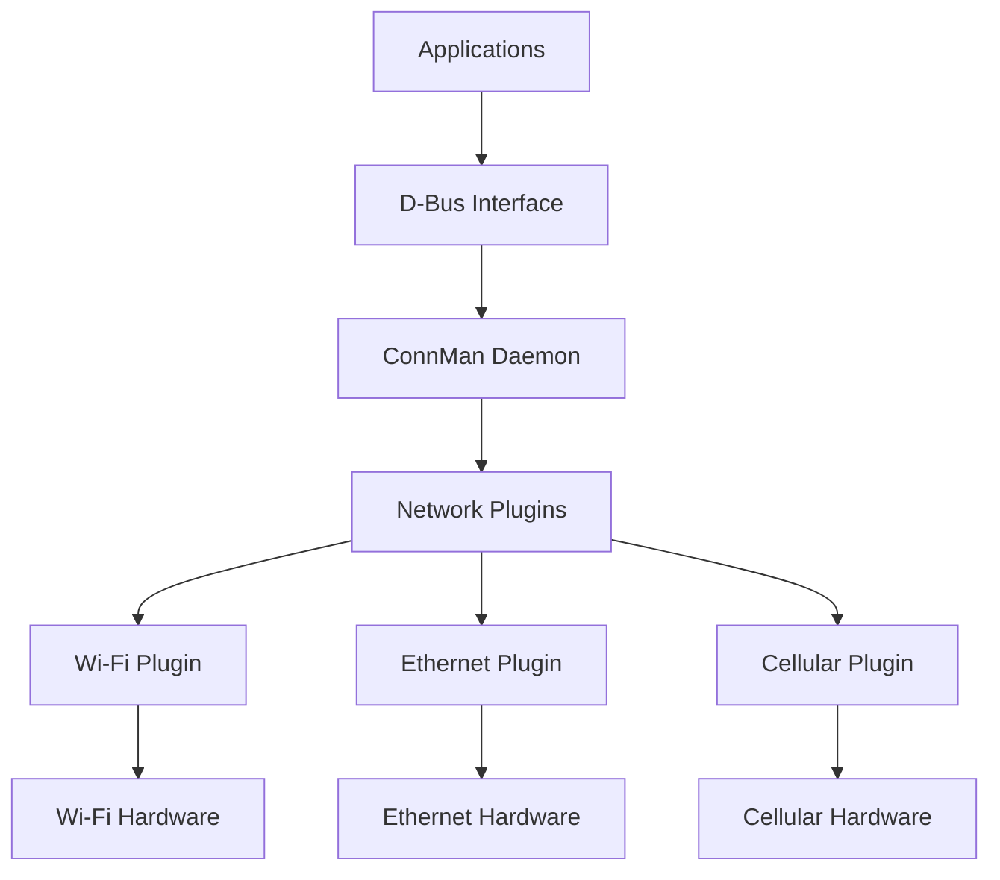

# ConnMan Network Manager

ConnMan (Connection Manager) is a network management system used in the Nest thermostat to handle network connectivity, configuration, and management. It provides a unified interface for managing different network technologies including Wi-Fi, Ethernet, and cellular connections.

## ConnMan Overview

### Purpose and Features
- **Unified Management**: Single interface for all network technologies
- **Automatic Configuration**: Automatic network configuration and setup
- **Service Management**: Network service lifecycle management
- **Policy Enforcement**: Network policy and access control
- **Power Optimization**: Network power management and optimization

### Architecture


## Core Components

### ConnMan Daemon
- **Main Process**: Core network management daemon
- **D-Bus Service**: D-Bus service for application communication
- **Plugin System**: Extensible plugin architecture
- **Configuration**: Network configuration and policy management

### Plugin Architecture
- **Wi-Fi Plugin**: 802.11 wireless network management
- **Ethernet Plugin**: Wired network management
- **Bluetooth Plugin**: Bluetooth network management
- **Cellular Plugin**: Cellular network management
- **VPN Plugin**: Virtual private network management

## Service Management

### Network Services
- **Service Types**: Wi-Fi, Ethernet, Cellular, VPN
- **Service States**: Offline, Association, Configuration, Ready, Online
- **Service Priority**: Service selection based on priority
- **Service Fallback**: Automatic fallback to backup services

### Service Lifecycle
```c
// Service lifecycle states
typedef enum {
    SERVICE_STATE_OFFLINE = 0,    // Service not connected
    SERVICE_STATE_ASSOCIATION,    // Associating with network
    SERVICE_STATE_CONFIGURATION,  // Getting IP configuration
    SERVICE_STATE_READY,          // Connected but no internet
    SERVICE_STATE_ONLINE,         // Connected with internet
    SERVICE_STATE_DISCONNECT,     // Disconnecting
    SERVICE_STATE_FAILURE         // Connection failed
} service_state_t;
```

### Service Configuration
```bash
# Service configuration example
[service_wifi_home]
Type = wifi
Name = HomeNetwork
Passphrase = password123
Security = psk
IPv4 = dhcp
IPv6 = auto
Priority = 10
AutoConnect = true
```

## D-Bus Interface

### D-Bus API
- **Service Interface**: Network service management
- **Technology Interface**: Network technology management
- **Manager Interface**: Global network management
- **Agent Interface**: User interaction for authentication

### API Methods
```c
// Main D-Bus API methods
// Get list of available services
DBusMessage *get_services(void);

// Connect to a specific service
DBusMessage *connect_service(const char *service_path);

// Disconnect from a service
DBusMessage *disconnect_service(const char *service_path);

// Set service property
DBusMessage *set_service_property(const char *service_path, 
                                  const char *property, 
                                  DBusMessageIter *value);
```

### Signal Handling
- **Service Added**: New service available
- **Service Removed**: Service no longer available
- **Property Changed**: Service property changed
- **Technology Changed**: Network technology state changed

## Configuration Management

### Configuration Files
- **Main Config**: `/etc/connman/main.conf`
- **Service Config**: `/var/lib/connman/settings`
- **Profile Config**: Network profile configurations
- **Policy Config**: Network policy configurations

### Main Configuration
```bash
# /etc/connman/main.conf
[General]
SingleConnectedTechnology = true
AllowHostnameUpdates = false
TetheringTechnologies = wifi,wifi

[wifi]
EnableTechnology = true
Tethering = false
```

### Profile Management
- **Named Profiles**: Named network configuration profiles
- **Auto-Switching**: Automatic profile switching
- **Profile Priority**: Profile selection priority
- **Profile Backup**: Profile backup and restore

## Network Technologies

### Wi-Fi Technology
- **Scanning**: Background Wi-Fi network scanning
- **Connection**: Wi-Fi network connection management
- **Security**: WPA/WPA2/WPA3 security support
- **Power Management**: Wi-Fi power management

### Ethernet Technology
- **Cable Detection**: Automatic cable detection
- **Link Configuration**: Ethernet link configuration
- **Speed Negotiation**: Auto-negotiation of speed/duplex
- **Static/DHCP**: Static and DHCP IP configuration

### Cellular Technology
- **SIM Management**: SIM card management
- **APN Configuration**: Access Point Name configuration
- **Roaming**: Cellular roaming management
- **Data Usage**: Data usage monitoring and control

## Power Management

### Power Saving Features
- **Sleep Modes**: Network interface sleep modes
- **Wake-on-LAN**: Wake on LAN capabilities
- **Adaptive Power**: Adaptive power management
- **Battery Optimization**: Battery operation optimization

### Power Policies
```c
// Power management configuration
typedef struct {
    bool wifi_power_save;        // Wi-Fi power save enabled
    int wifi_sleep_timeout;      // Wi-Fi sleep timeout
    bool eth_power_down;         // Ethernet power down when idle
    int cellular_scan_interval; // Cellular scan interval
} power_policy_t;
```

## Security Features

### Network Security
- **WPA/WPA2**: Wi-Fi protected access support
- **802.1X**: IEEE 802.1X authentication
- **VPN Support**: Virtual private network support
- **Firewall**: Built-in firewall capabilities

### Certificate Management
- **Client Certificates**: Client certificate management
- **CA Certificates**: Certificate authority management
- **Certificate Validation**: Certificate validation and revocation
- **Secure Storage**: Secure certificate storage

## Monitoring and Diagnostics

### Network Monitoring
- **Link Quality**: Real-time link quality monitoring
- **Signal Strength**: Wi-Fi signal strength monitoring
- **Data Usage**: Network data usage tracking
- **Connection History**: Connection history and statistics

### Diagnostic Tools
```bash
# ConnMan diagnostic commands
connmanctl technologies          # List available technologies
connmanctl services              # List available services
connmanctl scan wifi            # Scan for Wi-Fi networks
connmanctl connect wifi_...     # Connect to Wi-Fi service
connmanctl disconnect wifi_...  # Disconnect from service
```

### Status Information
- **Service Status**: Detailed service status information
- **Technology Status**: Network technology status
- **Statistics**: Network usage and performance statistics
- **Error Logs**: Error and warning logs

## Performance Optimization

### Connection Optimization
- **Fast Roaming**: Fast access point roaming
- **Load Balancing**: Load balancing across connections
- **Redundancy**: Connection redundancy and failover
- **Quality of Service**: QoS for network traffic

### Resource Optimization
- **Memory Usage**: Optimized memory usage
- **CPU Usage**: Efficient CPU utilization
- **Battery Life**: Extended battery life optimization
- **Network Efficiency**: Efficient network resource usage

## Integration with Applications

### Application API
- **High-level API**: Simplified API for applications
- **Event Notification**: Network event notifications
- **Status Queries**: Network status queries
- **Configuration**: Network configuration access

### Integration Examples
```c
// Application integration example
#include <connman.h>

// Network status callback
void network_status_callback(network_status_t status) {
    switch (status) {
        case NETWORK_CONNECTED:
            start_cloud_services();
            break;
        case NETWORK_DISCONNECTED:
            stop_cloud_services();
            break;
    }
}

// Register for network events
int register_network_callback(void) {
    return connman_register_status_callback(network_status_callback);
}
```

## Troubleshooting

### Common Issues
- **Connection Failures**: Authentication or configuration issues
- **Intermittent Connectivity**: Signal or interference issues
- **Slow Performance**: Network congestion or configuration issues
- **Power Issues**: Excessive power consumption

### Debug Commands
```bash
# Debug and troubleshooting commands
connmanctl --debug              # Enable debug mode
journalctl -u connman           # View ConnMan logs
connmanctl state wifi           # Check Wi-Fi technology state
connmanctl services             # List all services with status
```

### Log Analysis
- **System Logs**: System log integration
- **Debug Logs**: Detailed debug logging
- **Performance Logs**: Performance metric logging
- **Error Logs**: Error and warning log analysis

## Development and Customization

### Plugin Development
- **Plugin API**: Plugin development API
- **Template**: Plugin development template
- **Testing**: Plugin testing framework
- **Documentation**: Plugin development documentation

### Custom Configuration
- **Custom Policies**: Custom network policies
- **Custom Technologies**: Custom network technology support
- **Integration**: Custom system integration
- **Optimization**: Performance optimization

## Standards and Compliance

### Network Standards
- **IEEE 802.11**: Wi-Fi standards compliance
- **Ethernet**: IEEE 802.3 Ethernet standards
- **Cellular**: 3G/4G/5G cellular standards
- **VPN**: VPN protocol standards

### Regulatory Compliance
- **FCC**: Federal Communications Commission
- **CE**: European Conformity
- **IC**: Industry Canada
- **RCM**: Regulatory Compliance Mark

## Related Documentation

- [Network Overview](./overview.mdx)
- [Wi-Fi Interface](./wifi.mdx)
- [Weave Protocol](./weave-protocol.mdx)
- [System Services](../system-services.mdx)
