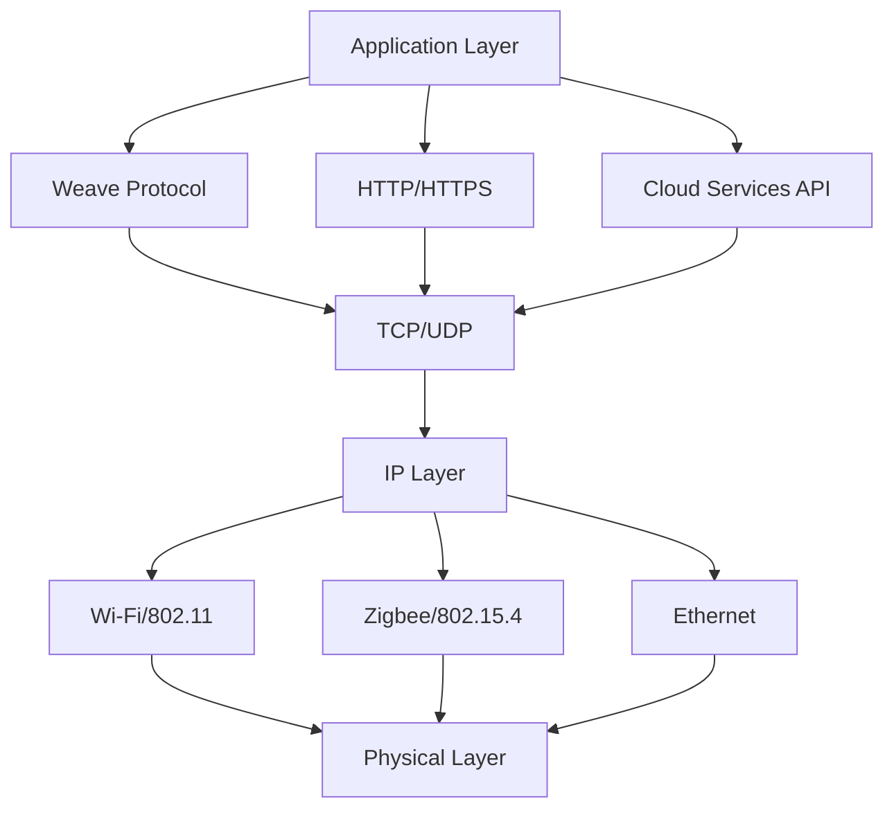
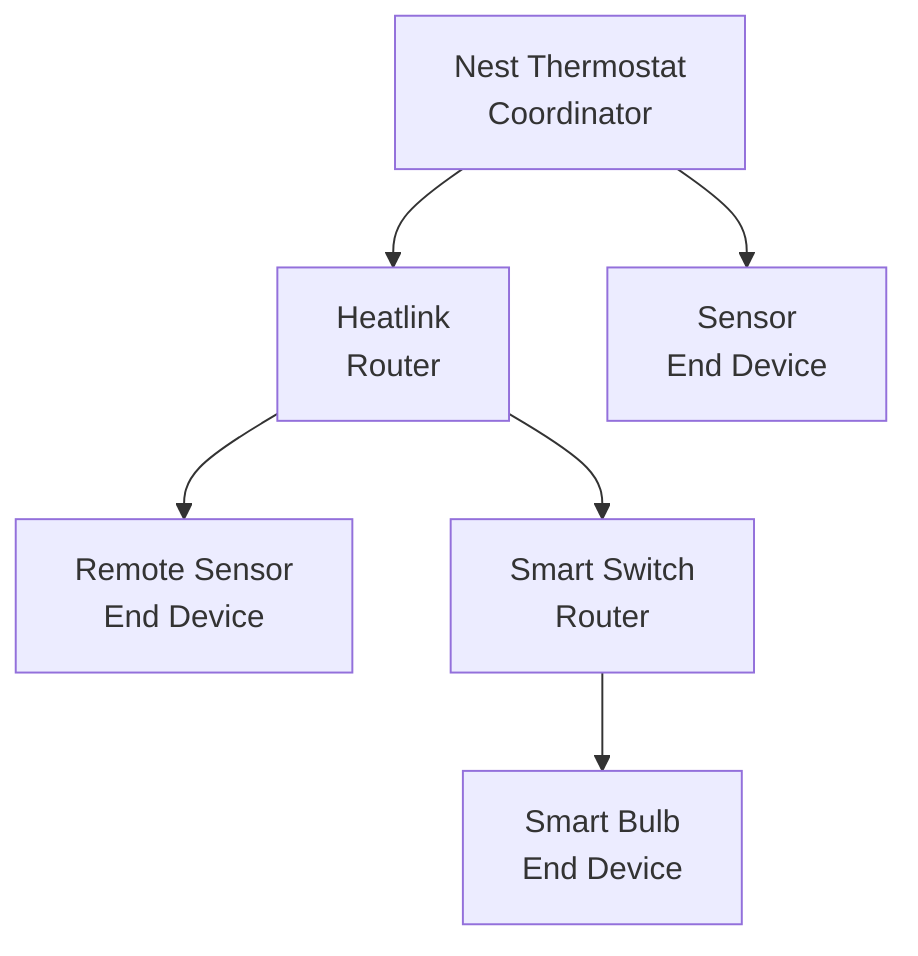
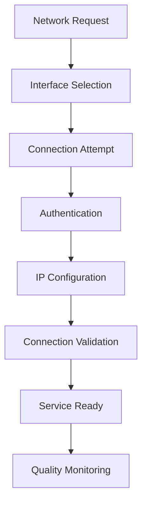

# Network Overview

The Nest Learning Thermostat incorporates sophisticated networking capabilities that enable cloud connectivity, mobile app integration, and smart home communication. The networking stack is designed for reliability, security, and energy efficiency.

## Network Architecture

### Network Stack Layers


### Key Components
- **Wi-Fi Interface**: Primary internet connectivity
- **Zigbee Interface**: Heatlink and smart home communication
- **Weave Protocol**: Nest's device-to-device communication
- **ConnMan**: Network connection management
- **Cloud Services**: Remote connectivity and data synchronization

## Wi-Fi Connectivity

### Wi-Fi Specifications
- **Standard**: 802.11b/g/n (2.4GHz)
- **Frequency**: 2.4GHz ISM band
- **Channels**: 1-13 (region dependent)
- **Data Rates**: Up to 72Mbps (802.11n)
- **Security**: WPA2/WPA3 personal and enterprise
- **Power Management**: 802.11 power saving enabled

### Wi-Fi Features
- **Auto-Connect**: Automatic connection to saved networks
- **Network Scanning**: Background network discovery
- **Roaming**: Seamless access point roaming
- **Fallback**: Automatic fallback to backup networks
- **Quality Monitoring**: Real-time link quality assessment

### Wi-Fi Configuration
```bash
# ConnMan Wi-Fi service configuration
[service_wifi]
Type = wifi
Name = HomeNetwork
Passphrase = password123
Security = psk
IPv4 = dhcp
IPv6 = auto
```

## Zigbee Networking

### Zigbee Specifications
- **Standard**: IEEE 802.15.4 physical layer
- **Protocol**: Zigbee PRO network layer
- **Frequency**: 2.4GHz ISM band
- **Data Rate**: 250kbps nominal
- **Range**: 10-100m indoor (mesh extended)
- **Network Size**: Up to 65,000 devices

### Zigbee Features
- **Mesh Networking**: Self-healing multi-hop network
- **Low Power**: Ultra-low power consumption
- **Security**: AES-128 encryption and authentication
- **Device Roles**: Coordinator, Router, End Device
- **Network Management**: Automatic network formation and repair

### Zigbee Network Topology


## Weave Protocol

### Protocol Overview
- **Purpose**: Nest's proprietary device communication protocol
- **Features**: Secure communication, mesh networking, cloud integration
- **Security**: End-to-end encryption, certificate-based authentication
- **Integration**: Mobile app and cloud service integration
- **Standards**: Based on IP and standard networking protocols

### Weave Features
- **Device Discovery**: Automatic device discovery and pairing
- **Secure Pairing**: Secure device pairing process
- **Message Routing**: Intelligent message routing in mesh networks
- **Cloud Integration**: Seamless cloud service integration
- **Mobile App**: Native mobile app connectivity

### Weave Communication
```c
// Weave message structure
typedef struct {
    uint16_t message_type;     // Message type identifier
    uint32_t source_id;        // Source device ID
    uint32_t dest_id;          // Destination device ID
    uint16_t payload_length;   // Payload data length
    uint8_t *payload;          // Message payload data
    uint8_t signature[64];     // Message signature
} weave_message_t;
```

## Network Management

### ConnMan Integration
- **Purpose**: Connection manager for network interfaces
- **Features**: Automatic network management, failover
- **Configuration**: Network profile and configuration management
- **Monitoring**: Network status and quality monitoring
- **Power Optimization**: Network power management

### Connection Management


### Network States
- **Disconnected**: No network connection available
- **Connecting**: Attempting to establish connection
- **Connected**: Successfully connected and operational
- **Roaming**: Moving between access points
- **Error**: Connection error or failure

## Cloud Connectivity

### Cloud Services
- **API Endpoints**: RESTful API for cloud communication
- **Data Synchronization**: Configuration and usage data sync
- **Remote Control**: Mobile app and web interface control
- **Firmware Updates**: Over-the-air update distribution
- **Analytics**: Usage analytics and diagnostics

### Communication Protocols
- **HTTPS**: Secure HTTP communication
- **MQTT**: Lightweight messaging protocol
- **WebSockets**: Real-time bidirectional communication
- **gRPC**: High-performance RPC communication

### Cloud API Integration
```c
// Cloud API client
typedef struct {
    char endpoint_url[256];
    char api_key[64];
    char device_id[32];
    auth_token_t auth_token;
} cloud_config_t;

int send_telemetry(cloud_config_t *config, telemetry_data_t *data) {
    // Prepare HTTPS request
    http_request_t request = {
        .method = "POST",
        .url = config->endpoint_url,
        .headers = {
            "Authorization: Bearer " + config->auth_token,
            "Content-Type: application/json"
        }
    };
    
    // Send telemetry data
    return http_send_request(&request, data);
}
```

## Network Security

### Security Features
- **Encryption**: TLS/SSL for all network communication
- **Authentication**: Certificate-based device authentication
- **Access Control**: Network access control and filtering
- **Firewall**: Built-in firewall and packet filtering
- **VPN Support**: Secure remote access capabilities

### Certificate Management
- **Device Certificates**: Unique X.509 certificates per device
- **Certificate Renewal**: Automatic certificate renewal
- **Root CA**: Trusted certificate authority management
- **Revocation**: Certificate revocation checking

### Security Configuration
```bash
# Network security configuration
[security]
tls_version = 1.3
cipher_suites = TLS_AES_256_GCM_SHA384,TLS_CHACHA20_POLY1305_SHA256
certificate_validation = strict
pin_domain = true
```

## Performance Optimization

### Network Performance
- **Latency**: <100ms typical cloud response time
- **Throughput**: Optimized for low-bandwidth applications
- **Reliability**: >99.9% connection reliability
- **Power Efficiency**: Optimized for battery operation

### Optimization Techniques
- **Connection Pooling**: Reuse network connections
- **Data Compression**: Compress network payloads
- **Batching**: Batch multiple operations together
- **Caching**: Cache frequently accessed data

### Quality of Service
- **Priority**: Message priority and queuing
- **Throttling**: Bandwidth throttling and control
- **Load Balancing**: Load distribution across connections
- **Failover**: Automatic failover to backup connections

## Network Diagnostics

### Diagnostic Tools
- **Ping**: Network connectivity testing
- **Traceroute**: Network path analysis
- **Speed Test**: Network bandwidth testing
- **Signal Analysis**: Wi-Fi signal strength analysis

### Health Monitoring
- **Link Quality**: Real-time link quality monitoring
- **Packet Loss**: Packet loss detection and reporting
- **Latency Monitoring**: Network latency tracking
- **Connection History**: Connection history and statistics

### Diagnostic Commands
```bash
# Network diagnostics
wifi-scan --analyze              # Wi-Fi network analysis
zigbee-tool --topology           # Zigbee network topology
weave-client --test-connection   # Weave connectivity test
ping -c 4 google.com            # Internet connectivity test
```

## Troubleshooting

### Common Issues
- **Connection Failures**: Wi-Fi authentication or association failures
- **Intermittent Connectivity**: Signal interference or network congestion
- **Slow Performance**: Bandwidth limitations or network congestion
- **Security Issues**: Certificate or authentication problems

### Resolution Strategies
- **Channel Optimization**: Switch to less congested Wi-Fi channels
- **Signal Strength**: Improve signal strength or add repeaters
- **Network Reset**: Reset network configuration and retry
- **Firmware Update**: Update network driver and firmware

## Development and Testing

### Development Environment
- **Simulator**: Network simulation environment
- **Emulator**: Hardware emulator for testing
- **Debug Tools**: Network debugging and analysis tools
- **Test Framework**: Automated network testing

### Testing Procedures
- **Connectivity Testing**: Network connection testing
- **Performance Testing**: Network performance benchmarking
- **Security Testing**: Network security validation
- **Stress Testing**: Network stress and load testing

## Related Documentation

- [Wi-Fi Interface](./wifi.mdx)
- [Zigbee Interface](./zigbee.mdx)
- [Weave Protocol](./weave-protocol.mdx)
- [ConnMan Manager](./connman.mdx)
