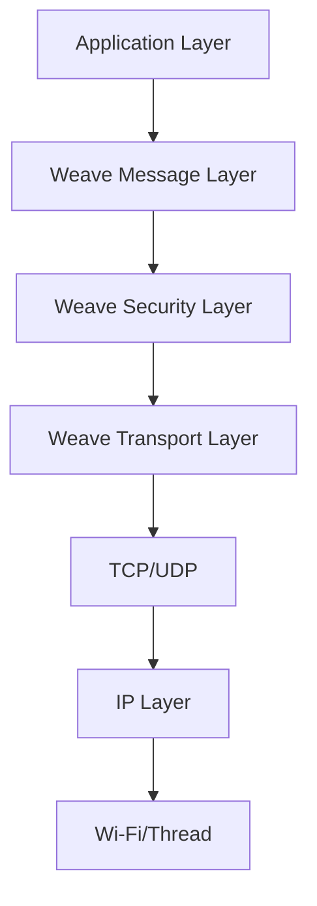
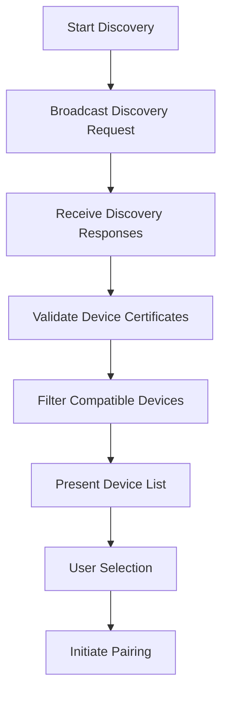

# Weave Protocol

Weave is Nest's proprietary communication protocol that enables secure, reliable device-to-device communication and cloud integration. It provides the foundation for mobile app connectivity, smart home integration, and cloud services.

## Protocol Overview

### Design Goals
- **Security**: End-to-end encryption and authentication
- **Reliability**: Reliable message delivery and error recovery
- **Scalability**: Support for large-scale device networks
- **Interoperability**: Cross-platform compatibility
- **Power Efficiency**: Optimized for battery-powered devices

### Protocol Stack


## Message Architecture

### Message Types
- **Data Messages**: Application data exchange
- **Control Messages**: Protocol control and management
- **Status Messages**: Status and error reporting
- **Discovery Messages**: Device discovery and identification
- **Authentication Messages**: Secure authentication and pairing

### Message Format
```
+--------+--------+--------+--------+--------+--------+
| Version | Type   | Flags  | Length | Message ID |
+--------+--------+--------+--------+--------+--------+
| Source Node ID | Destination Node ID | Payload |
+--------+--------+--------+--------+--------+
| Signature | Timestamp | Options |
+--------+--------+--------+--------+
```

### Message Structure
```c
// Weave message structure
typedef struct {
    uint8_t version;            // Protocol version
    uint16_t message_type;      // Message type identifier
    uint16_t flags;             // Message flags
    uint32_t length;            // Message payload length
    uint64_t message_id;        // Unique message identifier
    uint64_t source_id;         // Source device ID
    uint64_t dest_id;           // Destination device ID
    uint8_t *payload;           // Message payload data
    uint8_t signature[64];      // Message signature
    uint32_t timestamp;         // Message timestamp
} weave_message_t;
```

## Security Architecture

### Authentication Framework
- **Device Certificates**: X.509 certificates for device authentication
- **Pairing Codes**: Secure pairing process with verification codes
- **Session Keys**: Ephemeral session keys for communication
- **Certificate Revocation**: Automatic certificate revocation checking

### Encryption Standards
- **AES-256**: Advanced Encryption Standard with 256-bit keys
- **ECDH**: Elliptic Curve Diffie-Hellman key exchange
- **ECDSA**: Elliptic Curve Digital Signature Algorithm
- **SHA-256**: Secure Hash Algorithm for integrity

### Security Layers
```c
// Security configuration
typedef struct {
    uint8_t session_key[32];    // Session encryption key
    uint8_t mac_key[16];        // Message authentication key
    uint64_t certificate_id;    // Device certificate identifier
    uint32_t key_expiration;    // Key expiration time
    security_level_t level;     // Security level
} weave_security_t;
```

## Device Discovery

### Discovery Process


### Discovery Features
- **mDNS/Bonjour**: Local network device discovery
- **Bluetooth LE**: Proximity-based discovery
- **QR Codes**: Visual discovery and pairing
- **NFC**: Near Field Communication pairing
- **Manual Entry**: Manual device ID entry

### Discovery Protocols
- **Weave Discovery**: Proprietary discovery protocol
- **UPnP**: Universal Plug and Play discovery
- **DNS-SD**: DNS-based Service Discovery
- **Custom Protocols**: Application-specific discovery

## Network Topology

### Topology Types
- **Star**: Central hub with connected devices
- **Mesh**: Multi-hop mesh network
- **Hybrid**: Combination of star and mesh
- **Cloud**: Cloud-mediated connectivity

### Mesh Networking
- **Routing**: Dynamic routing algorithms
- **Self-Healing**: Automatic network repair
- **Load Balancing**: Traffic load distribution
- **Optimization**: Network performance optimization

### Network Management
```c
// Network management structure
typedef struct {
    uint64_t network_id;        // Network identifier
    uint64_t coordinator_id;    // Network coordinator
    uint32_t max_nodes;         // Maximum node count
    uint32_t current_nodes;     // Current node count
    routing_table_t routes;     // Routing table
    network_stats_t stats;      // Network statistics
} weave_network_t;
```

## Transport Layer

### Transport Protocols
- **TCP**: Reliable stream-based communication
- **UDP**: Low-latency datagram communication
- **TLS**: Secure transport layer
- **WebSockets**: Real-time bidirectional communication

### Connection Management
- **Connection Pooling**: Efficient connection reuse
- **Keep-Alive**: Connection keep-alive mechanisms
- **Failover**: Automatic connection failover
- **Load Balancing**: Connection load balancing

### Quality of Service
- **Priority**: Message priority queuing
- **Reliability**: Guaranteed message delivery
- **Latency**: Low-latency message delivery
- **Throughput**: High-throughput data transfer

## Cloud Integration

### Cloud Services
- **Device Registry**: Cloud device registration and management
- **Data Synchronization**: Configuration and state synchronization
- **Remote Access**: Secure remote device access
- **Analytics**: Usage analytics and insights

### API Integration
```c
// Cloud API client
typedef struct {
    char endpoint[256];         // API endpoint URL
    char api_key[64];           // API authentication key
    uint64_t device_id;         // Device identifier
    auth_token_t token;         // Authentication token
    connection_pool_t pool;     // Connection pool
} weave_cloud_client_t;

int send_telemetry(weave_cloud_client_t *client, 
                   telemetry_data_t *data) {
    // Prepare and send telemetry data to cloud
    return cloud_api_post(client, "/telemetry", data);
}
```

### Data Synchronization
- **Configuration Sync**: Device configuration synchronization
- **State Sync**: Device state synchronization
- **Firmware Sync**: Firmware update synchronization
- **Backup/Restore**: Configuration backup and restore

## Mobile App Integration

### App Connectivity
- **Native SDK**: iOS and Android SDK integration
- **Authentication**: Secure app authentication
- **Real-time Updates**: Real-time device status updates
- **Remote Control**: Remote device control capabilities

### SDK Features
```c
// Mobile SDK example
typedef struct {
    device_discovery_cb discovery_callback;
    message_received_cb message_callback;
    connection_status_cb status_callback;
    error_handler_cb error_callback;
} weave_sdk_callbacks_t;

int weave_sdk_initialize(weave_sdk_callbacks_t *callbacks);
int weave_sdk_discover_devices(void);
int weave_sdk_connect_device(uint64_t device_id);
int weave_sdk_send_message(uint64_t device_id, weave_message_t *msg);
```

## Performance Optimization

### Message Optimization
- **Compression**: Message payload compression
- **Batching**: Message batching for efficiency
- **Caching**: Response caching for performance
- **Prefetching**: Data prefetching for responsiveness

### Network Optimization
- **Connection Reuse**: Connection pooling and reuse
- **Bandwidth Management**: Intelligent bandwidth usage
- **Latency Optimization**: Latency reduction techniques
- **Error Recovery**: Fast error recovery mechanisms

## Testing and Debugging

### Testing Framework
- **Unit Tests**: Component-level testing
- **Integration Tests**: System integration testing
- **Performance Tests**: Performance benchmarking
- **Security Tests**: Security vulnerability testing

### Debugging Tools
- **Packet Capture**: Weave protocol packet capture
- **Message Analyzer**: Message analysis and debugging
- **Network Simulator**: Network simulation for testing
- **Performance Monitor**: Real-time performance monitoring

## Implementation Examples

### Device Registration
```c
// Device registration process
int register_device_with_cloud(weave_device_info_t *device_info) {
    // Generate device certificate signing request
    csr_t *csr = generate_csr(device_info);
    
    // Send CSR to cloud for certificate generation
    certificate_t *cert = cloud_sign_certificate(csr);
    
    // Install certificate on device
    install_certificate(cert);
    
    // Register device with cloud services
    return cloud_register_device(device_info, cert);
}
```

### Message Exchange
```c
// Secure message exchange
int send_secure_message(uint64_t dest_id, uint8_t *data, size_t length) {
    weave_message_t msg = {
        .source_id = get_device_id(),
        .dest_id = dest_id,
        .message_type = DATA_MESSAGE,
        .payload = data,
        .length = length,
        .timestamp = get_current_time()
    };
    
    // Encrypt and sign message
    encrypt_message(&msg);
    sign_message(&msg);
    
    // Send message through transport layer
    return transport_send_message(&msg);
}
```

## Standards and Compliance

### Security Standards
- **FIPS 140-2**: Federal Information Processing Standards
- **Common Criteria**: Common Criteria security evaluation
- **ISO 27001**: Information security management
- **NIST**: National Institute of Standards and Technology

### Privacy Standards
- **GDPR**: General Data Protection Regulation
- **CCPA**: California Consumer Privacy Act
- **Privacy by Design**: Privacy-focused design principles
- **Data Minimization**: Data minimization practices

## Future Developments

### Protocol Evolution
- **Version 2.0**: Enhanced protocol features
- **Thread Integration**: Thread network protocol support
- **Matter Integration**: Matter/Thread protocol support
- **5G Support**: 5G network optimization

### Enhanced Features
- **AI Integration**: AI-powered network optimization
- **Edge Computing**: Edge computing capabilities
- **Blockchain**: Blockchain for security and trust
- **Quantum Resistance**: Quantum-resistant cryptography

## Related Documentation

- [Network Overview](./overview.mdx)
- [Wi-Fi Interface](./wifi.mdx)
- [Zigbee Interface](./zigbee.mdx)
- [Cloud Services](../../api-reference/introduction.mdx)
