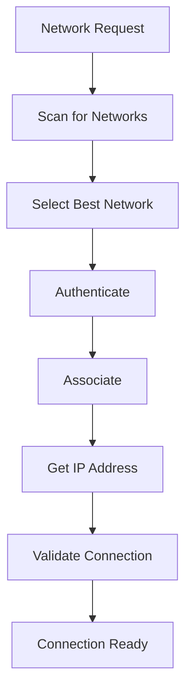

# Wi-Fi Interface

The Nest Learning Thermostat uses Wi-Fi as its primary means of internet connectivity, enabling cloud services, mobile app integration, and remote access. The Wi-Fi implementation is optimized for reliability, security, and power efficiency.

## Wi-Fi Hardware

### Wireless Module
- **Standard**: 802.11b/g/n (2.4GHz only)
- **Chipset**: TI SimpleLink or similar embedded Wi-Fi solution
- **Antenna**: Internal PCB antenna with optimized radiation pattern
- **Power**: +18dBm maximum transmit power
- **Sensitivity**: -95dBm typical receive sensitivity

### RF Specifications
| Parameter | Value | Description |
|-----------|-------|-------------|
| Frequency Range | 2401-2483MHz | 2.4GHz ISM band |
| Channels | 1-13 | Regional channel availability |
| Modulation | DSSS, OFDM | Compatible with all standards |
| Data Rate | 1-72Mbps | Variable rate adaptation |
| Security | WPA2/WPA3 | Enterprise and personal security |

## Wi-Fi Features

### Connectivity Features
- **Auto-Connect**: Automatic connection to saved networks
- **Network Scanning**: Background network discovery and monitoring
- **Roaming**: Seamless roaming between access points
- **Hotspot Support**: Wi-Fi hotspot setup capability
- **Captive Portal**: Captive portal detection and handling

### Power Management
- **Power Save Mode**: 802.11 power saving enabled
- **Sleep Modes**: Aggressive sleep policies for battery operation
- **Beacon Listening**: Optimized beacon listening intervals
- **Dynamic Power**: Adaptive transmit power control

### Security Features
- **WPA2/WPA3**: Support for latest Wi-Fi security standards
- **Enterprise**: EAP-TLS, PEAP enterprise authentication
- **Personal**: WPA2-PSK, WPA3-SAE personal security
- **Hidden Networks**: Support for hidden SSID networks

## Network Configuration

### ConnMan Integration
```bash
# Wi-Fi service configuration example
[service_wifi_home]
Type = wifi
Name = MyHomeNetwork
Passphrase = mypassword123
Security = psk
IPv4 = dhcp
IPv6 = auto
Priority = 10

[service_wifi_work]
Type = wifi
Name = CorporateNetwork
EAP = peap
Identity = user@company.com
Passphrase = workpassword
Phase2 = MSCHAPV2
```

### Network Profiles
- **Saved Networks**: Encrypted storage of network credentials
- **Priority**: Network priority and selection preferences
- **Auto-Join**: Automatic joining based on signal strength and priority
- **Fallback**: Automatic fallback to backup networks

### Advanced Configuration
```c
// Wi-Fi configuration structure
typedef struct {
    char ssid[33];              // Network SSID
    char passphrase[65];        // WPA2 passphrase
    security_type_t security;   // Security type
    ip_config_t ip_config;      // IP configuration
    int priority;               // Network priority
    bool auto_connect;          // Auto-connect flag
    power_save_mode_t power;    // Power save mode
} wifi_config_t;
```

## Connection Management

### Connection Process


### Connection States
- **Idle**: No active network connection
- **Scanning**: Scanning for available networks
- **Connecting**: Attempting to connect to network
- **Authenticating**: Performing authentication
- **Associated**: Successfully associated with AP
- **Connected**: Full IP connectivity established
- **Error**: Connection failed or error state

### Error Handling
```c
// Wi-Fi error handling
typedef enum {
    WIFI_ERROR_NONE = 0,
    WIFI_ERROR_NO_NETWORKS,
    WIFI_ERROR_AUTH_FAILED,
    WIFI_ERROR_ASSOC_FAILED,
    WIFI_ERROR_DHCP_FAILED,
    WIFI_ERROR_SIGNAL_LOST,
    WIFI_ERROR_TIMEOUT
} wifi_error_t;

void handle_wifi_error(wifi_error_t error) {
    switch (error) {
        case WIFI_ERROR_AUTH_FAILED:
            retry_with_different_credentials();
            break;
        case WIFI_ERROR_SIGNAL_LOST:
            initiate_roaming_scan();
            break;
        case WIFI_ERROR_DHCP_FAILED:
            request_new_ip_lease();
            break;
        default:
            log_wifi_error(error);
            schedule_retry_connection();
    }
}
```

## Performance Optimization

### Data Rate Optimization
- **Rate Adaptation**: Automatic data rate adaptation based on link quality
- **MIMO Support**: Multiple input multiple output antenna diversity
- **Fragmentation**: Packet fragmentation for improved reliability
- **Aggregation**: Frame aggregation for improved throughput

### Range and Coverage
- **Transmit Power**: Adaptive transmit power control
- **Antenna Diversity**: Antenna diversity for improved signal
- **Channel Selection**: Intelligent channel selection
- **Interference Avoidance**: Interference detection and avoidance

### Quality of Service
- **Traffic Prioritization**: Priority for critical traffic
- **Bandwidth Management**: Bandwidth allocation and control
- **Latency Optimization**: Latency reduction techniques
- **Reliability**: Enhanced reliability mechanisms

## Network Monitoring

### Signal Quality Monitoring
```c
// Signal quality monitoring
typedef struct {
    int rssi;                   // Received signal strength
    int snr;                    // Signal-to-noise ratio
    int channel;                // Current channel
    int tx_rate;                // Transmit data rate
    int rx_rate;                // Receive data rate
    int error_rate;             // Packet error rate
} wifi_signal_info_t;

void monitor_signal_quality(void) {
    wifi_signal_info_t info;
    get_signal_info(&info);
    
    if (info.rssi < -80) {
        log_warning("Weak signal: %d dBm", info.rssi);
        consider_roaming();
    }
    
    if (info.error_rate > 5) {
        log_warning("High error rate: %d%%", info.error_rate);
        request_lower_data_rate();
    }
}
```

### Network Statistics
- **Connection History**: Historical connection data
- **Performance Metrics**: Throughput, latency, jitter measurements
- **Error Statistics**: Error rates and types
- **Usage Analytics**: Data usage tracking and analysis

## Security Implementation

### Authentication Methods
- **WPA2-Personal**: Pre-shared key authentication
- **WPA3-Personal**: Simultaneous authentication of equals (SAE)
- **WPA2-Enterprise**: 802.1X/EAP authentication
- **WPA3-Enterprise**: Enhanced enterprise security

### Encryption Standards
- **CCMP**: Counter mode with CBC-MAC protocol
- **GCMP**: Galois/Counter Mode protocol
- **TKIP**: Temporal Key Integrity Protocol (legacy)
- **WEP**: Wired Equivalent Privacy (deprecated)

### Security Configuration
```bash
# Wi-Fi security configuration
[wifi_security]
security_mode = wpa3_sae
cipher_suite = gcmp_256
key_management = sae
pmf_required = true
ocsp_stapling = true
```

## Troubleshooting and Diagnostics

### Diagnostic Tools
- **Wi-Fi Scan**: Detailed network scanning and analysis
- **Signal Analysis**: Real-time signal strength and quality
- **Connection Test**: End-to-end connectivity testing
- **Speed Test**: Network throughput and latency testing

### Common Issues
- **Authentication Failures**: Incorrect credentials or security settings
- **Signal Problems**: Weak signal or interference
- **Connection Drops**: Intermittent connection issues
- **Slow Performance**: Low data rates or congestion

### Debug Commands
```bash
# Wi-Fi debugging commands
wifi-tool --scan                 # Scan for networks
wifi-tool --signal               # Show signal strength
wifi-tool --connect <ssid>       # Connect to network
wifi-tool --disconnect           # Disconnect from network
wifi-tool --status               # Show connection status
```

## Power Management

### Power Save Modes
- **CAM**: Constantly awake mode (maximum performance)
- **PS-Poll**: Power save poll mode
- **U-APSD**: Unscheduled automatic power save delivery
- **Deep Sleep**: Maximum power saving mode

### Power Optimization
- **Beacon Interval**: Optimized beacon listening intervals
- **DTIM Period**: Dynamic TIM period adjustment
- **Sleep Scheduling**: Intelligent sleep scheduling
- **Wake Triggers**: Optimized wake-up triggers

## Development and Testing

### Development Environment
- **Simulator**: Wi-Fi network simulation
- **Emulator**: Hardware emulation for testing
- **Debug Tools**: Comprehensive debugging toolkit
- **Test Framework**: Automated testing framework

### Testing Procedures
- **Connectivity Testing**: Network connection validation
- **Performance Testing**: Throughput and latency testing
- **Security Testing**: Security vulnerability assessment
- **Reliability Testing**: Long-term reliability testing

## Standards and Compliance

### Wi-Fi Standards
- **802.11b**: 2.4GHz, 11Mbps maximum
- **802.11g**: 2.4GHz, 54Mbps maximum
- **802.11n**: 2.4GHz, 72Mbps maximum (with 20MHz channel)
- **802.11ac**: 5GHz (not supported in current hardware)

### Regulatory Compliance
- **FCC**: Federal Communications Commission (US)
- **CE**: European Conformity (EU)
- **IC**: Innovation, Science and Economic Development (Canada)
- **RCM**: Regulatory Compliance Mark (Australia)

## Related Documentation

- [Network Overview](./overview.mdx)
- [Zigbee Interface](./zigbee.mdx)
- [Weave Protocol](./weave-protocol.mdx)
- [ConnMan Manager](./connman.mdx)
