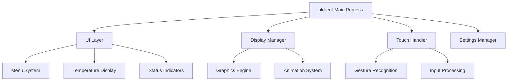
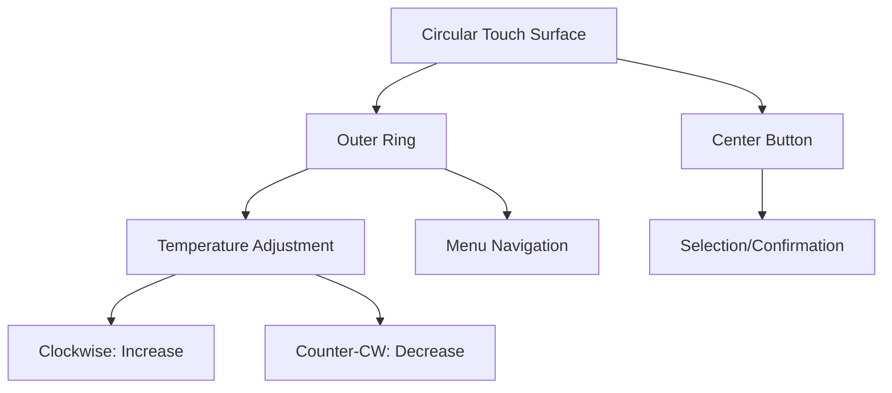

# nlclient Application

nlclient is the primary user interface application for the Nest Learning Thermostat. It handles all user interactions, display rendering, and provides the main interface through which users control their HVAC system.

## Application Overview

### Purpose and Responsibilities
- **User Interface**: Primary touch-based user interface
- **Display Management**: Circular display rendering and control
- **Touch Handling**: Capacitive touch input processing
- **Settings Management**: User preferences and configuration
- **Status Display**: Real-time system status indication

### Application Architecture


## Core Components

### Main Application Loop
```c
// Simplified main loop structure
int main(int argc, char *argv[]) {
    // Initialize subsystems
    init_display_system();
    init_touch_system();
    init_dbus_connection();
    load_configuration();
    
    // Main event loop
    while (running) {
        process_touch_events();
        update_display();
        handle_dbus_messages();
        process_timers();
    }
    
    cleanup_and_exit();
    return 0;
}
```

### Display Management
- **Framebuffer**: Direct framebuffer access for performance
- **Graphics Engine**: Custom 2D graphics rendering engine
- **Font Rendering**: Anti-aliased font rendering system
- **Color Management**: Color space and calibration management

### Touch System
- **Controller Interface**: I2C touch controller communication
- **Event Processing**: Raw touch data processing and filtering
- **Gesture Recognition**: Multi-touch gesture recognition
- **Haptic Feedback**: Optional vibration feedback system

## User Interface System

### Display Modes
- **Normal Mode**: Standard temperature display
- **Menu Mode**: Settings and configuration interface
- **Farsight Mode**: Distance viewing mode
- **Eco Mode**: Energy-saving display mode
- **Setup Mode**: Initial setup and wizard

### Screen Layout
```
┌─────────────────────────┐
│      Status Bar         │
│  ┌─────────────────┐    │
│  │                 │    │
│  │   Temperature   │    │
│  │     Display     │    │
│  │                 │    │
│  └─────────────────┘    │
│    Status Indicators     │
│      Bottom Bar          │
└─────────────────────────┘
```

### UI Elements
- **Temperature Display**: Large, prominent temperature readout
- **Status Icons**: Heating, cooling, fan, connectivity status
- **Menu Items**: Scrollable menu system
- **Progress Indicators**: Loading and progress indicators
- **Alert Messages**: System alerts and notifications

## Touch Interface

### Touch Zones


### Gesture Recognition
- **Single Tap**: Menu selection and confirmation
- **Double Tap**: Quick actions and shortcuts
- **Swipe**: Menu navigation and scrolling
- **Rotary Motion**: Temperature adjustment
- **Long Press**: Context menus and advanced options

### Touch Processing Pipeline
```c
// Touch event processing
typedef struct {
    int x, y;              // Touch coordinates
    int pressure;          // Touch pressure
    int timestamp;         // Event timestamp
    touch_type_t type;     // Touch event type
} touch_event_t;

void process_touch_event(touch_event_t *event) {
    // Coordinate transformation
    transform_coordinates(event);
    
    // Gesture recognition
    gesture_t gesture = recognize_gesture(event);
    
    // UI action mapping
    ui_action_t action = map_gesture_to_action(gesture);
    
    // Execute action
    execute_ui_action(action);
}
```

## Display Rendering

### Graphics Pipeline
- **Drawing Engine**: Custom 2D drawing engine
- **Font System**: Vector and bitmap font rendering
- **Animation System**: Smooth transition animations
- **Color Management**: Color calibration and correction

### Rendering Optimization
- **Double Buffering**: Flicker-free display updates
- **Partial Updates**: Efficient partial screen updates
- **Hardware Acceleration**: GPU-accelerated graphics
- **Memory Management**: Optimized graphics memory usage

### Animation System
```c
// Animation framework
typedef struct {
    float start_value;     // Animation start value
    float end_value;       // Animation end value
    int duration;          // Animation duration in ms
    easing_func_t easing;  // Easing function
    update_callback_t callback; // Update callback
} animation_t;

void update_animations(void) {
    for each animation in active_animations {
        float progress = calculate_progress(animation);
        float value = apply_easing(animation, progress);
        animation.callback(value);
        
        if (progress >= 1.0) {
            remove_animation(animation);
        }
    }
}
```

## Settings Management

### Configuration Categories
- **Temperature**: Temperature units, ranges, and preferences
- **System**: System settings and diagnostics
- **Network**: Wi-Fi and network configuration
- **Schedule**: Heating and cooling schedules
- **Energy**: Energy-saving features and settings
- **Advanced**: Advanced configuration options

### Settings Storage
- **Persistent Storage**: Settings saved to flash memory
- **Default Values**: Factory default settings
- **Validation**: Settings validation and error checking
- **Backup/Restore**: Settings backup and restore functionality

### Settings Interface
```c
// Settings data structure
typedef struct {
    char setting_name[64];
    setting_type_t type;
    union {
        int int_value;
        float float_value;
        char string_value[256];
        bool bool_value;
    } value;
    validation_func_t validator;
} setting_t;

bool update_setting(const char *name, void *value) {
    setting_t *setting = find_setting(name);
    if (!setting) return false;
    
    if (!setting->validator(value)) {
        show_error_message("Invalid setting value");
        return false;
    }
    
    update_setting_value(setting, value);
    save_settings_to_storage();
    notify_setting_change(name, value);
    return true;
}
```

## D-Bus Integration

### Service Communication
- **System Bus**: Connection to system D-Bus
- **Service Interfaces**: Interface to thermostat services
- **Signal Handling**: Asynchronous signal processing
- **Error Handling**: Robust error handling and recovery

### D-Bus API
```c
// D-Bus method calls
DBusMessage *call_thermostat_service(const char *method, 
                                     DBusMessageIter *args) {
    DBusMessage *msg = dbus_message_new_method_call(
        "com.nest.thermostat",
        "/com/nest/thermostat",
        "com.nest.thermostat",
        method
    );
    
    dbus_message_iter_append_iterator(msg, args);
    
    DBusMessage *reply = dbus_connection_send_with_reply_and_block(
        connection, msg, 1000, NULL
    );
    
    dbus_message_unref(msg);
    return reply;
}
```

### Signal Handling
- **Temperature Updates**: Real-time temperature signal handling
- **Status Changes**: System status change notifications
- **Configuration Updates**: Dynamic configuration updates
- **Error Notifications**: System error and warning signals

## Localization System

### Supported Languages
- **English**: en_US, en_GB
- **French**: fr_FR, fr_CA
- **German**: de_DE
- **Italian**: it_IT
- **Spanish**: es_ES, es_US
- **Dutch**: nl_NL

### Localization Architecture
- **Resource Files**: String resource files per language
- **Dynamic Loading**: Runtime language switching
- **Font Support**: Multi-language font rendering
- **RTL Support**: Right-to-left language support

### String Management
```c
// Localization function
const char *get_localized_string(const char *key) {
    return lookup_string(current_locale, key);
}

// Usage example
void show_temperature_screen(void) {
    const char *temp_label = get_localized_string("temperature");
    const char *degrees = get_localized_string("degrees_celsius");
    
    render_text(temp_label, x, y, font_large);
    render_temperature(current_temp, x, y + 30, font_huge);
    render_text(degrees, x + temp_width, y + 30, font_small);
}
```

## Performance Optimization

### Rendering Performance
- **Frame Rate**: Target 60 FPS rendering
- **Partial Updates**: Only update changed screen regions
- **Hardware Acceleration**: Utilize GPU for graphics operations
- **Memory Optimization**: Efficient graphics memory usage

### Touch Performance
- **Sampling Rate**: 100-200Hz touch sampling
- **Latency**: <10ms touch response time
- **Accuracy**: Sub-pixel touch accuracy
- **Multi-touch**: Up to 5 simultaneous touch points

### Memory Management
- **Heap Management**: Efficient heap allocation
- **Buffer Management**: Optimized buffer usage
- **Memory Pooling**: Pre-allocated memory pools
- **Garbage Collection**: Regular memory cleanup

## Error Handling and Recovery

### Error Detection
- **Touch Errors**: Touch controller fault detection
- **Display Errors**: Display hardware error detection
- **Memory Errors**: Memory allocation failure handling
- **Service Errors**: D-Bus service error handling

### Recovery Strategies
- **Service Restart**: Automatic service restart on failure
- **Fallback Modes**: Graceful degradation on errors
- **Error Logging**: Comprehensive error logging
- **User Notification**: User-friendly error messages

### Diagnostic Features
- **Self-Test**: Built-in diagnostic tests
- **Status Display**: System status information
- **Debug Mode**: Engineering debug interface
- **Log Export**: Diagnostic log export functionality

## Development and Testing

### Build Configuration
- **Cross-compilation**: ARM cross-compilation setup
- **Dependencies**: GTK+, D-Bus, system libraries
- **Debug Build**: Debug symbols and logging enabled
- **Release Build**: Optimized production build

### Testing Framework
- **Unit Tests**: Component unit testing
- **Integration Tests**: System integration testing
- **UI Tests**: User interface testing
- **Performance Tests**: Performance benchmarking

### Debugging Tools
- **Debug Logging**: Comprehensive debug logging
- **Performance Profiling**: Performance analysis tools
- **Memory Debugging**: Memory leak detection
- **Remote Debugging**: Remote debugging capabilities

## Related Documentation

- [Software Overview](./overview.mdx)
- [System Services](./system-services.mdx)
- [User Interface Details](../user-interface.mdx)
- [Display Hardware](../hardware/display.mdx)
