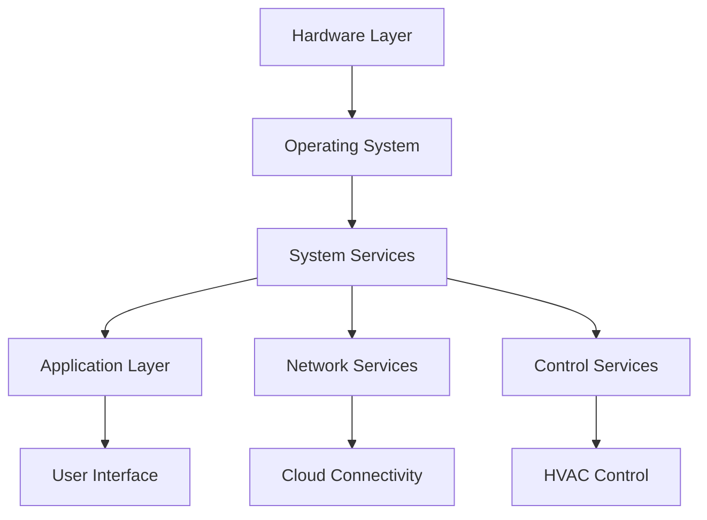

# Software Overview

The Nest Learning Thermostat software is a sophisticated embedded system that combines real-time control, machine learning algorithms, and network connectivity to provide intelligent climate control. This document provides a comprehensive overview of the software architecture and components.

## Software Architecture

### System Layers


### Key Components
- **Operating System**: Custom Linux distribution with real-time capabilities
- **System Services**: D-Bus, device management, monitoring
- **Applications**: nlclient (UI), thermostat manager, sensor service
- **Network Stack**: ConnMan, Weave protocol, cloud services
- **Control Logic**: Temperature control algorithms and learning systems

## Operating System

### Linux Distribution
- **Base**: OpenEmbedded-based custom distribution
- **Kernel**: Linux 3.x/4.x with real-time patches
- **Init System**: Systemd for service management
- **C Library**: uClibc for reduced footprint
- **Package Manager**: Opkg for lightweight package management

### Real-time Features
- **PREEMPT_RT**: Full preemption patch for low latency
- **High-Resolution Timers**: Precise timing for control loops
- **CPU Isolation**: Dedicated cores for real-time tasks
- **IRQ Threading**: Interrupt handling in kernel threads

### System Configuration
- **Memory Management**: Optimized for 256MB RAM
- **Storage**: JFFS2 filesystem on NAND flash
- **Boot Time**: Optimized for <30 second boot
- **Power Management**: Advanced power saving features

## System Services

### D-Bus System Bus
- **Purpose**: Inter-process communication
- **Services**: System service registration and communication
- **Security**: Policy-based access control
- **Performance**: High-performance message passing

### Systemd Services
```bash
# Critical system services
systemd-journald.service      # System logging
dbus.service                  # IPC system
connman.service               # Network management
sensor-service.service        # Hardware sensors
thermostat-manager.service    # Control logic
nlclient.service              # User interface
```

### Device Management
- **Hardware Abstraction**: Unified hardware interface
- **Device Drivers**: Custom drivers for Nest hardware
- **Hotplug Support**: Dynamic device detection
- **Resource Management**: Hardware resource allocation

## Application Layer

### nlclient (Main UI Application)
- **Purpose**: Primary user interface application
- **Technology**: GTK+ with custom Nest UI components
- **Features**: Touch interface, temperature display, settings
- **Integration**: D-Bus integration with system services

### Thermostat Manager
- **Purpose**: Core temperature control logic
- **Features**: Learning algorithms, schedule management
- **Communication**: D-Bus interface for other components
- **Control**: Real-time HVAC control decisions

### Sensor Service
- **Purpose**: Hardware sensor management
- **Sensors**: Temperature, humidity, motion, light
- **Features**: Calibration, filtering, data aggregation
- **Interface**: D-Bus API for sensor data

## Network Stack

### ConnMan Network Manager
- **Purpose**: Network connection management
- **Features**: Wi-Fi, Ethernet, cellular connectivity
- **Configuration**: Automatic network switching
- **Power Management**: Network power optimization

### Weave Protocol
- **Purpose**: Device-to-device communication
- **Features**: Secure communication, mesh networking
- **Integration**: Mobile app and cloud connectivity
- **Security**: End-to-end encryption

### Cloud Services
- **Connectivity**: Secure cloud platform connection
- **Data Sync**: Configuration and usage data synchronization
- **Remote Control**: Mobile app and web interface
- **Updates**: Over-the-air update management

## Control Logic

### Temperature Control
- **Algorithms**: PID control with learning adaptation
- **Setpoints**: Dynamic temperature setpoint management
- **Deadbands**: Configurable heating/cooling deadbands
- **Optimization**: Energy optimization algorithms

### Learning Systems
- **Schedule Learning**: Automatic schedule generation
- **Usage Patterns**: User behavior learning
- **Energy Optimization**: Energy usage optimization
- **Adaptation**: Continuous system adaptation

### Safety Systems
- **Fault Detection**: Automatic fault detection
- **Safety Limits**: Temperature and system safety limits
- **Emergency Modes**: Emergency heating/cooling modes
- **Monitoring**: Continuous system health monitoring

## User Interface

### Display Management
- **Graphics**: Custom graphics rendering engine
- **Touch Handling**: Capacitive touch interface
- **Animations**: Smooth transition animations
- **Localization**: Multi-language support

### UI Components
- **Temperature Display**: Large, clear temperature display
- **Status Indicators**: System status and mode indicators
- **Menu System**: Hierarchical menu navigation
- **Settings**: Comprehensive settings interface

### Interaction Design
- **Rotary Input**: Circular ring for temperature adjustment
- **Touch Gestures**: Swipe and tap gestures
- **Voice Feedback**: Optional voice feedback
- **Accessibility**: Accessibility features for all users

## Data Management

### Configuration Storage
- **System Config**: System-level configuration data
- **User Config**: User preferences and settings
- **Learned Data**: Machine learning data and patterns
- **Backup Data**: Configuration backup and recovery

### Logging System
- **System Logs**: System event and error logging
- **Usage Logs**: User interaction and usage logging
- **Diagnostic Logs**: Diagnostic and troubleshooting data
- **Performance Logs**: Performance and resource usage logging

### Data Persistence
- **Flash Storage**: Reliable data storage on NAND flash
- **Wear Leveling**: Flash wear leveling algorithms
- **Data Integrity**: Checksums and error correction
- **Recovery**: Data recovery and repair mechanisms

## Security Architecture

### System Security
- **Secure Boot**: Signed firmware verification
- **Access Control**: User and service access control
- **Encryption**: Data encryption and protection
- **Audit**: Security event auditing and logging

### Network Security
- **TLS/SSL**: Secure network communication
- **Certificate Management**: Device certificate handling
- **Firewall**: Network packet filtering
- **VPN**: Secure remote access capabilities

### Application Security
- **Sandboxing**: Application isolation and sandboxing
- **Memory Protection**: Memory protection and ASLR
- **Input Validation**: Input validation and sanitization
- **Error Handling**: Secure error handling practices

## Performance Optimization

### Resource Management
- **Memory**: Efficient memory usage and management
- **CPU**: CPU usage optimization and scheduling
- **Storage**: Optimized storage usage and access
- **Network**: Network bandwidth optimization

### Power Management
- **Sleep Modes**: Aggressive sleep mode policies
- **Wake Sources**: Optimized wake source handling
- **Clock Management**: Dynamic clock frequency scaling
- **Peripheral Control**: Peripheral power management

### Real-time Performance
- **Latency**: Low-latency response requirements
- **Determinism**: Deterministic timing behavior
- **Priority**: Real-time task priority management
- **Scheduling**: Optimized task scheduling

## Development Environment

### Build System
- **Cross-compilation**: ARM cross-compilation toolchain
- **Build Framework**: BitBake and OpenEmbedded
- **Package Management**: Opkg package system
- **Version Control**: Git-based version control

### Debugging Tools
- **GDB**: GNU debugger for application debugging
- **Strace**: System call tracing
- **Performance**: Performance profiling tools
- **Logging**: Comprehensive logging framework

### Testing Framework
- **Unit Tests**: Component-level unit testing
- **Integration Tests**: System integration testing
- **Hardware Tests**: Hardware-in-the-loop testing
- **Simulation**: Software simulation environment

## Quality Assurance

### Code Quality
- **Standards**: Coding standards and guidelines
- **Review**: Code review processes
- **Static Analysis**: Static code analysis tools
- **Metrics**: Code quality metrics tracking

### Testing Strategy
- **Automated Testing**: Automated test suites
- **Manual Testing**: Manual testing procedures
- **Regression Testing**: Regression test automation
- **Performance Testing**: Performance benchmarking

### Release Process
- **Version Management**: Semantic versioning
- **Release Notes**: Comprehensive release documentation
- **Deployment**: Controlled deployment process
- **Rollback**: Rollback capabilities and procedures

## Related Documentation

- [Linux System Details](../architecture/linux-system.mdx)
- [User Interface](../user-interface.mdx)
- [Network Connectivity](./network/overview.mdx)
- [Thermostat Logic](./thermostat/overview.mdx)
