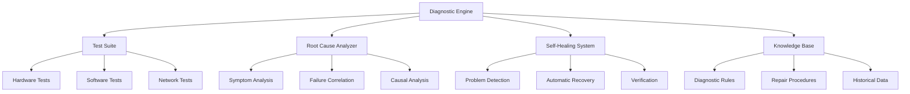

# Diagnostics

The Nest Learning Thermostat implements comprehensive diagnostic systems for automated troubleshooting, root cause analysis, and self-healing capabilities. This document details the diagnostic architecture and implementation.

## Diagnostic Architecture

### Core Components
- **Diagnostic Engine**: Core diagnostic processing and analysis
- **Test Suite**: Comprehensive test suite for system validation
- **Root Cause Analyzer**: Automated root cause analysis system
- **Self-Healing System**: Automatic problem detection and resolution
- **Diagnostic Knowledge Base**: Knowledge base for diagnostic decisions

### Diagnostic Framework


## Diagnostic Engine

### Symptom Analysis
Comprehensive analysis of system symptoms and anomalies.

```c
// Diagnostic engine system
typedef struct {
    symptom_analyzer_t analyzer;           // Symptom analyzer
    test_executor_t executor;             // Test executor
    diagnostic_rules_t rules;              // Diagnostic rules
    result_processor_t processor;          // Result processor
} diagnostic_engine_t;

// Symptom analyzer
typedef struct {
    symptom_collector_t collector;         // Symptom collector
    pattern_matcher_t matcher;             // Pattern matcher
    symptom_classifier_t classifier;       // Symptom classifier
    correlation_analyzer_t correlation;    // Correlation analyzer
} symptom_analyzer_t;

// Symptom structure
typedef struct {
    symptom_id_t symptom_id;               // Symptom ID
    symptom_type_t type;                   // Symptom type
    severity_t severity;                   // Symptom severity
    timestamp_t first_observed;            // First observation time
    timestamp_t last_observed;             // Last observation time
    int occurrence_count;                  // Occurrence count
    symptom_data_t data;                   // Symptom-specific data
    component_id_t affected_component;     // Affected component
} symptom_t;

// Symptom analysis process
symptom_analysis_t analyze_symptoms(diagnostic_engine_t *engine, 
                                   symptom_report_t *report) {
    symptom_analyzer_t *analyzer = &engine->analyzer;
    symptom_analysis_t analysis = {0};
    
    // Collect symptoms from various sources
    symptom_collection_t collection = collect_symptoms(
        &analyzer->collector, report);
    
    // Classify symptoms by type and severity
    classify_symptoms(&analyzer->classifier, &collection, &analysis);
    
    // Match symptom patterns
    pattern_matches_t matches = match_symptom_patterns(
        &analyzer->matcher, &collection);
    
    // Analyze symptom correlations
    analysis.correlations = analyze_symptom_correlations(
        &analyzer->correlation, &collection, matches);
    
    // Generate symptom summary
    analysis.summary = generate_symptom_summary(&collection, matches);
    
    return analysis;
}
```

### Pattern Matching
Advanced pattern matching for known issue recognition.

```c
// Pattern matcher
typedef struct {
    pattern_database_t database;          // Pattern database
    matching_algorithm_t algorithm;        // Matching algorithm
    confidence_calculator_t confidence;    // Confidence calculation
    pattern_history_t history;             // Pattern matching history
} pattern_matcher_t;

// Diagnostic pattern
typedef struct {
    pattern_id_t pattern_id;               // Pattern ID
    char pattern_name[128];                // Pattern name
    symptom_signature_t signature;         // Symptom signature
    pattern_type_t type;                   // Pattern type
    float confidence_threshold;            // Confidence threshold
    associated_issues_t issues;            // Associated issues
    recommended_actions_t actions;         // Recommended actions
} diagnostic_pattern_t;

// Pattern matching algorithm
pattern_matches_t match_diagnostic_patterns(
    pattern_matcher_t *matcher, 
    symptom_collection_t *symptoms) {
    
    pattern_matches_t matches = {0};
    
    // Iterate through pattern database
    for (int i = 0; i < matcher->database.pattern_count; i++) {
        diagnostic_pattern_t *pattern = &matcher->database.patterns[i];
        
        // Calculate pattern match score
        float match_score = calculate_pattern_match_score(
            pattern, symptoms);
        
        // Check if match exceeds threshold
        if (match_score >= pattern->confidence_threshold) {
            // Add to matches
            pattern_match_t match = {
                .pattern = pattern,
                .match_score = match_score,
                .confidence = calculate_match_confidence(
                    match_score, pattern->confidence_threshold)
            };
            
            matches.matches[matches.match_count++] = match;
        }
    }
    
    // Sort matches by confidence
    sort_pattern_matches(&matches);
    
    // Update pattern history
    update_pattern_history(&matcher->history, &matches);
    
    return matches;
}
```

## Test Suite

### Hardware Diagnostics
Comprehensive hardware testing and validation.

```c
// Test suite system
typedef struct {
    hardware_tests_t hardware;             // Hardware tests
    software_tests_t software;             // Software tests
    network_tests_t network;               // Network tests
    integration_tests_t integration;       // Integration tests
    test_scheduler_t scheduler;             // Test scheduler
} test_suite_t;

// Hardware tests
typedef struct {
    cpu_tests_t cpu;                       // CPU tests
    memory_tests_t memory;                 // Memory tests
    storage_tests_t storage;               // Storage tests
    sensor_tests_t sensors;                 // Sensor tests
    display_tests_t display;               // Display tests
    communication_tests_t communication;   // Communication tests
} hardware_tests_t;

// CPU diagnostic tests
test_result_t run_cpu_diagnostics(cpu_tests_t *cpu_tests) {
    test_result_t result = {0};
    
    // CPU performance test
    test_result_t perf_test = run_cpu_performance_test();
    result.sub_results[result.sub_result_count++] = perf_test;
    
    // CPU stress test
    test_result_t stress_test = run_cpu_stress_test();
    result.sub_results[result.sub_result_count++] = stress_test;
    
    // CPU cache test
    test_result_t cache_test = run_cpu_cache_test();
    result.sub_results[result.sub_result_count++] = cache_test;
    
    // CPU instruction test
    test_result_t instr_test = run_cpu_instruction_test();
    result.sub_results[result.sub_result_count++] = instr_test;
    
    // CPU thermal test
    test_result_t thermal_test = run_cpu_thermal_test();
    result.sub_results[result.sub_result_count++] = thermal_test;
    
    // Aggregate results
    result.overall_status = aggregate_test_results(result.sub_results, 
                                                  result.sub_result_count);
    result.confidence = calculate_test_confidence(result.sub_results, 
                                                 result.sub_result_count);
    
    return result;
}

// Memory diagnostic tests
test_result_t run_memory_diagnostics(memory_tests_t *mem_tests) {
    test_result_t result = {0};
    
    // Memory allocation test
    test_result_t alloc_test = run_memory_allocation_test();
    result.sub_results[result.sub_result_count++] = alloc_test;
    
    // Memory stress test
    test_result_t stress_test = run_memory_stress_test();
    result.sub_results[result.sub_result_count++] = stress_test;
    
    // Memory integrity test
    test_result_t integrity_test = run_memory_integrity_test();
    result.sub_results[result.sub_result_count++] = integrity_test;
    
    // Memory speed test
    test_result_t speed_test = run_memory_speed_test();
    result.sub_results[result.sub_result_count++] = speed_test;
    
    // Memory leak test
    test_result_t leak_test = run_memory_leak_test();
    result.sub_results[result.sub_result_count++] = leak_test;
    
    // Aggregate results
    result.overall_status = aggregate_test_results(result.sub_results, 
                                                  result.sub_result_count);
    result.confidence = calculate_test_confidence(result.sub_results, 
                                                 result.sub_result_count);
    
    return result;
}
```

### Software Diagnostics
Application and system software testing.

```c
// Software tests
typedef struct {
    application_tests_t application;       // Application tests
    system_tests_t system;                 // System tests
    service_tests_t services;               // Service tests
    api_tests_t api;                       // API tests
} software_tests_t;

// Application diagnostic tests
test_result_t run_application_diagnostics(
    application_tests_t *app_tests) {
    
    test_result_t result = {0};
    
    // UI functionality test
    test_result_t ui_test = run_ui_functionality_test();
    result.sub_results[result.sub_result_count++] = ui_test;
    
    // Touch interface test
    test_result_t touch_test = run_touch_interface_test();
    result.sub_results[result.sub_result_count++] = touch_test;
    
    // Display rendering test
    test_result_t display_test = run_display_rendering_test();
    result.sub_results[result.sub_result_count++] = display_test;
    
    // Temperature control test
    test_result_t control_test = run_temperature_control_test();
    result.sub_results[result.sub_result_count++] = control_test;
    
    // Schedule management test
    test_result_t schedule_test = run_schedule_management_test();
    result.sub_results[result.sub_result_count++] = schedule_test;
    
    // Learning system test
    test_result_t learning_test = run_learning_system_test();
    result.sub_results[result.sub_result_count++] = learning_test;
    
    // Aggregate results
    result.overall_status = aggregate_test_results(result.sub_results, 
                                                  result.sub_result_count);
    result.confidence = calculate_test_confidence(result.sub_results, 
                                                 result.sub_result_count);
    
    return result;
}
```

## Root Cause Analysis

### Causal Analysis
Automated analysis to identify root causes of system issues.

```c
// Root cause analyzer
typedef struct {
    causal_engine_t engine;                // Causal analysis engine
    failure_tree_t failure_tree;           // Failure tree analysis
    correlation_analyzer_t correlation;    // Correlation analyzer
    hypothesis_generator_t hypothesis;     // Hypothesis generator
} root_cause_analyzer_t;

// Causal analysis engine
typedef struct {
    causal_models_t models;                // Causal models
    inference_engine_t inference;          // Inference engine
    evidence_collector_t evidence;         // Evidence collector
    confidence_calculator_t confidence;    // Confidence calculation
} causal_engine_t;

// Root cause analysis result
typedef struct {
    issue_id_t issue_id;                   // Issue ID
    root_cause_t root_cause;               // Identified root cause
    causal_chain_t causal_chain;           // Causal chain
    evidence_t evidence;                   // Supporting evidence
    confidence_level_t confidence;         // Analysis confidence
    alternative_causes_t alternatives;     // Alternative causes
} rca_result_t;

// Perform root cause analysis
rca_result_t perform_root_cause_analysis(
    root_cause_analyzer_t *rca, 
    symptom_analysis_t *symptoms, 
    test_results_t *test_results) {
    
    rca_result_t result = {0};
    
    // Collect evidence from symptoms and test results
    evidence_collection_t evidence = collect_evidence(
        &rca->engine.evidence, symptoms, test_results);
    
    // Generate initial hypotheses
    hypothesis_set_t hypotheses = generate_hypotheses(
        &rca->hypothesis, &evidence);
    
    // Apply causal inference
    causal_inference_t inference = apply_causal_inference(
        &rca->engine.inference, hypotheses, &evidence);
    
    // Identify most likely root cause
    result.root_cause = identify_root_cause(inference);
    result.confidence = calculate_rca_confidence(inference);
    
    // Build causal chain
    result.causal_chain = build_causal_chain(
        &rca->failure_tree, result.root_cause);
    
    // Collect supporting evidence
    result.evidence = collect_supporting_evidence(
        &evidence, result.root_cause);
    
    // Identify alternative causes
    result.alternatives = identify_alternative_causes(
        inference, result.root_cause);
    
    return result;
}
```

### Failure Tree Analysis
Systematic failure tree analysis for complex issues.

```c
// Failure tree analysis
typedef struct {
    failure_tree_t tree;                   // Failure tree structure
    tree_analysis_t analysis;              // Tree analysis methods
    probability_calculator_t probability;  // Probability calculation
    minimal_cutsets_t cutsets;             // Minimal cutsets
} failure_tree_t;

// Failure tree node
typedef struct {
    node_id_t node_id;                     // Node ID
    node_type_t type;                      // Node type (AND, OR, BASIC)
    char description[256];                 // Node description
    float probability;                     // Failure probability
    node_children_t children;              // Child nodes
    evidence_level_t evidence;             // Evidence level
} failure_tree_node_t;

// Failure tree analysis
failure_tree_result_t analyze_failure_tree(
    failure_tree_t *tree, 
    symptom_set_t *observed_symptoms) {
    
    failure_tree_result_t result = {0};
    
    // Calculate node probabilities based on evidence
    calculate_node_probabilities(tree, observed_symptoms);
    
    // Identify minimal cutsets
    result.cutsets = find_minimal_cutsets(&tree->cutsets, tree);
    
    // Calculate top event probability
    result.top_event_probability = 
        calculate_top_event_probability(tree);
    
    // Rank failure modes by probability
    result.failure_modes = rank_failure_modes(tree, result.cutsets);
    
    // Generate diagnostic recommendations
    result.recommendations = generate_ft_recommendations(
        tree, result.failure_modes);
    
    return result;
}
```

## Self-Healing System

### Automatic Recovery
Self-healing mechanisms for automatic problem resolution.

```c
// Self-healing system
typedef struct {
    problem_detector_t detector;           // Problem detector
    recovery_engine_t engine;              // Recovery engine
    healing_strategies_t strategies;       // Healing strategies
    verification_t verification;           // Recovery verification
} self_healing_system_t;

// Problem detector
typedef struct {
    detection_rules_t rules;               // Detection rules
    anomaly_detector_t anomaly;            // Anomaly detector
    failure_predictor_t predictor;         // Failure predictor
    priority_evaluator_t priority;         // Priority evaluation
} problem_detector_t;

// Recovery engine
typedef struct {
    recovery_actions_t actions;            // Recovery actions
    action_executor_t executor;            // Action executor
    rollback_manager_t rollback;           // Rollback manager
    recovery_monitor_t monitor;            // Recovery monitoring
} recovery_engine_t;

// Automatic recovery process
recovery_result_t perform_automatic_recovery(
    self_healing_system_t *healing, 
    problem_report_t *problem) {
    
    recovery_result_t result = {0};
    
    // Detect and classify problem
    problem_classification_t classification = 
        classify_problem(&healing->detector, problem);
    
    // Select recovery strategy
    recovery_strategy_t strategy = select_recovery_strategy(
        &healing->strategies, classification);
    
    // Execute recovery actions
    result = execute_recovery_strategy(&healing->engine, strategy);
    
    // Verify recovery success
    if (result.success) {
        result.verified = verify_recovery(
            &healing->verification, problem, strategy);
        
        if (!result.verified) {
            // Rollback recovery if verification fails
            rollback_recovery(&healing->engine.rollback, strategy);
            result.success = false;
        }
    }
    
    // Monitor recovery effectiveness
    monitor_recovery_effectiveness(&healing->engine.monitor, 
                                 problem, strategy, result);
    
    return result;
}
```

### Healing Strategies
Different strategies for automatic problem resolution.

```c
// Healing strategies
typedef struct {
    strategy_database_t database;          // Strategy database
    strategy_selector_t selector;          // Strategy selector
    adaptive_learner_t learner;            // Adaptive learning
    effectiveness_tracker_t tracker;       // Effectiveness tracking
} healing_strategies_t;

// Recovery strategy
typedef struct {
    strategy_id_t strategy_id;             // Strategy ID
    problem_type_t problem_type;           // Problem type
    recovery_actions_t actions;            // Recovery actions
    execution_plan_t plan;                 // Execution plan
    success_criteria_t criteria;           // Success criteria
    rollback_plan_t rollback;              // Rollback plan
    historical_effectiveness_t effectiveness; // Historical effectiveness
} recovery_strategy_t;

// Recovery actions
typedef struct {
    action_type_t type;                    // Action type
    action_parameters_t parameters;        // Action parameters
    execution_order_t order;               // Execution order
    dependencies_t dependencies;           // Action dependencies
    timeout_t timeout;                     // Action timeout
    retry_policy_t retry_policy;           // Retry policy
} recovery_action_t;

// Common healing strategies
recovery_strategy_t get_service_restart_strategy(void) {
    recovery_strategy_t strategy = {0};
    strategy.strategy_id = STRATEGY_SERVICE_RESTART;
    strategy.problem_type = PROBLEM_SERVICE_FAILURE;
    
    // Define recovery actions
    recovery_action_t actions[] = {
        {
            .type = ACTION_STOP_SERVICE,
            .parameters = {.graceful_shutdown = true},
            .order = 1,
            .timeout = 30
        },
        {
            .type = ACTION_WAIT,
            .parameters = {.wait_duration = 5},
            .order = 2,
            .timeout = 10
        },
        {
            .type = ACTION_START_SERVICE,
            .parameters = {.startup_mode = STARTUP_NORMAL},
            .order = 3,
            .timeout = 60
        },
        {
            .type = ACTION_VERIFY_SERVICE,
            .parameters = {.health_check_timeout = 30},
            .order = 4,
            .timeout = 35
        }
    };
    
    strategy.actions.count = sizeof(actions) / sizeof(actions[0]);
    memcpy(strategy.actions.actions, actions, sizeof(actions));
    
    return strategy;
}
```

## Diagnostic Knowledge Base

### Knowledge Management
Comprehensive knowledge base for diagnostic decisions.

```c
// Diagnostic knowledge base
typedef struct {
    knowledge_repository_t repository;    // Knowledge repository
    inference_engine_t inference;          // Inference engine
    learning_system_t learning;            // Learning system
    knowledge_updater_t updater;           // Knowledge updater
} diagnostic_knowledge_base_t;

// Knowledge repository
typedef struct {
    diagnostic_rules_t rules;              // Diagnostic rules
    repair_procedures_t procedures;        // Repair procedures
    historical_cases_t cases;              // Historical cases
    expert_knowledge_t expert;             // Expert knowledge
} knowledge_repository_t;

// Diagnostic rule
typedef struct {
    rule_id_t rule_id;                     // Rule ID
    char rule_name[128];                   // Rule name
    condition_set_t conditions;            // Rule conditions
    conclusion_t conclusion;               // Rule conclusion
    confidence_t confidence;               // Rule confidence
    priority_t priority;                   // Rule priority
    usage_statistics_t usage;              // Usage statistics
} diagnostic_rule_t;

// Knowledge-based diagnosis
diagnosis_result_t diagnose_with_knowledge_base(
    diagnostic_knowledge_base_t *kb, 
    symptom_set_t *symptoms) {
    
    diagnosis_result_t result = {0};
    
    // Apply diagnostic rules
    rule_matches_t matches = apply_diagnostic_rules(
        &kb->repository.rules, symptoms);
    
    // Use inference engine to derive conclusions
    inference_result_t inference = apply_inference(
        &kb->inference, matches);
    
    // Find similar historical cases
    similar_cases_t similar_cases = find_similar_cases(
        &kb->repository.cases, symptoms);
    
    // Combine inference results with case-based reasoning
    result = combine_diagnostic_methods(inference, similar_cases);
    
    // Update knowledge base usage statistics
    update_knowledge_usage(kb, result);
    
    return result;
}
```

### Learning and Adaptation
Continuous learning from diagnostic experiences.

```c
// Diagnostic learning system
typedef struct {
    experience_collector_t collector;      // Experience collector
    pattern_learner_t learner;             // Pattern learner
    rule_generator_t generator;            // Rule generator
    validation_system_t validation;        // Validation system
} learning_system_t;

// Diagnostic experience
typedef struct {
    experience_id_t experience_id;        // Experience ID
    symptom_set_t symptoms;                // Observed symptoms
    test_results_t test_results;           // Test results
    final_diagnosis_t diagnosis;           // Final diagnosis
    resolution_t resolution;               // Problem resolution
    effectiveness_t effectiveness;         // Resolution effectiveness
    timestamp_t timestamp;                 // Experience timestamp
} diagnostic_experience_t;

// Learn from diagnostic experience
void learn_from_experience(learning_system_t *learning, 
                          diagnostic_experience_t *experience) {
    
    // Collect experience data
    collect_diagnostic_experience(&learning->collector, experience);
    
    // Update pattern learning
    update_pattern_learning(&learning->learner, experience);
    
    // Generate new diagnostic rules if appropriate
    if (should_generate_new_rule(learning, experience)) {
        diagnostic_rule_t new_rule = generate_diagnostic_rule(
            &learning->generator, experience);
        
        // Validate new rule
        if (validate_diagnostic_rule(&learning->validation, new_rule)) {
            add_rule_to_knowledge_base(new_rule);
        }
    }
    
    // Update learning model parameters
    update_learning_parameters(learning, experience);
}
```

## Diagnostic Reporting

### Comprehensive Reporting
Detailed diagnostic reports for analysis and troubleshooting.

```c
// Diagnostic reporting system
typedef struct {
    report_generator_t generator;          // Report generator
    report_formatter_t formatter;          // Report formatter
    report_distributor_t distributor;      // Report distributor
    report_archive_t archive;              // Report archive
} diagnostic_reporting_t;

// Diagnostic report
typedef struct {
    report_id_t report_id;                 // Report ID
    timestamp_t generated_time;            // Generation time
    report_type_t type;                    // Report type
    summary_t summary;                     // Executive summary
    detailed_analysis_t analysis;          // Detailed analysis
    recommendations_t recommendations;     // Recommendations
    attachments_t attachments;             // Report attachments
} diagnostic_report_t;

// Generate comprehensive diagnostic report
diagnostic_report_t generate_diagnostic_report(
    diagnostic_reporting_t *reporting, 
    diagnostic_session_t *session) {
    
    diagnostic_report_t report = {0};
    
    // Generate report ID and metadata
    report.report_id = generate_report_id();
    report.generated_time = get_current_timestamp();
    report.type = REPORT_TYPE_COMPREHENSIVE;
    
    // Generate executive summary
    report.summary = generate_executive_summary(session);
    
    // Generate detailed analysis
    report.analysis = generate_detailed_analysis(session);
    
    // Generate recommendations
    report.recommendations = generate_recommendations(session);
    
    // Add attachments
    report.attachments = collect_report_attachments(session);
    
    // Format report
    format_diagnostic_report(&reporting->formatter, &report);
    
    // Distribute report
    distribute_report(&reporting->distributor, &report);
    
    // Archive report
    archive_report(&reporting->archive, &report);
    
    return report;
}
```

## Related Documentation

- [System Management Overview](./overview.mdx)
- [Resource Management](./resource-management.mdx)
- [Service Management](./service-management.mdx)
- [Health Monitoring](./health-monitoring.mdx)
