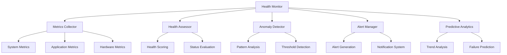

# Health Monitoring

The Nest Learning Thermostat implements comprehensive health monitoring systems to track system performance, detect anomalies, and provide proactive maintenance capabilities. This document details the health monitoring architecture and implementation.

## Health Monitoring Architecture

### Core Components
- **Metrics Collection**: Real-time collection of system and application metrics
- **Health Assessment**: Continuous health evaluation and scoring
- **Anomaly Detection**: Automated detection of abnormal behavior patterns
- **Alert Management**: Intelligent alert generation and notification
- **Predictive Analytics**: Predictive health analysis and maintenance scheduling

### Monitoring Framework


## Metrics Collection

### System Metrics
Comprehensive collection of system-level performance metrics.

```c
// Health monitoring system
typedef struct {
    metrics_collector_t collector;         // Metrics collector
    health_assessor_t assessor;             // Health assessor
    anomaly_detector_t detector;           // Anomaly detector
    alert_manager_t alert_manager;         // Alert manager
    monitoring_config_t config;            // Monitoring configuration
} health_monitoring_t;

// Metrics collector
typedef struct {
    system_metrics_t system;               // System metrics
    application_metrics_t applications;    // Application metrics
    hardware_metrics_t hardware;           // Hardware metrics
    network_metrics_t network;             // Network metrics
    collection_policy_t policy;            // Collection policy
} metrics_collector_t;

// System metrics structure
typedef struct {
    cpu_metrics_t cpu;                     // CPU metrics
    memory_metrics_t memory;               // Memory metrics
    storage_metrics_t storage;             // Storage metrics
    process_metrics_t processes;           // Process metrics
    thermal_metrics_t thermal;             // Thermal metrics
    power_metrics_t power;                 // Power metrics
    timestamp_t collection_time;           // Collection timestamp
} system_metrics_t;

// CPU metrics collection
void collect_cpu_metrics(cpu_metrics_t *cpu_metrics) {
    // Get CPU usage
    cpu_metrics->usage_percent = get_cpu_usage_percentage();
    
    // Get load averages
    get_load_average(cpu_metrics->load_average);
    
    // Get CPU frequency
    cpu_metrics->current_frequency = get_cpu_frequency();
    cpu_metrics->min_frequency = get_min_cpu_frequency();
    cpu_metrics->max_frequency = get_max_cpu_frequency();
    
    // Get CPU temperature
    cpu_metrics->temperature = get_cpu_temperature();
    
    // Get context switches
    cpu_metrics->context_switches = get_context_switch_count();
    
    // Get CPU time by state
    get_cpu_time_by_state(cpu_metrics->cpu_time);
    
    // Update collection timestamp
    cpu_metrics->last_update = get_current_timestamp();
}

// Memory metrics collection
void collect_memory_metrics(memory_metrics_t *mem_metrics) {
    // Get memory usage
    mem_metrics->total_memory = get_total_memory();
    mem_metrics->free_memory = get_free_memory();
    mem_metrics->used_memory = mem_metrics->total_memory - mem_metrics->free_memory;
    mem_metrics->usage_percent = (float)mem_metrics->used_memory / 
                                 mem_metrics->total_memory * 100.0;
    
    // Get swap usage
    mem_metrics->total_swap = get_total_swap();
    mem_metrics->free_swap = get_free_swap();
    mem_metrics->used_swap = mem_metrics->total_swap - mem_metrics->free_swap;
    
    // Get memory statistics
    get_memory_statistics(mem_metrics->stats);
    
    // Update collection timestamp
    mem_metrics->last_update = get_current_timestamp();
}
```

### Application Metrics
Application-specific metrics for thermostat functionality.

```c
// Application metrics
typedef struct {
    thermostat_metrics_t thermostat;       // Thermostat metrics
    ui_metrics_t ui;                       // UI metrics
    network_metrics_t network;             // Network metrics
    sensor_metrics_t sensors;             // Sensor metrics
    learning_metrics_t learning;           // Learning metrics
} application_metrics_t;

// Thermostat metrics
typedef struct {
    temperature_control_metrics_t control; // Temperature control metrics
    schedule_metrics_t schedule;           // Schedule metrics
    energy_metrics_t energy;               // Energy metrics
    comfort_metrics_t comfort;             // Comfort metrics
} thermostat_metrics_t;

// Temperature control metrics
void collect_temperature_control_metrics(
    temperature_control_metrics_t *control_metrics) {
    
    // Get current temperature readings
    control_metrics->current_temperature = get_current_temperature();
    control_metrics->target_temperature = get_target_temperature();
    control_metrics->outdoor_temperature = get_outdoor_temperature();
    
    // Get control performance
    control_metrics->steady_state_error = get_steady_state_error();
    control_metrics->settling_time = get_settling_time();
    control_metrics->overshoot = get_overshoot_percentage();
    
    // Get HVAC system status
    control_metrics->hvac_mode = get_current_hvac_mode();
    control_metrics->hvac_state = get_current_hvac_state();
    control_metrics->system_runtime = get_system_runtime();
    
    // Get sensor status
    control_metrics->sensor_status = get_sensor_status();
    control_metrics->calibration_status = get_calibration_status();
    
    // Update collection timestamp
    control_metrics->last_update = get_current_timestamp();
}
```

## Health Assessment

### Health Scoring Algorithm
Multi-dimensional health scoring system.

```c
// Health assessor
typedef struct {
    scoring_model_t model;                 // Scoring model
    health_weights_t weights;              // Health weights
    threshold_config_t thresholds;         // Health thresholds
    assessment_history_t history;          // Assessment history
} health_assessor_t;

// Scoring model
typedef struct {
    model_type_t type;                     // Model type
    scoring_algorithm_t algorithm;         // Scoring algorithm
    normalization_t normalization;         // Score normalization
    aggregation_method_t aggregation;     // Score aggregation
} scoring_model_t;

// Health weights
typedef struct {
    float system_weight;                   // System health weight
    float application_weight;              // Application health weight
    float hardware_weight;                 // Hardware health weight
    float network_weight;                  // Network health weight
    float user_experience_weight;          // User experience weight
} health_weights_t;

// Calculate overall health score
health_score_t calculate_health_score(health_assessor_t *assessor, 
                                     metrics_collector_t *collector) {
    health_score_t score = {0};
    
    // Calculate component scores
    float system_score = calculate_system_health_score(
        &collector->system, &assessor->thresholds);
    float application_score = calculate_application_health_score(
        &collector->applications, &assessor->thresholds);
    float hardware_score = calculate_hardware_health_score(
        &collector->hardware, &assessor->thresholds);
    float network_score = calculate_network_health_score(
        &collector->network, &assessor->thresholds);
    
    // Calculate weighted overall score
    score.overall_score = (system_score * assessor->weights.system_weight) +
                         (application_score * assessor->weights.application_weight) +
                         (hardware_score * assessor->weights.hardware_weight) +
                         (network_score * assessor->weights.network_weight);
    
    // Apply normalization
    score.overall_score = apply_normalization(
        &assessor->model.normalization, score.overall_score);
    
    // Determine health status
    score.status = determine_health_status(score.overall_score, 
                                          &assessor->thresholds);
    
    // Calculate health trend
    score.trend = calculate_health_trend(&assessor->history, 
                                        score.overall_score);
    
    // Update assessment history
    update_assessment_history(&assessor->history, score);
    
    return score;
}

// System health score calculation
float calculate_system_health_score(system_metrics_t *system, 
                                   threshold_config_t *thresholds) {
    float component_scores[6];
    int valid_components = 0;
    
    // CPU health score
    if (system->cpu.usage_percent < thresholds->cpu.warning_threshold) {
        component_scores[valid_components++] = 100.0 - 
            (system->cpu.usage_percent / thresholds->cpu.critical_threshold) * 50.0;
    } else {
        component_scores[valid_components++] = 50.0 - 
            ((system->cpu.usage_percent - thresholds->cpu.warning_threshold) / 
             (thresholds->cpu.critical_threshold - thresholds->cpu.warning_threshold)) * 50.0;
    }
    
    // Memory health score
    float memory_usage_ratio = (float)system->memory.used_memory / 
                              system->memory.total_memory;
    if (memory_usage_ratio < thresholds->memory.warning_threshold) {
        component_scores[valid_components++] = 100.0 - 
            (memory_usage_ratio / thresholds->memory.critical_threshold) * 50.0;
    } else {
        component_scores[valid_components++] = 50.0 - 
            ((memory_usage_ratio - thresholds->memory.warning_threshold) / 
             (thresholds->memory.critical_threshold - thresholds->memory.warning_threshold)) * 50.0;
    }
    
    // Storage health score
    float storage_usage_ratio = (float)system->storage.used_space / 
                               system->storage.total_space;
    component_scores[valid_components++] = 100.0 - 
        (storage_usage_ratio / 0.9) * 50.0; // 90% usage as critical
    
    // Thermal health score
    if (system->thermal.cpu_temperature < thresholds->thermal.warning_threshold) {
        component_scores[valid_components++] = 100.0;
    } else if (system->thermal.cpu_temperature < thresholds->thermal.critical_threshold) {
        component_scores[valid_components++] = 75.0 - 
            ((system->thermal.cpu_temperature - thresholds->thermal.warning_threshold) / 
             (thresholds->thermal.critical_threshold - thresholds->thermal.warning_threshold)) * 75.0;
    } else {
        component_scores[valid_components++] = 0.0;
    }
    
    // Calculate average system health score
    float total_score = 0.0;
    for (int i = 0; i < valid_components; i++) {
        total_score += component_scores[i];
    }
    
    return total_score / valid_components;
}
```

### Health Status Classification
Multi-level health status classification system.

```c
// Health status levels
typedef enum {
    HEALTH_STATUS_EXCELLENT,               // Excellent health (90-100)
    HEALTH_STATUS_GOOD,                    // Good health (75-89)
    HEALTH_STATUS_FAIR,                    // Fair health (60-74)
    HEALTH_STATUS_POOR,                    // Poor health (40-59)
    HEALTH_STATUS_CRITICAL,                // Critical health (0-39)
    HEALTH_STATUS_UNKNOWN                  // Unknown health status
} health_status_t;

// Health status determination
health_status_t determine_health_status(float health_score, 
                                       threshold_config_t *thresholds) {
    if (health_score >= thresholds->excellent_threshold) {
        return HEALTH_STATUS_EXCELLENT;
    } else if (health_score >= thresholds->good_threshold) {
        return HEALTH_STATUS_GOOD;
    } else if (health_score >= thresholds->fair_threshold) {
        return HEALTH_STATUS_FAIR;
    } else if (health_score >= thresholds->poor_threshold) {
        return HEALTH_STATUS_POOR;
    } else {
        return HEALTH_STATUS_CRITICAL;
    }
}
```

## Anomaly Detection

### Statistical Anomaly Detection
Statistical methods for detecting abnormal behavior patterns.

```c
// Anomaly detection system
typedef struct {
    detection_methods_t methods;           // Detection methods
    statistical_models_t models;           // Statistical models
    ml_models_t ml_models;                 // Machine learning models
    detection_history_t history;           // Detection history
} anomaly_detector_t;

// Statistical models
typedef struct {
    moving_average_model_t moving_avg;     // Moving average model
    standard_deviation_model_t std_dev;    // Standard deviation model
    regression_model_t regression;         // Regression model
    seasonal_model_t seasonal;             // Seasonal model
} statistical_models_t;

// Moving average anomaly detection
anomaly_result_t detect_moving_average_anomaly(
    moving_average_model_t *model, 
    time_series_data_t *data, 
    int window_size) {
    
    anomaly_result_t result = {0};
    
    if (data->count < window_size) {
        result.is_anomaly = false;
        result.reason = "Insufficient data for analysis";
        return result;
    }
    
    // Calculate moving average
    float moving_avg = calculate_moving_average(data->values, 
                                               data->count, window_size);
    
    // Calculate current deviation
    float current_value = data->values[data->count - 1];
    float deviation = fabs(current_value - moving_avg);
    
    // Calculate threshold based on historical variance
    float threshold = model->std_deviation_multiplier * 
                     calculate_standard_deviation(data->values, 
                                                 data->count, window_size);
    
    // Determine if anomaly
    result.is_anomaly = (deviation > threshold);
    result.deviation_score = deviation / threshold;
    result.confidence = calculate_anomaly_confidence(deviation, threshold);
    
    if (result.is_anomaly) {
        result.severity = determine_anomaly_severity(result.deviation_score);
        result.reason = "Value deviates significantly from moving average";
    }
    
    return result;
}
```

### Machine Learning Anomaly Detection
Advanced ML-based anomaly detection for complex patterns.

```c
// Machine learning models for anomaly detection
typedef struct {
    isolation_forest_t isolation_forest;   // Isolation forest model
    autoencoder_t autoencoder;             // Autoencoder model
    lstm_anomaly_detector_t lstm;          // LSTM anomaly detector
    ensemble_detector_t ensemble;          // Ensemble detector
} ml_models_t;

// Isolation forest anomaly detection
anomaly_result_t detect_isolation_forest_anomaly(
    isolation_forest_t *model, 
    feature_vector_t *features) {
    
    anomaly_result_t result = {0};
    
    // Calculate anomaly score
    float anomaly_score = calculate_isolation_forest_score(model, features);
    
    // Determine if anomaly based on threshold
    result.is_anomaly = (anomaly_score > model->anomaly_threshold);
    result.deviation_score = anomaly_score;
    result.confidence = calculate_ml_confidence(anomaly_score, 
                                              model->anomaly_threshold);
    
    if (result.is_anomaly) {
        result.severity = determine_ml_severity(anomaly_score);
        result.reason = "Pattern detected as anomalous by isolation forest";
    }
    
    return result;
}

// Ensemble anomaly detection
anomaly_result_t detect_ensemble_anomaly(ml_models_t *ml_models, 
                                       feature_vector_t *features) {
    anomaly_result_t results[MAX_MODELS];
    int result_count = 0;
    
    // Run all anomaly detection models
    results[result_count++] = detect_isolation_forest_anomaly(
        &ml_models->isolation_forest, features);
    results[result_count++] = detect_autoencoder_anomaly(
        &ml_models->autoencoder, features);
    results[result_count++] = detect_lstm_anomaly(
        &ml_models->lstm, features);
    
    // Aggregate results using voting or weighted averaging
    anomaly_result_t ensemble_result = aggregate_anomaly_results(
        results, result_count);
    
    return ensemble_result;
}
```

## Alert Management

### Alert Generation
Intelligent alert generation with severity classification.

```c
// Alert management system
typedef struct {
    alert_generator_t generator;           // Alert generator
    alert_classifier_t classifier;         // Alert classifier
    notification_manager_t notifications;  // Notification manager
    alert_history_t history;               // Alert history
} alert_manager_t;

// Alert generator
typedef struct {
    alert_rules_t rules;                   // Alert rules
    correlation_engine_t correlation;      // Alert correlation
    deduplication_t deduplication;         // Alert deduplication
    rate_limiting_t rate_limiting;         // Rate limiting
} alert_generator_t;

// Alert structure
typedef struct {
    alert_id_t alert_id;                   // Unique alert ID
    alert_type_t type;                     // Alert type
    alert_severity_t severity;             // Alert severity
    char title[256];                       // Alert title
    char description[1024];                // Alert description
    char source[128];                      // Alert source
    timestamp_t generated_time;            // Generation time
    alert_metadata_t metadata;             // Alert metadata
    alert_status_t status;                 // Alert status
} alert_t;

// Generate health alerts
void generate_health_alerts(alert_manager_t *alert_manager, 
                           health_score_t *health_score, 
                           anomaly_result_t *anomalies, 
                           int anomaly_count) {
    
    alert_generator_t *generator = &alert_manager->generator;
    
    // Check health score alerts
    if (health_score->status <= HEALTH_STATUS_POOR) {
        alert_t health_alert = create_health_score_alert(health_score);
        
        // Apply alert rules
        if (evaluate_alert_rules(&generator->rules, &health_alert)) {
            // Classify alert severity
            classify_alert_severity(&alert_manager->classifier, &health_alert);
            
            // Check for alert deduplication
            if (!is_duplicate_alert(&generator->deduplication, &health_alert)) {
                // Send alert
                send_alert(alert_manager, &health_alert);
            }
        }
    }
    
    // Check anomaly alerts
    for (int i = 0; i < anomaly_count; i++) {
        if (anomalies[i].is_anomaly) {
            alert_t anomaly_alert = create_anomaly_alert(&anomalies[i]);
            
            if (evaluate_alert_rules(&generator->rules, &anomaly_alert)) {
                classify_alert_severity(&alert_manager->classifier, 
                                        &anomaly_alert);
                
                if (!is_duplicate_alert(&generator->deduplication, 
                                       &anomaly_alert)) {
                    send_alert(alert_manager, &anomaly_alert);
                }
            }
        }
    }
}
```

### Alert Correlation
Correlate related alerts to reduce noise and provide context.

```c
// Alert correlation engine
typedef struct {
    correlation_rules_t rules;             // Correlation rules
    time_window_t window;                  // Correlation time window
    similarity_threshold_t threshold;      // Similarity threshold
    correlation_groups_t groups;           // Correlation groups
} correlation_engine_t;

// Alert correlation
void correlate_alerts(correlation_engine_t *engine, 
                     alert_t *alerts, 
                     int alert_count) {
    
    // Group alerts by time window
    alert_group_t time_groups[MAX_GROUPS];
    int group_count = group_alerts_by_time(alerts, alert_count, 
                                          &engine->window, time_groups);
    
    // Correlate alerts within each time group
    for (int i = 0; i < group_count; i++) {
        correlate_alerts_in_group(engine, &time_groups[i]);
    }
    
    // Update correlation groups
    update_correlation_groups(&engine->groups, time_groups, group_count);
}
```

## Predictive Analytics

### Health Trend Analysis
Analyze health trends to predict future system state.

```c
// Predictive analytics system
typedef struct {
    trend_analyzer_t trend_analyzer;       // Trend analyzer
    prediction_model_t prediction_model;   // Prediction model
    maintenance_scheduler_t scheduler;     // Maintenance scheduler
    prediction_history_t history;          // Prediction history
} predictive_analytics_t;

// Trend analyzer
typedef struct {
    trend_algorithm_t algorithm;           // Trend algorithm
    time_window_t analysis_window;         // Analysis window
    trend_thresholds_t thresholds;         // Trend thresholds
    trend_patterns_t patterns;             // Trend patterns
} trend_analyzer_t;

// Health trend prediction
health_prediction_t predict_health_trend(
    predictive_analytics_t *analytics, 
    health_history_t *history) {
    
    trend_analyzer_t *analyzer = &analytics->trend_analyzer;
    
    // Extract trend features
    trend_features_t features = extract_trend_features(history, 
                                                      &analyzer->analysis_window);
    
    // Apply prediction model
    health_prediction_t prediction = apply_prediction_model(
        &analytics->prediction_model, features);
    
    // Calculate prediction confidence
    prediction.confidence = calculate_prediction_confidence(
        features, &analytics->prediction_model);
    
    // Generate maintenance recommendations
    if (prediction.risk_level > RISK_THRESHOLD) {
        prediction.maintenance_recommendation = 
            generate_maintenance_recommendation(prediction);
    }
    
    // Update prediction history
    update_prediction_history(&analytics->history, prediction);
    
    return prediction;
}
```

### Failure Prediction
Predict potential system failures before they occur.

```c
// Failure prediction system
typedef struct {
    failure_models_t models;               // Failure prediction models
    early_warning_t warning;               // Early warning system
    risk_assessment_t risk_assessment;      // Risk assessment
    prediction_accuracy_t accuracy;        // Prediction accuracy tracking
} failure_prediction_t;

// Failure prediction result
typedef struct {
    component_type_t component;            // Component type
    failure_probability_t probability;     // Failure probability
    time_to_failure_t ttf;                 // Time to failure estimate
    failure_mode_t predicted_mode;         // Predicted failure mode
    confidence_level_t confidence;         // Prediction confidence
    preventive_actions_t actions;          // Recommended preventive actions
} failure_prediction_result_t;

// Predict component failure
failure_prediction_result_t predict_component_failure(
    failure_prediction_t *failure_pred, 
    component_type_t component, 
    metrics_history_t *history) {
    
    failure_prediction_result_t result = {0};
    result.component = component;
    
    // Select appropriate prediction model
    failure_model_t *model = select_failure_model(&failure_pred->models, 
                                                 component);
    
    // Extract failure indicators
    failure_indicators_t indicators = extract_failure_indicators(
        history, component);
    
    // Apply failure prediction model
    result.probability = apply_failure_model(model, indicators);
    result.ttf = estimate_time_to_failure(model, indicators);
    result.predicted_mode = predict_failure_mode(model, indicators);
    result.confidence = calculate_failure_confidence(model, indicators);
    
    // Generate preventive actions
    if (result.probability > FAILURE_PROBABILITY_THRESHOLD) {
        result.actions = generate_preventive_actions(component, 
                                                  result.predicted_mode);
    }
    
    return result;
}
```

## Related Documentation

- [System Management Overview](./overview.mdx)
- [Resource Management](./resource-management.mdx)
- [Service Management](./service-management.mdx)
- [Diagnostics](./diagnostics.mdx)
