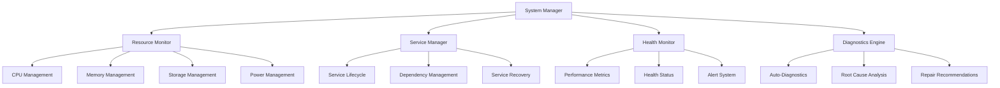

# System Management Overview

The Nest Learning Thermostat incorporates comprehensive system management capabilities for monitoring, maintenance, diagnostics, and optimization. This document provides an overview of the system management architecture and components.

## Management Architecture

### Core Management Components
- **System Monitoring**: Real-time monitoring of system health and performance
- **Resource Management**: CPU, memory, storage, and power management
- **Service Management**: Lifecycle management of system services
- **Diagnostics**: Automated diagnostics and troubleshooting
- **Maintenance**: System maintenance and optimization tasks

### Management Framework


## System Monitoring

### Real-time Monitoring
Continuous monitoring of system resources and performance metrics.

```c
// System monitoring structure
typedef struct {
    resource_monitor_t resources;         // Resource monitoring
    performance_monitor_t performance;     // Performance monitoring
    health_monitor_t health;               // Health monitoring
    alert_manager_t alerts;                // Alert management
    monitoring_config_t config;            // Monitoring configuration
} system_monitor_t;

// Resource monitoring
typedef struct {
    cpu_monitor_t cpu;                     // CPU monitoring
    memory_monitor_t memory;               // Memory monitoring
    storage_monitor_t storage;             // Storage monitoring
    network_monitor_t network;             // Network monitoring
    power_monitor_t power;                 // Power monitoring
    thermal_monitor_t thermal;             // Thermal monitoring
} resource_monitor_t;

// CPU monitoring
typedef struct {
    float cpu_usage_percent;               // CPU usage percentage
    float load_average[3];                 // Load average (1, 5, 15 min)
    int process_count;                     // Number of running processes
    int thread_count;                      // Number of threads
    cpu_frequency_t frequencies;           // CPU frequencies
    cpu_temperature_t temperature;         // CPU temperature
    timestamp_t last_update;               // Last update timestamp
} cpu_monitor_t;

// Resource monitoring update
void update_resource_monitoring(resource_monitor_t *monitor) {
    // Update CPU metrics
    monitor->cpu.cpu_usage_percent = calculate_cpu_usage();
    get_load_average(monitor->cpu.load_average);
    monitor->cpu.process_count = get_process_count();
    monitor->cpu.thread_count = get_thread_count();
    update_cpu_frequencies(&monitor->cpu.frequencies);
    update_cpu_temperature(&monitor->cpu.temperature);
    
    // Update memory metrics
    update_memory_monitoring(&monitor->memory);
    
    // Update storage metrics
    update_storage_monitoring(&monitor->storage);
    
    // Update network metrics
    update_network_monitoring(&monitor->network);
    
    // Update power metrics
    update_power_monitoring(&monitor->power);
    
    // Update thermal metrics
    update_thermal_monitoring(&monitor->thermal);
    
    // Check for resource alerts
    check_resource_alerts(monitor);
}
```

### Performance Monitoring
Detailed performance analysis and optimization recommendations.

```c
// Performance monitoring system
typedef struct {
    performance_metrics_t metrics;         // Performance metrics
    performance_analyzer_t analyzer;       // Performance analyzer
    optimization_engine_t optimizer;       // Optimization engine
    benchmark_suite_t benchmarks;          // Benchmark suite
} performance_monitor_t;

// Performance metrics
typedef struct {
    system_metrics_t system;               // System performance metrics
    application_metrics_t applications;    // Application performance metrics
    response_time_metrics_t response_time; // Response time metrics
    throughput_metrics_t throughput;       // Throughput metrics
    efficiency_metrics_t efficiency;       // Efficiency metrics
} performance_metrics_t;

// System performance metrics
typedef struct {
    float boot_time_seconds;               // Boot time in seconds
    float average_response_time;           // Average response time
    float transaction_throughput;          // Transaction throughput
    float resource_utilization;            // Resource utilization
    float system_stability_index;          // System stability index
    timestamp_t metrics_timestamp;         // Metrics collection timestamp
} system_metrics_t;

// Performance analysis
performance_analysis_t analyze_performance(performance_monitor_t *monitor, 
                                           time_window_t analysis_window) {
    performance_analysis_t analysis = {0};
    
    // Collect performance data
    performance_data_t data = collect_performance_data(analysis_window);
    
    // Calculate performance trends
    analysis.trends = calculate_performance_trends(data);
    
    // Identify performance bottlenecks
    analysis.bottlenecks = identify_performance_bottlenecks(data);
    
    // Generate optimization recommendations
    analysis.recommendations = generate_optimization_recommendations(
        &analysis.bottlenecks);
    
    // Calculate performance score
    analysis.performance_score = calculate_performance_score(&analysis);
    
    return analysis;
}
```

## Resource Management

### CPU Management
Dynamic CPU frequency scaling and process priority management.

```c
// CPU management system
typedef struct {
    cpu_governor_t governor;               // CPU frequency governor
    process_scheduler_t scheduler;         // Process scheduler
    thermal_throttling_t thermal;          // Thermal throttling
    power_management_t power_mgmt;         // Power management
} cpu_management_t;

// CPU frequency governor
typedef struct {
    governor_type_t type;                  // Governor type
    frequency_policy_t policy;             // Frequency policy
    scaling_algorithm_t algorithm;         // Scaling algorithm
    performance_target_t target;           // Performance target
} cpu_governor_t;

// Dynamic frequency scaling
void adjust_cpu_frequency(cpu_management_t *cpu_mgmt, float load_percentage) {
    cpu_governor_t *governor = &cpu_mgmt->governor;
    
    // Calculate target frequency based on load
    frequency_target_t target = calculate_frequency_target(
        governor, load_percentage);
    
    // Apply thermal constraints
    target = apply_thermal_constraints(&cpu_mgmt->thermal, target);
    
    // Apply power constraints
    target = apply_power_constraints(&cpu_mgmt->power_mgmt, target);
    
    // Set CPU frequency
    set_cpu_frequency(target.frequency);
    
    // Log frequency change
    log_frequency_change(target);
}
```

### Memory Management
Memory allocation optimization and garbage collection management.

```c
// Memory management system
typedef struct {
    memory_allocator_t allocator;         // Memory allocator
    garbage_collector_t gc;                // Garbage collector
    memory_pool_t pools[MAX_POOLS];       // Memory pools
    memory_monitor_t monitor;             // Memory monitoring
} memory_management_t;

// Memory allocator
typedef struct {
    allocation_strategy_t strategy;        // Allocation strategy
    fragmentation_handler_t fragmentation; // Fragmentation handler
    compaction_algorithm_t compaction;     // Memory compaction
    cache_manager_t cache;                 // Memory cache management
} memory_allocator_t;

// Memory optimization
void optimize_memory_usage(memory_management_t *mem_mgmt) {
    // Analyze memory fragmentation
    fragmentation_analysis_t analysis = analyze_memory_fragmentation(
        &mem_mgmt->allocator.fragmentation);
    
    // Trigger garbage collection if needed
    if (analysis.fragmentation_percentage > GC_THRESHOLD) {
        trigger_garbage_collection(&mem_mgmt->gc);
    }
    
    // Compact memory if fragmentation is high
    if (analysis.fragmentation_percentage > COMPACTION_THRESHOLD) {
        compact_memory(&mem_mgmt->allocator.compaction);
    }
    
    // Optimize memory pools
    optimize_memory_pools(mem_mgmt->pools);
    
    // Update memory statistics
    update_memory_statistics(&mem_mgmt->monitor);
}
```

### Storage Management
Flash storage optimization and wear leveling management.

```c
// Storage management system
typedef struct {
    flash_manager_t flash;                 // Flash storage management
    filesystem_manager_t filesystem;       // Filesystem management
    wear_leveling_t wear_leveling;         // Wear leveling
    storage_optimizer_t optimizer;         // Storage optimizer
} storage_management_t;

// Flash storage management
typedef struct {
    flash_geometry_t geometry;             // Flash geometry
    block_management_t blocks;             // Block management
    wear_statistics_t wear_stats;          // Wear statistics
    error_correction_t ecc;                // Error correction
} flash_manager_t;

// Wear leveling algorithm
void apply_wear_leveling(storage_management_t *storage, 
                       write_operation_t *operation) {
    wear_leveling_t *wl = &storage->wear_leveling;
    
    // Select target block based on wear leveling strategy
    flash_block_t target_block = select_target_block(wl, operation->size);
    
    // Update wear statistics
    update_wear_statistics(&wl->wear_stats, target_block);
    
    // Perform write operation
    perform_flash_write(target_block, operation);
    
    // Update block mapping
    update_block_mapping(&wl->block_mapping, operation->logical_address, 
                        target_block);
}
```

## Service Management

### Service Lifecycle
Complete lifecycle management of system services.

```c
// Service management system
typedef struct {
    service_registry_t registry;           // Service registry
    lifecycle_manager_t lifecycle;         // Lifecycle manager
    dependency_manager_t dependencies;     // Dependency management
    recovery_manager_t recovery;           // Recovery management
} service_management_t;

// Service registry
typedef struct {
    service_entry_t services[MAX_SERVICES]; // Service entries
    int service_count;                     // Number of registered services
    service_state_monitor_t monitor;       // Service state monitor
    service_config_t config;               // Service configuration
} service_registry_t;

// Service entry
typedef struct {
    char service_name[64];                 // Service name
    service_id_t service_id;               // Service ID
    service_state_t current_state;         // Current state
    service_state_t desired_state;         // Desired state
    pid_t process_id;                      // Process ID
    priority_t priority;                   // Service priority
    dependency_list_t dependencies;        // Service dependencies
    health_check_t health_check;           // Health check configuration
    restart_policy_t restart_policy;       // Restart policy
} service_entry_t;

// Service lifecycle management
void manage_service_lifecycle(service_management_t *svc_mgmt, 
                            service_id_t service_id) {
    service_entry_t *service = find_service(&svc_mgmt->registry, service_id);
    
    if (!service) {
        log_error("Service not found: %d", service_id);
        return;
    }
    
    // Check current state vs desired state
    if (service->current_state != service->desired_state) {
        switch (service->desired_state) {
            case SERVICE_STATE_RUNNING:
                start_service(service, &svc_mgmt->dependencies);
                break;
                
            case SERVICE_STATE_STOPPED:
                stop_service(service, &svc_mgmt->dependencies);
                break;
                
            case SERVICE_STATE_RESTARTING:
                restart_service(service, &svc_mgmt->recovery);
                break;
        }
    }
    
    // Check service health
    check_service_health(service);
    
    // Handle service failures
    if (service->current_state == SERVICE_STATE_FAILED) {
        handle_service_failure(service, &svc_mgmt->recovery);
    }
}
```

### Dependency Management
Manage service dependencies and startup ordering.

```c
// Dependency management system
typedef struct {
    dependency_graph_t graph;             // Dependency graph
    startup_order_t startup_order;         // Startup order
    conflict_resolver_t resolver;          // Conflict resolver
    circular_dependency_detector_t detector; // Circular dependency detector
} dependency_management_t;

// Dependency graph
typedef struct {
    dependency_node_t nodes[MAX_NODES];    // Dependency nodes
    dependency_edge_t edges[MAX_EDGES];    // Dependency edges
    int node_count;                        // Number of nodes
    int edge_count;                        // Number of edges
    graph_validation_t validation;         // Graph validation
} dependency_graph_t;

// Calculate startup order
startup_order_t calculate_startup_order(dependency_graph_t *graph) {
    startup_order_t order = {0};
    
    // Validate dependency graph
    if (!validate_dependency_graph(graph)) {
        log_error("Invalid dependency graph");
        return order;
    }
    
    // Perform topological sort
    order = topological_sort(graph);
    
    // Optimize for parallel startup
    order = optimize_for_parallel_startup(order);
    
    // Apply priority constraints
    order = apply_priority_constraints(order);
    
    return order;
}
```

## Health Monitoring

### System Health Assessment
Comprehensive health assessment and scoring.

```c
// Health monitoring system
typedef struct {
    health_assessment_t assessment;        // Health assessment
    health_metrics_t metrics;              // Health metrics
    alert_system_t alerts;                 // Alert system
    predictive_health_t predictive;        // Predictive health
} health_monitor_t;

// Health assessment
typedef struct {
    overall_health_score_t overall;        // Overall health score
    component_health_t components;         // Component health
    health_trend_t trends;                 // Health trends
    health_recommendations_t recommendations; // Health recommendations
} health_assessment_t;

// Component health
typedef struct {
    cpu_health_t cpu;                      // CPU health
    memory_health_t memory;                // Memory health
    storage_health_t storage;              // Storage health
    network_health_t network;              // Network health
    thermal_health_t thermal;              // Thermal health
    service_health_t services;             // Service health
} component_health_t;

// Health score calculation
health_score_t calculate_health_score(health_monitor_t *monitor) {
    health_score_t score = {0};
    
    // Calculate component scores
    float cpu_score = calculate_cpu_health_score(&monitor->metrics.cpu);
    float memory_score = calculate_memory_health_score(&monitor->metrics.memory);
    float storage_score = calculate_storage_health_score(&monitor->metrics.storage);
    float network_score = calculate_network_health_score(&monitor->metrics.network);
    float thermal_score = calculate_thermal_health_score(&monitor->metrics.thermal);
    float service_score = calculate_service_health_score(&monitor->metrics.services);
    
    // Calculate weighted overall score
    score.overall = (cpu_score * 0.2) + (memory_score * 0.2) + 
                   (storage_score * 0.15) + (network_score * 0.15) + 
                   (thermal_score * 0.15) + (service_score * 0.15);
    
    // Determine health status
    if (score.overall >= 90.0) {
        score.status = HEALTH_STATUS_EXCELLENT;
    } else if (score.overall >= 75.0) {
        score.status = HEALTH_STATUS_GOOD;
    } else if (score.overall >= 60.0) {
        score.status = HEALTH_STATUS_FAIR;
    } else if (score.overall >= 40.0) {
        score.status = HEALTH_STATUS_POOR;
    } else {
        score.status = HEALTH_STATUS_CRITICAL;
    }
    
    return score;
}
```

### Predictive Health Analytics
Predictive analysis for proactive maintenance.

```c
// Predictive health system
typedef struct {
    prediction_model_t model;              // Prediction model
    trend_analysis_t trends;                // Trend analysis
    failure_prediction_t failure;          // Failure prediction
    maintenance_scheduler_t scheduler;     // Maintenance scheduler
} predictive_health_t;

// Failure prediction
typedef struct {
    failure_probability_t probability;     // Failure probability
    time_to_failure_t ttf;                 // Time to failure prediction
    failure_mode_t mode;                   // Predicted failure mode
    confidence_level_t confidence;         // Prediction confidence
} failure_prediction_t;

// Predictive analysis
failure_prediction_t predict_system_failure(predictive_health_t *predictive, 
                                           health_metrics_t *current_metrics) {
    failure_prediction_t prediction = {0};
    
    // Analyze historical trends
    trend_analysis_t trends = analyze_health_trends(
        &predictive->trends, current_metrics);
    
    // Apply prediction model
    prediction = apply_failure_prediction_model(
        &predictive->model, trends, current_metrics);
    
    // Calculate confidence based on data quality
    prediction.confidence = calculate_prediction_confidence(
        trends.data_quality, model_accuracy);
    
    // Generate maintenance recommendations
    if (prediction.probability > FAILURE_THRESHOLD) {
        schedule_maintenance(&predictive->scheduler, prediction);
    }
    
    return prediction;
}
```

## Diagnostics and Troubleshooting

### Automated Diagnostics
Comprehensive automated diagnostic system.

```c
// Diagnostics system
typedef struct {
    diagnostic_engine_t engine;            // Diagnostic engine
    test_suite_t test_suite;               // Test suite
    root_cause_analyzer_t rca;             // Root cause analyzer
    repair_recommendations_t repairs;      // Repair recommendations
} diagnostics_system_t;

// Diagnostic engine
typedef struct {
    diagnostic_rules_t rules;              // Diagnostic rules
    symptom_analyzer_t symptom_analyzer;   // Symptom analyzer
    knowledge_base_t knowledge_base;       // Knowledge base
    diagnostic_history_t history;          // Diagnostic history
} diagnostic_engine_t;

// Automated diagnostic process
diagnostic_result_t run_automated_diagnostics(diagnostics_system_t *diagnostics, 
                                             symptom_report_t *symptoms) {
    diagnostic_result_t result = {0};
    
    // Analyze symptoms
    symptom_analysis_t analysis = analyze_symptoms(
        &diagnostics->engine.symptom_analyzer, symptoms);
    
    // Apply diagnostic rules
    rule_matches_t matches = apply_diagnostic_rules(
        &diagnostics->engine.rules, &analysis);
    
    // Query knowledge base
    knowledge_query_t query = query_knowledge_base(
        &diagnostics->engine.knowledge_base, &matches);
    
    // Perform targeted tests
    test_results_t test_results = run_targeted_tests(
        &diagnostics->test_suite, &query);
    
    // Analyze root cause
    root_cause_t root_cause = analyze_root_cause(
        &diagnostics->rca, &analysis, &test_results);
    
    // Generate repair recommendations
    result.recommendations = generate_repair_recommendations(
        &diagnostics->repairs, &root_cause);
    
    // Calculate diagnostic confidence
    result.confidence = calculate_diagnostic_confidence(
        &analysis, &test_results, &root_cause);
    
    return result;
}
```

## Related Documentation

- [Resource Management](./resource-management.mdx)
- [Service Management](./service-management.mdx)
- [Health Monitoring](./health-monitoring.mdx)
- [Diagnostics](./diagnostics.mdx)
