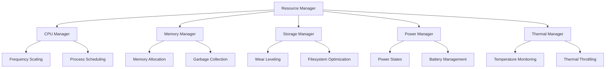

# Resource Management

The Nest Learning Thermostat implements sophisticated resource management systems to optimize performance, extend battery life, and ensure reliable operation. This document details the resource management architecture and algorithms.

## Resource Management Architecture

### Resource Categories
- **CPU Management**: Dynamic frequency scaling and process scheduling
- **Memory Management**: Memory allocation, garbage collection, and optimization
- **Storage Management**: Flash storage optimization and wear leveling
- **Power Management**: Power consumption optimization and battery management
- **Thermal Management**: Temperature monitoring and thermal throttling

### Management Framework


## CPU Management

### Dynamic Frequency Scaling
Adaptive CPU frequency adjustment based on workload and thermal conditions.

```c
// CPU management system
typedef struct {
    cpu_governor_t governor;               // CPU frequency governor
    process_scheduler_t scheduler;         // Process scheduler
    thermal_throttling_t thermal;          // Thermal throttling
    performance_monitor_t performance;     // Performance monitoring
} cpu_management_t;

// CPU frequency governor
typedef struct {
    governor_type_t type;                  // Governor type
    frequency_policy_t policy;             // Frequency policy
    scaling_algorithm_t algorithm;         // Scaling algorithm
    performance_target_t target;           // Performance target
    frequency_limits_t limits;             // Frequency limits
} cpu_governor_t;

// Frequency scaling policy
typedef struct {
    scaling_strategy_t strategy;           // Scaling strategy
    load_threshold_t thresholds;           // Load thresholds
    response_time_target_t response_target; // Response time targets
    power_efficiency_t efficiency;         // Power efficiency targets
} frequency_policy_t;

// Adaptive frequency scaling
void adaptive_frequency_scaling(cpu_management_t *cpu_mgmt) {
    cpu_governor_t *governor = &cpu_mgmt->governor;
    
    // Get current system metrics
    system_metrics_t metrics = get_current_system_metrics();
    
    // Calculate optimal frequency
    frequency_target_t target = calculate_optimal_frequency(
        governor, &metrics);
    
    // Apply thermal constraints
    target = apply_thermal_constraints(&cpu_mgmt->thermal, target);
    
    // Apply power constraints
    target = apply_power_constraints(target, &metrics.power_consumption);
    
    // Set CPU frequency
    if (target.frequency != get_current_cpu_frequency()) {
        set_cpu_frequency(target.frequency);
        log_frequency_change(target);
    }
}

// Optimal frequency calculation
frequency_target_t calculate_optimal_frequency(cpu_governor_t *governor, 
                                             system_metrics_t *metrics) {
    frequency_target_t target = {0};
    
    switch (governor->type) {
        case GOVERNOR_PERFORMANCE:
            // Maximum performance mode
            target.frequency = governor->limits.max_frequency;
            break;
            
        case GOVERNOR_POWERSAVE:
            // Power saving mode
            target.frequency = governor->limits.min_frequency;
            break;
            
        case GOVERNOR_ONDEMAND:
            // On-demand scaling based on load
            if (metrics->cpu_load > governor->policy.thresholds.high_load) {
                target.frequency = governor->limits.max_frequency;
            } else if (metrics->cpu_load > governor->policy.thresholds.medium_load) {
                target.frequency = governor->limits.max_frequency * 0.75;
            } else {
                target.frequency = governor->limits.min_frequency;
            }
            break;
            
        case GOVERNOR_ADAPTIVE:
            // Adaptive scaling considering multiple factors
            target = calculate_adaptive_frequency(governor, metrics);
            break;
    }
    
    return target;
}
```

### Process Scheduling
Intelligent process scheduling for optimal resource utilization.

```c
// Process scheduler
typedef struct {
    scheduling_policy_t policy;            // Scheduling policy
    priority_manager_t priority;           // Priority management
    load_balancer_t load_balancer;         // Load balancing
    realtime_manager_t realtime;           // Real-time task management
} process_scheduler_t;

// Scheduling policy
typedef struct {
    policy_type_t type;                    // Policy type
    time_slice_t time_slice;               // Time slice configuration
    priority_levels_t priorities;          // Priority levels
    fairness_algorithm_t fairness;         // Fairness algorithm
} scheduling_policy_t;

// Process scheduling algorithm
void schedule_processes(process_scheduler_t *scheduler) {
    process_queue_t *ready_queue = get_ready_queue();
    process_queue_t *realtime_queue = get_realtime_queue();
    
    // Schedule real-time processes first
    schedule_realtime_processes(&scheduler->realtime, realtime_queue);
    
    // Schedule regular processes
    switch (scheduler->policy.type) {
        case SCHED_ROUND_ROBIN:
            schedule_round_robin(scheduler, ready_queue);
            break;
            
        case SCHED_PRIORITY:
            schedule_priority_based(scheduler, ready_queue);
            break;
            
        case SCHED_FAIR_SHARE:
            schedule_fair_share(scheduler, ready_queue);
            break;
            
        case SCHED_ADAPTIVE:
            schedule_adaptive(scheduler, ready_queue);
            break;
    }
    
    // Update load balancing
    update_load_balancing(&scheduler->load_balancer);
}
```

## Memory Management

### Memory Allocation Optimization
Efficient memory allocation and management strategies.

```c
// Memory management system
typedef struct {
    memory_allocator_t allocator;         // Memory allocator
    garbage_collector_t gc;                // Garbage collector
    memory_pool_t pools[MAX_POOLS];       // Memory pools
    memory_compactor_t compactor;         // Memory compactor
} memory_management_t;

// Memory allocator
typedef struct {
    allocation_strategy_t strategy;        // Allocation strategy
    fragmentation_handler_t fragmentation; // Fragmentation handler
    cache_manager_t cache;                 // Memory cache management
    buddy_system_t buddy_system;           // Buddy system allocator
} memory_allocator_t;

// Memory allocation strategy
typedef struct {
    strategy_type_t type;                  // Strategy type
    pool_sizing_t pool_sizing;             // Pool sizing policy
    allocation_alignment_t alignment;     // Allocation alignment
    prefetch_policy_t prefetch;            // Prefetch policy
} allocation_strategy_t;

// Optimized memory allocation
void* optimized_memory_allocate(memory_management_t *mem_mgmt, 
                               size_t size, allocation_flags_t flags) {
    memory_allocator_t *allocator = &mem_mgmt->allocator;
    
    // Select appropriate allocation strategy
    allocation_strategy_t *strategy = select_allocation_strategy(
        allocator, size, flags);
    
    // Try to allocate from memory pools first
    void *ptr = allocate_from_pools(mem_mgmt->pools, size);
    if (ptr) {
        return ptr;
    }
    
    // Use main allocator
    switch (strategy->type) {
        case ALLOC_STRATEGY_BUDDY:
            ptr = buddy_system_allocate(&allocator->buddy_system, size);
            break;
            
        case ALLOC_STRATEGY_SLAB:
            ptr = slab_allocator_allocate(size);
            break;
            
        case ALLOC_STRATEGY_TLSF:
            ptr = tlsf_allocator_allocate(size);
            break;
    }
    
    // Update allocation statistics
    update_allocation_statistics(ptr, size);
    
    return ptr;
}
```

### Garbage Collection
Automated garbage collection for memory optimization.

```c
// Garbage collector
typedef struct {
    gc_algorithm_t algorithm;              // GC algorithm
    gc_policy_t policy;                    // GC policy
    gc_statistics_t statistics;            // GC statistics
    gc_tuning_t tuning;                    // GC tuning parameters
} garbage_collector_t;

// GC algorithm
typedef struct {
    algorithm_type_t type;                 // Algorithm type
    generational_gc_t generational;        // Generational GC
    concurrent_gc_t concurrent;            // Concurrent GC
    incremental_gc_t incremental;          // Incremental GC
} gc_algorithm_t;

// Garbage collection process
void run_garbage_collection(garbage_collector_t *gc) {
    gc_statistics_t *stats = &gc->statistics;
    
    // Start GC timing
    timestamp_t gc_start = get_current_timestamp();
    
    switch (gc->algorithm.type) {
        case GC_GENERATIONAL:
            run_generational_gc(&gc->algorithm.generational);
            break;
            
        case GC_CONCURRENT:
            run_concurrent_gc(&gc->algorithm.concurrent);
            break;
            
        case GC_INCREMENTAL:
            run_incremental_gc(&gc->algorithm.incremental);
            break;
    }
    
    // Update GC statistics
    timestamp_t gc_end = get_current_timestamp();
    stats->last_gc_duration = gc_end - gc_start;
    stats->total_gc_time += stats->last_gc_duration;
    stats->gc_count++;
    
    // Tune GC parameters based on performance
    tune_gc_parameters(gc, stats);
}
```

## Storage Management

### Flash Storage Optimization
Optimized flash storage management with wear leveling.

```c
// Storage management system
typedef struct {
    flash_manager_t flash;                 // Flash storage management
    filesystem_manager_t filesystem;       // Filesystem management
    wear_leveling_t wear_leveling;         // Wear leveling
    storage_optimizer_t optimizer;         // Storage optimizer
} storage_management_t;

// Flash storage manager
typedef struct {
    flash_geometry_t geometry;             // Flash geometry
    block_management_t blocks;             // Block management
    wear_statistics_t wear_stats;          // Wear statistics
    error_correction_t ecc;                // Error correction
    bad_block_manager_t bad_blocks;        // Bad block management
} flash_manager_t;

// Wear leveling algorithm
typedef struct {
    wear_leveling_type_t type;             // Wear leveling type
    block_pool_t free_blocks;              // Free block pool
    wear_distribution_t distribution;      // Wear distribution
    wear_threshold_t thresholds;           // Wear thresholds
} wear_leveling_t;

// Advanced wear leveling
void apply_wear_leveling(storage_management_t *storage, 
                       write_operation_t *operation) {
    wear_leveling_t *wl = &storage->wear_leveling;
    
    // Select target block based on wear leveling strategy
    flash_block_t target_block = select_optimal_block(wl, operation->size);
    
    // Check block health
    if (is_block_bad(target_block)) {
        target_block = select_alternative_block(wl, operation->size);
    }
    
    // Perform write operation with error correction
    write_result_t result = perform_protected_write(target_block, operation);
    
    if (result.success) {
        // Update wear statistics
        update_block_wear(&wl->wear_stats, target_block);
        
        // Update wear distribution
        update_wear_distribution(&wl->distribution, target_block);
        
        // Check for wear threshold violations
        check_wear_thresholds(wl, target_block);
    } else {
        // Handle write failure
        handle_write_failure(storage, target_block, operation);
    }
}
```

### Filesystem Optimization
Optimized filesystem operations for embedded systems.

```c
// Filesystem manager
typedef struct {
    filesystem_type_t type;                // Filesystem type
    mount_options_t mount_options;         // Mount options
    cache_policy_t cache_policy;           // Cache policy
    journaling_t journaling;               // Journaling configuration
} filesystem_manager_t;

// Filesystem cache policy
typedef struct {
    cache_size_t size;                     // Cache size
    replacement_policy_t replacement;      // Replacement policy
    write_back_policy_t write_back;        // Write-back policy
    prefetch_strategy_t prefetch;          // Prefetch strategy
} cache_policy_t;

// Optimized filesystem operations
void optimize_filesystem_operations(filesystem_manager_t *fs) {
    // Analyze filesystem usage patterns
    usage_pattern_t patterns = analyze_usage_patterns(fs);
    
    // Optimize cache configuration
    optimize_cache_configuration(&fs->cache_policy, patterns);
    
    // Optimize journaling for performance
    optimize_journaling(&fs->journaling, patterns);
    
    // Perform filesystem maintenance
    perform_filesystem_maintenance(fs);
}
```

## Power Management

### Power State Management
Dynamic power state adjustment based on usage patterns.

```c
// Power management system
typedef struct {
    power_state_manager_t states;          // Power state manager
    battery_manager_t battery;             // Battery management
    power_policy_t policy;                 // Power policy
    power_monitoring_t monitoring;         // Power monitoring
} power_management_t;

// Power state manager
typedef struct {
    power_state_t current_state;           // Current power state
    state_transition_t transitions;        // State transitions
    state_policy_t policy;                 // State policy
    wakeup_sources_t wakeup_sources;       // Wakeup sources
} power_state_manager_t;

// Power states
typedef enum {
    POWER_STATE_ACTIVE,                    // Active power state
    POWER_STATE_IDLE,                      // Idle power state
    POWER_STATE_STANDBY,                   // Standby power state
    POWER_STATE_SUSPEND,                   // Suspend power state
    POWER_STATE_HIBERNATE,                 // Hibernate power state
    POWER_STATE_OFF                        // Power off state
} power_state_t;

// Power state management
void manage_power_states(power_management_t *power_mgmt) {
    power_state_manager_t *states = &power_mgmt->states;
    
    // Get current system activity
    system_activity_t activity = get_system_activity();
    
    // Determine optimal power state
    power_state_t optimal_state = determine_optimal_power_state(
        &states->policy, activity);
    
    // Transition to optimal state if needed
    if (optimal_state != states->current_state) {
        transition_power_state(states, optimal_state);
    }
    
    // Configure wakeup sources
    configure_wakeup_sources(&states->wakeup_sources, optimal_state);
}

// Power state transition
void transition_power_state(power_state_manager_t *states, 
                          power_state_t target_state) {
    // Validate transition
    if (!is_valid_transition(states->current_state, target_state)) {
        log_error("Invalid power state transition");
        return;
    }
    
    // Prepare for transition
    prepare_power_state_transition(states->current_state, target_state);
    
    // Execute transition
    execute_power_state_transition(target_state);
    
    // Update current state
    states->current_state = target_state;
    
    // Log transition
    log_power_state_transition(target_state);
}
```

### Battery Management
Comprehensive battery monitoring and management.

```c
// Battery manager
typedef struct {
    battery_monitor_t monitor;             // Battery monitoring
    charging_controller_t charger;         // Charging controller
    battery_health_t health;               // Battery health
    power_optimization_t optimization;     // Power optimization
} battery_manager_t;

// Battery monitoring
typedef struct {
    battery_status_t status;               // Battery status
    charge_level_t charge_level;           // Charge level
    voltage_monitor_t voltage;             // Voltage monitoring
    current_monitor_t current;             // Current monitoring
    temperature_monitor_t temperature;     // Temperature monitoring
} battery_monitor_t;

// Battery health monitoring
void monitor_battery_health(battery_manager_t *battery) {
    battery_health_t *health = &battery->health;
    
    // Get current battery metrics
    battery_metrics_t metrics = get_battery_metrics(&battery->monitor);
    
    // Calculate state of health
    health->state_of_health = calculate_state_of_health(metrics);
    
    // Estimate remaining capacity
    health->estimated_capacity = estimate_remaining_capacity(metrics);
    
    // Predict battery life
    health->predicted_life = predict_battery_life(health, metrics);
    
    // Check for battery issues
    check_battery_issues(health, metrics);
    
    // Optimize charging based on health
    optimize_charging_strategy(&battery->charger, health);
}
```

## Thermal Management

### Temperature Monitoring
Comprehensive temperature monitoring and thermal analysis.

```c
// Thermal management system
typedef struct {
    temperature_monitor_t monitor;         // Temperature monitoring
    thermal_throttling_t throttling;       // Thermal throttling
    cooling_system_t cooling;              // Cooling system
    thermal_policy_t policy;               // Thermal policy
} thermal_management_t;

// Temperature monitor
typedef struct {
    temperature_sensor_t sensors[MAX_SENSORS]; // Temperature sensors
    thermal_zone_t zones[MAX_ZONES];       // Thermal zones
    temperature_history_t history;         // Temperature history
    thermal_model_t model;                 // Thermal model
} temperature_monitor_t;

// Temperature sensor
typedef struct {
    sensor_id_t id;                        // Sensor ID
    sensor_type_t type;                    // Sensor type
    location_t location;                   // Sensor location
    calibration_data_t calibration;       // Calibration data
    float current_temperature;             // Current temperature
    temperature_thresholds_t thresholds;   // Temperature thresholds
} temperature_sensor_t;

// Temperature monitoring
void monitor_temperatures(thermal_management_t *thermal) {
    temperature_monitor_t *monitor = &thermal->monitor;
    
    // Read all temperature sensors
    for (int i = 0; i < MAX_SENSORS; i++) {
        temperature_sensor_t *sensor = &monitor->sensors[i];
        
        if (sensor->type != SENSOR_TYPE_NONE) {
            // Read raw temperature
            float raw_temp = read_temperature_sensor(sensor->id);
            
            // Apply calibration
            float calibrated_temp = apply_calibration(sensor, raw_temp);
            
            // Update current temperature
            sensor->current_temperature = calibrated_temp;
            
            // Check temperature thresholds
            check_temperature_thresholds(sensor);
            
            // Update temperature history
            update_temperature_history(&monitor->history, sensor->id, 
                                      calibrated_temp);
        }
    }
    
    // Update thermal zones
    update_thermal_zones(monitor);
    
    // Update thermal model
    update_thermal_model(&monitor->model);
}
```

### Thermal Throttling
Dynamic performance adjustment based on thermal conditions.

```c
// Thermal throttling system
typedef struct {
    throttling_policy_t policy;            // Throttling policy
    performance_limiter_t limiter;         // Performance limiter
    cooling_control_t cooling_control;     // Cooling control
    throttling_history_t history;          // Throttling history
} thermal_throttling_t;

// Throttling policy
typedef struct {
    temperature_thresholds_t thresholds;   // Temperature thresholds
    throttling_levels_t levels;            // Throttling levels
    recovery_strategy_t recovery;          // Recovery strategy
    hysteresis_t hysteresis;               // Hysteresis configuration
} throttling_policy_t;

// Thermal throttling algorithm
void apply_thermal_throttling(thermal_management_t *thermal) {
    thermal_throttling_t *throttling = &thermal->throttling;
    temperature_monitor_t *monitor = &thermal->monitor;
    
    // Get maximum temperature across all zones
    float max_temp = get_maximum_temperature(monitor);
    
    // Determine throttling level
    throttling_level_t level = determine_throttling_level(
        &throttling->policy, max_temp);
    
    // Apply throttling if needed
    if (level > THROTTLING_NONE) {
        apply_performance_limiting(&throttling->limiter, level);
        
        // Increase cooling
        increase_cooling(&throttling->cooling_control, level);
        
        // Log throttling event
        log_throttling_event(max_temp, level);
    } else {
        // Check if we can recover from throttling
        if (can_recover_from_throttling(throttling, max_temp)) {
            recover_from_throttling(throttling);
        }
    }
}
```

## Resource Optimization

### Multi-resource Optimization
Coordinated optimization across all system resources.

```c
// Resource optimizer
typedef struct {
    optimization_objectives_t objectives;  // Optimization objectives
    optimization_algorithm_t algorithm;    // Optimization algorithm
    resource_coordinator_t coordinator;    // Resource coordinator
    optimization_feedback_t feedback;      // Optimization feedback
} resource_optimizer_t;

// Optimization objectives
typedef struct {
    performance_weight_t performance;     // Performance weight
    power_weight_t power;                  // Power efficiency weight
    thermal_weight_t thermal;              // Thermal management weight
    reliability_weight_t reliability;      // Reliability weight
} optimization_objectives_t;

// Multi-resource optimization
void optimize_system_resources(resource_optimizer_t *optimizer, 
                              system_state_t *current_state) {
    // Analyze current resource utilization
    resource_analysis_t analysis = analyze_resource_utilization(current_state);
    
    // Calculate optimization targets
    optimization_targets_t targets = calculate_optimization_targets(
        &optimizer->objectives, &analysis);
    
    // Apply optimization algorithm
    optimization_plan_t plan = apply_optimization_algorithm(
        &optimizer->algorithm, targets, current_state);
    
    // Coordinate resource adjustments
    coordinate_resource_adjustments(&optimizer->coordinator, &plan);
    
    // Monitor optimization results
    monitor_optimization_results(&optimizer->feedback, &plan);
    
    // Adapt optimization parameters
    adapt_optimization_parameters(optimizer, &optimizer->feedback);
}
```

## Related Documentation

- [System Management Overview](./overview.mdx)
- [Service Management](./service-management.mdx)
- [Health Monitoring](./health-monitoring.mdx)
- [Diagnostics](./diagnostics.mdx)
