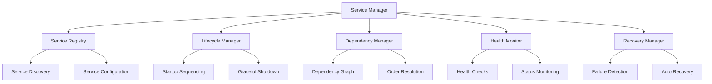

# Service Management

The Nest Learning Thermostat implements a comprehensive service management system for orchestrating system services, managing dependencies, and ensuring reliable operation. This document details the service management architecture and implementation.

## Service Management Architecture

### Core Components
- **Service Registry**: Central registry of all system services
- **Lifecycle Manager**: Service startup, shutdown, and restart management
- **Dependency Manager**: Service dependency resolution and ordering
- **Health Monitor**: Service health monitoring and status tracking
- **Recovery Manager**: Automatic service recovery and fault tolerance

### Service Framework


## Service Registry

### Service Registration
Central registration system for all system services.

```c
// Service registry system
typedef struct {
    service_entry_t services[MAX_SERVICES]; // Service entries
    int service_count;                     // Number of registered services
    service_index_t index;                 // Service index for fast lookup
    registry_config_t config;              // Registry configuration
    service_metadata_t metadata;           // Service metadata
} service_registry_t;

// Service entry
typedef struct {
    service_id_t service_id;               // Unique service ID
    char service_name[64];                 // Service name
    char service_version[16];              // Service version
    service_type_t type;                   // Service type
    service_state_t current_state;         // Current service state
    service_state_t desired_state;         // Desired service state
    pid_t process_id;                      // Process ID
    service_priority_t priority;           // Service priority
    dependency_list_t dependencies;        // Service dependencies
    health_check_config_t health_check;    // Health check configuration
    restart_policy_t restart_policy;       // Restart policy
    resource_limits_t limits;              // Resource limits
    timestamp_t registration_time;         // Registration timestamp
    timestamp_t last_heartbeat;            // Last heartbeat timestamp
} service_entry_t;

// Service registration
int register_service(service_registry_t *registry, 
                    service_descriptor_t *descriptor) {
    // Validate service descriptor
    if (!validate_service_descriptor(descriptor)) {
        return SERVICE_REGISTRATION_INVALID_DESCRIPTOR;
    }
    
    // Check for duplicate service
    if (find_service_by_name(registry, descriptor->name) != NULL) {
        return SERVICE_REGISTRATION_DUPLICATE;
    }
    
    // Create new service entry
    service_entry_t *entry = create_service_entry(descriptor);
    
    // Add to registry
    if (registry->service_count < MAX_SERVICES) {
        registry->services[registry->service_count] = *entry;
        registry->service_count++;
        
        // Update service index
        update_service_index(&registry->index, entry);
        
        // Initialize service monitoring
        initialize_service_monitoring(entry);
        
        log_service_registration(entry);
        return SERVICE_REGISTRATION_SUCCESS;
    }
    
    return SERVICE_REGISTRATION_FULL;
}
```

### Service Discovery
Dynamic service discovery and lookup mechanisms.

```c
// Service discovery system
typedef struct {
    discovery_method_t method;             // Discovery method
    service_cache_t cache;                 // Service cache
    lookup_algorithm_t algorithm;          // Lookup algorithm
    discovery_events_t events;              // Discovery events
} service_discovery_t;

// Service cache
typedef struct {
    cache_entry_t entries[MAX_CACHE_ENTRIES]; // Cache entries
    int cache_size;                        // Current cache size
    cache_policy_t policy;                 // Cache policy
    timestamp_t last_cleanup;              // Last cleanup timestamp
} service_cache_t;

// Service lookup
service_entry_t* lookup_service(service_registry_t *registry, 
                               service_query_t *query) {
    service_discovery_t *discovery = &registry->discovery;
    
    // Check cache first
    service_entry_t *cached_result = lookup_in_cache(&discovery->cache, query);
    if (cached_result) {
        return cached_result;
    }
    
    // Perform registry lookup
    service_entry_t *result = NULL;
    
    switch (query->lookup_type) {
        case LOOKUP_BY_NAME:
            result = find_service_by_name(registry, query->service_name);
            break;
            
        case LOOKUP_BY_ID:
            result = find_service_by_id(registry, query->service_id);
            break;
            
        case LOOKUP_BY_TYPE:
            result = find_service_by_type(registry, query->service_type);
            break;
            
        case LOOKUP_BY_CAPABILITY:
            result = find_service_by_capability(registry, query->capability);
            break;
    }
    
    // Cache the result
    if (result) {
        cache_service_result(&discovery->cache, query, result);
    }
    
    return result;
}
```

## Lifecycle Management

### Service Startup
Controlled service startup with dependency resolution.

```c
// Service lifecycle manager
typedef struct {
    startup_sequencer_t sequencer;         // Startup sequencer
    shutdown_handler_t shutdown;           // Shutdown handler
    restart_manager_t restart;             // Restart manager
    state_tracker_t state_tracker;         // State tracking
} lifecycle_manager_t;

// Startup sequencer
typedef struct {
    startup_strategy_t strategy;           // Startup strategy
    dependency_resolver_t resolver;        // Dependency resolver
    parallel_startup_t parallel;           // Parallel startup
    startup_timeout_t timeout;             // Startup timeout
} startup_sequencer_t;

// Service startup process
startup_result_t startup_services(lifecycle_manager_t *lifecycle, 
                                 service_registry_t *registry) {
    startup_sequencer_t *sequencer = &lifecycle->sequencer;
    
    // Calculate startup order
    startup_order_t order = calculate_startup_order(
        &sequencer->resolver, registry);
    
    // Validate startup order
    if (!validate_startup_order(order)) {
        return STARTUP_ORDER_INVALID;
    }
    
    // Execute startup sequence
    startup_result_t result = execute_startup_sequence(sequencer, order);
    
    // Update service states
    update_service_states(&lifecycle->state_tracker, result);
    
    return result;
}

// Execute startup sequence
startup_result_t execute_startup_sequence(startup_sequencer_t *sequencer, 
                                         startup_order_t order) {
    startup_result_t result = {0};
    
    // Start services in calculated order
    for (int phase = 0; phase < order.phase_count; phase++) {
        startup_phase_t *current_phase = &order.phases[phase];
        
        if (current_phase->parallel_execution) {
            // Start services in parallel
            result = start_services_parallel(sequencer, current_phase);
        } else {
            // Start services sequentially
            result = start_services_sequential(sequencer, current_phase);
        }
        
        // Check for startup failures
        if (result.failure_count > 0) {
            handle_startup_failures(sequencer, &result);
            
            // Decide whether to continue or abort
            if (should_abort_startup(result)) {
                return result;
            }
        }
    }
    
    return result;
}
```

### Graceful Shutdown
Controlled service shutdown with proper resource cleanup.

```c
// Service shutdown handler
typedef struct {
    shutdown_strategy_t strategy;         // Shutdown strategy
    timeout_manager_t timeouts;           // Shutdown timeouts
    cleanup_manager_t cleanup;            // Cleanup management
    shutdown_order_t order;               // Shutdown order
} shutdown_handler_t;

// Graceful shutdown process
shutdown_result_t shutdown_services_gracefully(lifecycle_manager_t *lifecycle, 
                                              shutdown_reason_t reason) {
    shutdown_handler_t *shutdown = &lifecycle->shutdown;
    
    // Calculate shutdown order (reverse of startup)
    shutdown_order_t order = calculate_shutdown_order(
        shutdown, reason);
    
    // Execute shutdown sequence
    shutdown_result_t result = execute_shutdown_sequence(shutdown, order);
    
    // Perform final cleanup
    perform_final_cleanup(&shutdown->cleanup);
    
    return result;
}

// Execute shutdown sequence
shutdown_result_t execute_shutdown_sequence(shutdown_handler_t *shutdown, 
                                           shutdown_order_t order) {
    shutdown_result_t result = {0};
    
    // Shutdown services in calculated order
    for (int phase = 0; phase < order.phase_count; phase++) {
        shutdown_phase_t *current_phase = &order.phases[phase];
        
        // Send shutdown signal to services
        send_shutdown_signals(current_phase);
        
        // Wait for graceful shutdown with timeout
        wait_for_shutdown_completion(current_phase, 
                                   &shutdown->timeouts);
        
        // Force shutdown if necessary
        force_hanging_services(current_phase);
        
        // Update shutdown statistics
        update_shutdown_statistics(&result, current_phase);
    }
    
    return result;
}
```

## Dependency Management

### Dependency Resolution
Automatic resolution of service dependencies and circular dependency detection.

```c
// Dependency management system
typedef struct {
    dependency_graph_t graph;             // Dependency graph
    dependency_resolver_t resolver;        // Dependency resolver
    conflict_detector_t conflict_detector; // Conflict detector
    version_manager_t version_manager;     // Version management
} dependency_management_t;

// Dependency graph
typedef struct {
    dependency_node_t nodes[MAX_NODES];    // Dependency nodes
    dependency_edge_t edges[MAX_EDGES];    // Dependency edges
    int node_count;                        // Number of nodes
    int edge_count;                        // Number of edges
    graph_validation_t validation;         // Graph validation
} dependency_graph_t;

// Dependency resolver
typedef struct {
    resolution_strategy_t strategy;        // Resolution strategy
    version_compatibility_t compatibility; // Version compatibility
    alternative_resolver_t alternatives;   // Alternative services
    resolution_cache_t cache;              // Resolution cache
} dependency_resolver_t;

// Resolve service dependencies
dependency_resolution_t resolve_dependencies(
    dependency_management_t *dep_mgmt, 
    service_entry_t *service) {
    
    dependency_resolver_t *resolver = &dep_mgmt->resolver;
    
    // Create resolution context
    resolution_context_t context = create_resolution_context(service);
    
    // Resolve direct dependencies
    for (int i = 0; i < service->dependencies.count; i++) {
        dependency_t *dep = &service->dependencies.dependencies[i];
        
        // Find compatible service
        service_entry_t *compatible_service = find_compatible_service(
            resolver, dep, &context);
        
        if (compatible_service) {
            add_resolved_dependency(&context, dep, compatible_service);
        } else {
            // Try to find alternative
            service_entry_t *alternative = find_alternative_service(
                &resolver->alternatives, dep);
            
            if (alternative) {
                add_resolved_dependency(&context, dep, alternative);
            } else {
                // Dependency resolution failed
                context.resolution_status = RESOLUTION_FAILED;
                context.failed_dependency = dep;
                break;
            }
        }
    }
    
    // Check for circular dependencies
    if (has_circular_dependencies(&dep_mgmt->graph, service)) {
        context.resolution_status = RESOLUTION_CIRCULAR_DEPENDENCY;
    }
    
    return create_resolution_result(&context);
}
```

### Version Management
Service version compatibility and upgrade management.

```c
// Version management system
typedef struct {
    version_policy_t policy;               // Version policy
    compatibility_matrix_t compatibility;  // Compatibility matrix
    upgrade_manager_t upgrade;             // Upgrade manager
    rollback_manager_t rollback;           // Rollback manager
} version_management_t;

// Version policy
typedef struct {
    version_constraint_t constraints;     // Version constraints
    compatibility_level_t compatibility;   // Compatibility level
    upgrade_strategy_t upgrade_strategy;   // Upgrade strategy
    version_locking_t locking;             // Version locking
} version_policy_t;

// Service upgrade management
upgrade_result_t upgrade_service(version_management_t *version_mgmt, 
                                service_id_t service_id, 
                                version_t target_version) {
    upgrade_manager_t *upgrade = &version_mgmt->upgrade;
    
    // Get current service
    service_entry_t *current_service = get_service_by_id(service_id);
    if (!current_service) {
        return UPGRADE_SERVICE_NOT_FOUND;
    }
    
    // Validate upgrade
    if (!validate_service_upgrade(version_mgmt, current_service, 
                                 target_version)) {
        return UPGRADE_VALIDATION_FAILED;
    }
    
    // Create upgrade plan
    upgrade_plan_t plan = create_upgrade_plan(upgrade, current_service, 
                                            target_version);
    
    // Execute upgrade plan
    upgrade_result_t result = execute_upgrade_plan(upgrade, plan);
    
    // Handle upgrade result
    if (result.success) {
        // Update service registry
        update_service_version(current_service, target_version);
        
        // Verify upgrade
        if (!verify_service_upgrade(current_service)) {
            // Rollback if verification fails
            rollback_service(&version_mgmt->rollback, service_id, 
                           current_service->previous_version);
            result.success = false;
            result.error = UPGRADE_VERIFICATION_FAILED;
        }
    }
    
    return result;
}
```

## Health Monitoring

### Service Health Checks
Comprehensive health monitoring for all system services.

```c
// Service health monitoring system
typedef struct {
    health_check_engine_t engine;          // Health check engine
    health_metrics_t metrics;              // Health metrics
    health_alerts_t alerts;                 // Health alerts
    health_history_t history;              // Health history
} health_monitor_t;

// Health check engine
typedef struct {
    check_scheduler_t scheduler;           // Check scheduler
    check_executor_t executor;             // Check executor
    result_analyzer_t analyzer;            // Result analyzer
    health_thresholds_t thresholds;        // Health thresholds
} health_check_engine_t;

// Health check configuration
typedef struct {
    check_type_t type;                     // Check type
    check_interval_t interval;             // Check interval
    timeout_t timeout;                     // Check timeout
    retry_policy_t retry_policy;           // Retry policy
    health_criteria_t criteria;            // Health criteria
} health_check_config_t;

// Execute health checks
void execute_health_checks(health_monitor_t *monitor, 
                          service_registry_t *registry) {
    health_check_engine_t *engine = &monitor->engine;
    
    for (int i = 0; i < registry->service_count; i++) {
        service_entry_t *service = &registry->services[i];
        
        // Check if health check is due
        if (is_health_check_due(service, &engine->scheduler)) {
            // Execute health check
            health_check_result_t result = execute_service_health_check(
                &engine->executor, service);
            
            // Analyze result
            health_status_t status = analyze_health_result(
                &engine->analyzer, result, &engine->thresholds);
            
            // Update service health status
            update_service_health_status(service, status);
            
            // Update health metrics
            update_health_metrics(&monitor->metrics, service, status);
            
            // Check for health alerts
            check_health_alerts(&monitor->alerts, service, status);
            
            // Update health history
            update_health_history(&monitor->history, service, status);
        }
    }
}
```

### Health Status Aggregation
Aggregate health status across multiple services and components.

```c
// Health status aggregation
typedef struct {
    aggregation_strategy_t strategy;       // Aggregation strategy
    health_weights_t weights;              // Health weights
    aggregation_rules_t rules;             // Aggregation rules
    overall_health_t overall;              // Overall health
} health_aggregator_t;

// Health aggregation
overall_health_t calculate_overall_health(health_aggregator_t *aggregator, 
                                         service_registry_t *registry) {
    overall_health_t overall = {0};
    
    float weighted_health_score = 0.0;
    float total_weight = 0.0;
    
    // Calculate weighted health score
    for (int i = 0; i < registry->service_count; i++) {
        service_entry_t *service = &registry->services[i];
        
        float service_weight = get_service_weight(&aggregator->weights, 
                                                 service->type);
        float service_health = get_service_health_score(service);
        
        weighted_health_score += service_health * service_weight;
        total_weight += service_weight;
    }
    
    // Calculate overall health score
    overall.health_score = weighted_health_score / total_weight;
    
    // Determine overall health status
    overall.status = determine_overall_health_status(overall.health_score);
    
    // Calculate health trend
    overall.trend = calculate_health_trend(&aggregator->overall, 
                                         overall.health_score);
    
    // Update overall health
    aggregator->overall = overall;
    
    return overall;
}
```

## Recovery Management

### Automatic Service Recovery
Self-healing mechanisms for automatic service recovery.

```c
// Service recovery management system
typedef struct {
    failure_detector_t detector;           // Failure detector
    recovery_engine_t engine;              // Recovery engine
    recovery_policy_t policy;              // Recovery policy
    recovery_history_t history;            // Recovery history
} recovery_manager_t;

// Failure detector
typedef struct {
    detection_methods_t methods;           // Detection methods
    failure_criteria_t criteria;           // Failure criteria
    detection_thresholds_t thresholds;     // Detection thresholds
    false_positive_filter_t filter;        // False positive filter
} failure_detector_t;

// Recovery engine
typedef struct {
    recovery_strategies_t strategies;      // Recovery strategies
    recovery_executor_t executor;          // Recovery executor
    rollback_handler_t rollback;           // Rollback handler
    recovery_validation_t validation;      // Recovery validation
} recovery_engine_t;

// Automatic service recovery
recovery_result_t recover_service_automatically(recovery_manager_t *recovery, 
                                               service_entry_t *service) {
    recovery_engine_t *engine = &recovery->engine;
    
    // Analyze failure
    failure_analysis_t analysis = analyze_service_failure(
        &recovery->detector, service);
    
    // Select recovery strategy
    recovery_strategy_t strategy = select_recovery_strategy(
        &engine->strategies, &analysis);
    
    // Execute recovery
    recovery_result_t result = execute_recovery_strategy(
        &engine->executor, service, strategy);
    
    // Validate recovery
    if (result.success) {
        result.success = validate_service_recovery(
            &engine->validation, service);
    }
    
    // Rollback if recovery failed
    if (!result.success) {
        rollback_service_recovery(&engine->rollback, service, 
                                 strategy);
    }
    
    // Update recovery history
    update_recovery_history(&recovery->history, service, strategy, 
                           result);
    
    return result;
}
```

### Circuit Breaker Pattern
Circuit breaker implementation for preventing cascading failures.

```c
// Circuit breaker system
typedef struct {
    circuit_breaker_t breakers[MAX_BREAKERS]; // Circuit breakers
    breaker_config_t config;               // Breaker configuration
    breaker_monitor_t monitor;             // Breaker monitoring
    breaker_recovery_t recovery;           // Breaker recovery
} circuit_breaker_system_t;

// Circuit breaker
typedef struct {
    char service_name[64];                 // Service name
    breaker_state_t state;                 // Breaker state
    failure_threshold_t threshold;         // Failure threshold
    timeout_config_t timeout;              // Timeout configuration
    failure_statistics_t stats;            // Failure statistics
    timestamp_t last_failure_time;         // Last failure time
    timestamp_t last_state_change;         // Last state change
} circuit_breaker_t;

// Circuit breaker states
typedef enum {
    BREAKER_STATE_CLOSED,                  // Normal operation
    BREAKER_STATE_OPEN,                    // Circuit open
    BREAKER_STATE_HALF_OPEN                // Testing recovery
} breaker_state_t;

// Circuit breaker execution
execution_result_t execute_with_circuit_breaker(
    circuit_breaker_system_t *cb_system, 
    const char *service_name, 
    service_operation_t operation) {
    
    circuit_breaker_t *breaker = find_circuit_breaker(cb_system, service_name);
    
    // Check breaker state
    if (breaker->state == BREAKER_STATE_OPEN) {
        // Check if we should try half-open state
        if (should_try_half_open(breaker)) {
            breaker->state = BREAKER_STATE_HALF_OPEN;
        } else {
            return create_execution_result(false, "Circuit breaker is open");
        }
    }
    
    // Execute operation
    execution_result_t result = execute_service_operation(operation);
    
    // Update breaker state based on result
    if (result.success) {
        handle_operation_success(breaker);
    } else {
        handle_operation_failure(breaker);
    }
    
    return result;
}
```

## Service Orchestration

### Service Composition
Compose multiple services into complex workflows.

```c
// Service orchestration system
typedef struct {
    workflow_engine_t engine;              // Workflow engine
    service_composer_t composer;           // Service composer
    orchestration_policy_t policy;         // Orchestration policy
    workflow_monitor_t monitor;            // Workflow monitoring
} service_orchestration_t;

// Workflow engine
typedef struct {
    workflow_definition_t definitions;    // Workflow definitions
    execution_engine_t executor;           // Execution engine
    state_manager_t state_manager;         // State management
    error_handler_t error_handler;         // Error handling
} workflow_engine_t;

// Service workflow
typedef struct {
    workflow_id_t workflow_id;             // Workflow ID
    workflow_step_t steps[MAX_STEPS];      // Workflow steps
    int step_count;                        // Number of steps
    execution_context_t context;           // Execution context
    workflow_state_t state;                // Workflow state
} service_workflow_t;

// Execute service workflow
workflow_result_t execute_service_workflow(
    service_orchestration_t *orchestration, 
    workflow_id_t workflow_id, 
    workflow_input_t input) {
    
    workflow_engine_t *engine = &orchestration->engine;
    
    // Get workflow definition
    service_workflow_t *workflow = get_workflow_definition(
        &engine->definitions, workflow_id);
    
    if (!workflow) {
        return create_workflow_result(false, "Workflow not found");
    }
    
    // Initialize execution context
    initialize_execution_context(&workflow->context, input);
    
    // Execute workflow steps
    workflow_result_t result = {0};
    for (int step = 0; step < workflow->step_count; step++) {
        workflow_step_t *current_step = &workflow->steps[step];
        
        // Execute step
        step_result_t step_result = execute_workflow_step(
            &engine->executor, current_step, &workflow->context);
        
        if (step_result.success) {
            // Update context with step output
            update_execution_context(&workflow->context, 
                                    current_step, step_result.output);
        } else {
            // Handle step failure
            result = handle_workflow_step_failure(engine, workflow, 
                                                current_step, step_result);
            break;
        }
    }
    
    // Update workflow state
    update_workflow_state(workflow, result);
    
    return result;
}
```

## Related Documentation

- [System Management Overview](./overview.mdx)
- [Resource Management](./resource-management.mdx)
- [Health Monitoring](./health-monitoring.mdx)
- [Diagnostics](./diagnostics.mdx)
