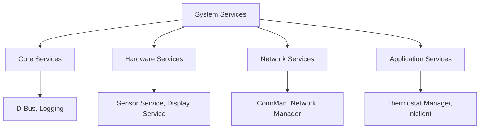
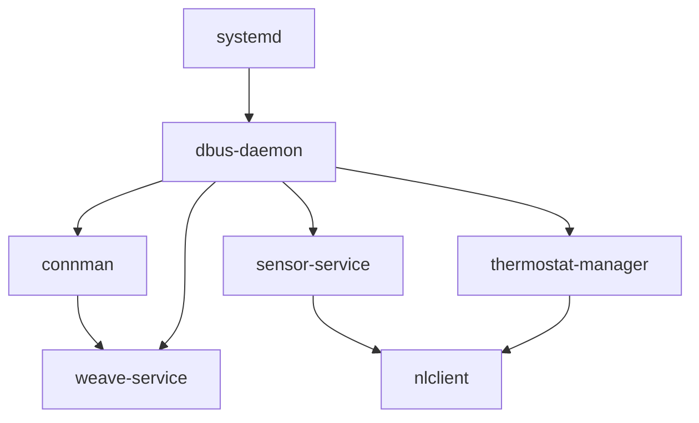

# System Services

The Nest Learning Thermostat runs a collection of system services that provide essential functionality for device operation, communication, and management. These services operate in the background and form the foundation of the software architecture.

## Service Architecture

### Service Management
- **Init System**: Systemd for service lifecycle management
- **Dependencies**: Service dependency management
- **Lifecycle**: Service startup, shutdown, and restart
- **Monitoring**: Service health monitoring and recovery

### Service Categories


## Core System Services

### systemd
- **Purpose**: System and service manager
- **Configuration**: `/etc/systemd/` configuration files
- **Features**: Parallel startup, dependency resolution
- **Management**: Service start/stop/restart operations

### D-Bus System Bus
- **Purpose**: Inter-process communication system
- **Configuration**: `/etc/dbus-1/` configuration
- **Services**: Message bus for service communication
- **Security**: Policy-based access control

### System Logging
- **journald**: Systemd journal for structured logging
- **syslog**: Traditional syslog compatibility
- **Rotation**: Automatic log file rotation
- **Persistence**: Log persistence across reboots

## Hardware Services

### Sensor Service
- **Purpose**: Hardware sensor management and data collection
- **Sensors**: Temperature, humidity, motion, ambient light
- **Features**: Calibration, filtering, data aggregation
- **Interface**: D-Bus API for sensor data access

#### Sensor Service Architecture
```c
// Sensor service main components
typedef struct {
    sensor_type_t type;
    int sampling_rate;
    calibration_data_t calibration;
    filter_config_t filter;
} sensor_config_t;

class SensorService {
private:
    std::map<sensor_type_t, Sensor*> sensors;
    DBusConnection* dbus_conn;
    
public:
    void initialize_sensors();
    void start_sampling();
    sensor_data_t read_sensor(sensor_type_t type);
    void calibrate_sensor(sensor_type_t type, calibration_data_t cal);
    void register_dbus_interface();
};
```

### Display Service
- **Purpose**: Display hardware management
- **Features**: Brightness control, display configuration
- **Backlight**: LED backlight control and management
- **Power**: Display power management

### Touch Service
- **Purpose**: Touch input processing and management
- **Features**: Touch event processing, gesture recognition
- **Calibration**: Touch screen calibration management
- **Interface**: Touch event D-Bus interface

## Network Services

### ConnMan
- **Purpose**: Network connection management
- **Features**: Wi-Fi, Ethernet, cellular connectivity
- **Configuration**: Network profile and configuration management
- **Power**: Network power optimization

#### ConnMan Configuration
```bash
# ConnMan service configuration
[general]
SingleConnectedTechnology = true
AllowHostnameUpdates = false
TetheringTechnologies = wifi,wifi

[wifi]
EnableTechnology = true
Tethering = false
```

### Network Manager
- **Purpose**: High-level network management
- **Features**: Network state management, failover
- **Monitoring**: Network quality monitoring
- **Diagnostics**: Network diagnostic capabilities

### Weave Service
- **Purpose**: Weave protocol implementation
- **Features**: Device-to-device communication, mesh networking
- **Security**: Secure communication and authentication
- **Integration**: Mobile app and cloud integration

## Application Services

### Thermostat Manager
- **Purpose**: Core thermostat control logic
- **Features**: Temperature control, schedule management
- **Learning**: Machine learning algorithms
- **Safety**: Safety monitoring and protection

#### Thermostat Manager Components
```c
// Thermostat control loop
class ThermostatManager {
private:
    TemperatureController* temp_controller;
    ScheduleManager* schedule_mgr;
    LearningEngine* learning_engine;
    SafetyMonitor* safety_monitor;
    
public:
    void initialize();
    void update_control_loop();
    void set_target_temperature(float temp);
    void enable_schedule(bool enable);
    void learn_user_pattern(user_pattern_t pattern);
    safety_status_t check_safety();
};
```

### Configuration Service
- **Purpose**: System configuration management
- **Features**: Configuration storage, validation
- **Persistence**: Configuration backup and recovery
- **Interface**: Configuration D-Bus API

### Update Service
- **Purpose**: Over-the-air update management
- **Features**: Update download, verification, installation
- **Rollback**: Update rollback and recovery
- **Security**: Signed update verification

## Service Communication

### D-Bus Interface Architecture
- **System Bus**: Global system communication bus
- **Session Bus**: User session communication (limited use)
- **Services**: D-Bus service registration and discovery
- **Messages**: Asynchronous message passing

### Service API Examples
```xml
<!-- Sensor service D-Bus interface -->
<node name="/com/nest/sensor">
  <interface name="com.nest.sensor">
    <method name="GetTemperature">
      <arg name="temperature" type="d" direction="out"/>
    </method>
    <method name="GetHumidity">
      <arg name="humidity" type="d" direction="out"/>
    </method>
    <signal name="TemperatureChanged">
      <arg name="temperature" type="d"/>
    </signal>
  </interface>
</node>
```

### Inter-Service Dependencies


## Service Configuration

### Systemd Service Files
```ini
# /etc/systemd/system/sensor-service.service
[Unit]
Description=Nest Sensor Service
After=dbus.service
Requires=dbus.service

[Service]
Type=dbus
BusName=com.nest.sensor
ExecStart=/nestlabs/bin/sensor-service
Restart=always
RestartSec=5

[Install]
WantedBy=multi-user.target
```

### D-Bus Service Files
```xml
<!-- /usr/share/dbus-1/system-services/com.nest.sensor.service -->
<busconfig>
  <user>nest</user>
  <group>nest</group>
  <listen>unix:path=/var/run/dbus/system_bus_socket</listen>
  <policy context="default">
    <allow own="com.nest.sensor"/>
    <allow send_destination="com.nest.sensor"/>
  </policy>
</busconfig>
```

## Service Monitoring

### Health Monitoring
- **Service Status**: Real-time service status monitoring
- **Resource Usage**: CPU, memory, and resource usage tracking
- **Performance**: Service performance metrics
- **Dependencies**: Service dependency health monitoring

### Automatic Recovery
- **Service Restart**: Automatic service restart on failure
- **Dependency Recovery**: Cascading service recovery
- **Resource Recovery**: Resource exhaustion recovery
- **State Recovery**: Service state restoration

### Monitoring Implementation
```c
// Service health monitoring
class ServiceMonitor {
private:
    std::vector<Service*> monitored_services;
    std::thread monitor_thread;
    
public:
    void add_service(Service* service);
    void start_monitoring();
    void check_service_health();
    void restart_failed_service(Service* service);
    void log_service_status(Service* service);
};
```

## Performance Optimization

### Resource Management
- **Memory**: Service memory usage optimization
- **CPU**: CPU usage balancing and optimization
- **I/O**: Disk I/O optimization
- **Network**: Network bandwidth optimization

### Startup Optimization
- **Parallel Startup**: Parallel service initialization
- **Dependency Optimization**: Optimized service dependency graph
- **Lazy Loading**: On-demand service loading
- **Preloading**: Critical service preloading

### Runtime Optimization
- **Thread Management**: Optimal thread pool sizing
- **Event Handling**: Efficient event processing
- **Caching**: Service result caching
- **Batching**: Batch processing for efficiency

## Security Considerations

### Service Isolation
- **User Separation**: Service-specific user accounts
- **Privilege Separation**: Minimal privilege principle
- **Namespace Isolation**: Process namespace isolation
- **Resource Limits**: Service resource constraints

### Communication Security
- **Authentication**: Service-to-service authentication
- **Authorization**: Access control and permissions
- **Encryption**: Encrypted service communication
- **Audit**: Security event auditing

### Security Configuration
```ini
# Service security limits
[Service]
User=nest
Group=nest
NoNewPrivileges=true
ProtectSystem=strict
ProtectHome=true
ReadWritePaths=/var/lib/nest/
PrivateTmp=true
SystemCallFilter=@system-service
```

## Debugging and Diagnostics

### Service Debugging
- **Logging**: Comprehensive service logging
- **Debug Mode**: Service debug mode activation
- **Profiling**: Service performance profiling
- **Tracing**: Service execution tracing

### Diagnostic Tools
- **systemctl**: Systemd service management
- **dbus-monitor**: D-Bus message monitoring
- **journalctl**: System log examination
- **strace**: System call tracing

### Debug Commands
```bash
# Service status and debugging
systemctl status sensor-service
journalctl -u sensor-service -f
dbus-monitor --system
systemctl daemon-reload
systemctl restart sensor-service
```

## Development and Deployment

### Service Development
- **Template**: Service development template
- **Testing**: Service testing framework
- **Integration**: Service integration testing
- **Documentation**: Service API documentation

### Deployment Process
- **Build**: Service build and packaging
- **Installation**: Service installation and configuration
- **Activation**: Service activation and startup
- **Verification**: Service deployment verification

## Related Documentation

- [Software Overview](./overview.mdx)
- [Linux System](../architecture/linux-system.mdx)
- [Thermostat Manager](./thermostat/overview.mdx)
- [Network Services](./network/overview.mdx)
