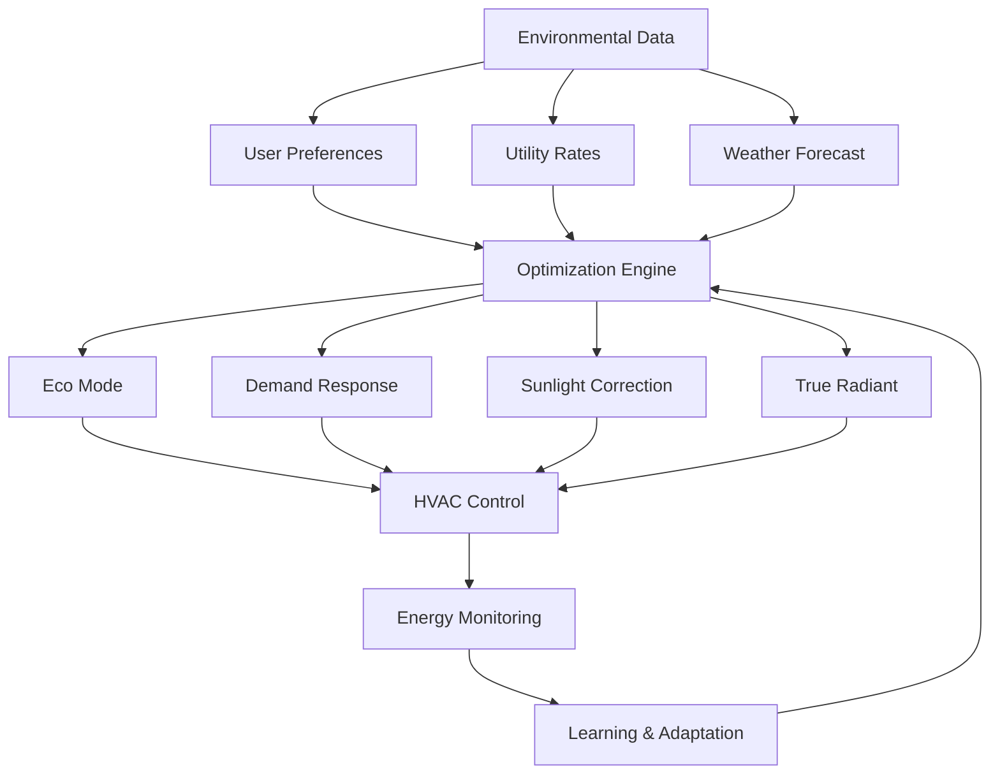

# Energy Optimization

The Nest Learning Thermostat implements comprehensive energy optimization algorithms to minimize energy consumption while maintaining user comfort. This document details the energy optimization strategies, algorithms, and implementation.

## Energy Optimization Architecture

### Core Components
- **Eco Mode**: Intelligent temperature setpoint optimization
- **Demand Response**: Utility demand response program participation
- **Sunlight Correction**: Solar gain compensation and utilization
- **True Radiant**: Radiant heating optimization for HVAC systems
- **Smart Fan Control**: Intelligent fan operation for efficiency
- **Time-of-Use Optimization**: Time-based energy cost optimization

### Optimization Framework


## Eco Mode Optimization

### Eco Mode Algorithm
Intelligent temperature setpoint adjustment for energy savings.

```c
// Eco mode optimization system
typedef struct {
    eco_settings_t settings;               // Eco mode settings
    optimization_algorithm_t algorithm;    // Optimization algorithm
    user_adaptation_t adaptation;          // User adaptation tracking
    performance_metrics_t metrics;         // Performance metrics
} eco_mode_system_t;

// Eco mode settings
typedef struct {
    bool enabled;                          // Eco mode enabled
    float base_eco_temperature_heat;       // Base eco heating temperature
    float base_eco_temperature_cool;       // Base eco cooling temperature
    float comfort_threshold;               // Comfort threshold
    float adaptation_rate;                 // Adaptation rate
    bool learning_enabled;                 // Learning enabled
    float user_sensitivity;                // User sensitivity factor
} eco_settings_t;

// Eco temperature optimization
float calculate_eco_temperature(eco_mode_system_t *eco, 
                                float current_temp, float outdoor_temp, 
                                time_of_day_t time, user_presence_t presence) {
    float base_temp = (current_temp > 70.0) ? 
                     eco->settings.base_eco_temperature_cool : 
                     eco->settings.base_eco_temperature_heat;
    
    // Apply outdoor temperature adjustment
    float outdoor_adjustment = calculate_outdoor_adjustment(outdoor_temp);
    
    // Apply time-based adjustment
    float time_adjustment = calculate_time_adjustment(time);
    
    // Apply presence-based adjustment
    float presence_adjustment = calculate_presence_adjustment(presence);
    
    // Apply learning-based adaptation
    float learning_adjustment = calculate_learning_adjustment(
        &eco->adaptation, current_temp, outdoor_temp);
    
    // Calculate final eco temperature
    float eco_temp = base_temp + outdoor_adjustment + time_adjustment + 
                    presence_adjustment + learning_adjustment;
    
    // Apply comfort constraints
    eco_temp = apply_comfort_constraints(eco_temp, current_temp, 
                                       eco->settings.comfort_threshold);
    
    return eco_temp;
}

// Outdoor temperature adjustment
float calculate_outdoor_adjustment(float outdoor_temp) {
    // Warmer outdoor temperatures allow higher cooling setpoints
    if (outdoor_temp > 80.0) {
        return (outdoor_temp - 80.0) * 0.3; // Gradual increase
    }
    
    // Colder outdoor temperatures allow lower heating setpoints
    if (outdoor_temp < 40.0) {
        return (outdoor_temp - 40.0) * 0.2; // Gradual decrease
    }
    
    return 0.0; // No adjustment in moderate weather
}
```

### User Adaptation Learning
Learn user comfort preferences and adapt eco mode accordingly.

```c
// User adaptation system
typedef struct {
    comfort_feedback_t feedback;           // User comfort feedback
    adaptation_model_t model;              // Adaptation model
    learning_rate_t learning_rate;         // Learning rate
    adaptation_history_t history;          // Adaptation history
} user_adaptation_t;

// Comfort feedback tracking
typedef struct {
    int manual_override_count;             // Number of manual overrides
    float average_override_magnitude;      // Average override magnitude
    time_of_day_t override_times[24];      // Override time distribution
    float override_durations[24];          // Override duration distribution
    float user_satisfaction_score;         // User satisfaction score
} comfort_feedback_t;

// Learning-based adaptation
void update_eco_adaptation(user_adaptation_t *adaptation, 
                          float eco_temp, float actual_temp, 
                          user_action_t action) {
    if (action.type == ACTION_TEMPERATURE_OVERRIDE) {
        // Calculate user discomfort
        float discomfort = abs(actual_temp - eco_temp);
        
        // Update adaptation model
        update_adaptation_model(&adaptation->model, eco_temp, actual_temp, 
                               discomfort);
        
        // Adjust eco temperature sensitivity
        if (discomfort > adaptation->learning_rate.threshold) {
            adaptation->model.sensitivity *= 0.95; // Reduce aggressiveness
        } else if (discomfort < adaptation->learning_rate.threshold / 2) {
            adaptation->model.sensitivity *= 1.02; // Increase aggressiveness
        }
        
        // Log adaptation
        log_adaptation_event(&adaptation->history, eco_temp, actual_temp, 
                           discomfort);
    }
}
```

## Demand Response

### Demand Response Participation
Automatic participation in utility demand response programs.

```c
// Demand response system
typedef struct {
    dr_program_t program;                  // Demand response program
    participation_strategy_t strategy;     // Participation strategy
    load_shedding_t load_shedding;         // Load shedding algorithms
    user_notification_t notification;      // User notification system
} demand_response_system_t;

// Demand response program
typedef struct {
    char utility_id[32];                   // Utility identifier
    program_type_t type;                   // Program type
    float max_load_reduction;              // Maximum load reduction (kW)
    float compensation_rate;               // Compensation rate ($/kWh)
    notification_lead_time_t lead_time;    // Notification lead time
    event_duration_limits_t limits;        // Event duration limits
} dr_program_t;

// Demand response event handling
void handle_dr_event(demand_response_system_t *dr, dr_event_t *event) {
    // Validate event parameters
    if (!validate_dr_event(event, &dr->program)) {
        log_invalid_dr_event(event);
        return;
    }
    
    // Calculate load reduction strategy
    load_reduction_strategy_t strategy = calculate_load_reduction(
        dr, event->required_reduction, event->duration);
    
    // Apply load reduction measures
    apply_load_reduction_measures(&strategy);
    
    // Notify user
    notify_user_of_dr_event(&dr->notification, event, &strategy);
    
    // Monitor compliance
    monitor_dr_compliance(event, &strategy);
    
    // Log event participation
    log_dr_participation(event, &strategy);
}

// Load reduction strategy calculation
load_reduction_strategy_t calculate_load_reduction(
    demand_response_system_t *dr, 
    float required_reduction, 
    int duration_minutes) {
    
    load_reduction_strategy_t strategy = {0};
    
    // Analyze current load and flexibility
    current_load_t current = analyze_current_load();
    flexibility_assessment_t flexibility = assess_load_flexibility();
    
    // Prioritize reduction measures
    if (required_reduction <= flexibility.eco_mode_potential) {
        // Use eco mode enhancement
        strategy.primary_method = ECO_MODE_ENHANCEMENT;
        strategy.eco_adjustment = calculate_eco_enhancement(required_reduction);
    } else if (required_reduction <= flexibility.preheat_shift_potential) {
        // Use preheat time shift
        strategy.primary_method = PREHEAT_TIME_SHIFT;
        strategy.time_shift_minutes = calculate_time_shift(required_reduction);
    } else {
        // Combine multiple methods
        strategy.primary_method = COMBINED_APPROACH;
        strategy.combination = calculate_combined_approach(
            required_reduction, flexibility);
    }
    
    // Calculate user comfort impact
    strategy.comfort_impact = estimate_comfort_impact(&strategy);
    
    // Apply user preference constraints
    apply_user_preference_constraints(&strategy, &dr->strategy);
    
    return strategy;
}
```

## Sunlight Correction

### Solar Gain Compensation
Utilize and compensate for solar heat gain to optimize energy usage.

```c
// Sunlight correction system
typedef struct {
    solar_model_t model;                   // Solar gain model
    correction_algorithm_t algorithm;      // Correction algorithm
    learning_system_t learning;            // Learning system
    weather_integration_t weather;         // Weather integration
} sunlight_correction_t;

// Solar gain model
typedef struct {
    float window_area_total;               // Total window area (sq ft)
    float window_orientation_factor;       // Orientation factor (0-1)
    float shading_coefficient;             // Shading coefficient
    float solar_transmittance;             // Solar transmittance
    float thermal_mass_factor;             // Building thermal mass factor
    location_parameters_t location;        // Geographic location
} solar_model_t;

// Solar heat gain calculation
float calculate_solar_heat_gain(solar_model_t *model, 
                               timestamp_t timestamp, 
                               weather_conditions_t *weather) {
    // Calculate solar position
    solar_position_t position = calculate_solar_position(
        model->location.latitude, model->location.longitude, timestamp);
    
    // Calculate solar irradiance
    float irradiance = calculate_solar_irradiance(&position, weather);
    
    // Calculate incident angle
    float incident_angle = calculate_incident_angle(&position, 
                                                  model->window_orientation_factor);
    
    // Calculate solar heat gain
    float heat_gain = model->window_area_total * 
                     model->solar_transmittance * 
                     model->shading_coefficient * 
                     irradiance * cos(incident_angle) * 
                     model->thermal_mass_factor;
    
    return heat_gain;
}

// Sunlight correction algorithm
float apply_sunlight_correction(sunlight_correction_t *correction, 
                               float target_temperature, 
                               timestamp_t timestamp, 
                               weather_conditions_t *weather) {
    // Calculate expected solar gain
    float solar_gain = calculate_solar_heat_gain(&correction->model, 
                                                timestamp, weather);
    
    // Apply learning-based correction factor
    float correction_factor = get_learning_correction_factor(
        &correction->learning, timestamp, solar_gain);
    
    // Calculate temperature offset
    float temperature_offset = solar_gain * correction_factor * 
                              SOLAR_GAIN_TEMPERATURE_FACTOR;
    
    // Apply correction to target temperature
    float corrected_temperature = target_temperature - temperature_offset;
    
    // Apply safety limits
    corrected_temperature = apply_solar_correction_limits(
        corrected_temperature, target_temperature);
    
    return corrected_temperature;
}
```

### Learning-based Solar Adaptation
Learn building-specific solar characteristics and user responses.

```c
// Solar learning system
typedef struct {
    building_characteristics_t building;   // Building characteristics
    user_response_t user_response;        // User response to solar correction
    seasonal_adaptation_t seasonal;        // Seasonal adaptation
    prediction_model_t prediction_model;   // Solar prediction model
} solar_learning_system_t;

// Building characteristics learning
void learn_building_characteristics(solar_learning_system_t *learning, 
                                   timestamp_t timestamp, 
                                   float indoor_temp, 
                                   float outdoor_temp, 
                                   float solar_irradiance) {
    // Calculate thermal response
    float thermal_response = calculate_thermal_response(
        indoor_temp, outdoor_temp, solar_irradiance);
    
    // Update building thermal model
    update_thermal_model(&learning->building, thermal_response, timestamp);
    
    // Learn window effectiveness
    update_window_effectiveness(&learning->building, solar_irradiance, 
                               indoor_temp, timestamp);
    
    // Update seasonal factors
    update_seasonal_factors(&learning->seasonal, thermal_response, timestamp);
}
```

## True Radiant Optimization

### Radiant Heating System Optimization
Optimize control for radiant heating systems to maximize efficiency.

```c
// True radiant system
typedef struct {
    radiant_system_t system;               // Radiant heating system
    preheating_algorithm_t preheating;     // Preheating algorithm
    thermal_mass_model_t thermal_mass;     // Thermal mass model
    optimization_parameters_t params;      // Optimization parameters
} true_radiant_system_t;

// Radiant heating system characteristics
typedef struct {
    system_type_t type;                    // System type (hydronic, electric)
    float thermal_mass_coefficient;        // Thermal mass coefficient
    float response_time_constant;          // Response time constant
    float heating_capacity;                // Heating capacity (BTU/hr)
    float efficiency_factor;               // System efficiency factor
    zoning_config_t zoning;                // Zoning configuration
} radiant_system_t;

// Preheating optimization algorithm
typedef struct {
    preheating_strategy_t strategy;        // Preheating strategy
    optimization_model_t model;            // Optimization model
    cost_benefit_analysis_t analysis;      // Cost-benefit analysis
    adaptive_parameters_t adaptive;        // Adaptive parameters
} preheating_algorithm_t;

// Calculate optimal preheating time
int calculate_optimal_preheat_time(true_radiant_system_t *radiant, 
                                  float target_temp, float current_temp, 
                                  float outdoor_temp, time_of_day_t target_time) {
    // Calculate required temperature rise
    float temp_rise_needed = target_temp - current_temp;
    
    // Estimate heating rate based on conditions
    float heating_rate = estimate_heating_rate(&radiant->system, 
                                             current_temp, outdoor_temp);
    
    // Calculate thermal mass effect
    float thermal_mass_factor = calculate_thermal_mass_factor(
        &radiant->thermal_mass, outdoor_temp);
    
    // Base preheating time calculation
    int base_preheat_time = (int)(temp_rise_needed / heating_rate * 60.0); // minutes
    
    // Apply thermal mass correction
    int corrected_preheat_time = (int)(base_preheat_time * thermal_mass_factor);
    
    // Apply optimization model
    int optimized_preheat_time = apply_preheating_optimization(
        &radiant->preheating, corrected_preheat_time, 
        target_temp, outdoor_temp);
    
    // Apply safety limits
    optimized_preheat_time = apply_preheat_time_limits(optimized_preheat_time);
    
    return optimized_preheat_time;
}
```

## Smart Fan Control

### Intelligent Fan Operation
Optimize fan operation for energy efficiency and comfort.

```c
// Smart fan control system
typedef struct {
    fan_control_strategy_t strategy;       // Fan control strategy
    air_circulation_model_t circulation;   // Air circulation model
    energy_optimization_t optimization;    // Energy optimization
    user_preference_t preferences;         // User preferences
} smart_fan_system_t;

// Fan control strategy
typedef struct {
    circulation_mode_t mode;               // Circulation mode
    runtime_optimization_t runtime;        // Runtime optimization
    speed_control_t speed_control;         // Speed control
    integration_mode_t integration;        // HVAC integration mode
} fan_control_strategy_t;

// Smart fan control algorithm
fan_control_command_t calculate_smart_fan_operation(
    smart_fan_system_t *fan, 
    temperature_zones_t zones, 
    hvac_state_t hvac_state, 
    user_preferences_t user_prefs) {
    
    fan_control_command_t command = {0};
    
    // Analyze temperature distribution
    temperature_analysis_t analysis = analyze_temperature_distribution(zones);
    
    // Determine circulation needs
    circulation_needs_t needs = determine_circulation_needs(
        &analysis, hvac_state, user_prefs);
    
    // Calculate optimal fan operation
    switch (fan->strategy.mode) {
        case CIRCULATION_MODE_CONTINUOUS:
            command = calculate_continuous_circulation(fan, needs);
            break;
            
        case CIRCULATION_MODE_INTERMITTENT:
            command = calculate_intermittent_circulation(fan, needs);
            break;
            
        case CIRCULATION_MODE_ADAPTIVE:
            command = calculate_adaptive_circulation(fan, needs, &analysis);
            break;
            
        case CIRCULATION_MODE_HVAC_INTEGRATED:
            command = calculate_hvac_integrated_circulation(fan, needs, hvac_state);
            break;
    }
    
    // Apply energy optimization
    command = apply_fan_energy_optimization(&fan->optimization, command);
    
    // Apply user preferences
    command = apply_user_fan_preferences(command, user_prefs);
    
    return command;
}
```

## Time-of-Use Optimization

### Time-based Energy Cost Optimization
Optimize operation based on time-of-use electricity rates.

```c
// Time-of-use optimization system
typedef struct {
    tou_rate_plan_t rate_plan;             // Time-of-use rate plan
    optimization_engine_t engine;          // Optimization engine
    load_shifting_t load_shifting;         // Load shifting algorithms
    cost_benefit_analysis_t analysis;      // Cost-benefit analysis
} tou_optimization_t;

// Time-of-use rate plan
typedef struct {
    rate_period_t periods[MAX_PERIODS];    // Rate periods
    int period_count;                       // Number of periods
    float base_rate;                        // Base electricity rate
    float peak_rate_multiplier;            // Peak rate multiplier
    demand_charge_t demand_charge;         // Demand charges
} tou_rate_plan_t;

// Rate period structure
typedef struct {
    time_window_t time_window;              // Active time window
    day_of_week_mask_t days;                // Active days
    float rate_per_kwh;                     // Rate per kWh
    period_type_t type;                     // Period type (peak, off-peak, etc.)
    float demand_charge_per_kw;             // Demand charge per kW
} rate_period_t;

// TOU optimization algorithm
tou_optimization_plan_t optimize_for_tou_rates(
    tou_optimization_t *tou, 
    temperature_schedule_t *schedule, 
    weather_forecast_t *forecast) {
    
    tou_optimization_plan_t plan = {0};
    
    // Analyze rate structure
    rate_analysis_t analysis = analyze_rate_structure(&tou->rate_plan);
    
    // Calculate cost optimization opportunities
    optimization_opportunity_t opportunities[MAX_OPPORTUNITIES];
    int opportunity_count = identify_optimization_opportunities(
        &analysis, schedule, forecast, opportunities);
    
    // Generate optimization plan
    for (int i = 0; i < opportunity_count; i++) {
        optimization_opportunity_t *opp = &opportunities[i];
        
        switch (opp->type) {
            case OPPORTUNITY_PREHEAT_SHIFT:
                plan.preheat_shifts[plan.preheat_shift_count++] = 
                    calculate_preheat_shift(opp, schedule);
                break;
                
            case OPPORTUNITY_TEMPERATURE_ADJUSTMENT:
                plan.temp_adjustments[plan.temp_adjustment_count++] = 
                    calculate_temperature_adjustment(opp, schedule);
                break;
                
            case OPPORTUNITY_LOAD_LEVELING:
                plan.load_leveling[plan.load_leveling_count++] = 
                    calculate_load_leveling(opp, schedule);
                break;
        }
    }
    
    // Calculate expected savings
    plan.expected_savings = calculate_expected_savings(&plan, &tou->rate_plan);
    
    // Validate plan against comfort constraints
    validate_tou_plan(&plan, schedule);
    
    return plan;
}
```

## Energy Monitoring and Analytics

### Real-time Energy Monitoring
Comprehensive energy usage monitoring and analysis.

```c
// Energy monitoring system
typedef struct {
    energy_meter_t meter;                  // Energy meter interface
    real_time_analyzer_t analyzer;         // Real-time analyzer
    historical_tracker_t history;          // Historical data tracker
    reporting_system_t reporting;          // Reporting system
} energy_monitoring_t;

// Real-time energy analyzer
typedef struct {
    power_analysis_t power;                // Power analysis
    efficiency_analysis_t efficiency;      // Efficiency analysis
    cost_analysis_t cost;                  // Cost analysis
    carbon_footprint_t carbon;             // Carbon footprint analysis
} real_time_analyzer_t;

// Energy consumption analysis
energy_analysis_t analyze_energy_consumption(energy_monitoring_t *monitor, 
                                            time_window_t window) {
    energy_analysis_t analysis = {0};
    
    // Get energy consumption data
    energy_data_t consumption = get_energy_consumption(&monitor->meter, window);
    
    // Analyze consumption patterns
    analysis.consumption_patterns = analyze_consumption_patterns(consumption);
    
    // Calculate efficiency metrics
    analysis.efficiency_metrics = calculate_efficiency_metrics(consumption);
    
    // Analyze cost implications
    analysis.cost_analysis = analyze_energy_costs(consumption, 
                                                 &monitor->reporting.rate_plan);
    
    // Calculate environmental impact
    analysis.environmental_impact = calculate_environmental_impact(
        consumption, &monitor->reporting.emission_factors);
    
    // Generate insights and recommendations
    analysis.insights = generate_energy_insights(&analysis);
    analysis.recommendations = generate_energy_recommendations(&analysis);
    
    return analysis;
}
```

## Related Documentation

- [Thermostat Overview](./overview.mdx)
- [Temperature Control](./temperature-control.mdx)
- [Learning Algorithms](./learning-algorithms.mdx)
- [Schedule Management](./schedule-management.mdx)
