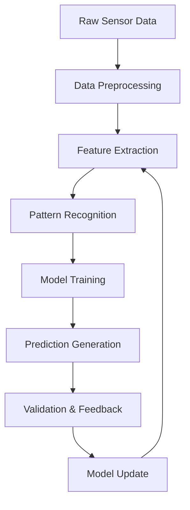

# Learning Algorithms

The Nest Learning Thermostat employs sophisticated machine learning algorithms to understand user behavior, predict preferences, and automatically optimize temperature control. This document details the learning algorithms, data processing, and adaptation mechanisms.

## Learning System Architecture

### Core Learning Components
- **Pattern Recognition**: Identify recurring user patterns and behaviors
- **Predictive Modeling**: Build models to predict user preferences
- **Adaptive Algorithms**: Continuously adapt to changing user behavior
- **Feature Extraction**: Extract meaningful features from sensor data
- **Model Validation**: Validate and update learning models

### Learning Pipeline


## Data Collection and Preprocessing

### Sensor Data Collection
Continuous collection of environmental and user interaction data.

```c
// Data collection structure
typedef struct {
    sensor_data_t sensors;       // Environmental sensor data
    user_interaction_t interactions; // User interaction data
    system_state_t system_state; // System state data
    contextual_data_t context;   // Contextual information
    timestamp_t timestamp;       // Data timestamp
} learning_data_point_t;

// Sensor data
typedef struct {
    float temperature;           // Current temperature
    float humidity;              // Current humidity
    float outdoor_temperature;   // Outdoor temperature
    float ambient_light;         // Ambient light level
    bool motion_detected;        // Motion detection status
    float pressure;              // Atmospheric pressure
} sensor_data_t;

// User interaction data
typedef struct {
    interaction_type_t type;     // Type of interaction
    float temperature_change;    // Temperature adjustment made
    int rotary_degrees;          // Rotary ring degrees turned
    bool button_pressed;         // Button press detected
    menu_navigation_t navigation; // Menu navigation actions
    timestamp_t interaction_time; // Interaction timestamp
} user_interaction_t;
```

### Data Preprocessing
Clean and preprocess raw data for learning algorithms.

```c
// Data preprocessing pipeline
typedef struct {
    filter_config_t filters;     // Data filters configuration
    normalization_t normalization; // Data normalization
    outlier_detection_t outlier_detection; // Outlier detection
    feature_engineering_t feature_engineering; // Feature engineering
} preprocessing_pipeline_t;

// Data filtering
typedef struct {
    moving_average_t temp_filter; // Temperature moving average filter
    kalman_filter_t motion_filter; // Motion detection Kalman filter
    low_pass_filter_t light_filter; // Light sensor low-pass filter
    median_filter_t interaction_filter; // Interaction median filter
} filter_config_t;

// Preprocessing function
void preprocess_learning_data(learning_data_point_t *raw_data, 
                             learning_data_point_t *processed_data,
                             preprocessing_pipeline_t *pipeline) {
    // Apply filters to sensor data
    processed_data->sensors.temperature = apply_moving_average(
        &pipeline->filters.temp_filter, raw_data->sensors.temperature);
    processed_data->sensors.motion_detected = apply_kalman_filter(
        &pipeline->filters.motion_filter, raw_data->sensors.motion_detected);
    
    // Normalize data
    normalize_data(&processed_data->sensors, &pipeline->normalization);
    
    // Detect and handle outliers
    handle_outliers(processed_data, &pipeline->outlier_detection);
    
    // Engineer features
    extract_features(processed_data, &pipeline->feature_engineering);
}
```

## Pattern Recognition

### Time Pattern Recognition
Identify time-based patterns in user behavior.

```c
// Time pattern recognition system
typedef struct {
    time_pattern_detector_t detector; // Time pattern detector
    pattern_classifier_t classifier;  // Pattern classifier
    pattern_validator_t validator;    // Pattern validator
    pattern_storage_t storage;        // Pattern storage
} time_pattern_system_t;

// Time pattern structure
typedef struct {
    pattern_id_t id;            // Pattern identifier
    time_window_t time_window;  // Active time window
    day_of_week_mask_t days;    // Active days mask
    float confidence;           // Pattern confidence
    int occurrence_count;       // Number of occurrences
    float mean_temperature;     // Mean temperature preference
    float std_temperature;      // Temperature standard deviation
    timestamp_t last_seen;      // Last occurrence timestamp
    pattern_type_t type;        // Pattern type
} time_pattern_t;

// Pattern detection algorithm
void detect_time_patterns(time_pattern_system_t *system, 
                         learning_data_point_t *data_history, 
                         int history_length) {
    // Analyze data for recurring patterns
    for (int i = 0; i < history_length; i++) {
        learning_data_point_t *data = &data_history[i];
        
        // Extract time features
        time_features_t features = extract_time_features(data->timestamp);
        
        // Check for pattern matches
        for (int j = 0; j < system->storage.pattern_count; j++) {
            time_pattern_t *pattern = &system->storage.patterns[j];
            
            if (matches_time_window(&features, &pattern->time_window) &&
                matches_day_of_week(&features, &pattern->days)) {
                
                // Update pattern statistics
                update_pattern_statistics(pattern, data);
                
                // Increase confidence
                pattern->confidence = calculate_pattern_confidence(pattern);
            }
        }
    }
    
    // Create new patterns for significant recurring behaviors
    create_new_patterns(system, data_history, history_length);
}
```

### Temperature Preference Learning
Learn user temperature preferences and comfort zones.

```c
// Temperature preference learning
typedef struct {
    comfort_zone_model_t comfort_model; // Comfort zone model
    preference_history_t history;       // Preference history
    adaptation_engine_t adaptation;     // Adaptation engine
    seasonal_adjustment_t seasonal;     // Seasonal adjustments
} temperature_learning_t;

// Comfort zone model
typedef struct {
    float preferred_heat_center;   // Preferred heating center temperature
    float preferred_heat_range;    // Preferred heating temperature range
    float preferred_cool_center;   // Preferred cooling center temperature
    float preferred_cool_range;    // Preferred cooling temperature range
    float learning_rate;           // Learning rate for preference updates
    float confidence_level;        // Model confidence level
    gaussian_mixture_t model;      // Gaussian mixture model
} comfort_zone_model_t;

// Preference learning algorithm
void learn_temperature_preferences(temperature_learning_t *learning, 
                                  learning_data_point_t *data_point) {
    comfort_zone_model_t *model = &learning->comfort_model;
    
    // Update comfort zone based on user interactions
    if (data_point->interactions.type == INTERACTION_TEMPERATURE_ADJUST) {
        float new_temp = data_point->sensors.temperature + 
                        data_point->interactions.temperature_change;
        
        // Update Gaussian mixture model
        update_gaussian_mixture(&model->model, data_point->timestamp, new_temp);
        
        // Recalculate comfort zones
        recalculate_comfort_zones(model);
        
        // Update confidence based on consistency
        update_preference_confidence(model, data_point);
    }
    
    // Adapt to seasonal changes
    apply_seasonal_adjustment(&learning->seasonal, model, data_point);
}
```

## Predictive Modeling

### Neural Network Model
Multi-layer neural network for temperature preference prediction.

```c
// Neural network structure for learning
typedef struct {
    int input_size;               // Number of input features
    int hidden_layers;            // Number of hidden layers
    int *hidden_sizes;            // Sizes of hidden layers
    int output_size;              // Number of outputs
    neural_layer_t *layers;       // Neural network layers
    activation_function_t activation; // Activation function
    learning_rate_t learning_rate; // Learning rate
    training_state_t training_state; // Training state
} neural_network_t;

// Neural network layer
typedef struct {
    int input_size;               // Layer input size
    int output_size;              // Layer output size
    float *weights;               // Weight matrix
    float *biases;                // Bias vector
    float *activations;           // Layer activations
    float *gradients;             // Gradient storage
} neural_layer_t;

// Neural network prediction
float neural_network_predict(neural_network_t *network, float *inputs) {
    // Forward propagation
    float *current_inputs = inputs;
    
    for (int layer = 0; layer < network->hidden_layers + 1; layer++) {
        neural_layer_t *current_layer = &network->layers[layer];
        
        // Calculate layer activations
        for (int i = 0; i < current_layer->output_size; i++) {
            float sum = current_layer->biases[i];
            for (int j = 0; j < current_layer->input_size; j++) {
                sum += current_inputs[j] * current_layer->weights[i * current_layer->input_size + j];
            }
            
            // Apply activation function
            current_layer->activations[i] = apply_activation(sum, network->activation);
        }
        
        current_inputs = current_layer->activations;
    }
    
    return current_inputs[0]; // Return single output
}
```

### Decision Tree Model
Decision tree for interpretable rule-based learning.

```c
// Decision tree for learning
typedef struct {
    decision_node_t *root;       // Root node of decision tree
    int max_depth;               // Maximum tree depth
    int min_samples_split;       // Minimum samples for split
    splitting_criteria_t criteria; // Splitting criteria
    pruning_enabled;             // Tree pruning enabled
} decision_tree_t;

// Decision tree node
typedef struct {
    bool is_leaf;                // Leaf node flag
    int feature_index;           // Feature index for split
    float threshold;             // Split threshold
    float prediction;            // Prediction value (for leaf nodes)
    decision_node_t *left_child; // Left child node
    decision_node_t *right_child; // Right child node
    int sample_count;            // Number of samples at node
    float impurity;              // Node impurity
} decision_node_t;

// Decision tree prediction
float decision_tree_predict(decision_tree_t *tree, float *features) {
    decision_node_t *current = tree->root;
    
    while (!current->is_leaf) {
        if (features[current->feature_index] <= current->threshold) {
            current = current->left_child;
        } else {
            current = current->right_child;
        }
    }
    
    return current->prediction;
}
```

## Adaptive Learning

### Online Learning
Continuous learning from new data without full retraining.

```c
// Online learning system
typedef struct {
    online_model_t model;        // Online learning model
    adaptation_rate_t rate;      // Adaptation rate
    concept_drift_detector_t drift_detector; // Concept drift detection
    model_validator_t validator; // Model validation
} online_learning_system_t;

// Online learning model
typedef struct {
    model_type_t type;           // Model type
    void *model_parameters;      // Model parameters
    update_function_t update;    // Update function
    predict_function_t predict;  // Prediction function
    float learning_rate;         // Learning rate
    int update_count;            // Number of updates
} online_model_t;

// Online learning update
void online_learning_update(online_learning_system_t *system, 
                           float *features, float target) {
    // Check for concept drift
    if (detect_concept_drift(&system->drift_detector, features, target)) {
        // Adapt learning rate
        system->rate.current_rate *= 0.5;
        log_concept_drift_detected();
    }
    
    // Update model with new data
    float prediction = system->model.predict(system->model.model_parameters, features);
    float error = target - prediction;
    
    system->model.update(system->model.model_parameters, features, error, 
                        system->rate.current_rate);
    
    // Validate model performance
    if (system->update_count % 100 == 0) {
        validate_model(&system->validator, system->model.model_parameters);
    }
    
    system->update_count++;
}
```

### Reinforcement Learning
Reinforcement learning for optimal control policy learning.

```c
// Reinforcement learning system
typedef struct {
    environment_t environment;   // Environment model
    policy_t policy;             // Control policy
    value_function_t value_function; // Value function
    learning_algorithm_t algorithm; // Learning algorithm
    experience_buffer_t buffer;  // Experience buffer
} reinforcement_learning_t;

// RL environment
typedef struct {
    state_space_t state_space;   // State space definition
    action_space_t action_space; // Action space definition
    transition_function_t transition; // State transition function
    reward_function_t reward;    // Reward function
} environment_t;

// Q-learning algorithm
void q_learning_update(reinforcement_learning_t *rl, 
                     state_t current_state, action_t action, 
                     state_t next_state, float reward) {
    // Current Q-value
    float current_q = get_q_value(&rl->policy, current_state, action);
    
    // Maximum Q-value for next state
    float max_next_q = get_max_q_value(&rl->policy, next_state);
    
    // Q-learning update rule
    float learning_rate = rl->algorithm.learning_rate;
    float discount_factor = rl->algorithm.discount_factor;
    float new_q = current_q + learning_rate * (reward + discount_factor * max_next_q - current_q);
    
    // Update Q-value
    set_q_value(&rl->policy, current_state, action, new_q);
    
    // Store experience
    store_experience(&rl->buffer, current_state, action, reward, next_state);
}
```

## Feature Engineering

### Feature Extraction
Extract meaningful features from raw sensor data.

```c
// Feature engineering system
typedef struct {
    feature_extractor_t extractors[MAX_EXTRACTORS]; // Feature extractors
    feature_selector_t selector;   // Feature selector
    feature_transformer_t transformer; // Feature transformer
    feature_cache_t cache;         // Feature cache
} feature_engineering_t;

// Feature extractor
typedef struct {
    feature_type_t type;          // Feature type
    extraction_function_t extract; // Extraction function
    parameter_t parameters;       // Extraction parameters
    bool enabled;                 // Enabled flag
} feature_extractor_t;

// Time-based feature extraction
typedef struct {
    time_features_t time;         // Time-based features
    seasonal_features_t seasonal; // Seasonal features
    weather_features_t weather;   // Weather features
    occupancy_features_t occupancy; // Occupancy features
} contextual_features_t;

// Extract time features
time_features_t extract_time_features(timestamp_t timestamp) {
    time_features_t features;
    struct tm *time_info = localtime(&timestamp);
    
    features.hour_of_day = time_info->tm_hour;
    features.day_of_week = time_info->tm_wday;
    features.day_of_month = time_info->tm_mday;
    features.month = time_info->tm_mon + 1;
    features.is_weekend = (time_info->tm_wday == 0 || time_info->tm_wday == 6);
    features.is_business_hours = (time_info->tm_hour >= 9 && time_info->tm_hour <= 17);
    
    // Cyclical encoding for time features
    features.hour_sin = sin(2 * M_PI * time_info->tm_hour / 24);
    features.hour_cos = cos(2 * M_PI * time_info->tm_hour / 24);
    features.day_sin = sin(2 * M_PI * time_info->tm_wday / 7);
    features.day_cos = cos(2 * M_PI * time_info->tm_wday / 7);
    
    return features;
}
```

## Model Validation and Evaluation

### Cross-Validation
K-fold cross-validation for model evaluation.

```c
// Cross-validation system
typedef struct {
    int k_folds;                  // Number of folds
    validation_method_t method;   // Validation method
    performance_metrics_t metrics; // Performance metrics
    validation_results_t results; // Validation results
} cross_validation_t;

// Performance metrics
typedef struct {
    float accuracy;               // Prediction accuracy
    float mean_squared_error;     // Mean squared error
    float mean_absolute_error;    // Mean absolute error
    float r_squared;              // R-squared value
    float confusion_matrix[4];    // Confusion matrix for classification
} performance_metrics_t;

// K-fold cross-validation
performance_metrics_t k_fold_cross_validation(cross_validation_t *cv, 
                                             learning_dataset_t *dataset, 
                                             model_t *model) {
    performance_metrics_t total_metrics = {0};
    
    // Split dataset into k folds
    dataset_folds_t folds = split_dataset(dataset, cv->k_folds);
    
    // Perform k-fold validation
    for (int fold = 0; fold < cv->k_folds; fold++) {
        // Create training and test sets
        learning_dataset_t train_set = create_training_set(folds, fold);
        learning_dataset_t test_set = create_test_set(folds, fold);
        
        // Train model
        train_model(model, &train_set);
        
        // Evaluate model
        performance_metrics_t fold_metrics = evaluate_model(model, &test_set);
        
        // Accumulate metrics
        total_metrics.accuracy += fold_metrics.accuracy;
        total_metrics.mean_squared_error += fold_metrics.mean_squared_error;
        total_metrics.mean_absolute_error += fold_metrics.mean_absolute_error;
        total_metrics.r_squared += fold_metrics.r_squared;
    }
    
    // Average metrics across folds
    total_metrics.accuracy /= cv->k_folds;
    total_metrics.mean_squared_error /= cv->k_folds;
    total_metrics.mean_absolute_error /= cv->k_folds;
    total_metrics.r_squared /= cv->k_folds;
    
    return total_metrics;
}
```

## Model Deployment and Updates

### Model Versioning
Track and manage different model versions.

```c
// Model versioning system
typedef struct {
    model_version_t current_version; // Current model version
    version_history_t history;   // Version history
    deployment_config_t deployment; // Deployment configuration
    rollback_capability_t rollback; // Rollback capability
} model_versioning_t;

// Model version
typedef struct {
    char version_id[32];         // Version identifier
    timestamp_t created;         // Creation timestamp
    model_metrics_t metrics;     // Model performance metrics
    training_data_info_t training_info; // Training data information
    bool is_production;          // Production deployment flag
} model_version_t;

// Model deployment
int deploy_model(model_versioning_t *versioning, model_version_t *new_version) {
    // Validate new model
    if (!validate_model_version(new_version)) {
        return MODEL_VALIDATION_FAILED;
    }
    
    // Backup current model
    model_version_t backup = versioning->current_version;
    
    // Deploy new model
    if (activate_model(new_version) == SUCCESS) {
        // Update current version
        versioning->current_version = *new_version;
        
        // Add to history
        add_to_version_history(&versioning->history, new_version);
        
        log_model_deployment(new_version);
        return SUCCESS;
    } else {
        // Rollback on failure
        activate_model(&backup);
        return MODEL_DEPLOYMENT_FAILED;
    }
}
```

## Related Documentation

- [Thermostat Overview](./overview.mdx)
- [Temperature Control](./temperature-control.mdx)
- [Schedule Management](./schedule-management.mdx)
- [Energy Optimization](./energy-optimization.mdx)
