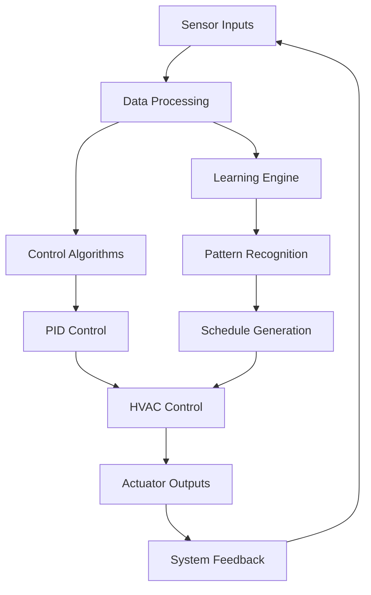
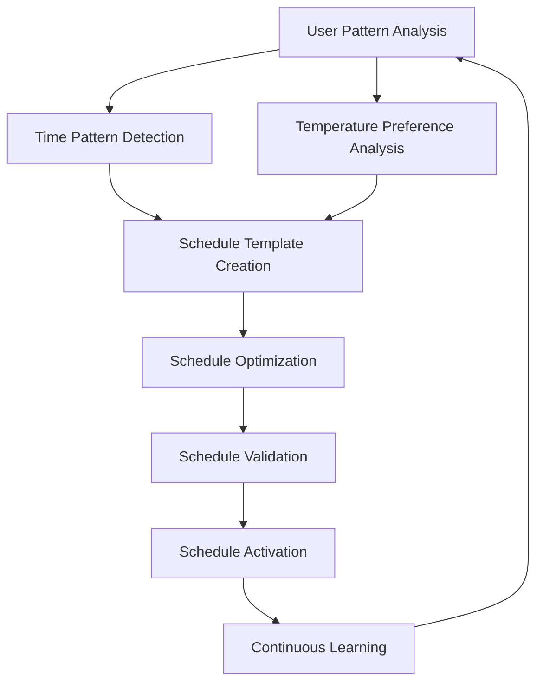
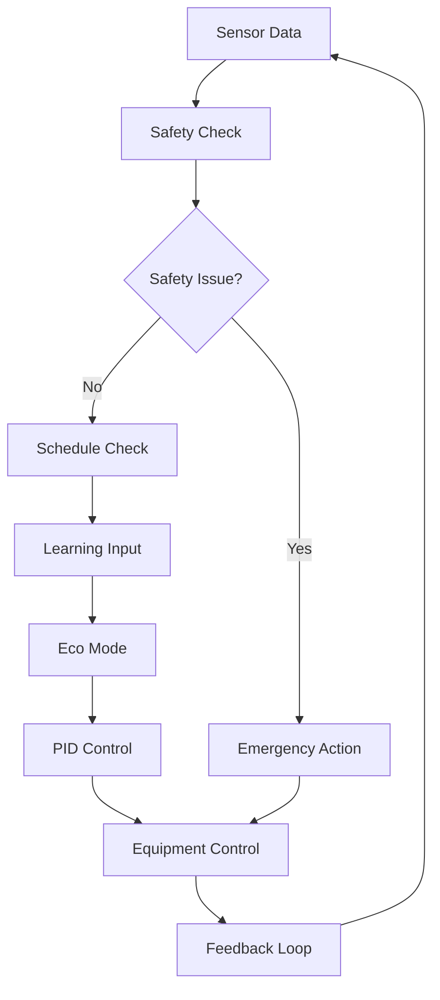

# Thermostat Logic Overview

The Nest Learning Thermostat implements sophisticated control algorithms and machine learning systems to provide intelligent temperature control, energy optimization, and user comfort. This document provides a comprehensive overview of the thermostat logic architecture and components.

## Logic Architecture

### Core Components
- **Temperature Control**: PID control algorithms and temperature regulation
- **Learning System**: Machine learning for user pattern recognition
- **Schedule Management**: Time-based scheduling and automation
- **Energy Optimization**: Energy-saving algorithms and efficiency optimization
- **Safety Systems**: Safety monitoring and protection mechanisms

### Logic Flow


## Temperature Control System

### PID Control Algorithm
The primary temperature control uses a PID (Proportional-Integral-Derivative) controller with adaptive tuning.

```c
// PID controller structure
typedef struct {
    float kp;                    // Proportional gain
    float ki;                    // Integral gain
    float kd;                    // Derivative gain
    float setpoint;              // Target temperature
    float integral;              // Integral accumulator
    float prev_error;            // Previous error for derivative
    float output_min;            // Minimum output limit
    float output_max;            // Maximum output limit
    float dt;                    // Time step
    bool adaptive;               // Adaptive tuning enabled
} pid_controller_t;

// PID control update
float pid_update(pid_controller_t *pid, float current_temp, float dt) {
    float error = pid->setpoint - current_temp;
    
    // Proportional term
    float p_term = pid->kp * error;
    
    // Integral term with anti-windup
    pid->integral += error * dt;
    if (pid->integral > pid->output_max / pid->ki) 
        pid->integral = pid->output_max / pid->ki;
    if (pid->integral < pid->output_min / pid->ki) 
        pid->integral = pid->output_min / pid->ki;
    float i_term = pid->ki * pid->integral;
    
    // Derivative term
    float d_term = pid->kd * (error - pid->prev_error) / dt;
    pid->prev_error = error;
    
    // Calculate output
    float output = p_term + i_term + d_term;
    
    // Apply limits
    if (output > pid->output_max) output = pid->output_max;
    if (output < pid->output_min) output = pid->output_min;
    
    return output;
}
```

### Adaptive Control
The PID controller parameters are dynamically adjusted based on system performance and environmental conditions.

```c
// Adaptive tuning parameters
typedef struct {
    float response_time;         // System response time
    float overshoot;             // Maximum overshoot
    float steady_state_error;    // Steady state error
    float stability_index;       // Stability index
    tuning_strategy_t strategy;  // Tuning strategy
} adaptive_tuning_t;

// Adaptive tuning algorithm
void adaptive_tune(pid_controller_t *pid, adaptive_tuning_t *tuning) {
    if (tuning->overshoot > 5.0) {
        // Reduce proportional gain to reduce overshoot
        pid->kp *= 0.9;
    }
    
    if (tuning->steady_state_error > 0.5) {
        // Increase integral gain to reduce steady state error
        pid->ki *= 1.1;
    }
    
    if (tuning->response_time > 300.0) {
        // Increase derivative gain to improve response
        pid->kd *= 1.05;
    }
}
```

## Learning System

### Machine Learning Architecture
The learning system uses multiple machine learning algorithms to understand user patterns and preferences.

```c
// Learning system structure
typedef struct {
    schedule_learner_t schedule_learner;    // Schedule learning
    comfort_learner_t comfort_learner;      // Comfort preference learning
    occupancy_learner_t occupancy_learner;  // Occupancy pattern learning
    energy_learner_t energy_learner;        // Energy usage learning
    learning_config_t config;               // Learning configuration
} learning_system_t;

// Schedule learner
typedef struct {
    neural_network_t model;                 // Neural network model
    time_series_data_t history;             // Historical data
    pattern_recognition_t patterns;         // Recognized patterns
    confidence_metrics_t confidence;        // Model confidence
} schedule_learner_t;
```

### Pattern Recognition
The system recognizes various user patterns including time-based preferences, temperature comfort zones, and occupancy patterns.

```c
// Pattern recognition structure
typedef struct {
    time_pattern_t time_patterns[MAX_PATTERNS];     // Time-based patterns
    temperature_pattern_t temp_patterns[MAX_PATTERNS]; // Temperature patterns
    occupancy_pattern_t occupancy_patterns[MAX_PATTERNS]; // Occupancy patterns
    seasonal_pattern_t seasonal_patterns[MAX_SEASONS]; // Seasonal patterns
    int pattern_count;                              // Number of active patterns
} pattern_recognition_t;

// Time pattern structure
typedef struct {
    pattern_id_t id;                        // Pattern identifier
    time_window_t time_window;              // Active time window
    day_of_week_t days[7];                  // Active days
    float preferred_temperature;            // Preferred temperature
    float confidence;                       // Pattern confidence
    int occurrence_count;                   // Number of occurrences
    timestamp_t last_seen;                  // Last occurrence time
} time_pattern_t;
```

### Learning Algorithm
The core learning algorithm processes sensor data and user interactions to build predictive models.

```c
// Learning algorithm
void learning_update(learning_system_t *system, sensor_data_t *sensors, 
                     user_action_t *action) {
    // Update time series data
    update_time_series(&system->schedule_learner.history, sensors, action);
    
    // Detect patterns
    detect_patterns(&system->schedule_learner.patterns, 
                   &system->schedule_learner.history);
    
    // Update neural network
    train_neural_network(&system->schedule_learner.model, 
                        &system->schedule_learner.history);
    
    // Calculate confidence
    calculate_confidence(&system->schedule_learner.confidence);
    
    // Generate schedule predictions
    generate_schedule_predictions(system);
}
```

## Schedule Management

### Schedule Generation
The system automatically generates temperature schedules based on learned user patterns.



### Schedule Structure
```c
// Schedule structure
typedef struct {
    schedule_header_t header;              // Schedule header
    schedule_day_t days[7];                 // Daily schedules
    away_settings_t away_settings;          // Away mode settings
    vacation_settings_t vacation_settings;  // Vacation settings
    schedule_stats_t statistics;           // Schedule statistics
} temperature_schedule_t;

// Daily schedule
typedef struct {
    day_of_week_t day;                      // Day of week
    schedule_entry_t entries[MAX_ENTRIES];  // Schedule entries
    int entry_count;                        // Number of entries
    bool auto_generated;                    // Auto-generated flag
    float confidence;                       // Generation confidence
} schedule_day_t;

// Schedule entry
typedef struct {
    time_of_day_t start_time;               // Start time
    time_of_day_t end_time;                 // End time
    float target_temperature;               // Target temperature
    schedule_mode_t mode;                   // Schedule mode
    bool active;                            // Active flag
    float priority;                         // Entry priority
} schedule_entry_t;
```

### Schedule Optimization
The schedule is continuously optimized for energy efficiency and user comfort.

```c
// Schedule optimization
typedef struct {
    optimization_goals_t goals;             // Optimization goals
    constraint_set_t constraints;           // Optimization constraints
    optimization_algorithm_t algorithm;     // Optimization algorithm
    optimization_results_t results;         // Optimization results
} schedule_optimization_t;

// Optimization goals
typedef struct {
    float energy_weight;                    // Energy optimization weight
    float comfort_weight;                   // Comfort optimization weight
    float learning_weight;                  // Learning adaptation weight
    float safety_weight;                    // Safety constraint weight
} optimization_goals_t;
```

## Energy Optimization

### Eco Mode
Eco mode optimizes temperature settings for energy savings while maintaining comfort.

```c
// Eco mode structure
typedef struct {
    eco_settings_t settings;                // Eco mode settings
    eco_algorithm_t algorithm;              // Eco optimization algorithm
    eco_metrics_t metrics;                  // Eco performance metrics
    adaptation_data_t adaptation;           // User adaptation data
} eco_mode_t;

// Eco settings
typedef struct {
    bool enabled;                           // Eco mode enabled
    float eco_temperature_heat;             // Eco heating temperature
    float eco_temperature_cool;             // Eco cooling temperature
    bool auto_eco;                          // Automatic eco mode
    float comfort_threshold;                // Comfort threshold
    adaptation_rate_t adaptation_rate;      // Adaptation rate
} eco_settings_t;
```

### Energy Efficiency Algorithms
Multiple algorithms work together to optimize energy usage.

```c
// Energy efficiency algorithms
typedef struct {
    sunlight_correction_t sunlight;         // Sunlight correction
    true_radiant_t true_radiant;            // True radiant heating
    preheating_optimization_t preheating;   // Preheating optimization
    smart_fan_control_t smart_fan;          // Smart fan control
    demand_response_t demand_response;      // Demand response
} energy_algorithms_t;

// Sunlight correction
typedef struct {
    bool enabled;                           // Sunlight correction enabled
    float solar_gain_factor;                // Solar gain factor
    learning_model_t model;                 // Learning model
    correction_history_t history;           // Correction history
} sunlight_correction_t;
```

### Energy Monitoring
Real-time energy monitoring and analytics.

```json
{
  "energy_monitoring": {
    "current_usage": {
      "instantaneous_power": 2.5,
      "daily_energy_kwh": 12.3,
      "monthly_energy_kwh": 369.2,
      "cop_heating": 3.2,
      "cop_cooling": 4.1
    },
    "efficiency_metrics": {
      "seasonal_efficiency": 0.87,
      "performance_index": 94.2,
      "energy_savings_vs_baseline": 15.8,
      "leaf_achievements": 24
    },
    "predictions": {
      "tomorrow_usage_kwh": 11.5,
      "monthly_projection_kwh": 385.0,
      "savings_potential_kwh": 45.2,
      "confidence_level": 0.89
    }
  }
}
```

## Safety Systems

### Safety Monitoring
Comprehensive safety monitoring protects the HVAC system and ensures safe operation.

```c
// Safety system structure
typedef struct {
    safety_limits_t limits;                 // Safety limits
    safety_monitors_t monitors;             // Safety monitors
    emergency_actions_t actions;            // Emergency actions
    safety_log_t log;                       // Safety log
} safety_system_t;

// Safety limits
typedef struct {
    temperature_limits_t temperature;       // Temperature limits
    pressure_limits_t pressure;             // Pressure limits
    timing_limits_t timing;                 // Timing limits
    equipment_limits_t equipment;           // Equipment limits
} safety_limits_t;

// Temperature limits
typedef struct {
    float max_heat_temperature;             // Maximum heating temperature
    float min_cool_temperature;             // Minimum cooling temperature
    float max_temperature_rate;             // Maximum temperature change rate
    float frost_protection_temp;            // Frost protection temperature
} temperature_limits_t;
```

### Fault Detection
Automatic fault detection and diagnosis system.

```c
// Fault detection system
typedef struct {
    fault_detectors_t detectors;            // Fault detectors
    diagnostic_engine_t engine;             // Diagnostic engine
    fault_handlers_t handlers;              // Fault handlers
    recovery_actions_t recovery;            // Recovery actions
} fault_detection_t;

// Fault detectors
typedef struct {
    temperature_fault_detector_t temp;      // Temperature fault detector
    sensor_fault_detector_t sensors;        // Sensor fault detector
    equipment_fault_detector_t equipment;   // Equipment fault detector
    communication_fault_detector_t comm;    // Communication fault detector
} fault_detectors_t;
```

## Control Logic Flow

### Main Control Loop
The main control loop executes continuously to maintain temperature control.

```c
// Main control loop
void thermostat_control_loop(void) {
    static timestamp_t last_update = 0;
    timestamp_t current_time = get_current_time();
    float dt = (current_time - last_update) / 1000.0;
    
    if (dt >= CONTROL_UPDATE_INTERVAL) {
        // Read sensors
        sensor_data_t sensors = read_all_sensors();
        
        // Update learning system
        learning_update(&learning_system, &sensors, &last_user_action);
        
        // Get current schedule target
        float schedule_target = get_schedule_target(current_time);
        
        // Apply eco mode adjustments
        float eco_target = apply_eco_mode(schedule_target);
        
        // Update PID controller
        float control_output = pid_update(&pid_controller, 
                                         sensors.temperature, dt);
        
        // Apply safety limits
        control_output = apply_safety_limits(control_output, &sensors);
        
        // Control HVAC equipment
        control_hvac_equipment(control_output);
        
        // Update energy monitoring
        update_energy_monitoring(&sensors, control_output);
        
        // Check for safety issues
        check_safety_conditions(&sensors, control_output);
        
        last_update = current_time;
    }
}
```

### Decision Making Process
The thermostat uses a hierarchical decision-making process.



## Performance Metrics

### Control Performance
Metrics to evaluate control system performance.

```c
// Performance metrics
typedef struct {
    control_metrics_t control;              // Control performance
    learning_metrics_t learning;            // Learning performance
    energy_metrics_t energy;                // Energy performance
    reliability_metrics_t reliability;      // Reliability metrics
} performance_metrics_t;

// Control metrics
typedef struct {
    float steady_state_error;               // Steady state error
    float settling_time;                    // Settling time
    float overshoot;                        // Maximum overshoot
    float stability_index;                  // Stability index
    int oscillations;                       // Number of oscillations
} control_metrics_t;
```

### User Satisfaction
Metrics for evaluating user satisfaction and comfort.

```c
// User satisfaction metrics
typedef struct {
    comfort_score_t comfort;                // Comfort score
    adaptation_score_t adaptation;          // Adaptation score
    schedule_adherence_t schedule;          // Schedule adherence
    user_feedback_t feedback;               // User feedback
} satisfaction_metrics_t;

// Comfort score
typedef struct {
    float temperature_comfort;              // Temperature comfort score
    float schedule_satisfaction;            // Schedule satisfaction score
    float energy_satisfaction;              // Energy satisfaction score
    float overall_satisfaction;             // Overall satisfaction score
} comfort_score_t;
```

## Related Documentation

- [Temperature Control](./temperature-control.mdx)
- [Learning Algorithms](./learning-algorithms.mdx)
- [Schedule Management](./schedule-management.mdx)
- [Energy Optimization](./energy-optimization.mdx)
