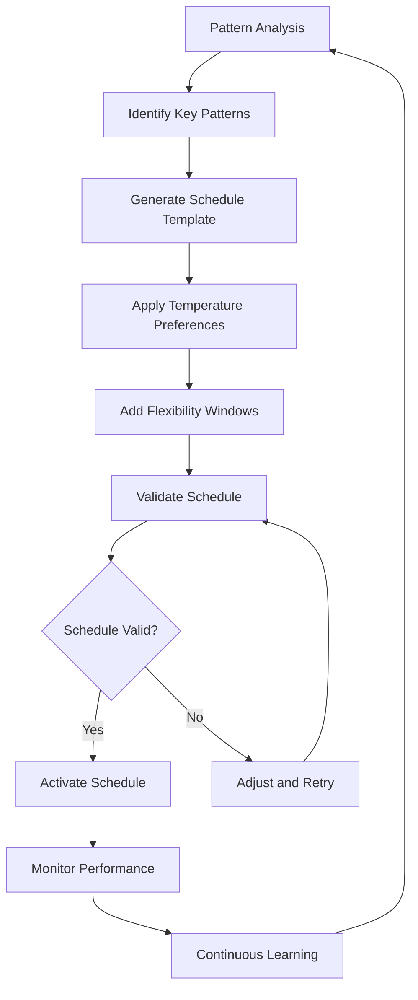

# Schedule Management

The Nest Learning Thermostat implements an intelligent scheduling system that automatically learns user patterns and generates optimal temperature schedules. This document details the schedule management architecture, algorithms, and automation features.

## Schedule Architecture

### Schedule Components
- **Time-based Scheduling**: Traditional time-based temperature programming
- **Learning-based Scheduling**: Automatic schedule generation from user patterns
- **Adaptive Scheduling**: Dynamic schedule adjustment based on conditions
- **Multi-zone Support**: Support for multiple temperature zones
- **Conflict Resolution**: Intelligent handling of scheduling conflicts

### Schedule Data Structure
```c
// Comprehensive schedule structure
typedef struct {
    schedule_header_t header;              // Schedule metadata
    weekly_schedule_t weekly;               // Weekly schedule data
    special_events_t events;                // Special events and exceptions
    learning_data_t learning;               // Learning-based adjustments
    adaptation_parameters_t adaptation;     // Adaptation parameters
    schedule_stats_t statistics;           // Schedule performance statistics
} temperature_schedule_t;

// Schedule header
typedef struct {
    char schedule_id[32];                   // Unique schedule identifier
    schedule_version_t version;             // Schedule version
    timestamp_t created;                    // Creation timestamp
    timestamp_t last_modified;              // Last modification timestamp
    bool auto_generated;                    // Auto-generated flag
    float confidence_score;                 // Schedule confidence score
    schedule_type_t type;                   // Schedule type
} schedule_header_t;

// Weekly schedule
typedef struct {
    daily_schedule_t days[7];               // Daily schedules
    weekly_pattern_t patterns;              // Weekly patterns
    seasonal_adjustments_t seasonal;        // Seasonal adjustments
    holiday_schedule_t holidays;            // Holiday schedule
} weekly_schedule_t;
```

## Time-based Scheduling

### Daily Schedule Structure
Each day can have multiple temperature periods with different setpoints.

```c
// Daily schedule structure
typedef struct {
    day_of_week_t day;                      // Day of week
    schedule_period_t periods[MAX_PERIODS]; // Temperature periods
    int period_count;                       // Number of periods
    away_settings_t away_settings;          // Away mode settings
    sleep_settings_t sleep_settings;        // Sleep settings
    bool is_active;                         // Schedule active flag
} daily_schedule_t;

// Temperature period
typedef struct {
    time_of_day_t start_time;               // Start time (HH:MM)
    time_of_day_t end_time;                 // End time (HH:MM)
    float target_temperature;               // Target temperature
    temperature_mode_t mode;                // Heat/Cool/Auto mode
    float priority;                         // Period priority
    bool is_flexible;                       // Flexible timing allowed
    flexibility_window_t flexibility;       // Flexibility window
    char label[32];                         // Period label
} schedule_period_t;

// Time of day structure
typedef struct {
    int hour;                               // Hour (0-23)
    int minute;                             // Minute (0-59)
    int total_minutes;                      // Total minutes from midnight
} time_of_day_t;

// Schedule period management
void add_schedule_period(daily_schedule_t *day, schedule_period_t *period) {
    if (day->period_count < MAX_PERIODS) {
        // Validate period doesn't overlap with existing periods
        if (validate_period_non_overlap(day, period)) {
            // Sort periods by start time
            insert_period_sorted(&day->periods[0], &day->period_count, period);
            day->is_active = true;
        }
    }
}
```

### Schedule Validation
Comprehensive validation to ensure schedule consistency and feasibility.

```c
// Schedule validation system
typedef struct {
    validation_rules_t rules;               // Validation rules
    constraint_checker_t constraints;       // Constraint checker
    conflict_resolver_t resolver;           // Conflict resolver
    validation_report_t report;             // Validation report
} schedule_validator_t;

// Validation rules
typedef struct {
    float min_temperature;                  // Minimum allowed temperature
    float max_temperature;                  // Maximum allowed temperature
    int min_period_duration;                // Minimum period duration (minutes)
    int max_period_duration;                // Maximum period duration (minutes)
    float max_temperature_change;           // Maximum temperature change per period
    int min_periods_per_day;                // Minimum periods per day
    int max_periods_per_day;                // Maximum periods per day
} validation_rules_t;

// Schedule validation function
validation_result_t validate_schedule(temperature_schedule_t *schedule, 
                                      schedule_validator_t *validator) {
    validation_result_t result = VALIDATION_SUCCESS;
    
    // Validate each day's schedule
    for (int day = 0; day < 7; day++) {
        daily_schedule_t *daily = &schedule->weekly.days[day];
        
        // Check period count
        if (daily->period_count < validator->rules.min_periods_per_day ||
            daily->period_count > validator->rules.max_periods_per_day) {
            result = VALIDATION_PERIOD_COUNT_ERROR;
            add_validation_error(&validator->report, day, "Invalid period count");
        }
        
        // Validate each period
        for (int period = 0; period < daily->period_count; period++) {
            schedule_period_t *p = &daily->periods[period];
            
            // Check temperature bounds
            if (p->target_temperature < validator->rules.min_temperature ||
                p->target_temperature > validator->rules.max_temperature) {
                result = VALIDATION_TEMPERATURE_ERROR;
                add_validation_error(&validator->report, day, 
                                   "Temperature out of bounds");
            }
            
            // Check period duration
            int duration = calculate_period_duration(p);
            if (duration < validator->rules.min_period_duration ||
                duration > validator->rules.max_period_duration) {
                result = VALIDATION_DURATION_ERROR;
                add_validation_error(&validator->report, day, 
                                   "Invalid period duration");
            }
        }
        
        // Check for overlaps
        if (check_period_overlaps(daily)) {
            result = VALIDATION_OVERLAP_ERROR;
            add_validation_error(&validator->report, day, "Periods overlap");
        }
    }
    
    return result;
}
```

## Learning-based Scheduling

### Pattern Recognition
Identify recurring user patterns to generate automatic schedules.

```c
// Pattern recognition for scheduling
typedef struct {
    time_pattern_detector_t time_detector; // Time pattern detection
    temperature_pattern_t temp_patterns;   // Temperature patterns
    occupancy_pattern_t occ_patterns;      // Occupancy patterns
    pattern_classifier_t classifier;       // Pattern classifier
    pattern_confidence_t confidence;       // Pattern confidence
} schedule_pattern_recognition_t;

// Time pattern for scheduling
typedef struct {
    pattern_id_t id;                       // Pattern identifier
    time_window_t active_window;           // Active time window
    day_of_week_mask_t days;                // Active days
    float preferred_temperature;           // Preferred temperature
    float temperature_variance;            // Temperature variance
    int occurrence_count;                  // Number of occurrences
    float confidence;                       // Pattern confidence
    timestamp_t first_seen;                 // First occurrence
    timestamp_t last_seen;                  // Last occurrence
    stability_score_t stability;            // Pattern stability
} schedule_time_pattern_t;

// Pattern detection algorithm
void detect_schedule_patterns(schedule_pattern_recognition_t *recognition, 
                             learning_data_history_t *history) {
    // Analyze historical data for recurring patterns
    for (int i = 0; i < history->data_count; i++) {
        learning_data_point_t *data = &history->data[i];
        
        // Extract time and temperature features
        time_features_t time_features = extract_time_features(data->timestamp);
        temperature_features_t temp_features = extract_temp_features(data);
        
        // Check against existing patterns
        for (int j = 0; j < recognition->temp_patterns.pattern_count; j++) {
            schedule_time_pattern_t *pattern = &recognition->temp_patterns.patterns[j];
            
            if (matches_time_pattern(&time_features, pattern) &&
                matches_temperature_preference(&temp_features, pattern)) {
                
                // Update pattern statistics
                update_pattern_statistics(pattern, data);
                
                // Increase confidence based on consistency
                pattern->confidence = calculate_pattern_confidence(pattern);
            }
        }
    }
    
    // Create new patterns for significant recurring behaviors
    create_new_schedule_patterns(recognition, history);
}
```

### Automatic Schedule Generation
Generate complete schedules from learned patterns.



```c
// Automatic schedule generation
typedef struct {
    generation_config_t config;            // Generation configuration
    pattern_weight_t weights;              // Pattern weights
    optimization_goals_t goals;            // Optimization goals
    generation_constraints_t constraints;  // Generation constraints
} schedule_generator_t;

// Generation configuration
typedef struct {
    float min_pattern_confidence;          // Minimum pattern confidence
    int min_occurrence_count;               // Minimum occurrence count
    float flexibility_factor;               // Flexibility factor
    bool include_learning_adaptations;      // Include learning adaptations
    energy_optimization_t energy_opt;      // Energy optimization settings
} generation_config_t;

// Generate schedule from patterns
temperature_schedule_t generate_schedule_from_patterns(
    schedule_generator_t *generator, 
    schedule_pattern_recognition_t *patterns) {
    
    temperature_schedule_t schedule = {0};
    
    // Initialize schedule header
    initialize_schedule_header(&schedule.header, "auto_generated");
    schedule.header.auto_generated = true;
    schedule.header.confidence_score = calculate_overall_confidence(patterns);
    
    // Generate daily schedules
    for (int day = 0; day < 7; day++) {
        daily_schedule_t *daily = &schedule.weekly.days[day];
        
        // Get relevant patterns for this day
        pattern_list_t day_patterns = get_patterns_for_day(patterns, day);
        
        // Sort patterns by confidence and occurrence
        sort_patterns_by_priority(&day_patterns);
        
        // Generate schedule periods from patterns
        generate_periods_from_patterns(daily, &day_patterns, generator);
        
        // Add flexibility windows
        add_flexibility_windows(daily, generator->config.flexibility_factor);
        
        // Apply energy optimization
        apply_energy_optimization(daily, &generator->config.energy_opt);
    }
    
    // Validate generated schedule
    schedule_validator_t validator = create_default_validator();
    if (validate_schedule(&schedule, &validator) != VALIDATION_SUCCESS) {
        // Apply conflict resolution
        resolve_schedule_conflicts(&schedule, &validator);
    }
    
    return schedule;
}
```

## Adaptive Scheduling

### Dynamic Schedule Adjustment
Real-time adjustment of schedules based on current conditions.

```c
// Adaptive scheduling system
typedef struct {
    adaptation_engine_t engine;            // Adaptation engine
    context_analyzer_t context;            // Context analyzer
    adjustment_policy_t policy;            // Adjustment policy
    performance_monitor_t monitor;         // Performance monitor
} adaptive_scheduler_t;

// Adaptation engine
typedef struct {
    real_time_adjustment_t real_time;      // Real-time adjustments
    predictive_adjustment_t predictive;    // Predictive adjustments
    learning_adjustment_t learning;        // Learning-based adjustments
    weather_adjustment_t weather;          // Weather-based adjustments
} adaptation_engine_t;

// Real-time adjustment
typedef struct {
    bool enabled;                          // Real-time adjustment enabled
    float adjustment_threshold;            // Adjustment threshold
    int max_adjustments_per_day;           // Maximum adjustments per day
    adjustment_history_t history;          // Adjustment history
    user_feedback_t feedback;              // User feedback integration
} real_time_adjustment_t;

// Apply real-time adjustments
void apply_real_time_adjustments(adaptive_scheduler_t *scheduler, 
                                current_conditions_t *conditions) {
    if (!scheduler->engine.real_time.enabled) {
        return;
    }
    
    // Analyze current context
    context_analysis_t analysis = analyze_context(&scheduler->context, conditions);
    
    // Check if adjustment is needed
    if (analysis.adjustment_needed && 
        analysis.adjustment_magnitude > scheduler->engine.real_time.adjustment_threshold) {
        
        // Calculate adjustment
        schedule_adjustment_t adjustment = calculate_adjustment(
            &scheduler->engine.real_time, &analysis);
        
        // Apply adjustment to current schedule
        apply_schedule_adjustment(adjustment);
        
        // Log adjustment
        log_schedule_adjustment(&scheduler->engine.real_time.history, adjustment);
        
        // Monitor user feedback
        monitor_user_feedback(&scheduler->engine.real_time.feedback, adjustment);
    }
}
```

### Weather-based Adaptation
Adjust schedules based on weather forecasts and conditions.

```c
// Weather-based adaptation
typedef struct {
    weather_provider_t provider;           // Weather data provider
    forecast_analysis_t analysis;          // Forecast analysis
    weather_adjustment_rules_t rules;      // Adjustment rules
    adaptation_history_t history;          // Adaptation history
} weather_adaptation_t;

// Weather adjustment rules
typedef struct {
    temperature_adjustment_t temp_adjust;  // Temperature adjustment rules
    humidity_adjustment_t humidity_adjust; // Humidity adjustment rules
    seasonal_adjustment_t seasonal_adjust; // Seasonal adjustment rules
    extreme_weather_t extreme_weather;     // Extreme weather handling
} weather_adjustment_rules_t;

// Weather-based schedule adjustment
void apply_weather_adjustments(weather_adaptation_t *weather, 
                              temperature_schedule_t *schedule, 
                              weather_forecast_t *forecast) {
    // Analyze weather forecast
    forecast_analysis_t analysis = analyze_weather_forecast(forecast);
    
    // Apply temperature adjustments
    if (analysis.temperature_anomaly > 5.0) {
        float temp_adjustment = calculate_temperature_adjustment(
            &weather->rules.temp_adjust, &analysis);
        
        adjust_schedule_temperatures(schedule, temp_adjustment);
    }
    
    // Apply humidity-based adjustments
    if (analysis.humidity_level > HUMIDITY_HIGH_THRESHOLD) {
        apply_humidity_adjustments(schedule, &weather->rules.humidity_adjust);
    }
    
    // Apply seasonal adjustments
    apply_seasonal_adjustments(schedule, &weather->rules.seasonal_adjust, 
                              &analysis);
    
    // Handle extreme weather conditions
    if (analysis.extreme_weather_event) {
        apply_extreme_weather_adjustments(schedule, 
                                        &weather->rules.extreme_weather);
    }
}
```

## Schedule Optimization

### Energy Optimization
Optimize schedules for energy efficiency while maintaining comfort.

```c
// Schedule optimization system
typedef struct {
    optimization_objectives_t objectives;  // Optimization objectives
    optimization_algorithm_t algorithm;    // Optimization algorithm
    constraint_solver_t constraints;       // Constraint solver
    optimization_results_t results;        // Optimization results
} schedule_optimizer_t;

// Optimization objectives
typedef struct {
    float energy_weight;                   // Energy optimization weight
    float comfort_weight;                  // Comfort maintenance weight
    float learning_weight;                 // Learning adaptation weight
    float reliability_weight;              // System reliability weight
    multi_objective_t multi_objective;      // Multi-objective optimization
} optimization_objectives_t;

// Energy optimization algorithm
void optimize_schedule_for_energy(schedule_optimizer_t *optimizer, 
                                 temperature_schedule_t *schedule) {
    // Define optimization problem
    optimization_problem_t problem = define_optimization_problem(
        schedule, &optimizer->objectives);
    
    // Apply optimization algorithm
    switch (optimizer->algorithm.type) {
        case GENETIC_ALGORITHM:
            apply_genetic_algorithm(&problem, &optimizer->results);
            break;
            
        case SIMULATED_ANNEALING:
            apply_simulated_annealing(&problem, &optimizer->results);
            break;
            
        case PARTICLE_SWARM:
            apply_particle_swarm_optimization(&problem, &optimizer->results);
            break;
            
        case GRADIENT_DESCENT:
            apply_gradient_descent(&problem, &optimizer->results);
            break;
    }
    
    // Apply optimization results
    if (optimizer->results.success) {
        apply_optimization_results(schedule, &optimizer->results);
        log_optimization_success(&optimizer->results);
    } else {
        log_optimization_failure(&optimizer->results);
    }
}
```

### Comfort Optimization
Optimize schedules for user comfort and satisfaction.

```c
// Comfort optimization
typedef struct {
    comfort_model_t model;                 // Comfort model
    user_preferences_t preferences;        // User preferences
    satisfaction_metrics_t metrics;        // Satisfaction metrics
    adaptation_strategy_t strategy;        // Adaptation strategy
} comfort_optimizer_t;

// Comfort model
typedef struct {
    thermal_comfort_t thermal;             // Thermal comfort model
    air_quality_comfort_t air_quality;     // Air quality comfort
    visual_comfort_t visual;               // Visual comfort
    acoustic_comfort_t acoustic;           // Acoustic comfort
    personalized_comfort_t personalized;   // Personalized comfort factors
} comfort_model_t;

// Thermal comfort calculation (PMV-PPD model)
float calculate_thermal_comfort(thermal_comfort_t *model, 
                               float temperature, float humidity, 
                               float air_velocity, float metabolic_rate) {
    // Calculate PMV (Predicted Mean Vote)
    float pmv = calculate_pmv(temperature, humidity, air_velocity, 
                             metabolic_rate, model->clothing_insulation);
    
    // Calculate PPD (Predicted Percentage Dissatisfied)
    float ppd = calculate_ppd(pmv);
    
    // Convert to comfort score (0-1, where 1 is most comfortable)
    float comfort_score = 1.0 - (ppd / 100.0);
    
    // Apply personal comfort adjustments
    comfort_score = apply_personal_adjustments(model, comfort_score);
    
    return comfort_score;
}
```

## Schedule Analytics

### Performance Monitoring
Monitor schedule performance and user satisfaction.

```c
// Schedule analytics system
typedef struct {
    performance_tracker_t performance;     // Performance tracking
    user_satisfaction_t satisfaction;      // User satisfaction tracking
    efficiency_analyzer_t efficiency;      // Efficiency analysis
    prediction_accuracy_t accuracy;        // Prediction accuracy
} schedule_analytics_t;

// Performance tracking
typedef struct {
    schedule_adherence_t adherence;        // Schedule adherence metrics
    energy_consumption_t consumption;      // Energy consumption tracking
    comfort_achievement_t comfort;         // Comfort achievement metrics
    system_reliability_t reliability;      // System reliability metrics
} performance_tracker_t;

// Schedule adherence tracking
void track_schedule_adherence(schedule_adherence_t *adherence, 
                             temperature_schedule_t *schedule, 
                             actual_conditions_t *actual) {
    // Calculate adherence percentage
    float adherence_percentage = calculate_adherence_percentage(schedule, actual);
    
    // Update adherence statistics
    update_adherence_statistics(adherence, adherence_percentage);
    
    // Identify adherence patterns
    identify_adherence_patterns(adherence, schedule, actual);
    
    // Generate adherence insights
    generate_adherence_insights(adherence);
}
```

## Related Documentation

- [Thermostat Overview](./overview.mdx)
- [Temperature Control](./temperature-control.mdx)
- [Learning Algorithms](./learning-algorithms.mdx)
- [Energy Optimization](./energy-optimization.mdx)
