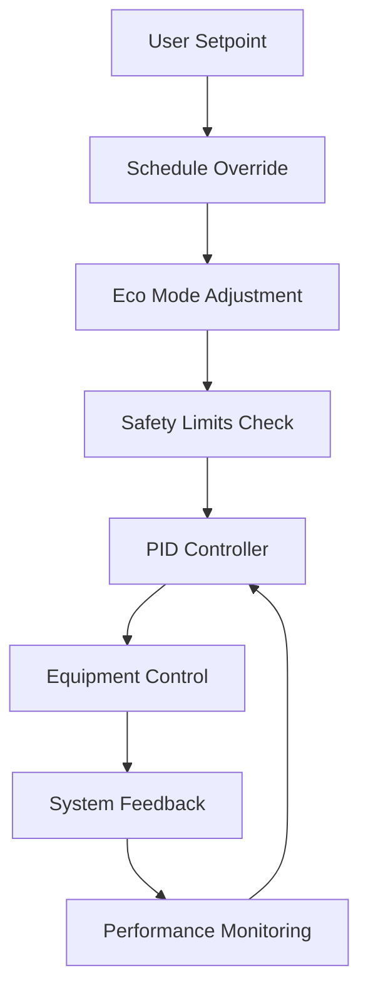

# Temperature Control

The Nest Learning Thermostat implements advanced temperature control algorithms to maintain comfortable indoor temperatures while maximizing energy efficiency. This document details the temperature control system, PID algorithms, and control strategies.

## Control System Architecture

### Control Components
- **PID Controller**: Primary temperature regulation using PID control
- **Adaptive Tuning**: Dynamic parameter adjustment based on system performance
- **Multi-stage Control**: Support for multi-stage heating and cooling systems
- **Deadband Management**: Intelligent deadband control for efficiency
- **Safety Limits**: Comprehensive safety monitoring and protection

### Control Hierarchy


## PID Control Implementation

### PID Controller Structure
The PID controller is the core of the temperature control system, providing precise temperature regulation.

```c
// Enhanced PID controller with advanced features
typedef struct {
    // PID parameters
    float kp;                    // Proportional gain
    float ki;                    // Integral gain
    float kd;                    // Derivative gain
    
    // State variables
    float setpoint;              // Target temperature
    float integral;              // Integral accumulator
    float prev_error;            // Previous error for derivative
    float prev_derivative;       // Previous derivative for filtering
    float prev_measurement;      // Previous measurement for derivative
    
    // Control limits
    float output_min;            // Minimum output limit
    float output_max;            // Maximum output limit
    float integral_min;          // Minimum integral limit
    float integral_max;          // Maximum integral limit
    
    // Timing and filtering
    float dt;                    // Time step
    float derivative_filter;     // Derivative filter coefficient
    float output_filter;         // Output filter coefficient
    
    // Advanced features
    bool anti_windup_enabled;    // Anti-windup protection
    bool feedforward_enabled;    // Feedforward control
    bool adaptive_enabled;       // Adaptive tuning
    float feedforward_gain;      // Feedforward gain
    
    // Performance tracking
    control_metrics_t metrics;   // Performance metrics
    tuning_state_t tuning_state; // Auto-tuning state
} advanced_pid_t;

// PID control update with advanced features
float advanced_pid_update(advanced_pid_t *pid, float measurement, float setpoint_change) {
    float error = pid->setpoint - measurement;
    
    // Proportional term
    float p_term = pid->kp * error;
    
    // Integral term with anti-windup
    if (pid->anti_windup_enabled) {
        // Conditional integration anti-windup
        if (!((pid->integral >= pid->integral_max && error > 0) ||
              (pid->integral <= pid->integral_min && error < 0))) {
            pid->integral += error * pid->dt;
        }
        
        // Clamp integral
        if (pid->integral > pid->integral_max) 
            pid->integral = pid->integral_max;
        if (pid->integral < pid->integral_min) 
            pid->integral = pid->integral_min;
    } else {
        pid->integral += error * pid->dt;
    }
    float i_term = pid->ki * pid->integral;
    
    // Derivative term with filtering
    float derivative = -(measurement - pid->prev_measurement) / pid->dt;
    pid->prev_measurement = measurement;
    
    // Filter derivative to reduce noise
    float filtered_derivative = (pid->derivative_filter * pid->prev_derivative + 
                                derivative) / (1.0 + pid->derivative_filter);
    pid->prev_derivative = filtered_derivative;
    float d_term = pid->kd * filtered_derivative;
    
    // Feedforward term
    float ff_term = 0.0;
    if (pid->feedforward_enabled && setpoint_change != 0.0) {
        ff_term = pid->feedforward_gain * setpoint_change;
    }
    
    // Calculate total output
    float output = p_term + i_term + d_term + ff_term;
    
    // Apply output limits
    if (output > pid->output_max) output = pid->output_max;
    if (output < pid->output_min) output = pid->output_min;
    
    // Output filtering for smooth control
    if (pid->output_filter > 0.0) {
        static float prev_output = 0.0;
        output = (pid->output_filter * prev_output + output) / (1.0 + pid->output_filter);
        prev_output = output;
    }
    
    // Update performance metrics
    update_control_metrics(&pid->metrics, error, output);
    
    return output;
}
```

### Adaptive PID Tuning
The PID parameters are automatically tuned based on system performance and operating conditions.

```c
// Adaptive tuning system
typedef struct {
    tuning_method_t method;      // Tuning method (Ziegler-Nichols, Cohen-Coon, etc.)
    performance_targets_t targets; // Performance targets
    adaptation_rate_t rate;      // Adaptation rate
    tuning_history_t history;    // Tuning history
    tuning_constraints_t constraints; // Tuning constraints
} adaptive_tuner_t;

// Performance targets for adaptive tuning
typedef struct {
    float max_overshoot;         // Maximum allowed overshoot (%)
    float max_settling_time;     // Maximum settling time (seconds)
    float max_steady_error;      // Maximum steady state error
    float min_stability_index;   // Minimum stability index
} performance_targets_t;

// Adaptive tuning algorithm
void adaptive_pid_tune(advanced_pid_t *pid, adaptive_tuner_t *tuner) {
    control_metrics_t *metrics = &pid->metrics;
    
    // Check if tuning is needed
    if (metrics->overshoot > tuner->targets.max_overshoot) {
        // Reduce proportional gain to reduce overshoot
        pid->kp *= 0.95;
        tuner->history.kp_adjustments++;
    }
    
    if (metrics->steady_state_error > tuner->targets.max_steady_error) {
        // Increase integral gain to reduce steady state error
        pid->ki *= 1.05;
        tuner->history.ki_adjustments++;
    }
    
    if (metrics->settling_time > tuner->targets.max_settling_time) {
        // Adjust derivative gain for better response
        if (metrics->overshoot < 2.0) {
            pid->kd *= 1.02; // Increase derivative if stable
        } else {
            pid->kd *= 0.98; // Decrease derivative if oscillating
        }
        tuner->history.kd_adjustments++;
    }
    
    // Apply tuning constraints
    apply_tuning_constraints(pid, &tuner->constraints);
    
    // Log tuning changes
    log_tuning_change(pid, tuner);
}
```

## Multi-Stage Control

### Multi-Stage Heating
Support for multi-stage heating systems with stage selection logic.

```c
// Multi-stage heating control
typedef struct {
    int num_stages;              // Number of heating stages
    stage_config_t stages[MAX_STAGES]; // Stage configurations
    stage_selection_t selection; // Stage selection strategy
    float stage_hysteresis;      // Stage switching hysteresis
    int min_stage_time;          // Minimum time per stage (seconds)
} multi_stage_heat_t;

// Stage configuration
typedef struct {
    float capacity;              // Stage capacity (percentage)
    float efficiency;            // Stage efficiency
    float min_output_temp;       // Minimum outdoor temperature for stage
    float max_output_temp;       // Maximum outdoor temperature for stage
    float cost_factor;           // Relative cost factor
} stage_config_t;

// Multi-stage control algorithm
int select_heating_stage(multi_stage_heat_t *heat, float required_output, 
                        float outdoor_temp) {
    static int current_stage = 0;
    static timestamp_t stage_change_time = 0;
    timestamp_t current_time = get_current_time();
    
    // Minimum stage time enforcement
    if (current_time - stage_change_time < heat->min_stage_time) {
        return current_stage;
    }
    
    // Calculate required stage based on output and outdoor temperature
    int target_stage = calculate_required_stage(heat, required_output, outdoor_temp);
    
    // Apply hysteresis to prevent rapid stage changes
    if (abs(target_stage - current_stage) == 1) {
        float hysteresis_threshold = heat->stage_hysteresis;
        if (target_stage > current_stage) {
            if (required_output < get_stage_capacity(heat, current_stage) - hysteresis_threshold) {
                target_stage = current_stage; // Don't upgrade yet
            }
        } else {
            if (required_output > get_stage_capacity(heat, current_stage) + hysteresis_threshold) {
                target_stage = current_stage; // Don't downgrade yet
            }
        }
    }
    
    // Update current stage
    if (target_stage != current_stage) {
        current_stage = target_stage;
        stage_change_time = current_time;
        log_stage_change(current_stage, required_output, outdoor_temp);
    }
    
    return current_stage;
}
```

### Multi-Stage Cooling
Similar multi-stage control for cooling systems.

```c
// Multi-stage cooling control
typedef struct {
    int num_stages;              // Number of cooling stages
    cooling_stage_t stages[MAX_STAGES]; // Cooling stage configurations
    float staging_threshold;     // Staging threshold
    bool compressor_protection;  // Compressor protection enabled
    int compressor_off_time;     // Minimum compressor off time
} multi_stage_cool_t;

// Cooling stage configuration
typedef struct {
    float capacity;              // Stage capacity (BTU/hr)
    float efficiency;            // Stage efficiency (SEER)
    float min_outdoor_temp;      // Minimum outdoor temperature
    float max_outdoor_temp;      // Maximum outdoor temperature
    bool variable_speed;         // Variable speed capability
} cooling_stage_t;
```

## Deadband Management

### Intelligent Deadband
Dynamic deadband adjustment for optimal efficiency and comfort.

```c
// Deadband management system
typedef struct {
    float base_deadband;         // Base deadband width
    float max_deadband;          // Maximum deadband width
    float min_deadband;          // Minimum deadband width
    deadband_strategy_t strategy; // Deadband adjustment strategy
    float load_factor;           // Current load factor
    float comfort_weight;        // Comfort vs efficiency weight
} deadband_manager_t;

// Dynamic deadband calculation
float calculate_dynamic_deadband(deadband_manager_t *manager, 
                                 float load_factor, float comfort_priority) {
    float deadband = manager->base_deadband;
    
    switch (manager->strategy) {
        case DEADBAND_LOAD_BASED:
            // Increase deadband under high load for efficiency
            if (load_factor > 0.8) {
                deadband *= 1.5;
            } else if (load_factor < 0.3) {
                deadband *= 0.8;
            }
            break;
            
        case DEADBAND_COMFORT_BASED:
            // Adjust based on comfort priority
            if (comfort_priority > 0.8) {
                deadband *= 0.7; // Tighter control for comfort
            } else if (comfort_priority < 0.3) {
                deadband *= 1.3; // Wider control for efficiency
            }
            break;
            
        case DEADBAND_ADAPTIVE:
            // Adaptive based on user patterns and system performance
            deadband = adaptive_deadband(manager, load_factor, comfort_priority);
            break;
    }
    
    // Apply limits
    if (deadband > manager->max_deadband) deadband = manager->max_deadband;
    if (deadband < manager->min_deadband) deadband = manager->min_deadband;
    
    return deadband;
}
```

### Deadband Hysteresis
Prevents rapid cycling around setpoint boundaries.

```c
// Deadband hysteresis control
typedef struct {
    float heating_deadband;      // Heating deadband
    float cooling_deadband;      // Cooling deadband
    float hysteresis_factor;     // Hysteresis factor
    bool in_heating_mode;        // Current heating mode state
    bool in_cooling_mode;        // Current cooling mode state
    timestamp_t last_mode_change; // Last mode change time
} deadband_hysteresis_t;

// Hysteresis control logic
hvac_mode_t apply_deadband_hysteresis(deadband_hysteresis_t *hysteresis, 
                                      float temperature, float heat_setpoint, 
                                      float cool_setpoint) {
    hvac_mode_t new_mode = hysteresis->in_heating_mode ? MODE_HEAT : 
                           hysteresis->in_cooling_mode ? MODE_COOL : MODE_OFF;
    
    // Heating mode control
    if (temperature < heat_setpoint - hysteresis->heating_deadband) {
        new_mode = MODE_HEAT;
        hysteresis->in_heating_mode = true;
        hysteresis->in_cooling_mode = false;
    } else if (temperature > heat_setpoint + 
               hysteresis->heating_deadband * hysteresis->hysteresis_factor) {
        hysteresis->in_heating_mode = false;
    }
    
    // Cooling mode control
    if (temperature > cool_setpoint + hysteresis->cooling_deadband) {
        new_mode = MODE_COOL;
        hysteresis->in_cooling_mode = true;
        hysteresis->in_heating_mode = false;
    } else if (temperature < cool_setpoint - 
               hysteresis->cooling_deadband * hysteresis->hysteresis_factor) {
        hysteresis->in_cooling_mode = false;
    }
    
    // Update mode change time
    if (new_mode != (hysteresis->in_heating_mode ? MODE_HEAT : 
                    hysteresis->in_cooling_mode ? MODE_COOL : MODE_OFF)) {
        hysteresis->last_mode_change = get_current_time();
    }
    
    return new_mode;
}
```

## Control Optimization

### Model Predictive Control
Advanced predictive control for optimal performance.

```c
// Model Predictive Control (MPC) implementation
typedef struct {
    int prediction_horizon;      // Prediction horizon steps
    int control_horizon;         // Control horizon steps
    system_model_t model;        // System model
    cost_function_t cost;        // Cost function
    constraint_set_t constraints; // Optimization constraints
    mpc_state_t state;           // MPC state
} mpc_controller_t;

// System model for prediction
typedef struct {
    float thermal_mass;          // Thermal mass of building
    float heat_loss_coefficient; // Heat loss coefficient
    float heat_gain_coefficient; // Heat gain coefficient
    float time_constant;         // System time constant
    float delay;                 // System delay
} system_model_t;

// MPC optimization
float mpc_optimize(mpc_controller_t *mpc, float current_temp, 
                   float setpoint, float disturbance) {
    // Predict system response over horizon
    float predictions[MAX_HORIZON];
    for (int i = 0; i < mpc->prediction_horizon; i++) {
        predictions[i] = predict_temperature(&mpc->model, current_temp, 
                                            disturbance, i);
    }
    
    // Optimize control sequence
    float optimal_control = solve_optimization(mpc, predictions, setpoint);
    
    // Apply first control action
    return optimal_control;
}
```

### Fuzzy Logic Control
Fuzzy logic control for handling nonlinearities and uncertainties.

```c
// Fuzzy logic controller
typedef struct {
    fuzzy_sets_t input_sets;     // Input fuzzy sets
    fuzzy_sets_t output_sets;    // Output fuzzy sets
    rule_base_t rules;           // Fuzzy rule base
    defuzzification_method_t method; // Defuzzification method
} fuzzy_controller_t;

// Fuzzy sets for temperature error
typedef struct {
    fuzzy_set_t negative_large;  // Negative large error
    fuzzy_set_t negative_small;  // Negative small error
    fuzzy_set_t zero;            // Zero error
    fuzzy_set_t positive_small;  // Positive small error
    fuzzy_set_t positive_large;  // Positive large error
} temperature_error_sets_t;

// Fuzzy control algorithm
float fuzzy_control(fuzzy_controller_t *fuzzy, float error, float error_rate) {
    // Fuzzify inputs
    float error_memberships[5];
    float rate_memberships[5];
    
    fuzzify_error(&fuzzy->input_sets.error_sets, error, error_memberships);
    fuzzify_error_rate(&fuzzy->input_sets.rate_sets, error_rate, rate_memberships);
    
    // Apply fuzzy rules
    float rule_strengths[MAX_RULES];
    apply_fuzzy_rules(&fuzzy->rules, error_memberships, rate_memberships, 
                     rule_strengths);
    
    // Defuzzify output
    float output = defuzzify(&fuzzy->output_sets, rule_strengths, fuzzy->method);
    
    return output;
}
```

## Performance Monitoring

### Control Performance Metrics
Real-time monitoring of control system performance.

```c
// Performance monitoring system
typedef struct {
    pid_metrics_t pid_metrics;   // PID performance metrics
    efficiency_metrics_t efficiency; // Efficiency metrics
    comfort_metrics_t comfort;   // Comfort metrics
    reliability_metrics_t reliability; // Reliability metrics
    performance_history_t history; // Performance history
} performance_monitor_t;

// PID performance metrics
typedef struct {
    float steady_state_error;    // Steady state error
    float settling_time;         // Settling time
    float rise_time;             // Rise time
    float overshoot;             // Percentage overshoot
    float undershoot;            // Percentage undershoot
    float stability_index;       // Stability index
    int oscillations;            // Number of oscillations
    float control_variance;      // Control output variance
} pid_metrics_t;

// Performance analysis
void analyze_control_performance(performance_monitor_t *monitor, 
                                float error_history[], int history_length) {
    // Calculate steady state error
    monitor->pid_metrics.steady_state_error = calculate_steady_state_error(
        error_history, history_length);
    
    // Calculate settling time
    monitor->pid_metrics.settling_time = calculate_settling_time(
        error_history, history_length);
    
    // Calculate overshoot
    monitor->pid_metrics.overshoot = calculate_overshoot(
        error_history, history_length);
    
    // Calculate stability index
    monitor->pid_metrics.stability_index = calculate_stability_index(
        error_history, history_length);
    
    // Update performance history
    update_performance_history(&monitor->history, &monitor->pid_metrics);
}
```

## Safety and Protection

### Safety Limits
Comprehensive safety monitoring and protection systems.

```c
// Safety protection system
typedef struct {
    temperature_limits_t temp_limits; // Temperature limits
    rate_limits_t rate_limits;   // Rate of change limits
    equipment_protection_t equipment; // Equipment protection
    emergency_actions_t emergency;   // Emergency actions
    safety_log_t safety_log;    // Safety event log
} safety_protection_t;

// Temperature safety limits
typedef struct {
    float max_heat_temperature; // Maximum heating temperature
    float min_cool_temperature; // Minimum cooling temperature
    float max_temp_rate;        // Maximum temperature change rate
    float frost_protection;     // Frost protection temperature
    float overheat_protection;  // Overheat protection temperature
} temperature_limits_t;

// Safety check function
safety_status_t check_safety_limits(safety_protection_t *safety, 
                                   float current_temp, float target_temp, 
                                   float temp_rate) {
    safety_status_t status = SAFETY_OK;
    
    // Check temperature limits
    if (target_temp > safety->temp_limits.max_heat_temperature) {
        status = SAFETY_OVERHEAT_RISK;
        log_safety_event(&safety->safety_log, "Target temperature exceeds maximum");
    }
    
    if (target_temp < safety->temp_limits.min_cool_temperature) {
        status = SAFETY_FROST_RISK;
        log_safety_event(&safety->safety_log, "Target temperature below minimum");
    }
    
    // Check rate of change
    if (abs(temp_rate) > safety->rate_limits.max_temp_rate) {
        status = SAFETY_RATE_VIOLATION;
        log_safety_event(&safety->safety_log, "Temperature change rate exceeds limit");
    }
    
    // Check equipment protection
    if (check_equipment_protection(&safety->equipment, current_temp, target_temp)) {
        status = SAFETY_EQUIPMENT_PROTECTION;
        log_safety_event(&safety->safety_log, "Equipment protection activated");
    }
    
    return status;
}
```

## Related Documentation

- [Thermostat Overview](./overview.mdx)
- [Learning Algorithms](./learning-algorithms.mdx)
- [Schedule Management](./schedule-management.mdx)
- [Energy Optimization](./energy-optimization.mdx)
