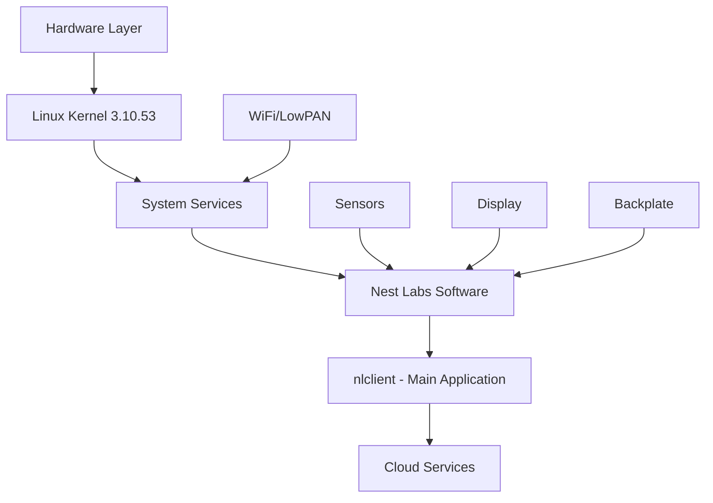

# System Overview

The Nest Learning Thermostat is a sophisticated embedded system combining hardware sensors, Linux-based software, and cloud connectivity.

## System Architecture

## Core Components

### Hardware Platform
- **Processor**: ARMv7l architecture
- **Storage**: 46MB root filesystem (mtdblock9) + separate data partitions
  - Root: 46MB (58% used)
  - System Config: 4MB (mtdblock10, 11% used)
  - User Config: 8MB (mtdblock11, 7% used)
  - Data: 20MB (mtdblock12, 6% used)
  - Log: 20MB (mtdblock13, 4% used)
  - Scratch: 92MB (mtdblock14, 4% used)
- **Connectivity**: WiFi (802.11) and LowPAN (6LoWPAN/ZigBee)
- **Sensors**: PIR motion, thermopile, ambient light sensor
- **Display**: OMAP framebuffer-based color display

### Operating System
- **Kernel**: Linux 3.10.53
- **Init System**: Custom init scripts
- **Root Filesystem**: Read-only with separate writable partitions

### Software Stack

<AccordionGroup>
  <Accordion title="Core Application">
    **nlclient** - The main thermostat application (4.9MB binary)
    - Thermostat logic and control
    - Sensor data processing
    - Schedule management
    - Cloud communication (Weave protocol)
    - Auto-away and occupancy detection
    - Energy statistics tracking
  </Accordion>

  <Accordion title="System Services">
    - **osm**: Open Service Manager - main service orchestrator
    - **nlclient**: Main thermostat application
    - **connmand**: Network connection manager
    - **wpa_supplicant**: WiFi authentication
    - **wpantund**: LowPAN networking daemon
    - **watchdogd**: System watchdog
    - **nlheartbeatd**: Heartbeat monitoring
    - **nlmetricsd**: Metrics collection daemon
    - **nlsleepd**: Sleep management daemon
    - **nlshutdownd**: Shutdown management
    - **dropbox**: Log/data upload service
  </Accordion>

  <Accordion title="Libraries">
    - libnlsystem.so - System utilities
    - libnlnetworkmanager.so - Network management
    - libnlweavetools.a - Weave protocol implementation
    - libnlapputils.so - Application utilities
    - libnldbus.so - D-Bus integration
    - libnlmetrics.so - Metrics collection
    - libVersion.so - Version information
    - libNuovationsUtilities.so - Core utilities
    - libUrlAccess.so - URL/HTTP access
    - libArchive.so - Archive handling
  </Accordion>
</AccordionGroup>

## Data Organization

### Configuration
- `/etc/nestlabs/` - System and application configuration
- `/media/system-config/` - System-level settings (SSH keys, WiFi calibration)
- `/media/user-config/` - User preferences and network settings

### Runtime Data
- `/media/data/` - Thermostat operational data (26+ JSON/recovery files)
  - Schedule management (schedulemanager.recovery, schedulescore.HEAT.recovery)
  - Auto-away detection (autoaway.recovery)
  - Energy statistics (energystats.recovery, toumanager.json)
  - Prediction models (predictionmanager.json)
  - Sunlight correction (sunlightcorrection.recovery)
  - HVAC control (radiantcontrol.recovery, furnaceshutdown.recovery)
  - Rate plans and demand response (rateplan.json, demandcharge.json)
- `/media/log/` - System and application logs
- `/media/scratch/` - Temporary storage and dropbox uploads

### Software
- `/nestlabs/bin/` - Nest-specific binaries (wirelessregcal, zb-loader)
- `/nestlabs/sbin/` - System administration binaries (19 daemons/tools)
- `/nestlabs/lib/` - Shared libraries (22 libraries)
- `/nestlabs/share/` - Resources and firmware
  - Firmware images (heatlink, backplate, bootloaders)
  - Localization files (9 languages: en_US, en_GB, fr_FR, de_DE, it_IT, es_ES, es_US, fr_CA, nl_NL)
  - UI resources (fonts: AkkuratNest-Bold/Regular, images)
  - Calibration data (brightness, thermal calibration)

## Network Architecture

<Tabs>
  <Tab title="WiFi">
    Primary connectivity method using standard 802.11 wireless
    - Managed by connmand and wpa_supplicant
    - Supports multiple network profiles
    - RSSI monitoring and roaming
  </Tab>
  <Tab title="LowPAN">
    6LoWPAN over 802.15.4 for local device communication
    - ZigBee protocol support
    - Managed by wpantund
    - SPI interface to radio hardware
  </Tab>
  <Tab title="Weave">
    Nest's proprietary application protocol
    - Secure device-to-cloud communication
    - Group key management
    - Service discovery
  </Tab>
</Tabs>

## Key Features

### Learning & Prediction
- Automatic schedule learning
- Occupancy prediction (Auto-Away)
- Time-to-temperature estimation
- Sunlight correction algorithms

### Energy Management
- Energy usage tracking
- Time-of-use rate support
- Demand response integration
- HVAC efficiency optimization

### Recovery & Reliability
- Multi-tier recovery system
- Automatic firmware rollback
- Watchdog monitoring
- Persistent state management

## System States

The device operates through several states managed by OSM (Open Service Manager):

1. **Boot** - Initial system startup
2. **Init** - Service initialization
3. **Running** - Normal operation
4. **Update** - Firmware update in progress
5. **Recovery** - Error recovery mode

<Info>
  The system maintains detailed operational data and implements sophisticated recovery mechanisms to ensure reliability.
</Info>
