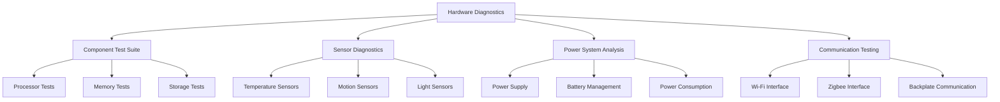

# Hardware Troubleshooting

The Nest Learning Thermostat includes comprehensive hardware diagnostic capabilities for identifying and resolving hardware-related issues. This document details hardware troubleshooting procedures, diagnostic tools, and repair guidelines.

## Hardware Diagnostic Architecture

### Core Components
- **Hardware Diagnostics Engine**: Core hardware diagnostic processing
- **Component Test Suite**: Comprehensive testing for all hardware components
- **Sensor Calibration**: Sensor accuracy verification and calibration
- **Power Management Diagnostics**: Power system analysis and troubleshooting
- **Communication Interface Testing**: Testing of all communication interfaces

### Hardware Diagnostic Framework


## Hardware Diagnostics Engine

### Component Testing
Comprehensive testing of all hardware components.

```c
// Hardware diagnostics system
typedef struct {
    hardware_test_engine_t test_engine;    // Hardware test engine
    component_diagnostics_t components;    // Component diagnostics
    sensor_diagnostics_t sensors;          // Sensor diagnostics
    power_diagnostics_t power;              // Power diagnostics
} hardware_diagnostics_t;

// Hardware test engine
typedef struct {
    test_suite_t test_suite;               // Test suite
    test_executor_t executor;              // Test executor
    result_analyzer_t analyzer;            // Result analyzer
    test_scheduler_t scheduler;            // Test scheduler
} hardware_test_engine_t;

// Hardware test suite
typedef struct {
    processor_tests_t processor;           // Processor tests
    memory_tests_t memory;                 // Memory tests
    storage_tests_t storage;               // Storage tests
    display_tests_t display;               // Display tests
    interface_tests_t interfaces;          // Interface tests
} test_suite_t;

// Execute comprehensive hardware diagnostics
hardware_diagnostic_result_t execute_hardware_diagnostics(
    hardware_diagnostics_t *diagnostics, 
    diagnostic_config_t *config) {
    
    hardware_test_engine_t *engine = &diagnostics->test_engine;
    hardware_diagnostic_result_t result = {0};
    
    // Initialize diagnostic session
    diagnostic_session_t session = initialize_diagnostic_session(config);
    
    // Execute processor tests
    processor_test_result_t processor_result = execute_processor_tests(
        &engine->test_suite.processor, &engine->executor);
    
    result.processor_status = processor_result.status;
    result.processor_details = processor_result.details;
    
    // Execute memory tests
    memory_test_result_t memory_result = execute_memory_tests(
        &engine->test_suite.memory, &engine->executor);
    
    result.memory_status = memory_result.status;
    result.memory_details = memory_result.details;
    
    // Execute storage tests
    storage_test_result_t storage_result = execute_storage_tests(
        &engine->test_suite.storage, &engine->executor);
    
    result.storage_status = storage_result.status;
    result.storage_details = storage_result.details;
    
    // Execute display tests
    display_test_result_t display_result = execute_display_tests(
        &engine->test_suite.display, &engine->executor);
    
    result.display_status = display_result.status;
    result.display_details = display_result.details;
    
    // Execute interface tests
    interface_test_result_t interface_result = execute_interface_tests(
        &engine->test_suite.interfaces, &engine->executor);
    
    result.interface_status = interface_result.status;
    result.interface_details = interface_result.details;
    
    // Analyze overall results
    result.overall_status = analyze_hardware_results(&engine->analyzer, result);
    
    // Generate diagnostic report
    result.report = generate_hardware_diagnostic_report(session, result);
    
    return result;
}
```

### Processor Diagnostics
Detailed testing of the OMAP processor and related components.

```c
// Processor tests
typedef struct {
    cpu_tests_t cpu;                       // CPU tests
    gpu_tests_t gpu;                       // GPU tests
    dsp_tests_t dsp;                       // DSP tests
    cache_tests_t cache;                   // Cache tests
    thermal_tests_t thermal;               // Thermal tests
} processor_tests_t;

// CPU tests
typedef struct {
    instruction_test_t instructions;       // Instruction tests
    register_test_t registers;             // Register tests
    arithmetic_test_t arithmetic;         // Arithmetic tests
    logic_test_t logic;                    // Logic tests
    performance_test_t performance;        // Performance tests
} cpu_tests_t;

// Execute processor diagnostics
processor_test_result_t execute_processor_diagnostics(
    processor_tests_t *processor_tests, 
    test_executor_t *executor) {
    
    processor_test_result_t result = {0};
    
    // Execute CPU instruction tests
    instruction_test_result_t instr_result = execute_instruction_tests(
        &processor_tests->cpu.instructions, executor);
    
    result.cpu_instruction_status = instr_result.status;
    result.cpu_instruction_details = instr_result.details;
    
    // Execute CPU register tests
    register_test_result_t reg_result = execute_register_tests(
        &processor_tests->cpu.registers, executor);
    
    result.cpu_register_status = reg_result.status;
    result.cpu_register_details = reg_result.details;
    
    // Execute CPU arithmetic tests
    arithmetic_test_result_t arith_result = execute_arithmetic_tests(
        &processor_tests->cpu.arithmetic, executor);
    
    result.cpu_arithmetic_status = arith_result.status;
    result.cpu_arithmetic_details = arith_result.details;
    
    // Execute CPU logic tests
    logic_test_result_t logic_result = execute_logic_tests(
        &processor_tests->cpu.logic, executor);
    
    result.cpu_logic_status = logic_result.status;
    result.cpu_logic_details = logic_result.details;
    
    // Execute CPU performance tests
    performance_test_result_t perf_result = execute_performance_tests(
        &processor_tests->cpu.performance, executor);
    
    result.cpu_performance_status = perf_result.status;
    result.cpu_performance_details = perf_result.details;
    
    // Execute GPU tests
    gpu_test_result_t gpu_result = execute_gpu_tests(
        &processor_tests->gpu, executor);
    
    result.gpu_status = gpu_result.status;
    result.gpu_details = gpu_result.details;
    
    // Execute DSP tests
    dsp_test_result_t dsp_result = execute_dsp_tests(
        &processor_tests->dsp, executor);
    
    result.dsp_status = dsp_result.status;
    result.dsp_details = dsp_result.details;
    
    // Execute cache tests
    cache_test_result_t cache_result = execute_cache_tests(
        &processor_tests->cache, executor);
    
    result.cache_status = cache_result.status;
    result.cache_details = cache_result.details;
    
    // Execute thermal tests
    thermal_test_result_t thermal_result = execute_thermal_tests(
        &processor_tests->thermal, executor);
    
    result.thermal_status = thermal_result.status;
    result.thermal_details = thermal_result.details;
    
    // Determine overall processor status
    result.overall_status = determine_processor_status(result);
    
    return result;
}
```

## Sensor Diagnostics

### Temperature Sensor Testing
Comprehensive testing and calibration of temperature sensors.

```c
// Sensor diagnostics
typedef struct {
    temperature_sensor_diagnostics_t temp; // Temperature sensors
    motion_sensor_diagnostics_t motion;    // Motion sensors
    light_sensor_diagnostics_t light;      // Light sensors
    humidity_sensor_diagnostics_t humidity; // Humidity sensors
    sensor_calibration_t calibration;     // Sensor calibration
} sensor_diagnostics_t;

// Temperature sensor diagnostics
typedef struct {
    internal_temp_test_t internal;         // Internal temperature sensor
    external_temp_test_t external;         // External temperature sensors
    accuracy_test_t accuracy;              // Accuracy testing
    response_time_test_t response_time;    // Response time testing
    drift_test_t drift;                    // Drift testing
} temperature_sensor_diagnostics_t;

// Execute temperature sensor diagnostics
temp_sensor_diagnostic_result_t execute_temperature_sensor_diagnostics(
    temperature_sensor_diagnostics_t *temp_diagnostics, 
    test_executor_t *executor) {
    
    temp_sensor_diagnostic_result_t result = {0};
    
    // Test internal temperature sensor
    internal_temp_result_t internal_result = test_internal_temperature_sensor(
        &temp_diagnostics->internal, executor);
    
    result.internal_sensor_status = internal_result.status;
    result.internal_sensor_details = internal_result.details;
    
    // Test external temperature sensors
    external_temp_result_t external_result = test_external_temperature_sensors(
        &temp_diagnostics->external, executor);
    
    result.external_sensor_status = external_result.status;
    result.external_sensor_details = external_result.details;
    
    // Test sensor accuracy
    accuracy_test_result_t accuracy_result = test_sensor_accuracy(
        &temp_diagnostics->accuracy, executor);
    
    result.accuracy_status = accuracy_result.status;
    result.accuracy_details = accuracy_result.details;
    
    // Test response time
    response_time_result_t response_result = test_sensor_response_time(
        &temp_diagnostics->response_time, executor);
    
    result.response_time_status = response_result.status;
    result.response_time_details = response_result.details;
    
    // Test sensor drift
    drift_test_result_t drift_result = test_sensor_drift(
        &temp_diagnostics->drift, executor);
    
    result.drift_status = drift_result.status;
    result.drift_details = drift_result.details;
    
    // Determine overall temperature sensor status
    result.overall_status = determine_temp_sensor_status(result);
    
    return result;
}
```

### Sensor Calibration
Calibration procedures for sensor accuracy optimization.

```c
// Sensor calibration system
typedef struct {
    calibration_algorithm_t algorithm;    // Calibration algorithm
    reference_source_t reference;          // Reference source
    calibration_validation_t validation;   // Calibration validation
    calibration_storage_t storage;         // Calibration storage
} sensor_calibration_t;

// Calibration algorithm
typedef struct {
    linear_calibration_t linear;           // Linear calibration
    polynomial_calibration_t polynomial;   // Polynomial calibration
    lookup_table_calibration_t lookup;     // Lookup table calibration
    adaptive_calibration_t adaptive;       // Adaptive calibration
} calibration_algorithm_t;

// Calibrate temperature sensor
calibration_result_t calibrate_temperature_sensor(
    sensor_calibration_t *calibration, 
    sensor_id_t sensor_id, 
    calibration_reference_t *reference) {
    
    calibration_result_t result = {0};
    
    // Collect calibration data points
    calibration_data_t data = collect_calibration_data(
        sensor_id, reference);
    
    if (data.point_count < MIN_CALIBRATION_POINTS) {
        result.status = CALIBRATION_STATUS_INSUFFICIENT_DATA;
        return result;
    }
    
    // Apply linear calibration
    linear_calibration_t linear = apply_linear_calibration(
        &calibration->algorithm.linear, data);
    
    // Apply polynomial calibration
    polynomial_calibration_t polynomial = apply_polynomial_calibration(
        &calibration->algorithm.polynomial, data);
    
    // Select best calibration method
    calibration_method_t best_method = select_best_calibration_method(
        linear, polynomial, data);
    
    result.calibration_method = best_method;
    
    // Validate calibration
    validation_result_t validation = validate_calibration(
        &calibration->validation, best_method, data);
    
    if (!validation.valid) {
        result.status = CALIBRATION_STATUS_VALIDATION_FAILED;
        result.validation_errors = validation.errors;
        return result;
    }
    
    // Store calibration data
    if (!store_calibration_data(&calibration->storage, sensor_id, 
                               best_method)) {
        result.status = CALIBRATION_STATUS_STORAGE_FAILED;
        return result;
    }
    
    result.status = CALIBRATION_STATUS_SUCCESS;
    result.calibration_data = best_method;
    result.accuracy_improvement = validation.accuracy_improvement;
    
    return result;
}
```

## Power System Diagnostics

### Power Supply Testing
Comprehensive testing of power supply components.

```c
// Power diagnostics
typedef struct {
    power_supply_diagnostics_t supply;     // Power supply diagnostics
    battery_diagnostics_t battery;         // Battery diagnostics
    power_consumption_t consumption;       // Power consumption analysis
    power_management_t management;         // Power management testing
} power_diagnostics_t;

// Power supply diagnostics
typedef struct {
    voltage_test_t voltage;                // Voltage testing
    current_test_t current;                // Current testing
    ripple_test_t ripple;                  // Ripple testing
    regulation_test_t regulation;          // Regulation testing
    efficiency_test_t efficiency;          // Efficiency testing
} power_supply_diagnostics_t;

// Execute power supply diagnostics
power_supply_diagnostic_result_t execute_power_supply_diagnostics(
    power_supply_diagnostics_t *supply_diagnostics, 
    test_executor_t *executor) {
    
    power_supply_diagnostic_result_t result = {0};
    
    // Test voltage levels
    voltage_test_result_t voltage_result = test_voltage_levels(
        &supply_diagnostics->voltage, executor);
    
    result.voltage_status = voltage_result.status;
    result.voltage_details = voltage_result.details;
    
    // Test current draw
    current_test_result_t current_result = test_current_draw(
        &supply_diagnostics->current, executor);
    
    result.current_status = current_result.status;
    result.current_details = current_result.details;
    
    // Test voltage ripple
    ripple_test_result_t ripple_result = test_voltage_ripple(
        &supply_diagnostics->ripple, executor);
    
    result.ripple_status = ripple_result.status;
    result.ripple_details = ripple_result.details;
    
    // Test voltage regulation
    regulation_test_result_t regulation_result = test_voltage_regulation(
        &supply_diagnostics->regulation, executor);
    
    result.regulation_status = regulation_result.status;
    result.regulation_details = regulation_result.details;
    
    // Test power efficiency
    efficiency_test_result_t efficiency_result = test_power_efficiency(
        &supply_diagnostics->efficiency, executor);
    
    result.efficiency_status = efficiency_result.status;
    result.efficiency_details = efficiency_result.details;
    
    // Determine overall power supply status
    result.overall_status = determine_power_supply_status(result);
    
    return result;
}
```

### Battery Diagnostics
Comprehensive battery health and performance testing.

```c
// Battery diagnostics
typedef struct {
    capacity_test_t capacity;              // Capacity testing
    health_test_t health;                  // Health testing
    charging_test_t charging;              // Charging testing
    temperature_test_t temperature;        // Temperature testing
    cycle_count_test_t cycle_count;        // Cycle count testing
} battery_diagnostics_t;

// Execute battery diagnostics
battery_diagnostic_result_t execute_battery_diagnostics(
    battery_diagnostics_t *battery_diagnostics, 
    test_executor_t *executor) {
    
    battery_diagnostic_result_t result = {0};
    
    // Test battery capacity
    capacity_test_result_t capacity_result = test_battery_capacity(
        &battery_diagnostics->capacity, executor);
    
    result.capacity_status = capacity_result.status;
    result.capacity_details = capacity_result.details;
    
    // Test battery health
    health_test_result_t health_result = test_battery_health(
        &battery_diagnostics->health, executor);
    
    result.health_status = health_result.status;
    result.health_details = health_result.details;
    
    // Test charging system
    charging_test_result_t charging_result = test_charging_system(
        &battery_diagnostics->charging, executor);
    
    result.charging_status = charging_result.status;
    result.charging_details = charging_result.details;
    
    // Test battery temperature behavior
    temperature_test_result_t temp_result = test_battery_temperature(
        &battery_diagnostics->temperature, executor);
    
    result.temperature_status = temp_result.status;
    result.temperature_details = temp_result.details;
    
    // Test cycle count
    cycle_count_result_t cycle_result = test_cycle_count(
        &battery_diagnostics->cycle_count, executor);
    
    result.cycle_count_status = cycle_result.status;
    result.cycle_count_details = cycle_result.details;
    
    // Determine overall battery status
    result.overall_status = determine_battery_status(result);
    
    return result;
}
```

## Communication Interface Testing

### Wi-Fi Interface Testing
Comprehensive testing of Wi-Fi communication interfaces.

```c
// Communication interface diagnostics
typedef struct {
    wifi_diagnostics_t wifi;               // Wi-Fi diagnostics
    zigbee_diagnostics_t zigbee;           // Zigbee diagnostics
    backplate_diagnostics_t backplate;     // Backplate diagnostics
    usb_diagnostics_t usb;                 // USB diagnostics
} communication_diagnostics_t;

// Wi-Fi diagnostics
typedef struct {
    radio_test_t radio;                    // Radio testing
    antenna_test_t antenna;                // Antenna testing
    protocol_test_t protocol;              // Protocol testing
    performance_test_t performance;        // Performance testing
    connectivity_test_t connectivity;      // Connectivity testing
} wifi_diagnostics_t;

// Execute Wi-Fi diagnostics
wifi_diagnostic_result_t execute_wifi_diagnostics(
    wifi_diagnostics_t *wifi_diagnostics, 
    test_executor_t *executor) {
    
    wifi_diagnostic_result_t result = {0};
    
    // Test Wi-Fi radio
    radio_test_result_t radio_result = test_wifi_radio(
        &wifi_diagnostics->radio, executor);
    
    result.radio_status = radio_result.status;
    result.radio_details = radio_result.details;
    
    // Test antenna system
    antenna_test_result_t antenna_result = test_antenna_system(
        &wifi_diagnostics->antenna, executor);
    
    result.antenna_status = antenna_result.status;
    result.antenna_details = antenna_result.details;
    
    // Test protocol implementation
    protocol_test_result_t protocol_result = test_wifi_protocols(
        &wifi_diagnostics->protocol, executor);
    
    result.protocol_status = protocol_result.status;
    result.protocol_details = protocol_result.details;
    
    // Test Wi-Fi performance
    performance_test_result_t perf_result = test_wifi_performance(
        &wifi_diagnostics->performance, executor);
    
    result.performance_status = perf_result.status;
    result.performance_details = perf_result.details;
    
    // Test connectivity
    connectivity_test_result_t conn_result = test_wifi_connectivity(
        &wifi_diagnostics->connectivity, executor);
    
    result.connectivity_status = conn_result.status;
    result.connectivity_details = conn_result.details;
    
    // Determine overall Wi-Fi status
    result.overall_status = determine_wifi_status(result);
    
    return result;
}
```

## Hardware Repair Guidelines

### Component Replacement
Guidelines for safe and effective component replacement.

```c
// Hardware repair system
typedef struct {
    replacement_guide_t replacement;       // Replacement guides
    repair_procedures_t procedures;         // Repair procedures
    safety_protocols_t safety;             // Safety protocols
    validation_system_t validation;        // Repair validation
} hardware_repair_t;

// Replacement guide
typedef struct {
    component_replacement_t components[MAX_COMPONENTS]; // Component replacements
    tool_requirements_t tools;             // Tool requirements
    skill_requirements_t skills;           // Skill requirements
    time_estimates_t time;                 // Time estimates
} replacement_guide_t;

// Component replacement procedure
replacement_result_t replace_hardware_component(
    replacement_guide_t *guide, 
    component_id_t component_id, 
    replacement_context_t *context) {
    
    replacement_result_t result = {0};
    
    // Get replacement procedure
    component_replacement_t *procedure = 
        get_replacement_procedure(guide, component_id);
    
    if (!procedure) {
        result.status = REPLACEMENT_STATUS_NO_PROCEDURE;
        return result;
    }
    
    // Validate prerequisites
    if (!validate_replacement_prerequisites(procedure, context)) {
        result.status = REPLACEMENT_STATUS_PREREQUISITES_FAILED;
        return result;
    }
    
    // Execute replacement steps
    for (int step = 0; step < procedure->step_count; step++) {
        replacement_step_t *current_step = &procedure->steps[step];
        
        step_result_t step_result = execute_replacement_step(
            current_step, context);
        
        if (!step_result.success) {
            result.status = REPLACEMENT_STATUS_STEP_FAILED;
            result.failed_step = step;
            result.step_error = step_result.error;
            
            // Attempt rollback if possible
            if (current_step->rollback_possible) {
                rollback_replacement_step(current_step, context);
            }
            
            return result;
        }
    }
    
    // Validate replacement
    if (!validate_replacement(&guide->validation, component_id, context)) {
        result.status = REPLACEMENT_STATUS_VALIDATION_FAILED;
        return result;
    }
    
    result.status = REPLACEMENT_STATUS_SUCCESS;
    result.replaced_component = component_id;
    
    return result;
}
```

## Related Documentation

- [Troubleshooting Overview](./overview.mdx)
- [Software Troubleshooting](./software-troubleshooting.mdx)
- [Network Troubleshooting](./network-troubleshooting.mdx)
- [Performance Issues](./performance-issues.mdx)
