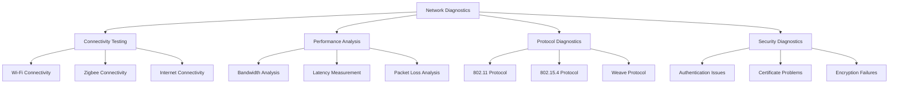

# Network Troubleshooting

The Nest Learning Thermostat incorporates comprehensive network diagnostic capabilities for identifying and resolving network-related issues. This document details network troubleshooting procedures, diagnostic tools, and connectivity optimization.

## Network Diagnostic Architecture

### Core Components
- **Network Diagnostics Engine**: Core network diagnostic processing
- **Connectivity Testing**: Comprehensive connectivity testing across all interfaces
- **Performance Analysis**: Network performance monitoring and analysis
- **Protocol Diagnostics**: Protocol-level troubleshooting and analysis
- **Security Diagnostics**: Network security and authentication troubleshooting

### Network Diagnostic Framework


## Network Diagnostics Engine

### Connectivity Testing
Comprehensive testing of all network interfaces and connections.

```c
// Network diagnostics system
typedef struct {
    connectivity_tester_t connectivity;    // Connectivity testing
    performance_analyzer_t performance;    // Performance analysis
    protocol_diagnostics_t protocols;      // Protocol diagnostics
    security_diagnostics_t security;       // Security diagnostics
} network_diagnostics_t;

// Connectivity tester
typedef struct {
    wifi_connectivity_t wifi;              // Wi-Fi connectivity
    zigbee_connectivity_t zigbee;          // Zigbee connectivity
    internet_connectivity_t internet;      // Internet connectivity
    service_connectivity_t services;       // Service connectivity
} connectivity_tester_t;

// Wi-Fi connectivity test
typedef struct {
    association_test_t association;        // Association testing
    authentication_test_t authentication;  // Authentication testing
    dhcp_test_t dhcp;                      // DHCP testing
    dns_test_t dns;                        // DNS testing
    gateway_test_t gateway;                // Gateway testing
} wifi_connectivity_t;

// Execute comprehensive connectivity tests
connectivity_report_t test_network_connectivity(
    connectivity_tester_t *tester, 
    test_config_t *config) {
    
    connectivity_report_t report = {0};
    
    // Test Wi-Fi connectivity
    wifi_connectivity_result_t wifi_result = test_wifi_connectivity(
        &tester->wifi, config);
    
    report.wifi_status = wifi_result.overall_status;
    report.wifi_details = wifi_result.details;
    
    // Test Zigbee connectivity
    zigbee_connectivity_result_t zigbee_result = test_zigbee_connectivity(
        &tester->zigbee, config);
    
    report.zigbee_status = zigbee_result.overall_status;
    report.zigbee_details = zigbee_result.details;
    
    // Test Internet connectivity
    internet_connectivity_result_t internet_result = test_internet_connectivity(
        &tester->internet, config);
    
    report.internet_status = internet_result.overall_status;
    report.internet_details = internet_result.details;
    
    // Test service connectivity
    service_connectivity_result_t service_result = test_service_connectivity(
        &tester->services, config);
    
    report.service_status = service_result.overall_status;
    report.service_details = service_result.details;
    
    // Determine overall connectivity status
    report.overall_status = determine_overall_connectivity_status(report);
    
    // Generate connectivity recommendations
    report.recommendations = generate_connectivity_recommendations(report);
    
    return report;
}
```

### Wi-Fi Connectivity Testing
Detailed testing of Wi-Fi network connectivity and performance.

```c
// Execute Wi-Fi connectivity test
wifi_connectivity_result_t test_wifi_connectivity(
    wifi_connectivity_t *wifi_test, 
    test_config_t *config) {
    
    wifi_connectivity_result_t result = {0};
    
    // Test AP association
    association_result_t assoc_result = test_ap_association(
        &wifi_test->association, config);
    
    result.association_status = assoc_result.status;
    result.association_details = assoc_result.details;
    
    // Test authentication
    authentication_result_t auth_result = test_wifi_authentication(
        &wifi_test->authentication, config);
    
    result.authentication_status = auth_result.status;
    result.authentication_details = auth_result.details;
    
    // Test DHCP functionality
    dhcp_result_t dhcp_result = test_dhcp_functionality(
        &wifi_test->dhcp, config);
    
    result.dhcp_status = dhcp_result.status;
    result.dhcp_details = dhcp_result.details;
    
    // Test DNS resolution
    dns_result_t dns_result = test_dns_resolution(
        &wifi_test->dns, config);
    
    result.dns_status = dns_result.status;
    result.dns_details = dns_result.details;
    
    // Test gateway connectivity
    gateway_result_t gateway_result = test_gateway_connectivity(
        &wifi_test->gateway, config);
    
    result.gateway_status = gateway_result.status;
    result.gateway_details = gateway_result.details;
    
    // Determine overall Wi-Fi status
    result.overall_status = determine_wifi_status(result);
    
    return result;
}
```

## Performance Analysis

### Bandwidth Analysis
Comprehensive analysis of network bandwidth and throughput.

```c
// Performance analyzer
typedef struct {
    bandwidth_analyzer_t bandwidth;        // Bandwidth analysis
    latency_analyzer_t latency;            // Latency analysis
    packet_analyzer_t packets;             // Packet analysis
    quality_analyzer_t quality;            // Quality analysis
} performance_analyzer_t;

// Bandwidth analyzer
typedef struct {
    throughput_tester_t throughput;        // Throughput testing
    capacity_analyzer_t capacity;          // Capacity analysis
    utilization_monitor_t utilization;     // Utilization monitoring
    bottleneck_detector_t bottleneck;      // Bottleneck detection
} bandwidth_analyzer_t;

// Bandwidth analysis result
typedef struct {
    throughput_metrics_t throughput;       // Throughput metrics
    capacity_metrics_t capacity;           // Capacity metrics
    utilization_metrics_t utilization;     // Utilization metrics
    bottleneck_analysis_t bottlenecks;     // Bottleneck analysis
    optimization_recommendations_t recommendations; // Recommendations
} bandwidth_analysis_result_t;

// Analyze network bandwidth
bandwidth_analysis_result_t analyze_network_bandwidth(
    bandwidth_analyzer_t *analyzer, 
    analysis_config_t *config) {
    
    bandwidth_analysis_result_t result = {0};
    
    // Test throughput
    result.throughput = test_network_throughput(
        &analyzer->throughput, config);
    
    // Analyze capacity
    result.capacity = analyze_network_capacity(
        &analyzer->capacity, config);
    
    // Monitor utilization
    result.utilization = monitor_bandwidth_utilization(
        &analyzer->utilization, config);
    
    // Detect bottlenecks
    result.bottlenecks = detect_bandwidth_bottlenecks(
        &analyzer->bottleneck, result.throughput, 
        result.capacity, result.utilization);
    
    // Generate optimization recommendations
    result.recommendations = generate_bandwidth_recommendations(result);
    
    return result;
}
```

### Latency Measurement
Precise measurement and analysis of network latency.

```c
// Latency analyzer
typedef struct {
    rtt_measurer_t rtt;                    // Round-trip time measurement
    jitter_analyzer_t jitter;              // Jitter analysis
    delay_analyzer_t delay;                // Delay analysis
    latency_profiler_t profiler;           // Latency profiling
} latency_analyzer_t;

// Latency measurement result
typedef struct {
    rtt_metrics_t rtt;                     // RTT metrics
    jitter_metrics_t jitter;               // Jitter metrics
    delay_analysis_t delay;                // Delay analysis
    latency_profile_t profile;             // Latency profile
    optimization_suggestions_t suggestions; // Optimization suggestions
} latency_analysis_result_t;

// Measure network latency
latency_analysis_result_t measure_network_latency(
    latency_analyzer_t *analyzer, 
    measurement_config_t *config) {
    
    latency_analysis_result_t result = {0};
    
    // Measure round-trip time
    result.rtt = measure_rtt(&analyzer->rtt, config);
    
    // Analyze jitter
    result.jitter = analyze_jitter(&analyzer->jitter, config);
    
    // Analyze delay components
    result.delay = analyze_delay_components(
        &analyzer->delay, config);
    
    // Generate latency profile
    result.profile = generate_latency_profile(
        &analyzer->profiler, result.rtt, result.jitter, result.delay);
    
    // Generate optimization suggestions
    result.suggestions = generate_latency_optimization_suggestions(result);
    
    return result;
}
```

## Protocol Diagnostics

### 802.11 Protocol Analysis
Detailed analysis of Wi-Fi protocol behavior and issues.

```c
// Protocol diagnostics
typedef struct {
    wifi_protocol_t wifi;                  // Wi-Fi protocol diagnostics
    zigbee_protocol_t zigbee;              // Zigbee protocol diagnostics
    weave_protocol_t weave;                // Weave protocol diagnostics
    ip_protocol_t ip;                      // IP protocol diagnostics
} protocol_diagnostics_t;

// Wi-Fi protocol diagnostics
typedef struct {
    frame_analyzer_t frames;               // Frame analysis
    association_diagnostics_t association; // Association diagnostics
    security_diagnostics_t security;       // Security diagnostics
    qos_diagnostics_t qos;                 // QoS diagnostics
} wifi_protocol_t;

// Wi-Fi frame analysis
typedef struct {
    management_frames_t management;        // Management frames
    control_frames_t control;              // Control frames
    data_frames_t data;                    // Data frames
    error_frames_t errors;                 // Error frames
} frame_analyzer_t;

// Analyze Wi-Fi protocol behavior
wifi_protocol_result_t analyze_wifi_protocol(
    wifi_protocol_t *wifi_diagnostics, 
    analysis_window_t *window) {
    
    wifi_protocol_result_t result = {0};
    
    // Analyze management frames
    management_frame_analysis_t mgmt_analysis = 
        analyze_management_frames(&wifi_diagnostics->frames.management, 
                                window);
    
    result.management_status = mgmt_analysis.status;
    result.management_details = mgmt_analysis.details;
    
    // Analyze control frames
    control_frame_analysis_t ctrl_analysis = 
        analyze_control_frames(&wifi_diagnostics->frames.control, 
                             window);
    
    result.control_status = ctrl_analysis.status;
    result.control_details = ctrl_analysis.details;
    
    // Analyze data frames
    data_frame_analysis_t data_analysis = 
        analyze_data_frames(&wifi_diagnostics->frames.data, 
                          window);
    
    result.data_status = data_analysis.status;
    result.data_details = data_analysis.details;
    
    // Analyze error frames
    error_frame_analysis_t error_analysis = 
        analyze_error_frames(&wifi_diagnostics->frames.errors, 
                           window);
    
    result.error_status = error_analysis.status;
    result.error_details = error_analysis.details;
    
    // Diagnose association issues
    association_diagnostic_t assoc_diagnostic = 
        diagnose_association_issues(&wifi_diagnostics->association, 
                                  mgmt_analysis);
    
    result.association_diagnostic = assoc_diagnostic;
    
    // Diagnose security issues
    security_diagnostic_t security_diagnostic = 
        diagnose_security_issues(&wifi_diagnostics->security, 
                               mgmt_analysis);
    
    result.security_diagnostic = security_diagnostic;
    
    // Determine overall protocol status
    result.overall_status = determine_wifi_protocol_status(result);
    
    return result;
}
```

### Zigbee Protocol Analysis
Analysis of Zigbee network protocol and mesh functionality.

```c
// Zigbee protocol diagnostics
typedef struct {
    mesh_analyzer_t mesh;                  // Mesh analysis
    network_diagnostics_t network;         // Network diagnostics
    security_diagnostics_t security;       // Security diagnostics
    routing_diagnostics_t routing;         // Routing diagnostics
} zigbee_protocol_t;

// Mesh analyzer
typedef struct {
    topology_analyzer_t topology;          // Topology analysis
    route_analyzer_t routes;               // Route analysis
    neighbor_analysis_t neighbors;         // Neighbor analysis
    link_quality_t quality;                // Link quality analysis
} mesh_analyzer_t;

// Analyze Zigbee protocol behavior
zigbee_protocol_result_t analyze_zigbee_protocol(
    zigbee_protocol_t *zigbee_diagnostics, 
    analysis_config_t *config) {
    
    zigbee_protocol_result_t result = {0};
    
    // Analyze mesh topology
    topology_analysis_t topology = analyze_mesh_topology(
        &zigbee_diagnostics->mesh.topology, config);
    
    result.topology_status = topology.status;
    result.topology_details = topology.details;
    
    // Analyze routing
    routing_analysis_t routing = analyze_zigbee_routing(
        &zigbee_diagnostics->routing, config);
    
    result.routing_status = routing.status;
    result.routing_details = routing.details;
    
    // Analyze network performance
    network_analysis_t network = analyze_zigbee_network(
        &zigbee_diagnostics->network, config);
    
    result.network_status = network.status;
    result.network_details = network.details;
    
    // Analyze security
    zigbee_security_analysis_t security = analyze_zigbee_security(
        &zigbee_diagnostics->security, config);
    
    result.security_status = security.status;
    result.security_details = security.details;
    
    // Determine overall Zigbee status
    result.overall_status = determine_zigbee_protocol_status(result);
    
    return result;
}
```

## Security Diagnostics

### Authentication Troubleshooting
Diagnosis and resolution of network authentication issues.

```c
// Security diagnostics
typedef struct {
    authentication_diagnostics_t auth;    // Authentication diagnostics
    certificate_diagnostics_t certs;      // Certificate diagnostics
    encryption_diagnostics_t encryption;   // Encryption diagnostics
    policy_diagnostics_t policy;          // Policy diagnostics
} security_diagnostics_t;

// Authentication diagnostics
typedef struct {
    wifi_auth_diagnostics_t wifi;          // Wi-Fi authentication
    zigbee_auth_diagnostics_t zigbee;      // Zigbee authentication
    weave_auth_diagnostics_t weave;        // Weave authentication
    credential_diagnostics_t credentials;  // Credential diagnostics
} authentication_diagnostics_t;

// Diagnose authentication issues
auth_diagnostic_result_t diagnose_authentication_issues(
    authentication_diagnostics_t *auth_diagnostics, 
    network_interface_t interface, 
    auth_context_t *context) {
    
    auth_diagnostic_result_t result = {0};
    
    switch (interface) {
        case NETWORK_INTERFACE_WIFI:
            result = diagnose_wifi_authentication(
                &auth_diagnostics->wifi, context);
            break;
            
        case NETWORK_INTERFACE_ZIGBEE:
            result = diagnose_zigbee_authentication(
                &auth_diagnostics->zigbee, context);
            break;
            
        case NETWORK_INTERFACE_WEAVE:
            result = diagnose_weave_authentication(
                &auth_diagnostics->weave, context);
            break;
    }
    
    // Analyze credential issues
    credential_analysis_t cred_analysis = analyze_credentials(
        &auth_diagnostics->credentials, context);
    
    result.credential_analysis = cred_analysis;
    
    // Generate authentication recommendations
    result.recommendations = generate_auth_recommendations(result);
    
    return result;
}
```

### Certificate Diagnostics
Diagnosis of certificate-related issues and validation problems.

```c
// Certificate diagnostics
typedef struct {
    certificate_validator_t validator;     // Certificate validator
    chain_analyzer_t chain;                // Chain analysis
    trust_store_diagnostics_t trust;       // Trust store diagnostics
    revocation_diagnostics_t revocation;   // Revocation diagnostics
} certificate_diagnostics_t;

// Certificate validation result
typedef struct {
    certificate_status_t status;           // Certificate status
    validation_errors_t errors;            // Validation errors
    chain_analysis_t chain;                // Chain analysis
    trust_validation_t trust;              // Trust validation
    revocation_status_t revocation;        // Revocation status
} certificate_validation_result_t;

// Diagnose certificate issues
cert_diagnostic_result_t diagnose_certificate_issues(
    certificate_diagnostics_t *cert_diagnostics, 
    certificate_context_t *context) {
    
    cert_diagnostic_result_t result = {0};
    
    // Validate certificate
    certificate_validation_result_t validation = validate_certificate(
        &cert_diagnostics->validator, context->certificate);
    
    result.validation = validation;
    
    // Analyze certificate chain
    chain_analysis_t chain = analyze_certificate_chain(
        &cert_diagnostics->chain, context->certificate);
    
    result.chain_analysis = chain;
    
    // Validate against trust store
    trust_validation_t trust = validate_trust_store(
        &cert_diagnostics->trust, context->certificate);
    
    result.trust_validation = trust;
    
    // Check revocation status
    revocation_status_t revocation = check_revocation_status(
        &cert_diagnostics->revocation, context->certificate);
    
    result.revocation_status = revocation;
    
    // Determine overall certificate status
    result.overall_status = determine_certificate_status(
        validation, chain, trust, revocation);
    
    // Generate certificate recommendations
    result.recommendations = generate_certificate_recommendations(result);
    
    return result;
}
```

## Network Optimization

### Connection Optimization
Optimization of network connections for improved performance and reliability.

```c
// Network optimizer
typedef struct {
    connection_optimizer_t connection;     // Connection optimization
    protocol_optimizer_t protocol;         // Protocol optimization
    qos_optimizer_t qos;                   // QoS optimization
    power_optimizer_t power;               // Power optimization
} network_optimizer_t;

// Connection optimizer
typedef struct {
    parameter_tuner_t tuner;               // Parameter tuning
    path_selector_t selector;              // Path selection
    load_balancer_t balancer;              // Load balancing
    failover_manager_t failover;           // Failover management
} connection_optimizer_t;

// Optimize network connection
optimization_result_t optimize_network_connection(
    network_optimizer_t *optimizer, 
    connection_context_t *context, 
    optimization_goals_t goals) {
    
    optimization_result_t result = {0};
    
    // Tune connection parameters
    parameter_tuning_result_t tuning = tune_connection_parameters(
        &optimizer->connection.tuner, context, goals);
    
    result.parameter_tuning = tuning;
    
    // Select optimal path
    path_selection_result_t path = select_optimal_path(
        &optimizer->connection.selector, context);
    
    result.path_selection = path;
    
    // Configure load balancing
    load_balancing_result_t load_balance = configure_load_balancing(
        &optimizer->connection.balancer, context);
    
    result.load_balancing = load_balance;
    
    // Setup failover
    failover_configuration_t failover = setup_failover(
        &optimizer->connection.failover, context);
    
    result.failover_setup = failover;
    
    // Apply protocol optimizations
    protocol_optimization_result_t protocol = apply_protocol_optimizations(
        &optimizer->protocol, context);
    
    result.protocol_optimization = protocol;
    
    // Configure QoS
    qos_configuration_t qos = configure_qos(
        &optimizer->qos, context, goals);
    
    result.qos_configuration = qos;
    
    // Optimize power usage
    power_optimization_result_t power = optimize_power_usage(
        &optimizer->power, context, goals);
    
    result.power_optimization = power;
    
    // Determine overall optimization success
    result.overall_success = determine_optimization_success(result);
    
    return result;
}
```

## Related Documentation

- [Troubleshooting Overview](./overview.mdx)
- [Hardware Troubleshooting](./hardware-troubleshooting.mdx)
- [Software Troubleshooting](./software-troubleshooting.mdx)
- [Performance Issues](./performance-issues.mdx)
