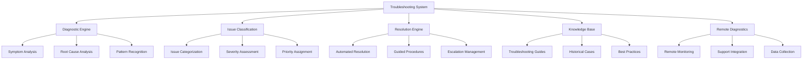

# Troubleshooting Overview

The Nest Learning Thermostat incorporates comprehensive troubleshooting capabilities for diagnosing and resolving system issues. This document provides an overview of the troubleshooting architecture, methodologies, and available tools.

## Troubleshooting Architecture

### Core Components
- **Diagnostic Engine**: Core diagnostic processing and analysis
- **Issue Classification**: Automated issue categorization and prioritization
- **Resolution Engine**: Automated and guided resolution procedures
- **Knowledge Base**: Comprehensive troubleshooting knowledge repository
- **Remote Diagnostics**: Remote diagnostic capabilities and support

### Troubleshooting Framework


## Diagnostic Engine

### Symptom Analysis
Comprehensive analysis of system symptoms and anomalies.

```c
// Troubleshooting system
typedef struct {
    diagnostic_engine_t diagnostic;        // Diagnostic engine
    issue_classifier_t classifier;         // Issue classifier
    resolution_engine_t resolution;        // Resolution engine
    knowledge_base_t knowledge;            // Knowledge base
} troubleshooting_system_t;

// Diagnostic engine
typedef struct {
    symptom_analyzer_t analyzer;           // Symptom analyzer
    pattern_matcher_t matcher;             // Pattern matcher
    anomaly_detector_t detector;           // Anomaly detector
    correlation_engine_t correlation;      // Correlation engine
} diagnostic_engine_t;

// Symptom analyzer
typedef struct {
    symptom_collector_t collector;         // Symptom collector
    symptom_classifier_t classifier;       // Symptom classifier
    symptom_aggregator_t aggregator;       // Symptom aggregator
    symptom_prioritizer_t prioritizer;     // Symptom prioritizer
} symptom_analyzer_t;

// Symptom structure
typedef struct {
    symptom_id_t symptom_id;               // Symptom ID
    symptom_type_t type;                   // Symptom type
    severity_t severity;                   // Symptom severity
    component_id_t component;              // Affected component
    timestamp_t first_observed;            // First observation time
    timestamp_t last_observed;             // Last observation time
    int occurrence_count;                  // Occurrence count
    symptom_data_t data;                   // Symptom-specific data
    correlation_id_t correlation_id;       // Correlation ID
} symptom_t;

// Analyze system symptoms
symptom_analysis_t analyze_system_symptoms(
    diagnostic_engine_t *engine, 
    system_state_t *state) {
    
    symptom_analyzer_t *analyzer = &engine->analyzer;
    symptom_analysis_t analysis = {0};
    
    // Collect symptoms from system state
    symptom_collection_t collection = collect_symptoms(
        &analyzer->collector, state);
    
    // Classify symptoms by type and severity
    classify_symptoms(&analyzer->classifier, &collection, &analysis);
    
    // Aggregate related symptoms
    aggregate_symptoms(&analyzer->aggregator, &collection, &analysis);
    
    // Prioritize symptoms by impact and urgency
    prioritize_symptoms(&analyzer->prioritizer, &analysis);
    
    // Match symptom patterns
    pattern_matches_t matches = match_symptom_patterns(
        &engine->matcher, &collection);
    
    analysis.pattern_matches = matches;
    
    // Detect anomalies
    anomaly_result_t anomalies = detect_symptom_anomalies(
        &engine->detector, &collection);
    
    analysis.anomalies = anomalies;
    
    // Correlate symptoms
    correlation_result_t correlations = correlate_symptoms(
        &engine->correlation, &collection);
    
    analysis.correlations = correlations;
    
    return analysis;
}
```

### Pattern Recognition
Advanced pattern recognition for known issue identification.

```c
// Pattern matcher
typedef struct {
    pattern_database_t database;          // Pattern database
    matching_algorithm_t algorithm;        // Matching algorithm
    confidence_calculator_t confidence;    // Confidence calculation
    learning_engine_t learning;            // Learning engine
} pattern_matcher_t;

// Troubleshooting pattern
typedef struct {
    pattern_id_t pattern_id;               // Pattern ID
    char pattern_name[128];                // Pattern name
    symptom_signature_t signature;         // Symptom signature
    issue_type_t issue_type;               // Issue type
    float confidence_threshold;            // Confidence threshold
    resolution_hints_t hints;              // Resolution hints
    historical_occurrence_t history;       // Historical occurrence
} troubleshooting_pattern_t;

// Match troubleshooting patterns
pattern_matches_t match_troubleshooting_patterns(
    pattern_matcher_t *matcher, 
    symptom_collection_t *symptoms) {
    
    pattern_matches_t matches = {0};
    
    // Iterate through pattern database
    for (int i = 0; i < matcher->database.pattern_count; i++) {
        troubleshooting_pattern_t *pattern = 
            &matcher->database.patterns[i];
        
        // Calculate pattern match score
        float match_score = calculate_pattern_match_score(
            pattern, symptoms, &matcher->algorithm);
        
        // Check if match exceeds threshold
        if (match_score >= pattern->confidence_threshold) {
            // Add to matches
            pattern_match_t match = {
                .pattern = pattern,
                .match_score = match_score,
                .confidence = calculate_match_confidence(
                    match_score, pattern->confidence_threshold)
            };
            
            matches.matches[matches.match_count++] = match;
        }
    }
    
    // Sort matches by confidence
    sort_pattern_matches(&matches);
    
    // Update learning engine
    update_pattern_learning(&matcher->learning, symptoms, matches);
    
    return matches;
}
```

## Issue Classification

### Automated Classification
Intelligent classification of issues for efficient resolution.

```c
// Issue classifier
typedef struct {
    classification_engine_t engine;       // Classification engine
    category_manager_t categories;         // Category management
    severity_assessor_t severity;          // Severity assessment
    priority_assigner_t priority;          // Priority assignment
} issue_classifier_t;

// Classification engine
typedef struct {
    ml_classifier_t ml_classifier;         // Machine learning classifier
    rule_classifier_t rule_classifier;     // Rule-based classifier
    hybrid_classifier_t hybrid;            // Hybrid classification
    feedback_learner_t feedback;           // Feedback learning
} classification_engine_t;

// Issue classification result
typedef struct {
    issue_id_t issue_id;                   // Issue ID
    category_t primary_category;           // Primary category
    category_t secondary_category;         // Secondary category
    severity_t severity;                   // Issue severity
    priority_t priority;                   // Issue priority
    classification_confidence_t confidence; // Classification confidence
    classification_reasoning_t reasoning;  // Classification reasoning
} issue_classification_t;

// Classify system issue
issue_classification_t classify_system_issue(
    issue_classifier_t *classifier, 
    symptom_analysis_t *symptoms, 
    system_context_t *context) {
    
    classification_engine_t *engine = &classifier->engine;
    issue_classification_t classification = {0};
    
    // Generate issue ID
    classification.issue_id = generate_issue_id();
    
    // Apply machine learning classification
    ml_classification_t ml_result = classify_with_ml(
        &engine->ml_classifier, symptoms, context);
    
    // Apply rule-based classification
    rule_classification_t rule_result = classify_with_rules(
        &engine->rule_classifier, symptoms, context);
    
    // Apply hybrid classification
    hybrid_classification_t hybrid_result = classify_hybrid(
        &engine->hybrid, ml_result, rule_result);
    
    // Determine primary and secondary categories
    classification.primary_category = 
        determine_primary_category(&classifier->categories, hybrid_result);
    classification.secondary_category = 
        determine_secondary_category(&classifier->categories, hybrid_result);
    
    // Assess severity
    classification.severity = assess_issue_severity(
        &classifier->severity, symptoms, hybrid_result);
    
    // Assign priority
    classification.priority = assign_issue_priority(
        &classifier->priority, classification.severity, 
        symptoms, context);
    
    // Calculate classification confidence
    classification.confidence = calculate_classification_confidence(
        ml_result, rule_result, hybrid_result);
    
    // Generate classification reasoning
    classification.reasoning = generate_classification_reasoning(
        ml_result, rule_result, hybrid_result);
    
    // Update feedback learner
    update_classification_feedback(&engine->feedback, classification, 
                                  symptoms, context);
    
    return classification;
}
```

### Severity Assessment
Automated assessment of issue severity and impact.

```c
// Severity assessor
typedef struct {
    impact_analyzer_t impact;              // Impact analysis
    urgency_calculator_t urgency;          // Urgency calculation
    risk_assessor_t risk;                  // Risk assessment
    severity_matrix_t matrix;              // Severity matrix
} severity_assessor_t;

// Impact analysis
typedef struct {
    functional_impact_t functional;        // Functional impact
    user_impact_t user;                    // User impact
    system_impact_t system;                // System impact
    business_impact_t business;            // Business impact
} impact_analyzer_t;

// Assess issue severity
severity_assessment_t assess_issue_severity(
    severity_assessor_t *assessor, 
    symptom_analysis_t *symptoms, 
    classification_result_t *classification) {
    
    severity_assessment_t assessment = {0};
    
    // Analyze functional impact
    functional_impact_t func_impact = analyze_functional_impact(
        &assessor->impact.functional, symptoms);
    
    // Analyze user impact
    user_impact_t user_impact = analyze_user_impact(
        &assessor->impact.user, symptoms);
    
    // Analyze system impact
    system_impact_t sys_impact = analyze_system_impact(
        &assessor->impact.system, symptoms);
    
    // Analyze business impact
    business_impact_t biz_impact = analyze_business_impact(
        &assessor->impact.business, symptoms);
    
    // Calculate urgency
    urgency_score_t urgency = calculate_issue_urgency(
        &assessor->urgency, func_impact, user_impact, 
        sys_impact, biz_impact);
    
    // Assess risk
    risk_assessment_t risk = assess_issue_risk(
        &assessor->risk, symptoms, classification);
    
    // Apply severity matrix
    severity_level_t severity = apply_severity_matrix(
        &assessor->matrix, func_impact, user_impact, 
        sys_impact, urgency, risk);
    
    assessment.severity = severity;
    assessment.functional_impact = func_impact;
    assessment.user_impact = user_impact;
    assessment.system_impact = sys_impact;
    assessment.business_impact = biz_impact;
    assessment.urgency = urgency;
    assessment.risk = risk;
    
    return assessment;
}
```

## Resolution Engine

### Automated Resolution
Self-healing capabilities for automatic issue resolution.

```c
// Resolution engine
typedef struct {
    automated_resolver_t automated;        // Automated resolver
    guided_resolver_t guided;              // Guided resolver
    escalation_manager_t escalation;       // Escalation manager
    resolution_validator_t validator;      // Resolution validator
} resolution_engine_t;

// Automated resolver
typedef struct {
    resolution_strategies_t strategies;    // Resolution strategies
    action_executor_t executor;            // Action executor
    success_predictor_t predictor;         // Success predictor
    rollback_handler_t rollback;           // Rollback handler
} automated_resolver_t;

// Resolution strategy
typedef struct {
    strategy_id_t strategy_id;             // Strategy ID
    issue_type_t applicable_issues;        // Applicable issue types
    resolution_actions_t actions;          // Resolution actions
    success_criteria_t criteria;           // Success criteria
    rollback_plan_t rollback;              // Rollback plan
    historical_success_t success_rate;     // Historical success rate
} resolution_strategy_t;

// Attempt automated resolution
resolution_result_t attempt_automated_resolution(
    automated_resolver_t *resolver, 
    issue_classification_t *issue, 
    system_context_t *context) {
    
    resolution_result_t result = {0};
    
    // Select appropriate resolution strategy
    resolution_strategy_t *strategy = select_resolution_strategy(
        &resolver->strategies, issue);
    
    if (!strategy) {
        result.status = RESOLUTION_STATUS_NO_STRATEGY;
        return result;
    }
    
    // Predict success probability
    success_prediction_t prediction = predict_resolution_success(
        &resolver->predictor, strategy, issue, context);
    
    if (prediction.success_probability < SUCCESS_THRESHOLD) {
        result.status = RESOLUTION_STATUS_LOW_SUCCESS_PROBABILITY;
        result.prediction = prediction;
        return result;
    }
    
    // Create rollback point
    rollback_point_t rollback = create_rollback_point(
        &resolver->rollback, context);
    
    // Execute resolution actions
    result = execute_resolution_actions(&resolver->executor, 
                                       strategy, context);
    
    if (result.status == RESOLUTION_STATUS_SUCCESS) {
        // Validate resolution success
        if (!validate_resolution_success(&resolver->validator, 
                                        issue, context)) {
            // Rollback if validation fails
            rollback_resolution(&resolver->rollback, rollback);
            result.status = RESOLUTION_STATUS_VALIDATION_FAILED;
        }
    } else {
        // Rollback on execution failure
        rollback_resolution(&resolver->rollback, rollback);
    }
    
    // Update strategy success rate
    update_strategy_success_rate(strategy, result);
    
    return result;
}
```

### Guided Resolution
Step-by-step guidance for manual issue resolution.

```c
// Guided resolver
typedef struct {
    procedure_generator_t generator;       // Procedure generator
    step_validator_t validator;            // Step validator
    progress_tracker_t progress;           // Progress tracking
    assistance_system_t assistance;        // Assistance system
} guided_resolver_t;

// Resolution procedure
typedef struct {
    procedure_id_t procedure_id;           // Procedure ID
    char procedure_name[128];              // Procedure name
    procedure_step_t steps[MAX_STEPS];     // Procedure steps
    int step_count;                        // Number of steps
    difficulty_level_t difficulty;         // Difficulty level
    estimated_duration_t duration;         // Estimated duration
    required_tools_t tools;                // Required tools
    safety_precautions_t safety;           // Safety precautions
} resolution_procedure_t;

// Generate guided resolution procedure
guided_resolution_t generate_guided_resolution(
    guided_resolver_t *resolver, 
    issue_classification_t *issue, 
    user_skill_level_t skill_level) {
    
    guided_resolution_t resolution = {0};
    
    // Generate base procedure
    resolution_procedure_t base_procedure = 
        generate_base_procedure(&resolver->generator, issue);
    
    // Adapt procedure to user skill level
    resolution.procedure = adapt_procedure_for_skill_level(
        base_procedure, skill_level);
    
    // Validate procedure steps
    if (!validate_procedure_steps(&resolver->validator, 
                                resolution.procedure)) {
        resolution.status = GUIDED_RESOLUTION_STATUS_INVALID_PROCEDURE;
        return resolution;
    }
    
    // Initialize progress tracking
    initialize_progress_tracking(&resolver->progress, 
                               resolution.procedure);
    
    // Setup assistance system
    setup_procedure_assistance(&resolver->assistance, 
                             resolution.procedure, skill_level);
    
    resolution.status = GUIDED_RESOLUTION_STATUS_READY;
    
    return resolution;
}
```

## Knowledge Base

### Troubleshooting Guides
Comprehensive troubleshooting guides and documentation.

```c
// Knowledge base
typedef struct {
    guide_repository_t guides;             // Guide repository
    case_repository_t cases;               // Case repository
    best_practices_t practices;             // Best practices
    learning_system_t learning;             // Learning system
} knowledge_base_t;

// Guide repository
typedef struct {
    troubleshooting_guide_t guides[MAX_GUIDES]; // Troubleshooting guides
    guide_index_t index;                   // Guide index
    search_engine_t search;                // Search engine
    recommendation_engine_t recommendations; // Recommendation engine
} guide_repository_t;

// Troubleshooting guide
typedef struct {
    guide_id_t guide_id;                   // Guide ID
    char title[256];                       // Guide title
    issue_category_t category;             // Issue category
    difficulty_level_t difficulty;         // Difficulty level
    guide_section_t sections[MAX_SECTIONS]; // Guide sections
    int section_count;                     // Number of sections
    prerequisite_t prerequisites[MAX_PREREQS]; // Prerequisites
    int prerequisite_count;                // Number of prerequisites
    success_rate_t success_rate;           // Success rate
    user_ratings_t ratings;                // User ratings
} troubleshooting_guide_t;

// Search troubleshooting guides
guide_search_result_t search_troubleshooting_guides(
    guide_repository_t *repository, 
    search_query_t *query) {
    
    guide_search_result_t result = {0};
    
    // Execute search
    search_result_t search_result = execute_guide_search(
        &repository->search, query);
    
    // Rank search results
    result = rank_guide_search_results(search_result);
    
    // Filter by relevance and quality
    result = filter_guide_results(result, query->filters);
    
    // Generate recommendations
    result.recommendations = generate_guide_recommendations(
        &repository->recommendations, query, result);
    
    return result;
}
```

### Historical Cases
Analysis of historical troubleshooting cases for learning.

```c
// Case repository
typedef struct {
    historical_case_t cases[MAX_CASES];    // Historical cases
    case_analyzer_t analyzer;              // Case analyzer
    similarity_matcher_t similarity;       // Similarity matching
    lessons_learned_t lessons;             // Lessons learned
} case_repository_t;

// Historical case
typedef struct {
    case_id_t case_id;                     // Case ID
    timestamp_t case_date;                 // Case date
    issue_classification_t issue;          // Issue classification
    symptom_analysis_t symptoms;           // Symptom analysis
    resolution_attempt_t attempts[MAX_ATTEMPTS]; // Resolution attempts
    int attempt_count;                     // Number of attempts
    resolution_result_t final_result;      // Final resolution
    lessons_learned_t lessons;             // Lessons learned
    case_metadata_t metadata;              // Case metadata
} historical_case_t;

// Find similar historical cases
similar_cases_t find_similar_cases(
    case_repository_t *repository, 
    issue_classification_t *current_issue, 
    symptom_analysis_t *current_symptoms) {
    
    similar_cases_t similar = {0};
    
    // Analyze current case
    case_analysis_t current_analysis = analyze_case(
        &repository->analyzer, current_issue, current_symptoms);
    
    // Find similar cases
    for (int i = 0; i < MAX_CASES; i++) {
        historical_case_t *historical_case = &repository->cases[i];
        
        // Calculate similarity score
        float similarity_score = calculate_case_similarity(
            current_analysis, historical_case);
        
        if (similarity_score > SIMILARITY_THRESHOLD) {
            similar_case_t similar_case = {
                .case_reference = historical_case,
                .similarity_score = similarity_score,
                .relevance_factors = calculate_relevance_factors(
                    current_analysis, historical_case)
            };
            
            similar.cases[similar.case_count++] = similar_case;
        }
    }
    
    // Sort by similarity
    sort_similar_cases(&similar);
    
    return similar;
}
```

## Remote Diagnostics

### Remote Monitoring
Remote diagnostic capabilities for support teams.

```c
// Remote diagnostics system
typedef struct {
    remote_monitor_t monitor;              // Remote monitor
    data_collector_t collector;            // Data collector
    communication_t communication;         // Communication
    support_integration_t support;        // Support integration
} remote_diagnostics_t;

// Remote monitor
typedef struct {
    monitoring_session_t session;          // Monitoring session
    real_time_analyzer_t real_time;        // Real-time analysis
    alert_system_t alerts;                 // Alert system
    dashboard_t dashboard;                 // Dashboard
} remote_monitor_t;

// Start remote diagnostics session
remote_session_result_t start_remote_diagnostics(
    remote_diagnostics_t *remote, 
    session_request_t *request) {
    
    remote_session_result_t result = {0};
    
    // Validate session request
    if (!validate_session_request(request)) {
        result.status = REMOTE_SESSION_STATUS_INVALID_REQUEST;
        return result;
    }
    
    // Establish secure communication
    secure_channel_t channel = establish_secure_channel(
        &remote->communication, request);
    
    if (!channel.established) {
        result.status = REMOTE_SESSION_STATUS_COMMUNICATION_FAILED;
        return result;
    }
    
    // Initialize monitoring session
    monitoring_session_t session = initialize_monitoring_session(
        &remote->monitor.session, request, channel);
    
    // Start data collection
    data_collection_config_t collection_config = 
        configure_data_collection(&remote->collector, request);
    
    if (!start_data_collection(&remote->collector, collection_config)) {
        result.status = REMOTE_SESSION_STATUS_COLLECTION_FAILED;
        cleanup_channel(channel);
        return result;
    }
    
    // Start real-time analysis
    if (!start_real_time_analysis(&remote->monitor.real_time, 
                                session, collection_config)) {
        result.status = REMOTE_SESSION_STATUS_ANALYSIS_FAILED;
        stop_data_collection(&remote->collector);
        cleanup_channel(channel);
        return result;
    }
    
    // Setup alert system
    setup_remote_alerts(&remote->monitor.alerts, session);
    
    // Initialize dashboard
    result.dashboard = initialize_remote_dashboard(
        &remote->monitor.dashboard, session);
    
    // Integrate with support systems
    if (!integrate_support_systems(&remote->support, session)) {
        result.status = REMOTE_SESSION_STATUS_SUPPORT_INTEGRATION_FAILED;
    } else {
        result.status = REMOTE_SESSION_STATUS_SUCCESS;
        result.session = session;
    }
    
    return result;
}
```

## Related Documentation

- [Hardware Troubleshooting](./hardware-troubleshooting.mdx)
- [Software Troubleshooting](./software-troubleshooting.mdx)
- [Network Troubleshooting](./network-troubleshooting.mdx)
- [Performance Issues](./performance-issues.mdx)
