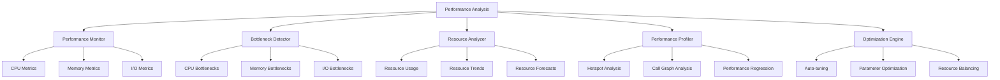

# Performance Issues

The Nest Learning Thermostat includes comprehensive performance monitoring and optimization capabilities for identifying and resolving performance-related issues. This document details performance analysis procedures, optimization techniques, and performance tuning guidelines.

## Performance Analysis Architecture

### Core Components
- **Performance Monitor**: Real-time performance monitoring and metrics collection
- **Bottleneck Detector**: Automated detection of performance bottlenecks
- **Resource Analyzer**: Detailed analysis of system resource utilization
- **Performance Profiler**: Deep performance profiling and hotspot identification
- **Optimization Engine**: Automated performance optimization and tuning

### Performance Analysis Framework


## Performance Monitor

### Real-time Metrics
Comprehensive real-time monitoring of system performance metrics.

```c
// Performance monitoring system
typedef struct {
    performance_monitor_t monitor;         // Performance monitor
    bottleneck_detector_t detector;        // Bottleneck detector
    resource_analyzer_t analyzer;          // Resource analyzer
    performance_profiler_t profiler;       // Performance profiler
} performance_analysis_t;

// Performance monitor
typedef struct {
    cpu_monitor_t cpu;                     // CPU monitoring
    memory_monitor_t memory;               // Memory monitoring
    io_monitor_t io;                       // I/O monitoring
    network_monitor_t network;             // Network monitoring
    thermal_monitor_t thermal;             // Thermal monitoring
} performance_monitor_t;

// CPU monitor
typedef struct {
    cpu_usage_tracker_t usage;             // CPU usage tracking
    load_average_monitor_t load;           // Load average monitoring
    frequency_monitor_t frequency;         // Frequency monitoring
    temperature_monitor_t temperature;     // Temperature monitoring
} cpu_monitor_t;

// Performance metrics collection
performance_metrics_t collect_performance_metrics(
    performance_monitor_t *monitor, 
    collection_window_t *window) {
    
    performance_metrics_t metrics = {0};
    
    // Collect CPU metrics
    metrics.cpu = collect_cpu_metrics(&monitor->cpu, window);
    
    // Collect memory metrics
    metrics.memory = collect_memory_metrics(&monitor->memory, window);
    
    // Collect I/O metrics
    metrics.io = collect_io_metrics(&monitor->io, window);
    
    // Collect network metrics
    metrics.network = collect_network_metrics(&monitor->network, window);
    
    // Collect thermal metrics
    metrics.thermal = collect_thermal_metrics(&monitor->thermal, window);
    
    // Calculate overall performance score
    metrics.overall_score = calculate_performance_score(metrics);
    
    return metrics;
}
```

### Performance Thresholds
Configurable performance thresholds and alerting.

```c
// Performance thresholds
typedef struct {
    cpu_thresholds_t cpu;                  // CPU thresholds
    memory_thresholds_t memory;            // Memory thresholds
    io_thresholds_t io;                    // I/O thresholds
    network_thresholds_t network;          // Network thresholds
    thermal_thresholds_t thermal;          // Thermal thresholds
} performance_thresholds_t;

// CPU thresholds
typedef struct {
    float cpu_usage_warning;               // CPU usage warning threshold
    float cpu_usage_critical;              // CPU usage critical threshold
    float load_average_warning;            // Load average warning threshold
    float load_average_critical;           // Load average critical threshold
    float temperature_warning;             // Temperature warning threshold
    float temperature_critical;            // Temperature critical threshold
} cpu_thresholds_t;

// Check performance against thresholds
performance_alerts_t check_performance_thresholds(
    performance_thresholds_t *thresholds, 
    performance_metrics_t *metrics) {
    
    performance_alerts_t alerts = {0};
    
    // Check CPU thresholds
    if (metrics.cpu.usage_percentage > thresholds->cpu.cpu_usage_critical) {
        alerts.cpu_alerts[alerts.cpu_alert_count++] = 
            create_cpu_alert(CPU_ALERT_TYPE_USAGE_CRITICAL, 
                           metrics.cpu.usage_percentage);
    } else if (metrics.cpu.usage_percentage > thresholds->cpu.cpu_usage_warning) {
        alerts.cpu_alerts[alerts.cpu_alert_count++] = 
            create_cpu_alert(CPU_ALERT_TYPE_USAGE_WARNING, 
                           metrics.cpu.usage_percentage);
    }
    
    // Check load average thresholds
    if (metrics.cpu.load_average > thresholds->cpu.load_average_critical) {
        alerts.cpu_alerts[alerts.cpu_alert_count++] = 
            create_cpu_alert(CPU_ALERT_TYPE_LOAD_CRITICAL, 
                           metrics.cpu.load_average);
    } else if (metrics.cpu.load_average > thresholds->cpu.load_average_warning) {
        alerts.cpu_alerts[alerts.cpu_alert_count++] = 
            create_cpu_alert(CPU_ALERT_TYPE_LOAD_WARNING, 
                           metrics.cpu.load_average);
    }
    
    // Check memory thresholds
    if (metrics.memory.usage_percentage > thresholds->memory.usage_critical) {
        alerts.memory_alerts[alerts.memory_alert_count++] = 
            create_memory_alert(MEMORY_ALERT_TYPE_USAGE_CRITICAL, 
                              metrics.memory.usage_percentage);
    }
    
    // Check I/O thresholds
    if (metrics.io.latency_ms > thresholds->io.latency_critical) {
        alerts.io_alerts[alerts.io_alert_count++] = 
            create_io_alert(IO_ALERT_TYPE_LATENCY_CRITICAL, 
                          metrics.io.latency_ms);
    }
    
    // Check network thresholds
    if (metrics.network.packet_loss_percentage > thresholds->network.packet_loss_critical) {
        alerts.network_alerts[alerts.network_alert_count++] = 
            create_network_alert(NETWORK_ALERT_TYPE_PACKET_LOSS_CRITICAL, 
                                metrics.network.packet_loss_percentage);
    }
    
    // Check thermal thresholds
    if (metrics.thermal.temperature_celsius > thresholds->thermal.temperature_critical) {
        alerts.thermal_alerts[alerts.thermal_alert_count++] = 
            create_thermal_alert(THERMAL_ALERT_TYPE_TEMPERATURE_CRITICAL, 
                                metrics.thermal.temperature_celsius);
    }
    
    return alerts;
}
```

## Bottleneck Detector

### Automated Detection
Intelligent detection of performance bottlenecks across system components.

```c
// Bottleneck detector
typedef struct {
    cpu_bottleneck_detector_t cpu;         // CPU bottleneck detection
    memory_bottleneck_detector_t memory;   // Memory bottleneck detection
    io_bottleneck_detector_t io;           // I/O bottleneck detection
    network_bottleneck_detector_t network; // Network bottleneck detection
} bottleneck_detector_t;

// CPU bottleneck detector
typedef struct {
    usage_analyzer_t usage;                // Usage analysis
    saturation_detector_t saturation;     // Saturation detection
    contention_analyzer_t contention;      // Contention analysis
    scalability_analyzer_t scalability;   // Scalability analysis
} cpu_bottleneck_detector_t;

// Bottleneck detection result
typedef struct {
    bottleneck_type_t type;                // Bottleneck type
    component_id_t component;              // Affected component
    severity_t severity;                   // Bottleneck severity
    bottleneck_details_t details;          // Bottleneck details
    impact_analysis_t impact;              // Impact analysis
    resolution_suggestions_t suggestions;  // Resolution suggestions
} bottleneck_result_t;

// Detect performance bottlenecks
bottleneck_analysis_t detect_performance_bottlenecks(
    bottleneck_detector_t *detector, 
    performance_metrics_t *metrics, 
    analysis_window_t *window) {
    
    bottleneck_analysis_t analysis = {0};
    
    // Detect CPU bottlenecks
    cpu_bottleneck_result_t cpu_bottlenecks = detect_cpu_bottlenecks(
        &detector->cpu, metrics, window);
    
    if (cpu_bottlenecks.detected) {
        for (int i = 0; i < cpu_bottlenecks.bottleneck_count; i++) {
            analysis.bottlenecks[analysis.bottleneck_count++] = 
                cpu_bottlenecks.bottlenecks[i];
        }
    }
    
    // Detect memory bottlenecks
    memory_bottleneck_result_t memory_bottlenecks = detect_memory_bottlenecks(
        &detector->memory, metrics, window);
    
    if (memory_bottlenecks.detected) {
        for (int i = 0; i < memory_bottlenecks.bottleneck_count; i++) {
            analysis.bottlenecks[analysis.bottleneck_count++] = 
                memory_bottlenecks.bottlenecks[i];
        }
    }
    
    // Detect I/O bottlenecks
    io_bottleneck_result_t io_bottlenecks = detect_io_bottlenecks(
        &detector->io, metrics, window);
    
    if (io_bottlenecks.detected) {
        for (int i = 0; i < io_bottlenecks.bottleneck_count; i++) {
            analysis.bottlenecks[analysis.bottleneck_count++] = 
                io_bottlenecks.bottlenecks[i];
        }
    }
    
    // Detect network bottlenecks
    network_bottleneck_result_t network_bottlenecks = detect_network_bottlenecks(
        &detector->network, metrics, window);
    
    if (network_bottlenecks.detected) {
        for (int i = 0; i < network_bottlenecks.bottleneck_count; i++) {
            analysis.bottlenecks[analysis.bottleneck_count++] = 
                network_bottlenecks.bottlenecks[i];
        }
    }
    
    // Prioritize bottlenecks by impact
    prioritize_bottlenecks(analysis.bottlenecks, analysis.bottleneck_count);
    
    return analysis;
}
```

### Root Cause Analysis
Deep analysis of bottleneck root causes and contributing factors.

```c
// Root cause analyzer
typedef struct {
    causal_analyzer_t causal;              // Causal analysis
    correlation_analyzer_t correlation;    // Correlation analysis
    trend_analyzer_t trend;                // Trend analysis
    predictive_analyzer_t predictive;      // Predictive analysis
} root_cause_analyzer_t;

// Root cause analysis result
typedef struct {
    bottleneck_id_t bottleneck_id;         // Bottleneck ID
    root_cause_t root_cause;                // Identified root cause
    contributing_factors_t factors;        // Contributing factors
    causal_chain_t chain;                  // Causal chain
    confidence_level_t confidence;         // Analysis confidence
    prevention_recommendations_t prevention; // Prevention recommendations
} root_cause_analysis_t;

// Analyze bottleneck root causes
root_cause_analysis_t analyze_bottleneck_root_causes(
    root_cause_analyzer_t *analyzer, 
    bottleneck_result_t *bottleneck, 
    historical_data_t *history) {
    
    root_cause_analysis_t analysis = {0};
    
    analysis.bottleneck_id = bottleneck->type;
    
    // Perform causal analysis
    causal_analysis_t causal = perform_causal_analysis(
        &analyzer->causal, bottleneck, history);
    
    analysis.root_cause = causal.primary_cause;
    analysis.chain = causal.causal_chain;
    
    // Analyze contributing factors
    analysis.factors = analyze_contributing_factors(
        causal, history);
    
    // Perform correlation analysis
    correlation_analysis_t correlation = perform_correlation_analysis(
        &analyzer->correlation, bottleneck, history);
    
    // Analyze trends
    trend_analysis_t trend = analyze_performance_trends(
        &analyzer->trend, history);
    
    // Predict future occurrences
    prediction_result_t prediction = predict_bottleneck_occurrence(
        &analyzer->predictive, bottleneck, trend);
    
    analysis.prediction = prediction;
    
    // Calculate analysis confidence
    analysis.confidence = calculate_analysis_confidence(
        causal, correlation, trend, prediction);
    
    // Generate prevention recommendations
    analysis.prevention = generate_prevention_recommendations(
        analysis);
    
    return analysis;
}
```

## Resource Analyzer

### Resource Utilization Analysis
Detailed analysis of system resource utilization patterns.

```c
// Resource analyzer
typedef struct {
    cpu_analyzer_t cpu;                    // CPU analysis
    memory_analyzer_t memory;              // Memory analysis
    storage_analyzer_t storage;            // Storage analysis
    network_analyzer_t network;            // Network analysis
    power_analyzer_t power;                // Power analysis
} resource_analyzer_t;

// CPU analyzer
typedef struct {
    usage_pattern_analyzer_t usage;        // Usage pattern analysis
    efficiency_analyzer_t efficiency;      // Efficiency analysis
    scaling_analyzer_t scaling;            // Scaling analysis
    thermal_analyzer_t thermal;            // Thermal analysis
} cpu_analyzer_t;

// Resource utilization analysis result
typedef struct {
    cpu_utilization_t cpu;                 // CPU utilization
    memory_utilization_t memory;           // Memory utilization
    storage_utilization_t storage;         // Storage utilization
    network_utilization_t network;         // Network utilization
    power_utilization_t power;             // Power utilization
    utilization_patterns_t patterns;       // Utilization patterns
    optimization_opportunities_t opportunities; // Optimization opportunities
} resource_utilization_analysis_t;

// Analyze resource utilization
resource_utilization_analysis_t analyze_resource_utilization(
    resource_analyzer_t *analyzer, 
    analysis_window_t *window) {
    
    resource_utilization_analysis_t analysis = {0};
    
    // Analyze CPU utilization
    analysis.cpu = analyze_cpu_utilization(
        &analyzer->cpu, window);
    
    // Analyze memory utilization
    analysis.memory = analyze_memory_utilization(
        &analyzer->memory, window);
    
    // Analyze storage utilization
    analysis.storage = analyze_storage_utilization(
        &analyzer->storage, window);
    
    // Analyze network utilization
    analysis.network = analyze_network_utilization(
        &analyzer->network, window);
    
    // Analyze power utilization
    analysis.power = analyze_power_utilization(
        &analyzer->power, window);
    
    // Identify utilization patterns
    analysis.patterns = identify_utilization_patterns(analysis);
    
    // Identify optimization opportunities
    analysis.opportunities = identify_optimization_opportunities(analysis);
    
    return analysis;
}
```

### Resource Forecasting
Predictive analysis of future resource requirements.

```c
// Resource forecaster
typedef struct {
    trend_analyzer_t trend;                // Trend analysis
    seasonal_analyzer_t seasonal;          // Seasonal analysis
    growth_predictor_t growth;             // Growth prediction
    capacity_planner_t capacity;           // Capacity planning
} resource_forecaster_t;

// Resource forecast
typedef struct {
    forecast_period_t period;              // Forecast period
    cpu_forecast_t cpu;                    // CPU forecast
    memory_forecast_t memory;              // Memory forecast
    storage_forecast_t storage;            // Storage forecast
    network_forecast_t network;            // Network forecast
    confidence_intervals_t confidence;    // Confidence intervals
    scaling_recommendations_t scaling;     // Scaling recommendations
} resource_forecast_t;

// Forecast resource requirements
resource_forecast_t forecast_resource_requirements(
    resource_forecaster_t *forecaster, 
    historical_data_t *history, 
    forecast_config_t *config) {
    
    resource_forecast_t forecast = {0};
    
    forecast.period = config->forecast_period;
    
    // Analyze trends
    trend_analysis_t trend = analyze_resource_trends(
        &forecaster->trend, history);
    
    // Analyze seasonal patterns
    seasonal_analysis_t seasonal = analyze_seasonal_patterns(
        &forecaster->seasonal, history);
    
    // Predict growth
    growth_prediction_t growth = predict_resource_growth(
        &forecaster->growth, trend, seasonal);
    
    // Generate CPU forecast
    forecast.cpu = generate_cpu_forecast(growth, config);
    
    // Generate memory forecast
    forecast.memory = generate_memory_forecast(growth, config);
    
    // Generate storage forecast
    forecast.storage = generate_storage_forecast(growth, config);
    
    // Generate network forecast
    forecast.network = generate_network_forecast(growth, config);
    
    // Calculate confidence intervals
    forecast.confidence = calculate_confidence_intervals(
        forecast, trend, seasonal);
    
    // Generate scaling recommendations
    forecast.scaling = generate_scaling_recommendations(
        &forecaster->capacity, forecast);
    
    return forecast;
}
```

## Performance Profiler

### Hotspot Analysis
Identification of performance hotspots and critical code paths.

```c
// Performance profiler
typedef struct {
    sampling_profiler_t sampling;          // Sampling profiler
    instrumentation_profiler_t instrumentation; // Instrumentation profiler
    hotspot_detector_t hotspot;            // Hotspot detection
    call_graph_analyzer_t call_graph;      // Call graph analysis
} performance_profiler_t;

// Sampling profiler
typedef struct {
    sampling_config_t config;              // Sampling configuration
    sample_collector_t collector;          // Sample collector
    sample_analyzer_t analyzer;            // Sample analyzer
    profile_aggregator_t aggregator;       // Profile aggregator
} sampling_profiler_t;

// Performance profile
typedef struct {
    profile_duration_t duration;           // Profile duration
    sampling_rate_t sampling_rate;         // Sampling rate
    hotspot_list_t hotspots;               // Hotspot list
    call_graph_t call_graph;               // Call graph
    function_statistics_t functions;       // Function statistics
    performance_metrics_t metrics;         // Performance metrics
} performance_profile_t;

// Generate performance profile
performance_profile_t generate_performance_profile(
    performance_profiler_t *profiler, 
    profiling_target_t target, 
    profiling_duration_t duration) {
    
    performance_profile_t profile = {0};
    
    profile.duration = duration;
    
    // Start sampling profiler
    sampling_session_t session = start_sampling_profiler(
        &profiler->sampling, target, duration);
    
    // Collect samples
    sample_collection_t samples = collect_samples(
        &profiler->sampling.collector, session);
    
    // Analyze samples
    sample_analysis_t analysis = analyze_samples(
        &profiler->sampling.analyzer, samples);
    
    // Detect hotspots
    profile.hotspots = detect_performance_hotspots(
        &profiler->hotspot, analysis);
    
    // Build call graph
    profile.call_graph = build_call_graph(
        &profiler->call_graph, analysis);
    
    // Generate function statistics
    profile.functions = generate_function_statistics(analysis);
    
    // Calculate performance metrics
    profile.metrics = calculate_performance_metrics(analysis);
    
    return profile;
}
```

### Performance Regression Detection
Detection of performance regressions and degradation.

```c
// Performance regression detector
typedef struct {
    baseline_comparator_t baseline;        // Baseline comparison
    regression_analyzer_t regression;      // Regression analysis
    impact_assessor_t impact;              // Impact assessment
    alert_generator_t alert;                // Alert generation
} performance_regression_detector_t;

// Performance regression result
typedef struct {
    regression_detected_t detected;        // Regression detected
    regression_severity_t severity;        // Regression severity
    affected_components_t components;      // Affected components
    performance_degradation_t degradation; // Performance degradation
    root_cause_analysis_t root_cause;      // Root cause analysis
    remediation_recommendations_t remediation; // Remediation recommendations
} performance_regression_result_t;

// Detect performance regressions
performance_regression_result_t detect_performance_regressions(
    performance_regression_detector_t *detector, 
    current_profile_t *current, 
    baseline_profile_t *baseline) {
    
    performance_regression_result_t result = {0};
    
    // Compare with baseline
    baseline_comparison_t comparison = compare_with_baseline(
        &detector->baseline, current, baseline);
    
    // Analyze regressions
    regression_analysis_t regression = analyze_regressions(
        &detector->regression, comparison);
    
    result.detected = regression.regressions_detected;
    
    if (result.detected) {
        // Assess severity
        result.severity = assess_regression_severity(regression);
        
        // Identify affected components
        result.components = identify_affected_components(regression);
        
        // Quantify performance degradation
        result.degradation = quantify_performance_degradation(
            current, baseline);
        
        // Analyze root cause
        result.root_cause = analyze_regression_root_cause(regression);
        
        // Generate remediation recommendations
        result.remediation = generate_remediation_recommendations(result);
        
        // Generate alerts
        generate_regression_alerts(&detector->alert, result);
    }
    
    return result;
}
```

## Performance Optimization

### Automated Optimization
Intelligent automated performance optimization and tuning.

```c
// Performance optimizer
typedef struct {
    auto_tuner_t auto_tuner;               // Auto-tuner
    parameter_optimizer_t parameter;       // Parameter optimization
    resource_balancer_t balancer;          // Resource balancing
    performance_predictor_t predictor;     // Performance prediction
} performance_optimizer_t;

// Auto-tuner
typedef struct {
    tuning_algorithm_t algorithm;          // Tuning algorithm
    optimization_target_t target;          // Optimization target
    constraint_set_t constraints;          // Optimization constraints
    feedback_controller_t feedback;        // Feedback controller
} auto_tuner_t;

// Performance optimization result
typedef struct {
    optimization_success_t success;        // Optimization success
    performance_improvement_t improvement; // Performance improvement
    tuned_parameters_t parameters;         // Tuned parameters
    optimization_metrics_t metrics;        // Optimization metrics
    rollback_plan_t rollback;              // Rollback plan
} performance_optimization_result_t;

// Perform automated performance optimization
performance_optimization_result_t optimize_performance_automatically(
    performance_optimizer_t *optimizer, 
    optimization_request_t *request) {
    
    performance_optimization_result_t result = {0};
    
    // Create optimization baseline
    performance_baseline_t baseline = create_performance_baseline();
    
    // Execute auto-tuning
    auto_tuning_result_t tuning = execute_auto_tuning(
        &optimizer->auto_tuner, request);
    
    if (tuning.success) {
        // Optimize parameters
        parameter_optimization_result_t param_opt = optimize_parameters(
            &optimizer->parameter, tuning.recommendations);
        
        result.parameters = param_opt.optimized_parameters;
        
        // Balance resources
        resource_balancing_result_t balancing = balance_resources(
            &optimizer->balancer, param_opt);
        
        // Measure performance improvement
        result.improvement = measure_performance_improvement(
            baseline, balancing);
        
        result.success = (result.improvement.overall_improvement > 
                         IMPROVEMENT_THRESHOLD);
        
        if (result.success) {
            result.metrics = calculate_optimization_metrics(
                result.improvement);
            
            // Create rollback plan
            result.rollback = create_rollback_plan(baseline, 
                                                 result.parameters);
        }
    } else {
        result.success = false;
    }
    
    return result;
}
```

## Related Documentation

- [Troubleshooting Overview](./overview.mdx)
- [Hardware Troubleshooting](./hardware-troubleshooting.mdx)
- [Software Troubleshooting](./software-troubleshooting.mdx)
- [Network Troubleshooting](./network-troubleshooting.mdx)
