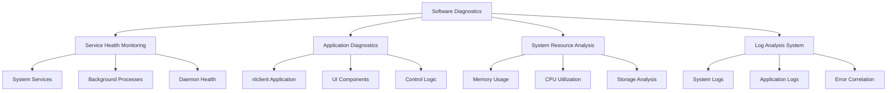

# Software Troubleshooting

The Nest Learning Thermostat incorporates comprehensive software diagnostic capabilities for identifying and resolving software-related issues. This document details software troubleshooting procedures, diagnostic tools, and recovery mechanisms.

## Software Diagnostic Architecture

### Core Components
- **Software Diagnostics Engine**: Core software diagnostic processing
- **Service Health Monitoring**: Real-time monitoring of system services
- **Application Diagnostics**: Application-level troubleshooting
- **System Resource Analysis**: Resource utilization and bottleneck analysis
- **Log Analysis System**: Comprehensive log analysis and correlation

### Software Diagnostic Framework


## Software Diagnostics Engine

### Service Health Monitoring
Real-time monitoring and analysis of system services.

```c
// Software diagnostics system
typedef struct {
    service_health_monitor_t health_monitor; // Service health monitoring
    application_diagnostics_t app_diagnostics; // Application diagnostics
    resource_analyzer_t resource_analyzer; // Resource analyzer
    log_analyzer_t log_analyzer;           // Log analyzer
} software_diagnostics_t;

// Service health monitor
typedef struct {
    service_registry_t registry;           // Service registry
    health_checker_t checker;              // Health checker
    performance_monitor_t performance;     // Performance monitoring
    alert_system_t alerts;                 // Alert system
} service_health_monitor_t;

// Service health status
typedef struct {
    service_id_t service_id;               // Service ID
    service_name_t name;                   // Service name
    health_status_t status;                // Health status
    performance_metrics_t metrics;         // Performance metrics
    last_check_time_t last_check;          // Last check time
    consecutive_failures_t failures;       // Consecutive failures
    restart_count_t restarts;              // Restart count
} service_health_t;

// Monitor service health
service_health_report_t monitor_service_health(
    service_health_monitor_t *monitor, 
    monitoring_config_t *config) {
    
    service_health_report_t report = {0};
    
    // Get service registry
    service_registry_t *registry = &monitor->registry;
    
    // Check health of all registered services
    for (int i = 0; i < registry->service_count; i++) {
        service_entry_t *service = &registry->services[i];
        
        // Perform health check
        health_check_result_t health_result = perform_health_check(
            &monitor->checker, service);
        
        // Update service health status
        service_health_t health_status = {
            .service_id = service->service_id,
            .name = service->service_name,
            .status = health_result.status,
            .metrics = health_result.metrics,
            .last_check = get_current_timestamp()
        };
        
        // Update failure tracking
        if (health_result.status == HEALTH_STATUS_UNHEALTHY) {
            service->consecutive_failures++;
            health_status.failures = service->consecutive_failures;
        } else {
            service->consecutive_failures = 0;
            health_status.failures = 0;
        }
        
        // Update restart tracking
        health_status.restarts = service->restart_count;
        
        // Add to report
        report.service_health[report.service_count++] = health_status;
        
        // Generate alerts if needed
        if (should_generate_health_alert(health_status, config)) {
            generate_service_alert(&monitor->alerts, health_status);
        }
    }
    
    // Calculate overall system health
    report.overall_health = calculate_overall_system_health(
        report.service_health, report.service_count);
    
    return report;
}
```

### Application Diagnostics
Comprehensive diagnostics for thermostat applications.

```c
// Application diagnostics
typedef struct {
    nlclient_diagnostics_t nlclient;       // nlclient diagnostics
    ui_diagnostics_t ui;                   // UI diagnostics
    control_diagnostics_t control;         // Control diagnostics
    learning_diagnostics_t learning;       // Learning diagnostics
} application_diagnostics_t;

// nlclient diagnostics
typedef struct {
    process_health_t process;              // Process health
    memory_usage_t memory;                 // Memory usage
    thread_analysis_t threads;             // Thread analysis
    performance_metrics_t performance;     // Performance metrics
    error_tracking_t errors;               // Error tracking
} nlclient_diagnostics_t;

// Execute nlclient diagnostics
nlclient_diagnostic_result_t execute_nlclient_diagnostics(
    nlclient_diagnostics_t *nlclient_diagnostics, 
    diagnostic_config_t *config) {
    
    nlclient_diagnostic_result_t result = {0};
    
    // Check process health
    process_health_result_t process_result = check_process_health(
        &nlclient_diagnostics->process, "nlclient");
    
    result.process_status = process_result.status;
    result.process_details = process_result.details;
    
    // Analyze memory usage
    memory_analysis_result_t memory_result = analyze_memory_usage(
        &nlclient_diagnostics->memory, "nlclient");
    
    result.memory_status = memory_result.status;
    result.memory_details = memory_result.details;
    
    // Analyze thread behavior
    thread_analysis_result_t thread_result = analyze_threads(
        &nlclient_diagnostics->threads, "nlclient");
    
    result.thread_status = thread_result.status;
    result.thread_details = thread_result.details;
    
    // Collect performance metrics
    performance_metrics_t perf_metrics = collect_performance_metrics(
        &nlclient_diagnostics->performance, "nlclient");
    
    result.performance = perf_metrics;
    
    // Track errors and exceptions
    error_tracking_result_t error_result = track_errors(
        &nlclient_diagnostics->errors, "nlclient");
    
    result.error_status = error_result.status;
    result.error_details = error_result.details;
    
    // Determine overall nlclient status
    result.overall_status = determine_nlclient_status(result);
    
    return result;
}
```

## System Resource Analysis

### Memory Analysis
Comprehensive memory usage analysis and leak detection.

```c
// Resource analyzer
typedef struct {
    memory_analyzer_t memory;              // Memory analyzer
    cpu_analyzer_t cpu;                    // CPU analyzer
    storage_analyzer_t storage;            // Storage analyzer
    network_analyzer_t network;            // Network analyzer
} resource_analyzer_t;

// Memory analyzer
typedef struct {
    memory_usage_tracker_t usage;         // Memory usage tracking
    leak_detector_t leak_detector;         // Memory leak detection
    fragmentation_analyzer_t fragmentation; // Fragmentation analysis
    gc_analyzer_t gc_analyzer;             // Garbage collection analysis
} memory_analyzer_t;

// Memory usage analysis
memory_analysis_result_t analyze_memory_usage(
    memory_analyzer_t *analyzer, 
    analysis_config_t *config) {
    
    memory_analysis_result_t result = {0};
    
    // Track memory usage by process
    process_memory_t process_memory[MAX_PROCESSES];
    int process_count = track_process_memory_usage(
        &analyzer->usage, process_memory);
    
    result.process_count = process_count;
    memcpy(result.process_memory, process_memory, 
           sizeof(process_memory_t) * process_count);
    
    // Detect memory leaks
    leak_detection_result_t leak_result = detect_memory_leaks(
        &analyzer->leak_detector, process_memory, process_count);
    
    result.leak_detected = leak_result.detected;
    result.leak_details = leak_result.details;
    
    // Analyze memory fragmentation
    fragmentation_result_t frag_result = analyze_memory_fragmentation(
        &analyzer->fragmentation);
    
    result.fragmentation_level = frag_result.level;
    result.fragmentation_details = frag_result.details;
    
    // Analyze garbage collection
    gc_analysis_result_t gc_result = analyze_garbage_collection(
        &analyzer->gc_analyzer);
    
    result.gc_efficiency = gc_result.efficiency;
    result.gc_details = gc_result.details;
    
    // Calculate overall memory health
    result.overall_health = calculate_memory_health(
        result.process_memory, process_count, leak_result, 
        frag_result, gc_result);
    
    // Generate memory optimization recommendations
    result.recommendations = generate_memory_recommendations(result);
    
    return result;
}
```

### CPU Analysis
Detailed CPU utilization and performance analysis.

```c
// CPU analyzer
typedef struct {
    cpu_usage_tracker_t usage;             // CPU usage tracking
    process_analyzer_t processes;          // Process analysis
    bottleneck_detector_t bottlenecks;     // Bottleneck detection
    performance_profiler_t profiler;       // Performance profiling
} cpu_analyzer_t;

// CPU analysis result
typedef struct {
    overall_cpu_usage_t overall;           // Overall CPU usage
    per_process_usage_t processes[MAX_PROCESSES]; // Per-process usage
    bottleneck_analysis_t bottlenecks;     // Bottleneck analysis
    performance_profile_t profile;         // Performance profile
    optimization_recommendations_t recommendations; // Recommendations
} cpu_analysis_result_t;

// Execute CPU analysis
cpu_analysis_result_t analyze_cpu_usage(
    cpu_analyzer_t *analyzer, 
    analysis_config_t *config) {
    
    cpu_analysis_result_t result = {0};
    
    // Track overall CPU usage
    result.overall = track_overall_cpu_usage(&analyzer->usage);
    
    // Analyze per-process CPU usage
    int process_count = analyze_per_process_cpu(
        &analyzer->processes, result.processes);
    
    result.process_count = process_count;
    
    // Detect CPU bottlenecks
    result.bottlenecks = detect_cpu_bottlenecks(
        &analyzer->bottlenecks, result.processes, process_count);
    
    // Generate performance profile
    result.profile = generate_cpu_performance_profile(
        &analyzer->profiler, result.overall, result.processes, 
        process_count);
    
    // Generate optimization recommendations
    result.recommendations = generate_cpu_optimization_recommendations(
        result);
    
    return result;
}
```

## Log Analysis System

### Log Collection and Analysis
Comprehensive log collection, parsing, and analysis.

```c
// Log analyzer
typedef struct {
    log_collector_t collector;             // Log collector
    log_parser_t parser;                   // Log parser
    correlation_engine_t correlation;      // Correlation engine
    pattern_matcher_t pattern_matcher;     // Pattern matcher
} log_analyzer_t;

// Log collector
typedef struct {
    log_source_t sources[MAX_SOURCES];     // Log sources
    collection_policy_t policy;            // Collection policy
    buffer_manager_t buffer;               // Buffer management
    filter_engine_t filter;                // Filter engine
} log_collector_t;

// Log analysis result
typedef struct {
    log_summary_t summary;                 // Log summary
    error_analysis_t errors;               // Error analysis
    pattern_matches_t patterns;            // Pattern matches
    correlation_analysis_t correlations;   // Correlation analysis
    trend_analysis_t trends;               // Trend analysis
} log_analysis_result_t;

// Execute comprehensive log analysis
log_analysis_result_t analyze_logs(
    log_analyzer_t *analyzer, 
    analysis_window_t *window) {
    
    log_analysis_result_t result = {0};
    
    // Collect logs from all sources
    log_collection_t collection = collect_logs(
        &analyzer->collector, window);
    
    // Parse log entries
    parsed_logs_t parsed_logs = parse_log_entries(
        &analyzer->parser, collection);
    
    // Generate log summary
    result.summary = generate_log_summary(parsed_logs);
    
    // Analyze errors and exceptions
    result.errors = analyze_log_errors(parsed_logs);
    
    // Match known patterns
    result.patterns = match_log_patterns(
        &analyzer->pattern_matcher, parsed_logs);
    
    // Correlate related events
    result.correlations = correlate_log_events(
        &analyzer->correlation, parsed_logs);
    
    // Analyze trends
    result.trends = analyze_log_trends(parsed_logs, window);
    
    return result;
}
```

### Error Correlation
Advanced correlation of related errors and events.

```c
// Correlation engine
typedef struct {
    correlation_rules_t rules;             // Correlation rules
    event_grouper_t grouper;               // Event grouper
    temporal_analyzer_t temporal;          // Temporal analysis
    causal_analyzer_t causal;              // Causal analysis
} correlation_engine_t;

// Correlation analysis
typedef struct {
    event_group_t groups[MAX_GROUPS];      // Event groups
    int group_count;                       // Number of groups
    causal_chain_t chains[MAX_CHAINS];     // Causal chains
    int chain_count;                       // Number of chains
    correlation_confidence_t confidence;   // Correlation confidence
} correlation_analysis_t;

// Correlate log events
correlation_analysis_t correlate_log_events(
    correlation_engine_t *engine, 
    parsed_logs_t *logs) {
    
    correlation_analysis_t analysis = {0};
    
    // Apply correlation rules
    rule_matches_t rule_matches = apply_correlation_rules(
        &engine->rules, logs);
    
    // Group related events
    analysis.group_count = group_related_events(
        &engine->grouper, logs, rule_matches, 
        analysis.groups);
    
    // Analyze temporal relationships
    temporal_analysis_t temporal = analyze_temporal_relationships(
        &engine->temporal, analysis.groups, analysis.group_count);
    
    // Build causal chains
    analysis.chain_count = build_causal_chains(
        &engine->causal, analysis.groups, analysis.group_count, 
        temporal, analysis.chains);
    
    // Calculate correlation confidence
    analysis.confidence = calculate_correlation_confidence(
        rule_matches, temporal, analysis.chains, analysis.chain_count);
    
    return analysis;
}
```

## Software Recovery Mechanisms

### Service Recovery
Automated service recovery and restart mechanisms.

```c
// Software recovery system
typedef struct {
    service_recovery_t service_recovery;   // Service recovery
    application_recovery_t app_recovery;   // Application recovery
    system_recovery_t system_recovery;     // System recovery
    data_recovery_t data_recovery;         // Data recovery
} software_recovery_t;

// Service recovery
typedef struct {
    restart_manager_t restart;             // Restart manager
    health_monitor_t health;               // Health monitoring
    fallback_strategy_t fallback;          // Fallback strategy
    recovery_validator_t validator;        // Recovery validator
} service_recovery_t;

// Automated service recovery
recovery_result_t recover_service_automatically(
    service_recovery_t *recovery, 
    service_id_t service_id, 
    failure_context_t *context) {
    
    recovery_result_t result = {0};
    
    // Analyze failure context
    failure_analysis_t analysis = analyze_service_failure(context);
    
    // Select recovery strategy
    recovery_strategy_t strategy = select_recovery_strategy(
        &recovery->restart, analysis);
    
    // Execute recovery
    switch (strategy.type) {
        case RECOVERY_STRATEGY_RESTART:
            result = restart_service(&recovery->restart, service_id, 
                                    strategy);
            break;
            
        case RECOVERY_STRATEGY_RESET:
            result = reset_service(&recovery->restart, service_id, 
                                  strategy);
            break;
            
        case RECOVERY_STRATEGY_FALLBACK:
            result = execute_fallback_strategy(&recovery->fallback, 
                                              service_id, strategy);
            break;
    }
    
    // Validate recovery
    if (result.success) {
        result.validated = validate_service_recovery(
            &recovery->validator, service_id);
    }
    
    return result;
}
```

### Application Recovery
Application-level recovery and state restoration.

```c
// Application recovery
typedef struct {
    state_manager_t state;                 // State management
    crash_recovery_t crash;                // Crash recovery
    data_restoration_t restoration;        // Data restoration
    configuration_recovery_t config;      // Configuration recovery
} application_recovery_t;

// Recover application state
app_recovery_result_t recover_application_state(
    application_recovery_t *recovery, 
    application_id_t app_id, 
    crash_context_t *crash_context) {
    
    app_recovery_result_t result = {0};
    
    // Analyze crash context
    crash_analysis_t analysis = analyze_crash_context(crash_context);
    
    // Restore application state
    state_restoration_result_t state_result = restore_application_state(
        &recovery->state, app_id, analysis);
    
    result.state_restored = state_result.success;
    result.state_details = state_result.details;
    
    // Restore data if needed
    if (analysis.data_corrupted) {
        data_restoration_result_t data_result = restore_application_data(
            &recovery->restoration, app_id);
        
        result.data_restored = data_result.success;
        result.data_details = data_result.details;
    }
    
    // Restore configuration if needed
    if (analysis.config_corrupted) {
        config_restoration_result_t config_result = restore_configuration(
            &recovery->config, app_id);
        
        result.config_restored = config_result.success;
        result.config_details = config_result.details;
    }
    
    // Determine overall recovery status
    result.overall_success = result.state_restored && 
                           (!analysis.data_corrupted || result.data_restored) &&
                           (!analysis.config_corrupted || result.config_restored);
    
    return result;
}
```

## Performance Optimization

### Performance Profiling
Detailed performance profiling and bottleneck identification.

```c
// Performance profiler
typedef struct {
    sampling_profiler_t sampling;          // Sampling profiler
    instrumentation_profiler_t instrumentation; // Instrumentation profiler
    bottleneck_detector_t detector;        // Bottleneck detector
    optimization_advisor_t advisor;        // Optimization advisor
} performance_profiler_t;

// Performance profile
typedef struct {
    cpu_profile_t cpu;                     // CPU profile
    memory_profile_t memory;               // Memory profile
    io_profile_t io;                       // I/O profile
    network_profile_t network;             // Network profile
    hotspot_analysis_t hotspots;           // Hotspot analysis
} performance_profile_t;

// Generate performance profile
performance_profile_t generate_performance_profile(
    performance_profiler_t *profiler, 
    profiling_target_t target, 
    profiling_duration_t duration) {
    
    performance_profile_t profile = {0};
    
    // Generate CPU profile
    profile.cpu = generate_cpu_profile(
        &profiler->sampling, target, duration);
    
    // Generate memory profile
    profile.memory = generate_memory_profile(
        &profiler->instrumentation, target, duration);
    
    // Generate I/O profile
    profile.io = generate_io_profile(
        &profiler->sampling, target, duration);
    
    // Generate network profile
    profile.network = generate_network_profile(
        &profiler->sampling, target, duration);
    
    // Analyze performance hotspots
    profile.hotspots = analyze_performance_hotspots(
        &profiler->detector, profile);
    
    return profile;
}
```

## Related Documentation

- [Troubleshooting Overview](./overview.mdx)
- [Hardware Troubleshooting](./hardware-troubleshooting.mdx)
- [Network Troubleshooting](./network-troubleshooting.mdx)
- [Performance Issues](./performance-issues.mdx)
